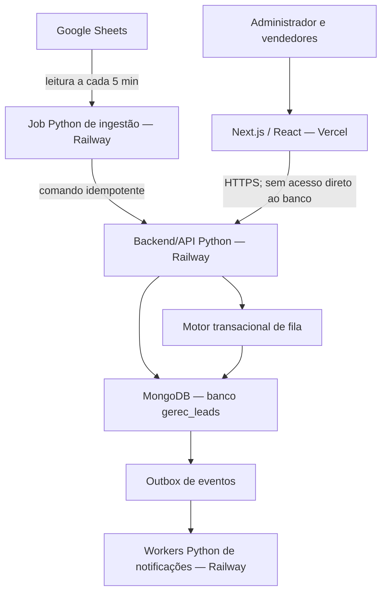
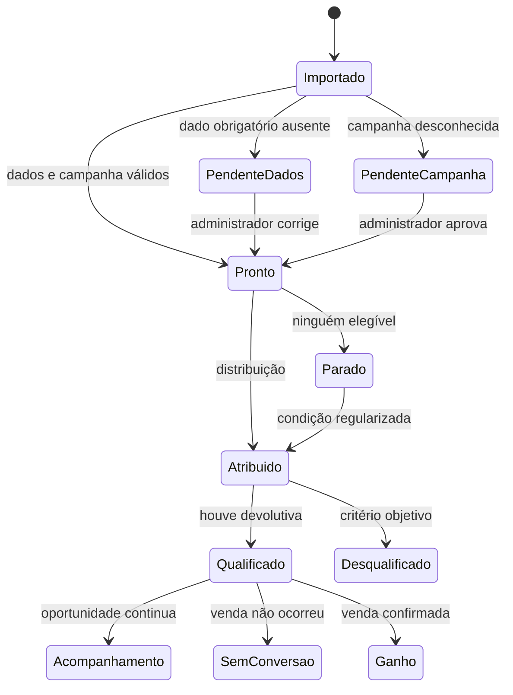
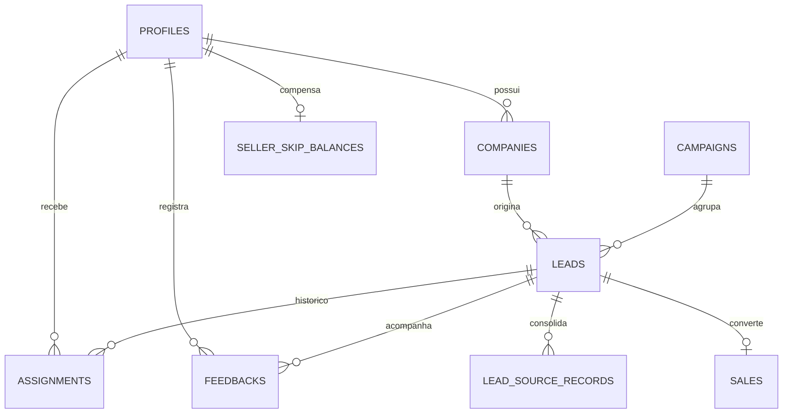

# Contexto Mestre - Gerenciador de Leads WTG

> Gerado em 2026-08-28 18:49:04 UTC por `scripts/generate-master-context.ps1`.

## Como usar este documento

Este é um pacote de contexto autocontido para desenvolvimento e revisão. Ele consolida fontes documentais e um retrato do código relevante; não substitui os arquivos de origem.

### Hierarquia de autoridade

1. `SPEC_GERENCIADOR_DE_LEADS_WTG.md` é a regra funcional canônica.
2. Decisões de governança aprovadas por Yago alteram explicitamente o SPEC.
3. `AGENTS.md` contém regras permanentes para o trabalho no repositório.
4. Desenhos, planos, evidências e relatórios explicam contexto, histórico e execução; divergências devem ser apontadas antes de qualquer implementação.
5. O código e as configurações são um retrato técnico do branch que gerou este arquivo e nunca substituem uma regra de negócio canônica.

### Escopo incluído

- documentação Markdown rastreada do projeto;
- configurações de build e deploy sem segredos;
- código Python da API e automações;
- código TypeScript/TSX/CSS do frontend, incluindo testes próximos ao código.

Arquivos de ambiente, credenciais, dumps, planilhas e dependências geradas são excluídos por segurança e para evitar contexto inútil.

## Fonte canônica: `SPEC_GERENCIADOR_DE_LEADS_WTG.md`

# Gerenciador de Leads WTG

## Especificação Funcional e Técnica — v1.0

**Data:** 25 de agosto de 2026
**Status:** especificação consolidada para revisão
**Produto:** sistema interno de distribuição, acompanhamento, qualificação e conversão de leads da WTG Corretora de Seguros
**Fonte de verdade:** este documento substitui protótipos, trechos de código e interpretações anteriores sobre este projeto. Se uma implementação divergir desta especificação, a especificação prevalece até que uma alteração seja formalmente aprovada.

---

## 1. Como usar esta especificação com outra inteligência artificial

A IA responsável pelo desenvolvimento deve:

1. Ler este documento integralmente antes de propor código ou estrutura de pastas.
2. Não alterar silenciosamente nenhuma regra de negócio.
3. Identificar contradições entre o código existente e esta especificação antes de continuar.
4. Produzir um plano de implementação dividido em etapas pequenas e verificáveis.
5. Implementar primeiro o núcleo transacional e seus testes; a interface não deve anteceder as regras críticas de fila.
6. Versionar toda alteração de schema, índices ou validações do MongoDB.
7. Aplicar TDD nas regras de distribuição, prazo útil, duplicidade, permissões e resultados finais.
8. Manter a lógica crítica de rodízio no backend/API Python, nunca em jobs de automação.
9. Não expor credenciais administrativas ou de banco no navegador.
10. Considerar concluído somente o que tiver critérios de aceite automatizados e evidência de validação.

### Prompt curto de inicialização para a IA desenvolvedora

> Leia integralmente `SPEC_GERENCIADOR_DE_LEADS_WTG.md`. Trate-o como fonte de verdade. Antes de programar, devolva: (1) resumo do entendimento; (2) riscos e dependências; (3) arquitetura proposta sem contrariar as decisões registradas; (4) plano de implementação testável. Não implemente antes da aprovação desse plano. Toda mudança de regra deve ser apresentada como proposta, nunca aplicada silenciosamente.

---

## 2. Resumo executivo

A WTG recebe leads em uma planilha Google alimentada por anúncios e outras fontes comerciais. O sistema deverá sincronizar essa planilha, organizar os leads por campanha e distribuí-los entre quatro vendedores por meio de uma única fila global:

1. Renato
2. Sandra
3. Jessica
4. Nelma

A distribuição não é apenas um rodízio simples. Um vendedor com qualquer feedback vencido fica temporariamente bloqueado para novas entregas e perde as suas próximas vezes naturais enquanto permanecer irregular. O sistema também precisa preservar o proprietário de uma empresa quando o mesmo CNPJ reaparecer em outra campanha, compensando futuramente quem recebeu entregas direcionadas fora do rodízio.

Depois da entrega, o vendedor registra contatos, tentativas e feedbacks periódicos. O sistema separa três conceitos que não podem ser confundidos:

- contato e acompanhamento;
- qualificação do lead;
- conversão em negócio ganho.

Não converter uma venda não desqualifica o lead. A desqualificação é reservada a critérios objetivos definidos pela WTG.

O MVP terá interface exclusivamente desktop, autenticação por e-mail e senha, dashboards por perfil, campanhas, fila, pendências, histórico, exportações e notificações por e-mail. A integração de um chatbot e de uma caixa corporativa compartilhada do WhatsApp será uma fase posterior.

---

## 3. Problema que o produto resolve

O processo atual depende de uma planilha e de acompanhamento humano para responder perguntas operacionais críticas:

- Quem deve receber o próximo lead?
- Um vendedor está apto a receber ou está atrasado?
- Um lead está parado por falta de vendedor, campanha não aprovada ou dado incompleto?
- O mesmo CNPJ já possui um proprietário na WTG?
- O vendedor entrou em contato e manteve o acompanhamento atualizado?
- O lead foi realmente desqualificado ou apenas não converteu?
- Qual campanha produz mais leads qualificados?
- Quem deve receber crédito por uma venda quando houve direcionamento temporário?

Sem uma fonte operacional única, o rodízio pode se tornar injusto, leads podem ficar esquecidos e indicadores de qualificação podem ser distorcidos.

---

## 4. Objetivos do MVP

### 4.1 Objetivos de negócio

- Distribuir leads com ordem, justiça e rastreabilidade.
- Impedir novas entregas a vendedores que não mantêm feedbacks em dia.
- Preservar o relacionamento de empresas recorrentes com o mesmo proprietário.
- Diferenciar claramente lead qualificado, desqualificado, sem conversão e convertido.
- Permitir que o administrador identifique rapidamente tudo que está parado.
- Medir a qualidade dos leads e das campanhas sem confundir qualificação com venda.
- Reduzir acompanhamento manual, mensagens dispersas e decisões baseadas em memória.

### 4.2 Objetivos técnicos

- Garantir distribuição exatamente uma vez, mesmo com sincronizações ou requisições simultâneas.
- Tornar importações idempotentes.
- Preservar histórico completo de alterações, atribuições e resultados.
- Aplicar isolamento por perfil no backend/API e em toda consulta ao banco, não apenas na interface.
- Manter integrações externas desacopladas do núcleo de negócio.
- Permitir evolução posterior para WhatsApp corporativo sem refazer a modelagem principal.

### 4.3 Indicadores de sucesso do produto

- Nenhum lead apto é atribuído duas vezes por concorrência.
- Nenhum vendedor bloqueado recebe lead normal pelo rodízio.
- Todo lead atribuído possui proprietário atual, data de atribuição e prazo calculado.
- Todo resultado final possui autor, comentário e data.
- Toda mudança de fila ou proprietário feita pelo administrador é auditável.
- A taxa de qualificação por campanha pode ser reproduzida a partir dos dados brutos.
- As telas de vendedor nunca revelam indicadores ou leads de outros vendedores.

---

## 5. Escopo

### 5.1 Incluído no MVP

- Login por e-mail e senha.
- Perfis de administrador e vendedor.
- Sincronização Google Sheets → sistema a cada 5 minutos.
- Importação inicial completa e operação incremental posterior.
- Cadastro e aprovação de campanhas.
- Fila global de distribuição.
- Bloqueio por feedback atrasado.
- Fila FIFO de leads parados.
- Propriedade de empresa por CNPJ.
- Direcionamento recorrente entre campanhas.
- Créditos de pulos compensatórios.
- Direcionamento temporário e transferência permanente pelo administrador.
- Feedback periódico com comentário mínimo.
- Registro de tentativas de contato pelo WhatsApp.
- Qualificação, desqualificação, encerramento sem conversão e negócio ganho.
- Dashboards por campanha e por perfil.
- Central de pendências.
- Notificações e relatórios por e-mail.
- Exportação CSV/XLSX pelo administrador.
- Auditoria das ações críticas.
- Arquivamento de linhas removidas da origem.

### 5.2 Fora do MVP

- Chatbot de WhatsApp.
- Caixa de entrada compartilhada do WhatsApp.
- Envio automático de mensagens de WhatsApp.
- Escrita ou correção automática na planilha Google.
- Aplicativo móvel nativo.
- Transferência de leads realizada por vendedores.
- Filas diferentes por campanha.
- Campanhas restritas a subconjuntos de vendedores.
- Cadastro público de usuários.
- Previsão de vendas por inteligência artificial.
- Pontuação automática de leads.
- Integração com CRM financeiro, emissão de apólices ou comissionamento.

### 5.3 Fase futura: WhatsApp corporativo

A fase posterior deverá usar um único número corporativo compartilhado. O chatbot fará atendimento inicial e, quando necessário, entregará a conversa a uma pessoa real. A propriedade da conversa deverá respeitar o vendedor atualmente responsável pelo lead. O módulo futuro deverá ser integrado por uma interface de provedor, sem acoplar o domínio a uma ferramenta específica.

---

## 6. Abordagens arquiteturais avaliadas

### 6.1 Opção aprovada — backend Python transacional com MongoDB

**Composição:** Next.js/React + TypeScript como cliente web hospedado na Vercel; backend/API e automações em Python hospedados na Railway; MongoDB como única fonte de persistência.

**Vantagens:**

- A atribuição ocorre em transação do MongoDB.
- Regras de concorrência usam transações, escritas condicionais, índices únicos e controle de versão.
- O histórico e a auditoria permanecem próximos dos dados.
- O backend Python aplica autorização por perfil em todos os comandos e consultas.
- Jobs podem falhar ou repetir um evento sem duplicar atribuições, pois outbox e comandos são idempotentes.

**Desvantagem:** transações do MongoDB exigem replica set em todos os ambientes e testes explícitos de concorrência, autorização e recuperação.

**Decisão:** adotar esta abordagem.

### 6.2 Alternativa rejeitada — regra de fila em automações externas

Seria mais rápida para uma demonstração, mas exporia a operação a condições de corrida, execuções duplicadas, dificuldade de reprocessamento e baixa testabilidade. As automações serão jobs Python na Railway e atuarão somente como adaptadores idempotentes; não controlarão regras de negócio.

### 6.3 Alternativa rejeitada — acesso do cliente web ao banco

Conectar o Next.js/React diretamente ao MongoDB reduziria a separação de responsabilidades e permitiria contornar autorização e invariantes do domínio. O cliente web acessará somente a API Python.

### 6.4 Tecnologias removidas da arquitetura nova

O sistema novo não usará Supabase, PostgreSQL, RLS, `service_role` nem n8n. Artefatos legados dessas tecnologias podem permanecer temporariamente no repositório até uma tarefa própria de remoção, mas não são fonte de verdade nem destino de novas implementações.

---

## 7. Arquitetura recomendada



### 7.1 Responsabilidades por componente

| Componente | Responsabilidade | Não deve fazer |
|---|---|---|
| Next.js/React na Vercel | Cliente web, apresentação e validação de experiência | Acessar MongoDB ou decidir regras críticas |
| Backend/API Python na Railway | Autenticação, autorização, comandos, consultas e regras críticas | Delegar invariantes ao cliente ou aos jobs |
| MongoDB (`gerec_leads`) | Única fonte de persistência para estados, histórico, auditoria e outbox | Ser acessado diretamente pelo cliente web |
| Jobs Python na Railway | Ler a planilha, normalizar payload, consumir outbox e chamar comandos idempotentes | Manter cursor de fila, escolher vendedor ou alterar resultado por conta própria |
| Google Sheets | Entrada de dados da operação | Receber atualizações do sistema |
| Vercel | Hospedagem do cliente Next.js/React | Hospedar o núcleo Python ou armazenar segredos no cliente |

O MongoDB usa o banco `gerec_leads`, com coleções normalizadas por agregado e referência explícita entre entidades. Índices únicos, validações de schema e transações multi-documento protegem os invariantes; essas transações só são suportadas sobre replica set, obrigatório em desenvolvimento, staging e produção.

### 7.2 Princípio estrutural

As ações críticas deverão ser comandos explícitos do domínio implementados em Python. Não se deve permitir que o frontend atualize diretamente campos sensíveis como `assignee_id`, `queue_cursor`, `won_by` ou `remaining_skips`, nem que possua credencial ou conexão com MongoDB.

---

## 8. Usuários iniciais

| Pessoa | E-mail | Perfil | Posição inicial |
|---|---|---|---:|
| Yago | yago@wtgseguros.com.br | Administrador | — |
| Renato | renato@wtgseguros.com.br | Vendedor | 1 |
| Sandra | sandracristina@wtgseguros.com.br | Vendedor | 2 |
| Jessica | jessicaalmeida@wtgseguros.com.br | Vendedor | 3 |
| Nelma | nelmacastro@wtgseguros.com.br | Vendedor | 4 |

### 8.1 Autenticação

- Login por e-mail e senha.
- Contas criadas somente pelo administrador ou por processo interno de convite.
- Não haverá cadastro público.
- Recuperação de senha será enviada ao e-mail do usuário.
- Ao desativar um usuário, suas sessões deverão ser revogadas e ele deixará de participar da fila.
- A desativação não apagará atribuições, feedbacks ou vendas históricas.

---

## 9. Papéis e permissões

### 9.1 Matriz de acesso

| Recurso/ação | Administrador | Vendedor |
|---|---:|---:|
| Ver todos os leads | Sim | Não |
| Ver leads próprios | Sim | Sim |
| Ver métricas globais | Sim | Não |
| Ver métricas próprias | Sim | Sim |
| Ver posição de todos na fila | Sim | Não |
| Ver a própria posição | Sim | Sim |
| Reordenar fila | Sim | Não |
| Pausar/reativar vendedor | Sim | Não |
| Aprovar campanha | Sim | Não |
| Editar campos vindos da planilha | Sim, com override auditado | Não |
| Registrar feedback em lead | Nota administrativa separada | Sim, se for responsável atual |
| Qualificar/desqualificar | Pode corrigir e reverter | Sim, no próprio lead |
| Marcar negócio ganho | Sim | Sim, no próprio lead |
| Reverter desqualificação | Sim | Não |
| Reverter negócio ganho | Sim | Não |
| Direcionar temporariamente | Sim | Não |
| Transferir propriedade permanentemente | Sim | Não |
| Exportar todos os dados | Sim | Não |
| Ver auditoria | Sim | Não |

### 9.2 Restrições adicionais do vendedor

- Não pode transferir leads.
- Não pode alterar a ordem da fila.
- Não pode ver nomes, atrasos, posições ou indicadores dos outros vendedores.
- Não pode editar CNPJ, empresa, telefone, e-mail, campanha ou campos de origem.
- Não pode registrar feedback em lead que não esteja atualmente atribuído a ele.
- Não pode reabrir um resultado final.

### 9.3 Notas administrativas

O administrador pode acrescentar uma nota administrativa, mas essa nota não conta como feedback do vendedor, não renova o SLA e não desbloqueia o vendedor. Isso impede regularização artificial do acompanhamento.

---

## 10. Glossário canônico

| Termo | Definição |
|---|---|
| Empresa | Entidade comercial identificada prioritariamente por CNPJ |
| Lead | Ocorrência comercial de uma empresa/contato dentro de uma campanha |
| Campanha | Origem comercial agrupadora dos leads |
| Anúncio | Peça/origem específica dentro de uma campanha; seu ID não é tratado como único por lead |
| Proprietário da empresa | Vendedor que recebeu a primeira atribuição válida daquele CNPJ, salvo transferência permanente |
| Responsável atual | Vendedor que deve atender o lead neste momento |
| Responsável temporário | Vendedor escolhido pelo administrador sem mudar o proprietário da empresa |
| Turno natural | Vez de um vendedor na ordem global do rodízio |
| Crédito de pulo | Débito de equidade que faz o vendedor perder uma futura vez natural por ter recebido lead direcionado |
| Feedback válido | Comentário operacional do responsável atual, após contato iniciado, com ao menos 6 caracteres úteis |
| Tentativa | Registro manual de contato pelo WhatsApp em um dia útil distinto |
| Qualificado | Lead que deu uma devolutiva real após contato, positiva ou negativa |
| Desqualificado | Lead que atende um dos critérios objetivos de desqualificação |
| Sem conversão | Lead qualificado que não gerou venda; não é desqualificação |
| Negócio ganho | Conversão confirmada; a empresa passa a ser cliente |
| Lead parado | Lead ainda não entregue por impedimento operacional |
| Override | Valor editado pelo administrador que passa a prevalecer sobre a planilha naquele campo |

---

## 11. Modelo conceitual de estados

O sistema não deverá usar uma única coluna genérica de “fase” para representar tudo. Cada eixo possui finalidade própria.

### 11.1 Eixos de estado

| Eixo | Valores principais |
|---|---|
| Origem | ativo, arquivado |
| Campanha | aprovação pendente, aprovada, arquivada |
| Atribuição | pendência de dados, pendência de campanha, pronto, parado, atribuído |
| Qualificação | pendente, qualificado, desqualificado |
| Conversão | ativo, acompanhamento qualificado, encerrado sem conversão, ganho |

### 11.2 Fluxo principal do lead



### 11.3 Regras de terminalidade

- `desqualificado`, `encerrado sem conversão` e `ganho` encerram o SLA de feedback.
- Um lead `qualificado em acompanhamento` continua sujeito a feedback periódico.
- Apenas o administrador pode reverter `desqualificado` ou `ganho`.
- A reversão gera evento de auditoria; o registro anterior não é apagado.
- `negócio ganho` pode ser registrado uma única vez por lead enquanto o estado não for revertido pelo administrador.

---

## 12. Contrato da planilha Google

### 12.1 Direção da integração

```text
Google Sheets  ───── leitura ─────>  Gerenciador de Leads
Google Sheets  <──── proibido ─────  Gerenciador de Leads
```

O sistema nunca deve inserir, alterar, reorganizar ou apagar células da planilha.

### 12.2 Colunas canônicas

| Ordem | Coluna | Obrigatoriedade | Uso |
|---:|---|---|---|
| A | ID do Lead | Obrigatória em produção | Identidade estável e idempotência |
| B | Data de entrada | Obrigatória | Ordenação, métricas e importação inicial |
| C | ID do anúncio | Recomendada | Rastreabilidade da origem; não é chave única |
| D | Nome do anúncio | Recomendada | Exibição e análise |
| E | ID da Campanha | Recomendada | Identidade externa da campanha |
| F | Nome da campanha | Obrigatória | Aprovação e agrupamento |
| G | Nome da Empresa | Opcional | Empresa exibida; usar o nome do contato como fallback |
| H | Número p/ contato | Obrigatória | Contato comercial |
| I | E-mail | Obrigatória | Contato e deduplicação auxiliar |
| J | CPF/CNPJ | Obrigatória | Identificação; vazio ou inválido gera pendência |
| K | Estado | Obrigatória | Avaliação manual de abrangência |
| L | Nome | Obrigatória | Pessoa de contato |
| M | Fase | Opcional operacionalmente | Armazenada apenas como dado de origem |
| N | Valor estimado | Opcional | Contexto comercial e relatórios |
| O | Proprietário do relacionamento | Opcional | Referência da origem, não controla a fila |

### 12.3 Regras dos identificadores

- `ID do Lead` é a única identidade de origem que deve ser única e estável.
- `ID do anúncio` é armazenado, mas o sistema não presume unicidade. Vários leads podem vir do mesmo anúncio.
- Linhas podem mudar de posição sem alterar o lead, pois o número da linha não é identidade.
- Uma linha sem `ID do Lead` não entra em produção. Registros legados devem receber um ID antes da sincronização inicial.

### 12.4 Validade mínima para distribuição

Para entrar na fila, a linha precisa ter `ID do Lead`, `Data de entrada`, campanha, nome do contato, telefone, e-mail, documento válido e Estado. A ausência de qualquer um desses dados cria pendência administrativa e impede a atribuição. Pendências de dados não contam para o limiar de dois leads parados, pois ainda não estão aptas à distribuição.

### 12.5 Normalização

- CNPJ/CPF: manter somente dígitos para comparação; preservar versão formatada apenas para exibição.
- Telefone: normalizar para código do país + DDD + número quando possível.
- E-mail: `trim` e comparação sem diferença entre maiúsculas e minúsculas.
- Estado: converter para sigla de duas letras.
- Datas: converter para instante usando `America/Sao_Paulo`.
- Valores: converter para decimal monetário sem depender de símbolo ou separador visual.
- Textos: remover espaços externos; não destruir acentos.

### 12.6 Modos de sincronização

#### Bootstrap

- Importar todas as linhas válidas.
- Não distribuir automaticamente todo o histórico.
- O administrador escolhe manualmente a quantidade de leads que deseja liberar por lote.
- Cada lote preserva ordem FIFO por `Data de entrada`, com `ID do Lead` como desempate.
- Após o lote, cada vendedor recebe um único e-mail consolidado com suas atribuições.

#### Operação normal

- Executar sincronização a cada 5 minutos.
- Novas linhas criam um registro de origem e criam ou atualizam a ocorrência comercial correspondente.
- Linhas alteradas atualizam campos sem override administrativo.
- Linhas idênticas não geram trabalho nem eventos novos.
- Linhas removidas arquivam seus registros de origem; a ocorrência comercial só é arquivada quando não restar outra origem ativa, e o histórico nunca é apagado.

### 12.7 Linha removida

Ao desaparecer do snapshot da origem:

- marcar o registro de origem como ausente/arquivado;
- registrar data e motivo `removed_from_source`;
- arquivar a ocorrência e retirá-la de filas/SLAs somente quando não restar outro registro de origem ativo vinculado à mesma ocorrência;
- preservar atribuições, feedbacks, vendas e auditoria;
- não excluir empresa ou campanha.

### 12.8 Precedência de edição

```text
override administrativo > valor atual da planilha > valor anterior importado
```

- Campo sem override acompanha a planilha.
- Editar um campo no sistema cria override por campo, com autor e data.
- Se a planilha mudar um campo com override, abrir conflito para análise manual.
- Até a resolução, o valor administrativo continua visível e operacional.
- “Aceitar origem” remove o override e aplica o valor da planilha.
- “Manter edição” fecha o conflito e preserva o override.
- Vendedores têm somente leitura desses campos.

### 12.9 Coluna `Fase`

A `Fase` da planilha é dado informativo de origem. Ela não pode atribuir lead, desqualificar, marcar venda, alterar proprietário ou substituir os estados internos.

### 12.10 Contrato físico provisório do workbook mock

O fixture `WTG - Leads.xlsx` representa somente a planilha mock atual. Na aba `Leads`, o contrato físico provisório ocupa as colunas A–Q, nesta ordem e com estes headers exatos:

| Coluna | Header físico do mock |
|---|---|
| A | `id` |
| B | `created_time` |
| C | `ad_id` |
| D | `ad_name` |
| E | `adset_id` |
| F | `adset_name` |
| G | `campaign_id` |
| H | `campaign_name` |
| I | `form_id` |
| J | `form_name` |
| K | `is_organic` |
| L | `platform` |
| M | `você_tem_cnpj_ou_mei?` |
| N | `full_name` |
| O | `phone_number` |
| P | `email` |
| Q | `lead_status` |

Para o vendedor, a projeção de dados originados da planilha contém exclusivamente M–P: resposta a `você_tem_cnpj_ou_mei?`, nome, telefone e e-mail. A coluna Q `lead_status` não integra essa projeção. Campos operacionais internos autorizados pelo sistema — como campanha, status interno, prazo e tentativas — não são dados originados da planilha e continuam disponíveis conforme o perfil e as permissões desta especificação.

A coluna M contém apenas a resposta a uma pergunta; ela não contém o número real do CNPJ e não satisfaz a identidade, a deduplicação nem a recorrência por CNPJ definidas na seção 13. A planilha definitiva continua sendo uma dependência posterior. O adapter é a fronteira obrigatória entre este contrato físico provisório e o contrato definitivo, para que a troca da planilha não altere silenciosamente as regras canônicas.

---

## 13. Identidade, duplicidade e recorrência

### 13.1 Níveis de identidade

1. **Registro de origem:** uma linha identificada por `source_lead_id`.
2. **Empresa:** CNPJ normalizado.
3. **Ocorrência comercial:** empresa + campanha.

Mais de um registro de origem pode apontar para a mesma ocorrência comercial. Essa separação é obrigatória para preservar IDs únicos da planilha sem duplicar um lead do mesmo CNPJ na mesma campanha.

### 13.2 Regras de deduplicação

- Mesmo `ID do Lead`: atualizar o mesmo registro de origem e sua ocorrência vinculada.
- Novo `ID do Lead`, mas mesmo CNPJ e mesma campanha: criar novo registro de origem vinculado à ocorrência existente; não criar outra ocorrência comercial.
- Mesmo CNPJ e campanha diferente: criar nova ocorrência ligada à mesma empresa.
- A combinação auxiliar de duplicidade é CNPJ + telefone + e-mail, todos normalizados.
- O sistema pode sinalizar provável duplicidade por telefone/e-mail, mas não deve mesclar automaticamente empresas com CNPJs diferentes.
- Sem CNPJ não há mesclagem automática de empresa.

### 13.3 Documento ausente ou inválido

- Campo vazio ou documento com quantidade inválida de dígitos gera `pendência de dados` e impede distribuição.
- Um CPF válido pode entrar na operação como contato identificado; o vendedor decide manualmente se a ausência de CNPJ desqualifica o lead.
- O administrador pode corrigir o documento. A correção dispara nova verificação de duplicidade antes da distribuição.

### 13.4 Mesmo CNPJ e mesma campanha após resultado final

No MVP, a nova linha atualiza a ocorrência existente e não abre automaticamente um novo ciclo comercial. Se a WTG quiser uma nova oportunidade na mesma campanha, o administrador deverá reabrir explicitamente o lead, gerando auditoria.

---

## 14. Campanhas

### 14.1 Regras gerais

- A campanha vem em coluna da planilha.
- Toda campanha desconhecida nasce como `aprovação pendente`.
- Somente o administrador pode aprovar.
- Enquanto pendente, seus leads não são distribuídos.
- Leads de campanha pendente contam como parados para o alerta operacional.
- Ao aprovar, os leads elegíveis entram na fila FIFO pela data original de entrada.
- Todas as campanhas usam a mesma fila global e os mesmos quatro vendedores.
- Não há especialização de vendedores por campanha no MVP.

### 14.2 Identidade da campanha

- Preferir `ID da Campanha` como chave externa.
- Se o ID estiver ausente, usar nome normalizado apenas para localizar a proposta de campanha.
- O administrador pode definir um nome de exibição diferente do texto da planilha.
- O nome de exibição não altera o valor da origem.

### 14.3 Tela de campanha

Cada campanha deverá apresentar:

- nome de exibição;
- ID externo;
- anúncios vinculados;
- quantidade de leads recebidos;
- atribuídos, parados, pendentes, qualificados, desqualificados e ganhos;
- taxa de qualificação;
- taxa de conversão;
- tempo médio até primeiro feedback;
- período filtrado;
- lista de leads.

---

## 15. Fila global de distribuição

### 15.1 Ordem inicial

```text
Renato → Sandra → Jessica → Nelma → Renato → ...
```

### 15.2 Princípios

- Existe um único cursor global, compartilhado por todas as campanhas.
- O cursor representa a próxima vez natural.
- A ordem pode ser alterada somente pelo administrador.
- A atribuição precisa ocorrer em transação serializada.
- Uma campanha nunca mantém cursor próprio.
- Um lead direcionado por recorrência não movimenta o cursor global.

### 15.3 Elegibilidade do vendedor

O vendedor está elegível se, simultaneamente:

- usuário ativo;
- não está pausado/ausente;
- não possui nenhum lead ativo com feedback vencido;
- não está sendo pulado por crédito compensatório naquela vez natural.

### 15.4 Bloqueio por atraso

- Um único feedback atrasado bloqueia novas atribuições normais.
- O bloqueio é derivado dos dados; não deve depender de um botão manual.
- A verificação crítica compara `feedback_due_at` com o relógio do banco no momento da distribuição; não depende de um cron ter marcado previamente o vendedor como bloqueado.
- O vendedor permanece responsável pelos leads já atribuídos.
- Registrar feedback válido regulariza aquele lead.
- O vendedor volta a estar disponível somente quando não restar nenhum lead atrasado.
- Regularizar não concede entrega imediata e não restaura uma vez perdida.
- Ele será considerado quando o cursor alcançar novamente sua posição.

### 15.5 Perda de vez

Quando chega a vez de um vendedor bloqueado, pausado ou com crédito de pulo:

1. a vez é consumida;
2. o cursor avança;
3. o lead procura o próximo candidato;
4. a vez não fica guardada;
5. não existe compensação por bloqueio ou ausência.

### 15.6 Pseudocódigo do rodízio normal

```text
função distribuir_lead_normal(lead):
    adquirir bloqueio transacional da fila global

    enquanto existir pelo menos um vendedor operacionalmente disponível:
        vendedor = fila[cursor]
        cursor = próxima_posição(cursor)

        se vendedor está inativo, ausente ou possui atraso:
            registrar pulo por indisponibilidade
            continuar

        se vendedor possui créditos_de_pulo > 0:
            decrementar exatamente 1 crédito
            registrar pulo compensatório
            continuar

        atribuir lead ao vendedor
        iniciar SLA de feedback
        registrar histórico e evento de notificação
        confirmar transação
        retornar atribuição

    marcar lead como parado por falta de vendedor elegível
    confirmar transação
```

Se todos os vendedores disponíveis possuírem créditos de pulo, o algoritmo pode completar novas voltas na mesma transação até consumir os créditos necessários e encontrar o primeiro candidato elegível. Se todos estiverem realmente bloqueados/ausentes, o lead fica parado.

### 15.7 Concorrência

- Duas sincronizações simultâneas não podem ler e atualizar o mesmo cursor sem bloqueio.
- Usar uma transação MongoDB que faça escrita condicional no documento único de `queue_state`, com versão, dentro de uma sessão conectada a replica set.
- A atribuição, o avanço do cursor, o consumo de crédito e a criação do histórico devem confirmar ou falhar juntos.
- Cada lead possui índice único parcial que impede duas atribuições atuais.

### 15.8 Reordenação

- Apenas administrador.
- Exibir ordem anterior e nova em auditoria.
- Reordenar não apaga créditos de pulo.
- O próximo cursor deve ser remapeado para a identidade do vendedor que era o próximo, não apenas para o número do índice, evitando mudança acidental da vez.

---

## 16. Empresas recorrentes e propriedade

### 16.1 Definição do proprietário

- O primeiro vendedor a receber uma atribuição efetiva de um CNPJ torna-se proprietário da empresa.
- Um lead parado não define proprietário.
- A propriedade pertence à empresa, não à campanha.
- A propriedade não muda quando surge novo lead em campanha diferente.

### 16.2 Novo lead da mesma empresa em campanha diferente

Quando um CNPJ conhecido reaparece em outra campanha:

1. criar uma nova ocorrência de lead;
2. vinculá-la à empresa existente;
3. direcioná-la ao proprietário da empresa;
4. não avançar o cursor global;
5. adicionar um crédito de pulo ao vendedor que recebeu a entrega direcionada.

### 16.3 Créditos de pulo

- Um lead direcionado gera um crédito.
- Três leads direcionados geram três créditos.
- Cada crédito é consumido em uma futura vez natural do vendedor.
- Os créditos podem atravessar várias rotações.
- O saldo nunca pode ficar negativo.
- O administrador visualiza o saldo de todos.
- O vendedor visualiza apenas o próprio saldo, sem informações dos colegas.

### 16.4 Proprietário bloqueado

- Se o proprietário estiver bloqueado ou pausado, o lead recorrente aguarda.
- O lead conta como parado para o alerta operacional.
- O sistema não o entrega automaticamente a outro vendedor.
- Quando o proprietário se regulariza, o lead recorrente pode ser atribuído imediatamente a ele, pois não depende da vez natural.
- O SLA começa somente na atribuição efetiva.

### 16.5 Direcionamento temporário

O administrador pode escolher outro responsável para atender um lead recorrente parado.

- O proprietário da empresa permanece original.
- O vendedor temporário torna-se responsável atual do lead.
- A atribuição temporária não altera o cursor.
- O vendedor temporário recebe um crédito de pulo.
- Se ele marcar negócio ganho, o crédito da venda é dele.
- Futuras recorrências continuam indo ao proprietário original.

### 16.6 Transferência permanente

- Somente o administrador pode transferir.
- Altera o proprietário da empresa para os leads futuros.
- Não reescreve responsáveis ou créditos de vendas históricas.
- Deve exigir motivo e confirmação.
- Gera evento de auditoria com proprietário anterior e novo.

---

## 17. Leads parados e fila FIFO

### 17.1 Motivos

| Motivo | Distribuição automática | Conta no alerta de 2 parados |
|---|---:|---:|
| Todos os vendedores bloqueados/ausentes | Sim, ao surgir elegibilidade | Sim |
| Proprietário recorrente bloqueado | Sim, quando ele regulariza | Sim |
| Campanha aguardando aprovação | Sim, depois da aprovação | Sim |
| Dado mínimo ausente ou inválido | Sim, depois da correção | Não |

### 17.2 Ordem FIFO

- Ordenar por `Data de entrada`.
- Usar `ID do Lead` como desempate estável.
- A prioridade não muda quando o motivo da pendência muda.
- Leads recorrentes respeitam seu proprietário e não concorrem com a fila normal.

### 17.3 Incidente de dois parados

- Abrir incidente quando a contagem elegível cruza de menos de 2 para 2 ou mais.
- Enviar um único alerta ao administrador por incidente.
- Enquanto o incidente estiver aberto, novos leads não geram alertas repetidos.
- Resolver quando a contagem cai para menos de 2.
- Um novo cruzamento após a resolução abre novo incidente.
- Leads com pendência de dados — inclusive CNPJ, telefone ou e-mail — aparecem no painel, mas não entram nessa contagem.

### 17.4 Falta total de vendedores

Se todos estiverem bloqueados ou pausados:

- os leads normais permanecem parados;
- nenhum é descartado;
- a ordem FIFO é preservada;
- quando alguém se regularizar, o distribuidor é acionado automaticamente;
- o vendedor regularizado recebe apenas conforme a posição do cursor, exceto lead recorrente que pertence a ele.

---

## 18. SLA e feedback periódico

### 18.1 Prazo

- Prazo inicial: 24 horas úteis após a atribuição.
- Sábados, domingos, feriados nacionais e feriados estaduais de São Paulo não contam.
- Feriados municipais não entram no MVP.
- Fuso: `America/Sao_Paulo`.
- Não há janela comercial de 9h às 18h; o relógio conta continuamente em dias elegíveis e pausa integralmente em dias não úteis.

### 18.2 Exemplos

| Atribuição | Calendário | Vencimento |
|---|---|---|
| Quinta, 10h | Sexta útil | Sexta, 10h |
| Sexta, 14h | Fim de semana comum | Segunda, 14h |
| Sexta, 14h | Segunda é feriado | Terça, 14h |

### 18.3 Lembrete

- Enviar 4 horas úteis antes do vencimento.
- O lembrete é transacional e não deve esperar o resumo diário.
- Criar chave idempotente por `lead + ciclo de SLA + tipo de lembrete`.

### 18.4 Feedback válido

Um feedback é válido quando:

- foi criado pelo responsável atual;
- está vinculado a uma ação explícita de contato/retorno;
- possui comentário com pelo menos 6 caracteres após remover espaços externos;
- não é apenas uma nota administrativa;
- não é duplicação idempotente da mesma submissão.

### 18.5 Renovação de prazo

- Cada feedback válido cria um novo ciclo de 24 horas úteis enquanto o lead estiver ativo.
- O ciclo anterior fica no histórico.
- Resultado final encerra o ciclo atual.
- Um comentário posterior ao vencimento regulariza aquele lead e cria novo prazo, caso ele continue ativo.
- O vendedor só é desbloqueado se nenhum outro lead dele permanecer atrasado.

### 18.6 Duração do acompanhamento

O acompanhamento é por tempo indeterminado. Não existe encerramento automático por idade do lead. Ele permanece ativo até que seja qualificado e encerrado, desqualificado, ganho ou arquivado por decisão válida.

---

## 19. Tentativas de contato

### 19.1 Regra

- Canal inicial do MVP: WhatsApp.
- Limite operacional: 5 tentativas.
- As tentativas devem ocorrer em 5 dias úteis distintos.
- No máximo uma tentativa conta por lead em cada data útil.
- Cada tentativa exige comentário válido.
- O sistema registra autor, data, hora, canal e número sequencial.

### 19.2 Após a quinta tentativa

- O sistema habilita o motivo `Não atende após 5 tentativas`.
- A desqualificação continua manual.
- O sistema nunca desqualifica automaticamente.
- Tentativas por telefone ou e-mail podem ser descritas no comentário, mas não substituem a contagem de WhatsApp no MVP.

### 19.3 Integridade

- Não permitir tentativa futura.
- Não permitir duas tentativas contabilizadas no mesmo dia útil.
- Não permitir tentativa em sábado, domingo ou feriado configurado.
- Correção de tentativa contabilizada exige administrador e auditoria.

---

## 20. Qualificação, desqualificação e conversão

### 20.1 Qualificação

Um lead é qualificado quando houve devolutiva real do contato após conversa iniciada pelo vendedor. A devolutiva pode ser positiva ou negativa.

Para qualificar:

- responsável atual realiza a ação;
- comentário com ao menos 6 caracteres;
- ação confirma explicitamente que houve resposta do contato;
- registrar data da decisão.

### 20.2 Não conversão

Não comprar, recusar proposta, escolher concorrente ou adiar a contratação não são motivos de desqualificação quando houve uma conversa real.

Nesses casos:

- `qualification_status = qualified`;
- `conversion_status = closed_no_conversion` quando o acompanhamento terminar;
- o lead continua contando como qualificado na taxa de campanha;
- não conta como negócio ganho.

### 20.3 Motivos permitidos de desqualificação

1. Não atende após 5 tentativas válidas em dias úteis distintos.
2. Não possui CNPJ.
3. Não pertence ao Estado de São Paulo.

Nenhum outro motivo pode ser escrito livremente como categoria. O comentário detalha o contexto, mas a categoria deve ser uma das três.

### 20.4 Avaliação manual

- O Estado diferente de SP não bloqueia a distribuição automaticamente; o vendedor analisa e desqualifica manualmente.
- Um CPF pode ser distribuído para análise; o vendedor pode confirmar ausência de CNPJ e desqualificar manualmente.
- Documento vazio ou inválido fica em pendência administrativa antes da distribuição.
- O sistema não toma decisão comercial automática com base apenas nos dados da planilha.

### 20.5 Negócio ganho

- Exige comentário válido.
- Marca o lead como qualificado e ganho.
- Converte a empresa em cliente.
- Registra responsável creditado, data e histórico.
- Se havia responsável temporário, a venda é creditada a ele.
- O proprietário original da empresa não muda por causa da venda temporária.
- A ação é idempotente e não pode criar dois eventos de venda para o mesmo lead.
- Somente o administrador pode reverter.

### 20.6 Resultado final e propriedade

Qualificar, desqualificar, encerrar sem conversão ou ganhar não muda automaticamente o proprietário da empresa.

---

## 21. Métricas e fórmulas

### 21.1 Taxa de qualificação

```text
leads qualificados
──────────────────────────────────────────────
leads qualificados + leads desqualificados
```

- Negócios ganhos pertencem ao conjunto de qualificados.
- Qualificados encerrados sem conversão continuam no numerador.
- Leads pendentes, novos, em contato ou parados não entram no denominador.
- O filtro de período usa `qualification_decided_at`.

### 21.2 Taxa de conversão dos qualificados

```text
negócios ganhos
────────────────────────────
leads qualificados decididos
```

### 21.3 SLA de primeiro feedback

```text
leads com primeiro feedback dentro do prazo
────────────────────────────────────────────
leads atribuídos com prazo já mensurável
```

### 21.4 Indicadores do administrador

- Leads recebidos.
- Leads distribuídos.
- Leads parados por motivo.
- Campanhas pendentes.
- CNPJs/documentos pendentes.
- Taxa de qualificação geral e por campanha.
- Conversões e valor estimado ganho.
- Feedbacks próximos do vencimento e atrasados.
- Tempo médio até primeira interação.
- Distribuição por vendedor.
- Créditos de pulo pendentes.
- Histórico de conflitos com a planilha.

### 21.5 Indicadores do vendedor

Somente seus próprios dados:

- leads ativos;
- feedbacks próximos do vencimento;
- feedbacks atrasados;
- qualificados;
- ganhos;
- taxa de qualificação própria;
- sua posição atual na fila;
- seu saldo de pulos compensatórios.

O vendedor não recebe totais individuais dos colegas.

### 21.6 Dimensão temporal

- Entrada: `source_entered_at`.
- Atribuição: `assigned_at`.
- Feedback: `feedback_created_at`.
- Qualificação: `qualification_decided_at`.
- Venda: `won_at`.

Cada gráfico deve declarar qual data utiliza. Não filtrar todos os indicadores por uma única coluna genérica.

---

## 22. Notificações e e-mails

### 22.1 Identidade de envio

- Remetente: `contato@wtgseguros.com.br`.
- Nome de exibição recomendado: `WTG — Contato Comercial`.
- Não copiar automaticamente o administrador nos e-mails de vendedor.

### 22.2 E-mails do vendedor

| Evento | Destinatário | Forma |
|---|---|---|
| Novas atribuições da operação normal | Somente vendedor responsável | Um consolidado diário por vendedor às 9h |
| Lote da importação inicial | Somente vendedor responsável | Um consolidado ao concluir o lote |
| Prazo a 4 horas úteis | Responsável atual | Imediato/transacional |
| Feedback vencido | Responsável atual | Uma notificação por ciclo vencido |

Se o vendedor não tiver novas atribuições no período, não enviar resumo vazio.
As atribuições aparecem imediatamente no dashboard; a consolidação afeta apenas o e-mail, não a disponibilidade do lead no sistema nem o início do SLA.

### 22.3 E-mails do administrador

As categorias não devem ser combinadas no mesmo e-mail:

1. Campanhas aguardando aprovação — consolidado diário às 9h.
2. Leads com CNPJ/documento pendente — consolidado diário às 9h.
3. Relatório geral de pendências — consolidado diário às 9h.
4. Incidente de 2 ou mais leads parados elegíveis — alerta no momento do cruzamento do limite.

### 22.4 Outbox e idempotência

- A transação de negócio grava um evento na coleção `notification_outbox`.
- Um worker Python idempotente na Railway consome eventos pendentes.
- Cada mensagem usa uma chave idempotente.
- Falha de e-mail não desfaz atribuição ou feedback.
- Reenvios preservam o mesmo evento e incrementam tentativas.
- Após limite de tentativas, mover para fila de falha e alertar administrador.

---

## 23. Experiência do usuário

### 23.1 Diretrizes gerais

- Interface em português do Brasil.
- Interface exclusivamente desktop, com largura mínima suportada de 1280 px; tablet e celular estão fora do escopo funcional.
- Estados e prazos devem ser entendidos por texto, não apenas cor.
- Datas exibidas no horário de São Paulo.
- Ações finais exigem confirmação clara.
- A interface nunca deve sugerir que “desqualificado” significa “não vendeu”.

### 23.2 Rotas recomendadas

```text
/login
/dashboard
/leads
/leads/:id
/campanhas
/campanhas/:id
/fila
/pendencias
/relatorios
/configuracoes
```

As rotas podem compartilhar o mesmo shell, mas o conteúdo é filtrado pelo perfil no servidor e no banco.

### 23.3 Dashboard do administrador

- KPIs globais.
- Filtro de período.
- Filtro de campanha.
- Taxa de qualificação por campanha.
- Conversão.
- Total e motivos de leads parados.
- Lista da fila com estados e créditos.
- Feedbacks atrasados.
- Campanhas para aprovação.
- Sincronização mais recente.

### 23.4 Dashboard do vendedor

- Somente indicadores próprios.
- Próximos vencimentos.
- Atrasados.
- Leads ativos.
- Qualificados e ganhos.
- Posição individual na fila.
- Não exibir nomes nem estados dos demais vendedores.

### 23.5 Lista de leads

Filtros:

- campanha;
- responsável;
- estado de atribuição;
- qualificação;
- conversão;
- prazo;
- Estado;
- período;
- busca por empresa, contato, CNPJ, telefone ou e-mail.

Colunas mínimas:

- empresa/contato;
- campanha/anúncio;
- responsável atual;
- proprietário da empresa quando diferente;
- estado de qualificação;
- estado de conversão;
- próximo prazo;
- número de tentativas;
- data de entrada.

### 23.6 Detalhe do lead

- Dados importados.
- Sinalização de override/conflito.
- Campanha e anúncio.
- Empresa e proprietário.
- Responsável atual e tipo de atribuição.
- Linha do tempo completa.
- SLA atual.
- Tentativas.
- Formulário de feedback.
- Ações de qualificar, desqualificar, encerrar sem conversão e ganhar.
- Link para abrir WhatsApp ou copiar o telefone; abrir a conversa não registra tentativa automaticamente.

### 23.7 Tela de fila

Administrador:

- ordem completa;
- próximo cursor;
- estado de cada vendedor;
- número de atrasos;
- saldo de créditos de pulo;
- ações de subir/descer, pausar e reativar;
- histórico de alterações.

Vendedor:

- somente sua posição;
- se está elegível ou bloqueado;
- motivo próprio do bloqueio;
- saldo próprio de pulos.

### 23.8 Central de pendências

Separar em abas ou grupos:

- campanhas pendentes;
- documentos/CNPJ pendentes;
- leads parados por disponibilidade;
- proprietários recorrentes bloqueados;
- feedbacks atrasados;
- conflitos de origem;
- falhas de sincronização/notificação.

### 23.9 Exportação

- Somente administrador no MVP.
- CSV e XLSX.
- Respeitar filtros atuais.
- Incluir data/hora, usuário que exportou e quantidade de registros na auditoria.
- Não incluir segredos, hashes de senha ou payloads técnicos.

---

## 24. Casos de uso principais

### UC-01 — Sincronizar nova linha

**Ator:** job Python de integração na Railway.
**Pré-condição:** linha possui ID do Lead.
**Fluxo:** normalizar → validar → deduplicar → resolver campanha/empresa → gravar → distribuir ou deixar pendente.
**Pós-condição:** uma única ocorrência criada ou atualizada, com histórico da sincronização.

### UC-02 — Distribuir lead normal

**Ator:** sistema.
**Fluxo:** bloquear fila → avaliar cursor → consumir pulos necessários → atribuir → criar SLA → registrar outbox → confirmar.
**Pós-condição:** exatamente um responsável ou motivo de parada.

### UC-03 — Registrar feedback

**Ator:** responsável atual.
**Fluxo:** escrever comentário válido → opcionalmente registrar tentativa → salvar → renovar SLA.
**Pós-condição:** histórico imutável e possível desbloqueio derivado.

### UC-04 — Qualificar

**Ator:** responsável atual.
**Fluxo:** confirmar devolutiva → comentar → escolher continuidade ou encerramento sem conversão.
**Pós-condição:** taxa de qualificação atualizada sem marcar venda automaticamente.

### UC-05 — Desqualificar

**Ator:** responsável atual.
**Fluxo:** selecionar motivo permitido → cumprir pré-condições → comentar → confirmar.
**Pós-condição:** SLA encerrado e evento auditado.

### UC-06 — Marcar negócio ganho

**Ator:** responsável atual.
**Fluxo:** comentar → confirmar → registrar venda única.
**Pós-condição:** empresa cliente, crédito ao responsável atual, propriedade preservada.

### UC-07 — Aprovar campanha

**Ator:** administrador.
**Fluxo:** revisar campanha → aprovar → liberar leads FIFO.
**Pós-condição:** leads elegíveis processados pela fila.

### UC-08 — Direcionar temporariamente

**Ator:** administrador.
**Fluxo:** escolher lead recorrente parado → escolher vendedor → informar motivo → confirmar.
**Pós-condição:** responsável temporário, proprietário original intacto, crédito de pulo criado.

### UC-09 — Transferir empresa

**Ator:** administrador.
**Fluxo:** escolher novo proprietário → justificar → confirmar.
**Pós-condição:** futuras recorrências usam o novo proprietário; histórico preservado.

---

## 25. Modelo de dados recomendado no MongoDB

O banco canônico chama-se `gerec_leads`. Cada entidade abaixo corresponde a uma coleção normalizada, ligada por identificadores estáveis. Não duplicar estado crítico em documentos embutidos quando isso impedir atualização atômica, auditoria ou aplicação uniforme de permissões.

### 25.1 Entidades

| Entidade | Finalidade | Campos essenciais |
|---|---|---|
| `profiles` | Perfil do usuário autenticado | user_id, nome, e-mail, papel, ativo |
| `seller_queue` | Ordem e disponibilidade administrativa | seller_id, posição, pausado, versão |
| `queue_state` | Cursor global | next_seller_id, versão, updated_at |
| `seller_skip_balances` | Créditos compensatórios | seller_id, saldo |
| `campaigns` | Campanhas internas e externas | external_id, source_name, display_name, status |
| `companies` | Empresa consolidada | cnpj, nome, estado, owner_id, client_since |
| `leads` | Ocorrência por empresa/campanha | company_id, campaign_id, dados operacionais, estados |
| `lead_source_records` | Linhas/IDs da planilha vinculados à ocorrência | source_lead_id, lead_id, source_row, row_hash, payload, present |
| `assignments` | Histórico de responsáveis | lead_id, seller_id, tipo, início, fim, autor |
| `feedback_cycles` | Cada SLA de 24h úteis | lead_id, start_at, reminder_at, due_at, closed_at |
| `feedbacks` | Comentários operacionais | lead_id, seller_id, comment, created_at |
| `contact_attempts` | Tentativas contabilizadas | lead_id, seller_id, channel, attempt_date |
| `qualification_events` | Decisões de qualificação | lead_id, outcome, reason, comment, actor |
| `sales` | Negócio ganho idempotente | lead_id único, credited_seller_id, won_at |
| `business_holidays` | Calendário nacional/SP | date, name, scope |
| `source_snapshots` | Execuções e presença dos registros de origem | sync_id, source_record_id, present |
| `field_overrides` | Precedência administrativa por campo | lead_id, field_name, value, actor |
| `source_conflicts` | Mudanças conflitantes | lead_id, field_name, source/admin values, status |
| `notification_outbox` | Eventos para integração | event_type, aggregate_id, idempotency_key, status |
| `notification_incidents` | Controle de alertas únicos | type, opened_at, resolved_at |
| `audit_log` | Trilha imutável | actor, entity, action, before, after, created_at |
| `system_settings` | Parâmetros globais | timezone, SLA, lembrete, limiar, horário digest |

### 25.2 Relações principais



### 25.3 Índices e validações essenciais

- índice único de `profiles.email_normalized`.
- índice único parcial de `companies.cnpj` quando presente e válido.
- índice único de `lead_source_records.source_lead_id`.
- índice único parcial para ocorrência ativa por `company_id + campaign_id`.
- uma atribuição atual por lead.
- `sales.lead_id` único.
- saldo de pulo maior ou igual a zero.
- posição de fila única entre vendedores ativos.
- comentário com mínimo de 6 caracteres após `trim`.
- uma tentativa contabilizada por lead/data útil.
- motivo de desqualificação pertencente ao conjunto permitido.
- `won_at` obrigatório quando conversão for ganha.

### 25.4 Histórico e transações

Coleções de evento não devem ser atualizadas destrutivamente. Correções criam eventos de reversão ou novos documentos. Dados atuais podem ser materializados nas coleções principais para consulta rápida, mas devem ser reproduzíveis a partir do histórico crítico.

Comandos que alteram mais de uma coleção — incluindo atribuição, cursor, créditos, histórico, auditoria e outbox — executam em uma única transação MongoDB. Todos os ambientes precisam fornecer replica set; a aplicação deve falhar de forma explícita na inicialização quando o ambiente não suportar essas transações.

---

## 26. Comandos de domínio e contratos de API

Os nomes abaixo são recomendados; a implementação pode ajustar rotas sem alterar semântica.

### 26.1 Ingestão

`POST /api/internal/imports/google-sheets/sync`

Requisitos:

- autenticação de serviço;
- `sync_run_id` e idempotency key;
- coleção de linhas normalizadas;
- resposta por linha: criada, atualizada, ignorada, pendente ou erro;
- não retornar segredos.

### 26.2 Feedback

`POST /api/leads/:leadId/feedbacks`

Payload conceitual:

```json
{
  "comment": "Contato respondeu e pediu retorno amanhã.",
  "contactStarted": true,
  "attempt": {
    "count": true,
    "channel": "whatsapp",
    "businessDate": "2026-08-25"
  },
  "idempotencyKey": "uuid"
}
```

O servidor calcula os prazos. O cliente nunca envia `due_at` como fonte de verdade.

### 26.3 Resultado

`POST /api/leads/:leadId/outcome`

Resultados aceitos:

- `qualified_follow_up`;
- `qualified_closed_no_conversion`;
- `disqualified`;
- `won`.

Todos exigem comentário; `disqualified` exige motivo; `won` cria registro de venda.

### 26.4 Administração

- `POST /api/admin/campaigns/:id/approve`
- `POST /api/admin/queue/reorder`
- `POST /api/admin/sellers/:id/pause`
- `POST /api/admin/leads/:id/temporary-assignment`
- `POST /api/admin/companies/:id/transfer-owner`
- `POST /api/admin/source-conflicts/:id/resolve`
- `POST /api/admin/leads/:id/reverse-outcome`

### 26.5 Leitura

As consultas devem aplicar autorização por perfil e filtros no backend Python. Não baixar todos os leads para filtrar no navegador e nunca consultar MongoDB diretamente a partir do cliente web.

---

## 27. Eventos de domínio

Eventos mínimos:

- `lead.imported`
- `lead.source_updated`
- `lead.archived`
- `lead.parked`
- `lead.assigned`
- `lead.feedback_due_soon`
- `lead.feedback_overdue`
- `lead.feedback_recorded`
- `lead.qualified`
- `lead.disqualified`
- `lead.closed_without_conversion`
- `lead.won`
- `campaign.detected`
- `campaign.approved`
- `seller.blocked`
- `seller.unblocked`
- `seller.skip_credited`
- `seller.skip_consumed`
- `company.owner_transferred`
- `source.conflict_detected`
- `parked.threshold_crossed`

Cada evento deve ter ID único, instante, agregado, ator quando aplicável e payload versionado.

---

## 28. Segurança e LGPD

### 28.1 Controles obrigatórios

- Autorização por perfil em todos os comandos e consultas do backend Python.
- Filtros obrigatórios de vendedor baseados no responsável atual e no histórico permitido, aplicados antes de consultar ou alterar coleções.
- Rotas administrativas verificam papel no servidor.
- Credenciais do MongoDB e chaves administrativas somente no backend e nos jobs Python da Railway.
- Segredos em variáveis de ambiente ou cofre, nunca no repositório.
- Senhas armazenadas somente como hash forte pelo serviço de autenticação do backend Python; nunca em texto puro nem em documentos comerciais.
- Proteção contra enumeração de contas no login/recuperação.
- Auditoria de exportação e ações finais.
- Sessão expirada e logout confiável.

### 28.2 Dados pessoais

Telefone, e-mail, nome, CPF/CNPJ e histórico de contato são dados protegidos. Exibir apenas a usuários com necessidade operacional. Logs técnicos não devem copiar payload completo sem necessidade.

### 28.3 Autorização e escopo de dados esperados

- Administrador: acesso operacional completo.
- Vendedor: leitura de leads cujo responsável atual é ele; histórico necessário de leads que atendeu é retornado por projeção restrita, sem permitir novas alterações.
- Feedback: inserção somente pelo responsável atual.
- Fila global: o backend retorna ao vendedor apenas uma projeção da própria posição.
- Métricas: consultas de vendedor sempre incluem o identificador do usuário autenticado no filtro MongoDB e passam por testes de acesso cruzado.

---

## 29. Falhas, consistência e recuperação

### 29.1 Sincronização repetida

Resultado esperado: nenhuma duplicação. O `ID do Lead` identifica o registro de origem, o hash evita atualizações vazias e a chave empresa + campanha consolida a ocorrência comercial.

### 29.2 Falha no meio da atribuição

Resultado esperado: transação inteira é revertida. Não pode avançar cursor sem atribuir, nem atribuir sem criar histórico.

### 29.3 E-mail indisponível

Resultado esperado: ação de negócio permanece confirmada; evento continua na outbox para nova tentativa.

### 29.4 Feriado ausente

O administrador pode adicionar/corrigir o calendário. O sistema recalcula apenas ciclos ainda abertos e registra a alteração; ciclos encerrados permanecem históricos.

### 29.5 Usuário desativado com leads ativos

- Pausar imediatamente novas entregas.
- Exibir pendência ao administrador.
- Não transferir automaticamente.
- Administrador decide direcionamento temporário ou transferência permanente.

### 29.6 Campanha renomeada na planilha

Se `ID da Campanha` for o mesmo, atualizar `source_name` sem criar campanha. Preservar o nome de exibição administrativo.

Se o `ID da Campanha` de um registro de origem mudar:

- antes de qualquer atribuição, remapear a ocorrência e revalidar a aprovação normalmente;
- depois de atribuição, feedback ou resultado, não reescrever o histórico automaticamente; abrir conflito para o administrador decidir entre corrigir a campanha histórica ou criar/vincular uma nova ocorrência.

### 29.7 Alteração de CNPJ

É uma mudança sensível:

- revalidar empresa e duplicidade;
- se existir override, abrir conflito;
- se a empresa mudar, não migrar ownership automaticamente sem revisão administrativa;
- impedir mesclagem silenciosa de históricos.

---

## 30. Auditoria

Registrar ao menos:

- login relevante e falhas de acesso;
- criação/desativação de usuário;
- reordenação e pausa da fila;
- atribuição e seus pulos;
- créditos criados/consumidos;
- feedbacks e tentativas;
- decisões de qualificação;
- negócio ganho e reversões;
- aprovação de campanha;
- overrides e conflitos;
- direcionamento temporário e transferência permanente;
- importações e arquivamentos;
- exportações.

Cada registro deve conter `actor_id`, ação, entidade, antes/depois quando aplicável, instante e correlation ID.

---

## 31. Observabilidade

### 31.1 Painel técnico do administrador

- última sincronização;
- duração;
- linhas lidas, criadas, atualizadas, ignoradas e com erro;
- último e-mail enviado por fluxo;
- eventos pendentes na outbox;
- falhas definitivas;
- versão da aplicação e do schema de dados.

### 31.2 Logs

- Estruturados em JSON.
- Correlation ID por sincronização/comando.
- Não registrar senha, token ou conteúdo integral de dados pessoais sem necessidade.
- Diferenciar erro recuperável de violação de regra.

### 31.3 Alertas técnicos

- sincronização sem sucesso por período superior ao esperado;
- fila de outbox crescendo;
- erro de autenticação do Google Sheets;
- falha do provedor de e-mail;
- alteração de schema ou índice inconsistente.

---

## 32. Requisitos não funcionais

| Categoria | Requisito |
|---|---|
| Consistência | Nenhuma atribuição dupla; comandos críticos transacionais |
| Idempotência | Importações, feedbacks, resultados e e-mails aceitam repetição segura |
| Desempenho | P95 das telas comuns abaixo de 2 segundos em condições normais |
| Escalabilidade | Paginação e filtros no servidor; sem carregar toda a base no cliente |
| Disponibilidade | Falha de integração não interrompe consultas e feedbacks já disponíveis |
| Acessibilidade | Navegação por teclado, foco visível, rótulos e contraste adequados |
| Suporte desktop | Uso funcional em desktop com largura mínima de 1280 px; tablet e celular fora do escopo funcional |
| Localização | pt-BR, moeda BRL e horário de São Paulo |
| Histórico | Dados operacionais não são apagados fisicamente por ações comuns |
| Backup | Backups automáticos do banco e procedimento de restauração testado |
| Segurança | Autorização server-side, filtros por perfil, segredos fora do cliente, auditoria e princípio do menor privilégio |

---

## 33. Estratégia de testes

### 33.1 Testes unitários

- normalização de CNPJ/CPF, telefone, e-mail e datas;
- cálculo de 24 horas úteis;
- lembrete de 4 horas úteis;
- fins de semana e feriados;
- chave de duplicidade;
- elegibilidade de vendedor;
- consumo de créditos de pulo;
- fórmulas de métricas.

### 33.2 Testes de banco/integrados

- distribuição concorrente;
- rollback do cursor;
- mesmo CNPJ/mesma campanha;
- mesmo CNPJ/campanha diferente;
- owner bloqueado;
- atribuição temporária;
- índice único de venda por lead;
- autorização e isolamento de administrador/vendedor;
- override e conflito;
- arquivamento de linha removida;
- outbox idempotente.

### 33.3 Testes ponta a ponta

- login de cada perfil;
- vendedor não vê colegas;
- administrador aprova campanha;
- lead passa por novo → contato → qualificado → ganho;
- cinco tentativas → desqualificação manual;
- feedback atrasado bloqueia e regularização remove bloqueio;
- exportação administrativa;
- recuperação de senha.

### 33.4 Relógio controlável

Testes de SLA não podem depender do relógio real. O serviço de tempo deve ser injetável para simular sexta-feira, fim de semana e feriado.

---

## 34. Critérios de aceite em cenários

### AC-01 — Rodízio básico

**Dado** cursor em Renato e todos elegíveis
**Quando** quatro leads normais forem processados em sequência
**Então** Renato, Sandra, Jessica e Nelma recebem exatamente um, nessa ordem.

### AC-02 — Vendedor atrasado perde a vez

**Dado** cursor em Renato e Renato com um feedback vencido
**Quando** chegar um lead normal
**Então** Renato é pulado, Sandra recebe e o cursor avança após Sandra.

### AC-03 — Regularização não restaura vez

**Dado** Renato foi pulado por atraso
**Quando** ele registrar feedback válido
**Então** não recebe imediatamente um lead normal; aguarda o próximo retorno natural do cursor.

### AC-04 — Um atraso é suficiente

**Dado** vendedor com dez leads ativos e apenas um vencido
**Então** ele fica bloqueado para novas entregas.

### AC-05 — Todos bloqueados

**Dado** todos os vendedores bloqueados
**Quando** chegar um lead apto
**Então** o lead fica parado, sem responsável e em FIFO.

### AC-06 — Liberação da fila parada

**Dado** leads normais parados e Sandra se regulariza
**Quando** o distribuidor for acionado
**Então** processa FIFO respeitando o cursor, sem furar a ordem.

### AC-07 — Recorrência entre campanhas

**Dado** CNPJ proprietário de Renato na campanha A
**Quando** surgir na campanha B
**Então** cria novo lead, atribui a Renato, não move cursor e adiciona um crédito de pulo a Renato.

### AC-08 — Múltiplas recorrências

**Dado** Renato recebeu três leads direcionados
**Então** perde suas três próximas vezes naturais, mesmo em rotações diferentes.

### AC-09 — Proprietário recorrente bloqueado

**Dado** novo lead recorrente de Renato e Renato bloqueado
**Então** o lead espera por Renato e conta como parado; não vai automaticamente a Sandra.

### AC-10 — Direcionamento temporário

**Dado** lead recorrente de Renato parado
**Quando** administrador direcionar temporariamente a Sandra
**Então** Sandra atende, recebe um crédito de pulo e Renato continua proprietário da empresa.

### AC-11 — Venda temporária

**Dado** Sandra como responsável temporária
**Quando** marcar negócio ganho com comentário válido
**Então** a venda é creditada a Sandra e a empresa continua de Renato.

### AC-12 — Duplicidade na mesma campanha

**Dado** CNPJ já existente na campanha A
**Quando** nova sincronização trouxer o mesmo CNPJ/campanha
**Então** vincula o novo registro de origem, atualiza a ocorrência e não cria outra ocorrência comercial.

### AC-13 — Linha movida

**Dado** a linha mudou de posição, mas manteve ID do Lead
**Então** o mesmo registro é atualizado.

### AC-14 — Linha removida

**Dado** ID do Lead não aparece no snapshot completo
**Então** o registro de origem é arquivado; a ocorrência é arquivada somente se nenhum outro registro de origem ativo permanecer vinculado, e nada é apagado.

### AC-15 — Override administrativo

**Dado** administrador alterou telefone no sistema
**Quando** a planilha trouxer outro telefone
**Então** o valor administrativo permanece e nasce conflito manual.

### AC-16 — Campanha nova

**Dado** campanha desconhecida
**Quando** seus leads forem importados
**Então** ficam pendentes e contam como parados até aprovação.

### AC-17 — Documento vazio

**Dado** linha sem CPF/CNPJ
**Então** fica em pendência de dados, não é distribuída e não entra no limiar de dois parados.

### AC-18 — Prazo no fim de semana

**Dado** lead atribuído sexta às 14h e sem feriado
**Então** o prazo vence segunda às 14h e o lembrete ocorre segunda às 10h.

### AC-19 — Comentário inválido

**Dado** comentário com menos de 6 caracteres úteis
**Então** não salva, não renova prazo e não desbloqueia vendedor.

### AC-20 — Feedback periódico

**Dado** lead ativo com feedback válido
**Então** abre novo ciclo de 24 horas úteis.

### AC-21 — Cinco tentativas

**Dado** quatro tentativas válidas
**Então** não permite desqualificar como não atende.
**Quando** a quinta tentativa em dia útil distinto for registrada
**Então** habilita a decisão manual.

### AC-22 — Não converteu

**Dado** cliente respondeu, mas recusou a proposta
**Então** pode ser qualificado e encerrado sem conversão; não pode ser desqualificado por esse motivo.

### AC-23 — Estado fora de SP

**Dado** lead com Estado RJ
**Então** é entregue normalmente com alerta visual; o vendedor decide manualmente pela desqualificação.

### AC-24 — Negócio ganho

**Dado** lead ativo e comentário válido
**Quando** responsável marcar ganho
**Então** cria uma única venda, transforma empresa em cliente e encerra SLA.

### AC-25 — Permissões do vendedor

**Dado** Renato autenticado
**Então** não consegue consultar leads, métricas ou posição individual de Sandra, nem diretamente pela API.

### AC-26 — Alerta de dois parados

**Dado** contagem elegível passou de 1 para 2
**Então** enviar um alerta ao administrador.
**Quando** subir para 3 no mesmo incidente
**Então** não repetir.
**Quando** cair para 1 e depois voltar a 2
**Então** enviar novo alerta.

### AC-27 — E-mail diário por vendedor

**Dado** Sandra recebeu vários leads desde o último resumo
**Às** 9h
**Então** recebe um único e-mail com somente seus leads.

### AC-28 — Venda única sob repetição

**Dado** dupla submissão do botão negócio ganho com a mesma idempotency key
**Então** existe uma venda e uma resposta idempotente, não duas vendas.

### AC-29 — Concorrência

**Dado** dois novos leads processados simultaneamente
**Então** cada um recebe uma atribuição única e o cursor final é equivalente ao processamento sequencial.

### AC-30 — Administrador não desbloqueia com nota

**Dado** lead atrasado de Jessica
**Quando** administrador escrever nota administrativa
**Então** o atraso e o bloqueio permanecem.

---

## 35. Ordem recomendada de desenvolvimento

Esta ordem é de dependência, não uma autorização automática para implementar.

1. Fundação do repositório, ambientes e qualidade.
2. Backend/API Python, configuração do MongoDB com replica set e modelo de coleções normalizadas.
3. Autenticação, perfis e autorização server-side.
4. Calendário útil e serviço de prazo.
5. Motor transacional da fila com testes concorrentes.
6. Importação idempotente e deduplicação.
7. Campanhas e pendências.
8. Feedbacks, tentativas e bloqueios.
9. Qualificação, conversão e propriedade.
10. Outbox e notificações.
11. Interface do administrador.
12. Interface do vendedor.
13. Dashboards, métricas e exportação.
14. Auditoria, observabilidade e recuperação.
15. Piloto controlado com importação em lotes.
16. Estabilização antes da fase WhatsApp.

---

## 36. Ambientes e entrega

### 36.1 Ambientes

- `development`: dados sintéticos, serviços locais ou projetos separados.
- `staging`: cópia estrutural de produção, sem contatos reais ou com dados anonimizados.
- `production`: dados reais e integrações oficiais.

Nenhum ambiente deve compartilhar chaves administrativas com outro.

### 36.2 CI/CD

- lint;
- typecheck;
- testes unitários;
- testes de banco, transações e autorização;
- build;
- alterações de schema e índices validadas;
- deploy de preview;
- aprovação antes de produção.

### 36.3 Evolução do schema MongoDB

- Nunca alterar silenciosamente um script de evolução já aplicado.
- Uma nova alteração gera um script versionado e idempotente para dados, validações ou índices.
- Toda alteração possui rollback operacional ou plano de recuperação.
- Seed de desenvolvimento separado de produção.

---

## 37. Dependências de configuração para implantação real

Antes do go-live, serão necessários:

- cluster MongoDB com replica set e banco `gerec_leads` para cada ambiente;
- serviço de backend/API Python e workers na Railway;
- projeto Vercel para o cliente Next.js/React;
- planilha Google oficial e nome da aba;
- credencial de leitura da Google Sheets;
- agenda dos jobs Python de integração na Railway;
- provedor SMTP/transacional autorizado para `contato@wtgseguros.com.br`;
- lista anual de feriados nacionais e estaduais de SP;
- domínio/URL final da aplicação;
- política de retenção e backup;
- senhas iniciais ou fluxo de convite dos cinco usuários.

Essas configurações não alteram as regras desta especificação.

---

## 38. Decisões canônicas consolidadas

1. A fila é global e começa em Renato → Sandra → Jessica → Nelma.
2. Todas as campanhas usam todos os vendedores.
3. Um atraso bloqueia novas entregas.
4. A vez perdida não é guardada.
5. Regularização não gera lead normal imediato.
6. Feedback vence em 24 horas úteis e renova periodicamente.
7. Lembrete ocorre 4 horas úteis antes.
8. Fins de semana, feriados nacionais e estaduais de SP não contam.
9. Comentário válido exige 6 caracteres úteis.
10. São 5 tentativas pelo WhatsApp, em dias úteis distintos.
11. Desqualificação é sempre manual.
12. Não converter não é desqualificar.
13. Qualificado significa que houve devolutiva real.
14. Negócio ganho transforma a empresa em cliente.
15. Apenas administrador reverte desqualificação ou venda.
16. Mesmo CNPJ/mesma campanha atualiza; campanha diferente cria nova ocorrência.
17. Primeiro recebedor torna-se proprietário da empresa.
18. Recorrência vai ao proprietário e gera crédito de pulo.
19. Créditos podem atravessar várias rotações.
20. Proprietário bloqueado faz o lead esperar.
21. Administrador pode direcionar temporariamente ou transferir permanentemente.
22. Venda temporária é creditada ao temporário sem mudar proprietário.
23. Campanhas desconhecidas exigem aprovação administrativa.
24. Campanhas pendentes contam como paradas.
25. Documento vazio fica pendente e não conta no alerta de dois parados.
26. O alerta de dois parados é único por incidente.
27. Google Sheets é somente entrada; o sistema nunca escreve nela.
28. Admin overrides prevalecem e mudanças conflitantes exigem análise manual.
29. Sincronização ocorre a cada 5 minutos.
30. Importação inicial é completa e liberada em lotes manuais.
31. Linhas removidas são arquivadas, nunca apagadas.
32. E-mail de atribuição é consolidado e enviado somente ao vendedor responsável.
33. Relatórios administrativos são separados e enviados às 9h.
34. Vendedor vê apenas seus leads, métricas e posição.
35. Somente administrador reordena a fila e gerencia ausências.
36. WhatsApp corporativo compartilhado fica para a fase posterior.
37. A interface é exclusivamente desktop, com largura mínima suportada de 1280 px; tablet e celular ficam fora do escopo funcional.
38. `WTG - Leads.xlsx` é o fixture mock atual A–Q; somente M–P compõem a projeção de origem do vendedor, Q fica excluída, M não é CNPJ real e a planilha definitiva será integrada posteriormente pela fronteira do adapter.

---

## 39. Regra de governança da especificação

Qualquer alteração futura deve registrar:

- regra anterior;
- nova regra;
- motivo;
- impacto em dados existentes;
- impacto em métricas;
- migração necessária;
- novos testes de aceite;
- aprovação de Yago/administrador do produto.

Nenhuma IA ou desenvolvedor deve “melhorar” uma regra de negócio sem apresentar a mudança explicitamente.

### GOV-001 — Interface exclusivamente desktop

- **Regra anterior:** o MVP previa interface responsiva, funcional em desktop, tablet e celular.
- **Nova regra:** o produto é exclusivamente desktop, com largura mínima suportada de 1280 px; tablet e celular ficam fora do escopo funcional.
- **Motivo:** alinhar a experiência ao ambiente operacional aprovado e evitar custo e critérios de aceite para dispositivos que não serão usados.
- **Impacto em dados existentes:** nenhum; a mudança afeta apenas suporte de interface e critérios de apresentação.
- **Impacto em métricas:** nenhum nas fórmulas de negócio; métricas técnicas de uso e qualidade passam a considerar somente o viewport desktop suportado.
- **Migração necessária:** nenhuma migração de dados; documentação, estilos e testes visuais/E2E devem adotar o mínimo de 1280 px.
- **Novos testes de aceite:** validar os fluxos funcionais e a acessibilidade em viewport desktop, incluindo o viewport de referência 1440 × 900; não criar gates funcionais para tablet ou celular.
- **Aprovação:** Yago, em 25 de agosto de 2026.

### GOV-002 — Workbook mock e projeção de origem do vendedor

- **Regra anterior:** o contrato canônico descrevia a planilha definitiva esperada, enquanto a estrutura física da planilha mock atual e a projeção de origem do vendedor não estavam registradas.
- **Nova regra:** `WTG - Leads.xlsx` é o fixture mock atual da aba `Leads`, com headers A–Q definidos na seção 12.10; somente M–P são dados de origem mostrados ao vendedor, Q fica fora dessa projeção, e campos operacionais internos autorizados continuam disponíveis conforme o perfil. A coluna M é uma pergunta/resposta, não um número real de CNPJ. A planilha definitiva será conectada posteriormente pela fronteira do adapter.
- **Motivo:** tornar o fixture atual reproduzível sem confundi-lo com o contrato definitivo nem ampliar a exposição dos dados de origem.
- **Impacto em dados existentes:** nenhum dado é migrado neste registro. Como o mock não fornece CNPJ real, seus registros ainda não satisfazem identidade, deduplicação ou recorrência por CNPJ e não podem ser tratados como produção para essas regras.
- **Impacto em métricas:** as fórmulas aprovadas não mudam; métricas dependentes de identidade por CNPJ só podem ser calculadas quando a origem definitiva fornecer documento real e válido.
- **Migração necessária:** nenhuma agora. Na chegada da planilha definitiva, mapear e validar o novo contrato no adapter, preservando histórico e regras canônicas.
- **Novos testes de aceite:** verificar os 17 headers A–Q e sua ordem; comprovar a projeção M–P e a exclusão de Q; impedir que M seja interpretada como CNPJ; testar a substituição localizada do contrato pelo adapter sem enfraquecer permissões.
- **Aprovação:** Yago, em 25 de agosto de 2026.

### GOV-003 — MongoDB, backend Python e separação de hospedagem

- **Regra anterior:** o núcleo transacional, autenticação e persistência seriam implementados com Supabase/PostgreSQL/RLS; integrações usariam n8n; Vercel hospedaria frontend e APIs compatíveis.
- **Nova regra:** MongoDB é a única persistência, no banco `gerec_leads`, com coleções normalizadas e transações dependentes de replica set. O backend/API Python concentra autenticação, autorização e regras críticas; backend e automações Python idempotentes rodam na Railway. O Next.js/React roda na Vercel exclusivamente como cliente web e nunca acessa MongoDB diretamente. O sistema novo não usa Supabase, PostgreSQL, RLS, `service_role` nem n8n.
- **Motivo:** adotar a infraestrutura aprovada para o sistema novo, com fronteira única de backend, implantação independente do cliente web e automações versionadas em Python.
- **Impacto em dados existentes:** não há migração de dados nesta tarefa documental. Artefatos locais da fundação anterior são legados temporários e não devem receber novas regras ou dados; uma etapa própria definirá sua retirada e qualquer conversão necessária.
- **Impacto em métricas:** nenhum. Fórmulas, dimensões temporais e regras de visibilidade permanecem inalteradas; consultas passam a ser calculadas pela API Python sobre MongoDB.
- **Migração necessária:** criar o modelo normalizado de coleções e índices no banco `gerec_leads`, exigir replica set em todos os ambientes, implementar autenticação/autorização no backend Python e substituir integrações anteriores por jobs/outbox Python na Railway. Não editar migrações legadas nesta mudança.
- **Novos testes de aceite:** comprovar transações multi-documento e rollback em replica set; concorrência equivalente ao processamento sequencial; índices únicos e idempotência; acesso cruzado negado pela API; ausência de conexão ou credencial MongoDB no cliente; reprocessamento seguro de jobs e outbox.
- **Aprovação:** Yago, em 27 de agosto de 2026.

---

## 40. Encerramento

O núcleo do produto é uma máquina operacional auditável, não apenas um dashboard. A qualidade da solução dependerá principalmente de quatro pontos:

1. distribuição transacional;
2. separação entre qualificação e conversão;
3. propriedade consistente de empresas recorrentes;
4. proteção de dados e permissões reais no banco.

Uma implementação que tenha uma interface bonita, mas não consiga provar essas quatro propriedades, não atende esta especificação.

## Documento de orientação: `AGENTS.md`

# Instruções permanentes do Gerenciador de Leads WTG

Estas instruções valem para todo arquivo dentro de `gerec_leads/`.

## Fonte canônica

1. Antes de analisar, planejar, implementar, corrigir, revisar ou testar o sistema, leia integralmente `SPEC_GERENCIADOR_DE_LEADS_WTG.md`.
2. Trate o SPEC como fonte de verdade funcional e técnica. Código, protótipos, mockups e documentos auxiliares não o substituem.
3. Se o código ou outra documentação divergir do SPEC, apresente a divergência e o impacto antes de continuar.
4. Não altere regra de negócio silenciosamente. Mudanças seguem a governança da seção 39 do SPEC e exigem aprovação de Yago.

## Escopo do novo sistema

- O Gerenciador de Leads é um projeto novo e isolado dentro de `gerec_leads/`.
- Não reutilize código, arquitetura, dados ou integrações das pastas legadas `backend/`, `frontend/` e `ingestao/` sem análise e autorização explícita.
- Os materiais visuais legados da WTG podem ser consultados apenas como referência de identidade visual.
- A interface é exclusivamente desktop, com largura mínima suportada de 1280 px. Tablet e celular estão fora do escopo funcional.
- `WTG - Leads.xlsx` é o fixture mock atual A–Q. Preserve o binário; somente M–P formam a projeção de origem do vendedor, Q fica excluída e M não deve ser interpretada como CNPJ real.
- Todo código, migração, teste, documentação e configuração do novo sistema deve permanecer dentro de `gerec_leads/`.
- A única exceção estrutural aprovada é `.github/workflows/gerec-leads-ci.yml`, porque o GitHub Actions só descobre workflows nessa pasta da raiz. Esse arquivo deve reagir apenas a mudanças em `gerec_leads/**`; toda a lógica e configuração executada por ele permanece em `gerec_leads/`.

## Fluxo obrigatório antes de implementar

Antes de escrever código, apresente e aguarde aprovação de:

1. resumo do entendimento;
2. riscos, dependências e ambiguidades;
3. arquitetura proposta sem contrariar decisões canônicas;
4. plano pequeno, sequencial e verificável.

Também:

- faça perguntas objetivas quando uma regra crítica estiver ambígua;
- mostre o diff proposto antes de mudanças importantes;
- preserve a lógica existente que estiver alinhada ao SPEC;
- não realize refatorações alheias ao objetivo da etapa;
- explique causa provável e impacto ao corrigir bugs;
- considere cenários reais, de borda e de erro;
- sugira e implemente testes proporcionais ao risco.

## Restrições arquiteturais

- Use o workspace modular descrito em `docs/ARQUITETURA.md`.
- Next.js/React não decide sozinho atribuição, cursor, propriedade, venda ou créditos de pulo.
- Regras críticas vivem em comandos transacionais do MongoDB, protegidos por índices, escritas condicionais, locks lógicos e testes.
- Não coloque lógica de negócio crítica em controllers, handlers, componentes React ou workflows do n8n.
- O n8n atua como adaptador de Google Sheets, agendas e notificações.
- Google Sheets é somente origem; o sistema nunca escreve na planilha.
- A planilha definitiva continua uma dependência posterior. Mantenha o contrato físico da origem atrás do adapter e não enfraqueça identidade, deduplicação ou recorrência por CNPJ para acomodar o mock.
- Toda mudança de banco usa nova migração versionada. Nunca edite uma migração já aplicada.
- RLS deve proteger os dados no banco; ocultar elementos na interface não é controle de acesso.
- `MONGODB_URI`, `MONGODB_DATABASE`, `APP_SECRET` e demais segredos nunca podem chegar ao navegador.

## Permissões já aprovadas

- Administrador: visão e operação globais conforme o SPEC.
- Vendedor: somente seus leads, métricas, posição e registros próprios.
- Após transferência, o vendedor anterior mantém somente leitura dos registros produzidos enquanto era responsável; não vê ações posteriores do novo responsável.
- As cinco contas iniciais são Yago, Renato, Sandra, Jessica e Nelma.
- No MVP inicial, as contas recebem senhas aleatórias e não exigem troca no primeiro login. O administrador pode redefini-las.

## Qualidade e testes

- Aplique TDD às regras de distribuição, prazo útil, duplicidade, permissões e resultados finais.
- Testes de tempo usam relógio controlável e nunca dependem do horário real.
- Testes de banco devem cobrir concorrência, rollback, idempotência, constraints e RLS.
- Testes ponta a ponta devem cobrir os fluxos dos dois perfis sem compartilhar dados indevidos.
- Uma etapa só termina com comandos de verificação executados e evidências registradas.
- O MVP só termina quando os critérios de aceite do SPEC, segurança, backup, recuperação e piloto estiverem validados.

## Seleção de skills

Use somente as skills relevantes à tarefa, quando disponíveis:

- descoberta e desenho: `using-superpowers`, `brainstorming`, `product-brainstorming`, `writing-plans`;
- arquitetura e interfaces: `codebase-design`, `vercel-composition-patterns`;
- banco e segurança: práticas de transações, índices e segredos do MongoDB;
- implementação: `test-driven-development`;
- React/Next.js: `vercel-react-best-practices`;
- interface: `frontend-design`, `ui-ux-pro-max`, `high-end-visual-design` ou `minimalist-ui`, conforme a direção aprovada;
- validação visual e E2E: `agent-browser`, `web-design-guidelines`;
- bugs: `systematic-debugging`;
- encerramento: `verification-before-completion`, `requesting-code-review`.

Não aplique todas as skills indiscriminadamente. A skill escolhida deve ter relação direta com o trabalho atual.

## Documentos de navegação

- Fonte de verdade: `SPEC_GERENCIADOR_DE_LEADS_WTG.md`
- Trilha de entrega: `ROADMAP.md`
- Plano executável da Etapa 1: `docs/superpowers/plans/2026-08-25-etapa-1-esqueleto-executavel.md`
- Organização técnica: `docs/ARQUITETURA.md`
- Decisões aprovadas: `docs/DECISOES.md`

## Documento de orientação: `README.md`

# Gerenciador de Leads WTG

O produto usa MongoDB como único banco, API e automações Python na Railway e cliente Next.js na Vercel. Leia `AGENTS.md` e `SPEC_GERENCIADOR_DE_LEADS_WTG.md` antes de alterar o sistema.

## Pré-requisitos

- Node.js 24 LTS e npm para o cliente web.
- Python 3.12 ou 3.13 para API e workers.
- Docker Desktop para o replica set MongoDB local.

## Configuração local

Instale dependências uma vez:

```powershell
npm ci
cd apps/api
python -m pip install -e ".[dev]"
cd ../..
```

Defina as variáveis server-side somente no processo do backend ou worker. Use `apps/api/.env.example` como referência; os valores abaixo são placeholders locais, não credenciais reais:

```powershell
$env:MONGODB_URI = "mongodb://127.0.0.1:27017/?replicaSet=rs0"
$env:MONGODB_DATABASE = "gerec_leads"
$env:APP_SECRET = "replace-with-a-local-secret"
```

Defina a variável pública somente no processo web:

```powershell
$env:NEXT_PUBLIC_API_URL = "http://127.0.0.1:8000"
```

## Serviços locais

Em terminais separados, execute:

```powershell
npm run mongodb:start
npm run mongodb:bootstrap
npm run api:start
npm run web:start
npm run worker:start
```

`npm run start:local` inicia MongoDB, aplica o bootstrap e abre API e web em segundo plano. O worker continua um processo separado porque depende do webhook de entrega configurado para o ambiente. Para encerrar o banco, execute `npm run mongodb:stop`; acrescente `-RemoveVolumes` ao chamar `scripts/stop-mongodb.ps1` diretamente quando quiser apagar dados locais.

O cliente web recebe somente `NEXT_PUBLIC_API_URL`. `MONGODB_URI`, `MONGODB_DATABASE` e `APP_SECRET` pertencem exclusivamente à API e aos workers Python; nunca os adicione ao ambiente Vercel ou a arquivos versionados.

## Verificação

```powershell
python -m pytest apps/api/tests -q
npm run lint
npm run typecheck
npm run test
npm run test:contracts
npm run build
npm run test:e2e
```

Consulte `infra/railway/README.md` para os comandos e variáveis de cada serviço Railway.

## Documento de orientação: `ROADMAP.md`

# Roadmap — Gerenciador de Leads WTG

- **Baseline:** 27 de agosto de 2026
- **Fonte funcional:** `SPEC_GERENCIADOR_DE_LEADS_WTG.md`
- **Arquitetura aprovada:** MongoDB como persistência única; backend e automações Python na Railway; cliente Next.js/React na Vercel
- **Estratégia:** consolidar a fundação MongoDB e o backend Python antes da interface e das integrações reais
- **Estado atual:** governança da migração MongoDB/Vercel/Railway em registro; fundação anterior concluída, porém tecnicamente substituída e tratada como legado

## Regra de avanço

Uma etapa só libera a seguinte quando:

- todos os entregáveis previstos existem;
- os testes e verificações da etapa passam;
- divergências com o SPEC foram resolvidas;
- não existem falhas críticas abertas;
- a evidência de validação foi registrada.

## Etapa 0 — Governança e organização

**Objetivo:** tornar o projeto navegável e impedir decisões silenciosas.

Entregáveis:

- SPEC definido como fonte canônica;
- `AGENTS.md` com fluxo obrigatório de desenvolvimento;
- roadmap com etapas e critérios de saída;
- arquitetura MongoDB/Vercel/Railway documentada;
- registro das decisões aprovadas e das decisões substituídas;
- estrutura futura concentrada em `gerec_leads/`;
- `.github/workflows/gerec-leads-ci.yml` mantido como única exceção técnica fora da pasta do produto;
- `WTG - Leads.xlsx` preservado como fixture mock A–Q, com projeção M–P para o vendedor;
- arquivos temporários e segredos ignorados pelo Git.

Critério de saída:

- documentação revisada e aprovada por Yago;
- nenhuma ambiguidade estrutural bloqueando a fundação MongoDB.

## Etapa 1 — Fundação anterior registrada como legado

**Objetivo histórico:** criar uma fundação local reproduzível, ainda sem regras funcionais.

Plano executado: `docs/superpowers/plans/2026-08-25-etapa-1-esqueleto-executavel.md`.

Estado:

- o workspace, o cliente Next.js, o tooling e o CI existentes podem ser aproveitados quando compatíveis;
- componentes de Supabase/PostgreSQL e n8n pertencem à fundação substituída e não recebem novas regras, dados ou dependências;
- a remoção física do legado ocorre em tarefa própria, depois que os comandos equivalentes estiverem cobertos pela nova arquitetura.

Critério de saída:

- concluída historicamente; não autoriza continuar a arquitetura substituída.

## Etapa 2 — Fundação MongoDB e backend Python

**Objetivo:** estabelecer o único banco e a fronteira server-side do produto.

Entregáveis:

- backend/API Python 3.12+ com configuração validada;
- MongoDB local em replica set e database `gerec_leads`;
- coleções normalizadas, validações e índices versionados;
- transações multi-documento disponíveis em development, staging e production;
- autenticação própria, sessões revogáveis e senhas derivadas com algoritmo forte;
- papéis `admin` e `seller` e autorização aplicada pela API e pelos repositórios;
- cinco contas iniciais sintéticas/locais conforme a configuração aprovada;
- testes de conexão, schema, índices, transações, autenticação e acesso cruzado.

Critério de saída:

- o backend falha explicitamente sem replica set;
- administrador acessa o escopo global permitido;
- cada vendedor acessa apenas dados e histórico próprios, inclusive por chamada direta à API;
- nenhuma URI ou credencial MongoDB chega ao cliente web.

## Etapa 3 — Núcleo transacional Python

**Objetivo:** provar as regras críticas independentemente da interface e das automações.

Entregáveis:

- calendário de dias úteis e relógio controlável;
- SLA de 24 horas úteis e lembrete de 4 horas úteis;
- fila global e cursor versionado em transação MongoDB;
- bloqueio derivado de feedback vencido;
- perda de vez e créditos compensatórios;
- propriedade da empresa e recorrência entre campanhas;
- atribuição temporária e transferência permanente;
- FIFO de leads parados;
- idempotência, índices únicos, histórico, auditoria e outbox no mesmo commit transacional;
- testes unitários, integrados e concorrentes.

Critério de saída:

- resultados equivalentes ao processamento sequencial sob concorrência;
- nenhuma atribuição ou venda duplicada;
- rollback não deixa cursor, histórico, auditoria ou outbox parciais;
- regras críticas dos critérios de aceite comprovadas automaticamente.

## Etapa 4 — Ingestão e operação do backend

**Objetivo:** completar os fluxos operacionais com dados sintéticos antes das telas definitivas.

Entregáveis:

- contrato versionado para Google Sheets;
- fixture `WTG - Leads.xlsx` documentado como mock A–Q da aba `Leads`, com projeção de origem M–P para o vendedor;
- adapter para a planilha mock e substituição localizada pela planilha final;
- bootstrap completo com liberação manual em lotes;
- sincronização incremental idempotente;
- campanhas e pendências;
- feedbacks e renovação do SLA;
- tentativas em dias úteis distintos;
- qualificação, desqualificação, sem conversão e ganho;
- overrides e conflitos;
- comandos administrativos e testes.

Critério de saída:

- fluxo completo funciona pela API Python sem interface definitiva;
- linhas repetidas, movidas ou removidas produzem o resultado previsto;
- falhas externas não desfazem ações de negócio confirmadas.

## Etapa 5 — Automações Python na Railway

**Objetivo:** executar integrações e tarefas agendadas sem deslocar regras do domínio.

Entregáveis:

- worker Python para consumir a outbox;
- job Python de sincronização do Google Sheets;
- agendas, locks e idempotency keys persistidos no MongoDB;
- alertas, lembretes e relatórios consolidados;
- retries limitados, fila de falhas e observabilidade;
- configuração de serviços e variáveis da Railway sem credenciais no repositório.

Critério de saída:

- reexecuções não duplicam leads, atribuições, vendas ou mensagens;
- workers reutilizam os mesmos serviços de domínio da API;
- nenhum job escolhe vendedor, altera cursor ou decide resultado por conta própria.

## Etapa 6 — Cliente Vercel do administrador

**Objetivo:** permitir operação global com clareza, segurança e rastreabilidade.

Entregáveis:

- login e estrutura visual WTG compartilhada;
- cliente Next.js/React configurado para chamar somente a API Python;
- dashboard global;
- campanhas e aprovação;
- fila, cursor, pausas e créditos;
- central de pendências;
- listas e detalhes de leads;
- overrides e conflitos;
- auditoria, relatórios e exportações;
- estados de carregamento, vazio, erro e confirmação.

Critério de saída:

- administrador executa os casos de uso previstos sem acesso direto ao MongoDB;
- ações críticas possuem confirmação e auditoria;
- interface desktop passa por acessibilidade e E2E em largura mínima de 1280 px.

## Etapa 7 — Cliente Vercel do vendedor

**Objetivo:** oferecer uma experiência privada e focada no acompanhamento comercial.

Entregáveis:

- dashboard exclusivamente individual;
- próximos vencimentos e atrasados;
- leads próprios e histórico permitido;
- posição e saldo individuais na fila;
- detalhe, contato, feedback e tentativa;
- qualificação, desqualificação, encerramento e ganho;
- experiência exclusivamente desktop, com largura mínima suportada de 1280 px.

Critério de saída:

- vendedor conclui seus fluxos ponta a ponta;
- nenhuma tela, consulta ou chamada revela dados dos colegas;
- estados e prazos são compreensíveis sem depender apenas de cor.

## Etapa 8 — Integrações reais

**Objetivo:** conectar serviços externos pelos jobs Python da Railway.

Entregáveis:

- Google Sheets definitivo;
- sincronização a cada 5 minutos;
- provedor de e-mail escolhido e configurado;
- resumos, alertas e lembretes idempotentes;
- tentativas, reprocessamento e fila de falhas;
- observabilidade das integrações.

Critério de saída:

- indisponibilidade externa é recuperável;
- reexecuções preservam idempotência;
- nenhuma credencial aparece no navegador ou no repositório;
- regras críticas permanecem no backend Python.

## Etapa 9 — Hardening e piloto

**Objetivo:** comprovar que o sistema pode receber dados e usuários reais com risco controlado.

Entregáveis:

- suíte E2E dos dois perfis;
- auditoria de autorização, segurança e LGPD;
- validação de desempenho e acessibilidade;
- backup e restauração do MongoDB testados;
- staging isolado e sem dados pessoais reais;
- implantação validada do cliente na Vercel e dos serviços Python na Railway;
- importação inicial em lotes controlados;
- piloto acompanhado com critérios de interrupção e recuperação.

Critério de saída:

- critérios de aceite do SPEC validados;
- nenhuma falha crítica aberta;
- staging aprovado por Yago.

## Etapa 10 — Produção e estabilização

**Objetivo:** implantar, monitorar e estabilizar o MVP.

Entregáveis:

- cluster MongoDB de produção com replica set, backup e credenciais próprios;
- cliente Next.js/React publicado na Vercel;
- API, workers e agendas Python publicados na Railway;
- domínio, segredos e alertas configurados;
- plano de go-live e rollback;
- documentação operacional;
- remoção final dos artefatos legados após comprovação de equivalência;
- período de estabilização monitorado.

Critério de saída final:

- 30 critérios de aceite validados;
- testes críticos, autorização, concorrência e E2E aprovados;
- importação real idempotente;
- backup e recuperação comprovados;
- piloto sem falhas críticas abertas;
- aceite final de Yago.

## Dependências externas conhecidas

- planilha Google definitiva;
- clusters MongoDB isolados para staging e production, ambos com replica set;
- projetos Railway para API, workers e agendas Python;
- projeto Vercel para o cliente Next.js/React;
- definição do provedor de e-mail;
- credencial de leitura do Google Sheets;
- domínio final;
- calendário oficial de feriados nacionais e estaduais de São Paulo.

Essas dependências não bloqueiam as Etapas 0 a 4 quando adapters, serviços locais e dados sintéticos forem usados.

## Documento de orientação: `docs/ARQUITETURA.md`

# Arquitetura inicial — Gerenciador de Leads WTG

## Estado

Arquitetura de migração aprovada em 27 de agosto de 2026. A fundação anterior é legada; a próxima etapa implementa o backend Python e a persistência MongoDB.

## Princípio central

O produto permanece um workspace modular dentro de `gerec_leads/`. MongoDB é a única fonte de persistência, no banco `gerec_leads`. O backend/API Python concentra autenticação, autorização, consistência, concorrência e comandos críticos. Next.js/React é somente o cliente web na Vercel; automações são jobs Python idempotentes na Railway.

## Estrutura planejada

```text
gerec_leads/
├── apps/
│   └── web/                  # Next.js, React e TypeScript
├── services/
│   ├── api/                  # Backend/API Python e regras críticas
│   └── workers/              # Ingestão, outbox e agendas Python
├── database/
│   ├── migrations/           # Evolução versionada de dados, schemas e índices
│   ├── seed/                 # Dados sintéticos locais
│   └── tests/                # Transações, índices e autorização
├── integrations/             # Contratos dos serviços externos
├── tests/
│   ├── e2e/                  # Fluxos ponta a ponta
│   └── contracts/            # Contratos das integrações
├── docs/                     # Arquitetura, decisões e operação
├── tooling/                  # Scripts de desenvolvimento e validação
├── AGENTS.md
├── ROADMAP.md
├── WTG - Leads.xlsx         # Fixture mock A–Q fornecido pelo usuário
└── SPEC_GERENCIADOR_DE_LEADS_WTG.md
```

A estrutura pode ganhar arquivos internos durante o planejamento, mas o backend do produto é Python e não deve ser substituído por APIs Next.js ou por um backend Node separado sem nova decisão arquitetural.

O workspace usa Node.js 24 LTS. A versão fica declarada em `.nvmrc` e em `package.json` para reduzir diferenças entre desenvolvimento local e CI.

### Exceção técnica do CI

O único arquivo do novo sistema autorizado fora de `gerec_leads/` é `.github/workflows/gerec-leads-ci.yml`, pois essa localização é obrigatória para descoberta pelo GitHub Actions. O workflow observa somente `gerec_leads/**` e chama scripts definidos dentro do workspace; ele não recebe regras de negócio nem configurações secretas.

## Módulos e interfaces

### Cliente web

Responsável por:

- páginas, formulários e estado de sessão do cliente;
- chamadas HTTPS autenticadas à API Python;
- validação de entrada para experiência do usuário;
- apresentação de consultas paginadas e filtradas pela API;
- apresentação em português do Brasil;
- experiência exclusivamente desktop, com largura mínima suportada de 1280 px.

Não pode decidir diretamente:

- próximo vendedor;
- avanço do cursor;
- bloqueio por atraso;
- propriedade de empresa;
- consumo de créditos;
- resultado de venda.

Também não pode abrir conexão com MongoDB, conter credenciais de banco ou executar regras críticas em Route Handlers/Server Actions.

### Núcleo transacional

É um módulo profundo no backend Python: oferece comandos pequenos e explícitos, ocultando transações MongoDB, escritas condicionais, índices, histórico, auditoria e idempotência em sua implementação.

Interfaces conceituais principais:

- sincronizar registros de origem;
- liberar lote inicial;
- distribuir lead elegível;
- registrar feedback ou tentativa;
- registrar resultado;
- aprovar campanha;
- direcionar temporariamente;
- transferir propriedade;
- reverter resultado autorizado.

Os callers e os testes atravessam as mesmas interfaces. Campos sensíveis não são atualizados diretamente pelo cliente. Comandos multi-documento usam transações e exigem MongoDB configurado como replica set em todos os ambientes.

### Job Python de Google Sheets

Responsável por:

- ler a planilha;
- normalizar o payload externo;
- fornecer idempotency key e correlation ID;
- chamar o comando de ingestão;
- registrar e reprocessar falhas externas.

O job roda na Railway, é idempotente e chama a mesma camada de aplicação usada pela API; ele nunca decide distribuição, cursor ou propriedade.

O fixture `WTG - Leads.xlsx` registra a planilha mock atual: aba `Leads`, colunas A–Q. Para o vendedor, a projeção de dados originados da planilha é limitada a M–P (`você_tem_cnpj_ou_mei?`, `full_name`, `phone_number` e `email`); Q `lead_status` fica excluída. Campanha, status interno, prazo, tentativas e outros campos operacionais autorizados pelo sistema continuam disponíveis conforme o perfil porque não compõem essa projeção de origem.

A coluna M é somente a resposta a uma pergunta e não contém o número real do CNPJ. Portanto, o mock não satisfaz as regras de identidade, deduplicação e recorrência por CNPJ. O adapter da planilha mock será substituído de forma localizada quando a planilha definitiva for fornecida, sem deslocar essas regras para a integração.

### Worker Python de notificações

Responsável por consumir a outbox de forma idempotente e entregar mensagens. Roda na Railway; o provedor real será definido depois. A indisponibilidade de e-mail nunca desfaz uma ação de negócio.

## Fluxo principal de dados

```text
Google Sheets
    ↓ leitura a cada 5 minutos
Job Python na Railway
    ↓ comando idempotente
Backend/API Python na Railway
    ↓ transação: validar → deduplicar → distribuir ou deixar pendente
MongoDB / gerec_leads (replica set)
    ↓ coleções normalizadas + histórico + auditoria + outbox
Backend/API Python
    ↓ HTTPS; autorização por perfil
Next.js/React na Vercel
    ↓
Administrador ou vendedor
```

## Segurança

- O backend Python gerencia autenticação, sessão e autorização; senhas ficam somente como hash forte.
- Toda consulta e alteração comercial aplica escopo por perfil no backend e no filtro MongoDB.
- Vendedores consultam somente seus dados e sua participação histórica permitida.
- O histórico do antigo responsável não inclui ações posteriores do novo responsável.
- Ações administrativas verificam o papel também no servidor.
- Credenciais administrativas e do MongoDB ficam apenas nos serviços da Railway.
- O cliente hospedado na Vercel nunca recebe URI, usuário ou senha do MongoDB.
- Logs evitam payloads pessoais completos.

## Ambientes

- `development`: backend e workers Python locais, MongoDB em replica set e dados sintéticos.
- `staging`: cliente na Vercel, serviços na Railway e cluster MongoDB próprios, sem dados pessoais reais.
- `production`: projetos Vercel/Railway e cluster MongoDB oficiais, todos separados de staging.

Cada ambiente usa credenciais próprias. Sem replica set, a inicialização do backend falha explicitamente porque os comandos críticos dependem de transações multi-documento.

## Tratamento do legado

O código fora de `gerec_leads/` não integra a nova arquitetura. Ele pode ser consultado somente para compreender identidade visual autorizada. Reutilização de código ou dados exige análise e aprovação próprias.

## Qualidade arquitetural

- Criar seams somente onde existe variação real, como planilha mock/final e provedor de notificações.
- Evitar módulos rasos que apenas repassam chamadas.
- Concentrar regras para obter locality: uma correção na fila deve valer para todos os callers.
- Dependências de tempo, integrações e autenticação devem ser controláveis em testes.
- Toda etapa segue os critérios de saída de `ROADMAP.md`.

## Documento de orientação: `docs/DECISOES.md`

# Registro de decisões iniciais

As decisões abaixo foram aprovadas na organização inicial do projeto. Mudanças futuras devem registrar motivo, impacto e aprovação.

| ID | Decisão | Motivo e impacto | Estado |
|---|---|---|---|
| DEC-001 | Tudo relacionado ao novo sistema fica dentro de `gerec_leads/`. | Isola o produto do código legado e torna o contexto navegável. | Aprovada |
| DEC-002 | O projeto é greenfield. | As pastas legadas não fornecem arquitetura, código ou dados automaticamente. | Aprovada |
| DEC-003 | O SPEC é a fonte canônica. | Divergências devem ser apresentadas; regras não mudam silenciosamente. | Aprovada |
| DEC-004 | Usar workspace modular. | Separa cliente web, API Python, automações, testes e documentação sem criar serviços desnecessários. | Aprovada |
| DEC-005 | A arquitetura inicialmente aprovada usava Next.js/React/TypeScript e Supabase/PostgreSQL. | Registro histórico substituído pela arquitetura MongoDB/Python da DEC-024; não orienta novas implementações. | Substituída pela DEC-024 |
| DEC-006 | A fundação inicial usava Supabase local via Docker. | Registro histórico substituído pelo MongoDB em replica set da DEC-024; os artefatos existentes são legados temporários. | Substituída pela DEC-024 |
| DEC-007 | Google Sheets é a única origem inicial de leads. | O MongoDB novo está vazio; não haverá migração de dados comerciais de outro banco ou do Pipedrive. | Aprovada |
| DEC-008 | A planilha atual é mock e a definitiva será fornecida depois. | O contrato ficará isolado em adapter testado para permitir ajuste localizado. | Aprovada |
| DEC-009 | A arquitetura inicial previa n8n hospedado na Cloudfy. | Registro histórico substituído por automações Python idempotentes na Railway; não orienta novas implementações. | Substituída pela DEC-026 |
| DEC-010 | Os usuários iniciais são Yago, Renato, Sandra, Jessica e Nelma. | Yago é administrador; os demais são vendedores na ordem canônica da fila. | Aprovada |
| DEC-011 | Contas usam senhas aleatórias sem troca obrigatória inicial. | Simplifica o primeiro MVP; redefinição administrativa permanece disponível. | Aprovada |
| DEC-012 | Vendedor vê somente seus dados. | Após transferência, mantém apenas seus próprios registros históricos em leitura, sem ações posteriores do novo responsável. | Aprovada |
| DEC-013 | O backend e banco precedem o frontend. | A interface não pode antecipar regras críticas ainda não comprovadas. | Aprovada |
| DEC-014 | A interface usa a identidade visual WTG. | Materiais do legado podem ser consultados apenas como referência visual. | Aprovada |
| DEC-015 | O provedor de e-mail será definido depois. | A outbox e a interface de notificação serão construídas antes do adapter real. | Aprovada |
| DEC-016 | Entrega usa development, staging e production isolados. | Reduz risco de dados e credenciais cruzados. | Aprovada |
| DEC-017 | A implantação inicial previa Vercel, Supabase remoto e n8n na Cloudfy. | Registro histórico substituído pela separação Vercel/Railway/MongoDB da DEC-026. | Substituída pela DEC-026 |
| DEC-018 | Cada etapa possui gate de qualidade. | Não há avanço sem testes, evidências e ausência de falhas críticas. | Aprovada |
| DEC-019 | O MVP termina após aceite automatizado e piloto controlado. | Interface pronta isoladamente não comprova o núcleo operacional. | Aprovada |
| DEC-020 | `.github/workflows/gerec-leads-ci.yml` é a única exceção à pasta do produto. | O GitHub Actions exige essa localização; o gatilho fica limitado a `gerec_leads/**` e toda lógica executada continua no workspace. | Aprovada |
| DEC-021 | O workspace usa Node.js 24 LTS. | Mantém um runtime ativo e uniforme entre máquinas locais e CI, declarado em `.nvmrc` e `package.json`. | Aprovada |
| DEC-022 | A interface é exclusivamente desktop, com largura mínima suportada de 1280 px. | Tablet e celular ficam fora do escopo funcional; implementação e testes de interface concentram-se no ambiente operacional aprovado. | Aprovada |
| DEC-023 | `WTG - Leads.xlsx` é o fixture mock A–Q atual; somente M–P formam a projeção de origem do vendedor e a planilha definitiva virá depois. | Q não integra a projeção; M é resposta a uma pergunta, não CNPJ real. O adapter preserva a troca localizada do contrato sem alterar identidade, recorrência ou permissões. | Aprovada |
| DEC-024 | MongoDB é a única persistência do sistema novo, no database `gerec_leads`; o backend/API Python concentra autenticação, autorização e regras críticas. | Coleções normalizadas, índices e transações multi-documento preservam os invariantes. Todos os ambientes exigem replica set. O sistema novo não usa Supabase, PostgreSQL, RLS nem `service_role`. | Aprovada em 27/08/2026 |
| DEC-025 | Next.js/React é somente cliente web e nunca acessa MongoDB diretamente. | Toda leitura e comando passam pela API Python autorizada; URI e credenciais do banco permanecem server-side. | Aprovada em 27/08/2026 |
| DEC-026 | Vercel hospeda o cliente Next.js/React; Railway hospeda a API, workers, jobs e agendamentos Python. | As automações usam comandos compartilhados e outbox idempotente, sem manter invariantes do domínio. O sistema novo não usa n8n. | Aprovada em 27/08/2026 |
| DEC-027 | Não haverá migração de dados comerciais nesta mudança arquitetural. | O MongoDB destinado ao produto está vazio. A mudança preserva as regras, métricas e o contrato do fixture; artefatos legados serão retirados em tarefa própria. | Aprovada em 27/08/2026 |

## Desenho de produto: `docs/superpowers/specs/2026-08-25-organizacao-roadmap-design.md`

# Design de organização e roadmap do Gerenciador de Leads WTG

- **Data:** 25 de agosto de 2026
- **Estado:** design aprovado; Etapa 1 concluída e Etapa 2 aguardando planejamento
- **Escopo:** organização do projeto e trilha até a entrega do MVP

## Contexto

O repositório contém uma aplicação legada fora de `gerec_leads/`, mas o novo Gerenciador de Leads será construído do zero. O arquivo `SPEC_GERENCIADOR_DE_LEADS_WTG.md` já descreve o produto, as regras canônicas, a arquitetura recomendada e os critérios de aceite.

O problema desta etapa não é implementar funcionalidades. É estabelecer um contexto persistente, uma organização navegável e uma sequência de desenvolvimento que impeça o frontend ou integrações externas de antecederem o núcleo transacional.

## Objetivos

- Confinar o novo produto a `gerec_leads/`.
- Tornar a leitura do SPEC obrigatória para trabalhos futuros.
- Registrar decisões já aprovadas e evitar rediscussões acidentais.
- Adotar uma estrutura que separe responsabilidades sem criar infraestrutura desnecessária.
- Definir gates verificáveis desde o esqueleto até a estabilização em produção.

## Abordagens consideradas

### Workspace modular — escolhida

Organiza Next.js, Supabase, n8n, testes e documentação em diretórios próprios sob `gerec_leads/`.

Vantagens:

- separação clara de responsabilidades;
- desenvolvimento e CI coordenados;
- integrações externas substituíveis por adapters;
- espaço para crescer sem antecipar um backend separado.

### Next.js diretamente na raiz — rejeitada

Reduz configuração inicial, mas mistura aplicação, banco, integrações e ferramentas à medida que o MVP cresce.

### Backend Node separado — rejeitada

Adiciona autenticação, deploy, observabilidade e interfaces operacionais sem benefício proporcional. Também enfraquece a decisão de concentrar transações críticas no PostgreSQL.

## Design aprovado

### Governança

`AGENTS.md` instrui agentes a ler o SPEC, relatar divergências, obter aprovação de plano e usar skills relevantes. `ROADMAP.md` define a trilha e os gates. `docs/DECISOES.md` registra escolhas aprovadas.

### Arquitetura

- Next.js/React/TypeScript oferece a interface e comandos server-side.
- Supabase Auth/PostgreSQL/RLS fornece autenticação, dados, permissões e núcleo transacional.
- n8n Cloudfy lê Google Sheets e entrega notificações.
- Google Sheets é origem somente leitura.
- Não existe backend Node separado no MVP.

### Dados e permissões

- Desenvolvimento começa localmente com Docker e Supabase CLI.
- Cinco usuários iniciais: um administrador e quatro vendedores.
- Senhas são aleatórias e não exigem troca no primeiro login nesta versão.
- Vendedor vê somente dados próprios.
- Após transferência, o vendedor anterior vê apenas seus registros históricos em leitura; não vê ações posteriores do novo responsável.

### Ingestão

- Não haverá migração do legado.
- `WTG - Leads.xlsx` é o fixture da planilha mock atual, com A–Q na aba `Leads`.
- Somente M–P formam a projeção de origem do vendedor; Q fica excluída, e campos operacionais internos autorizados permanecem disponíveis conforme o perfil.
- M é resposta à pergunta `você_tem_cnpj_ou_mei?`, não o número real do CNPJ; o mock ainda não satisfaz identidade, deduplicação ou recorrência por CNPJ.
- A planilha final altera somente o adapter e seus testes.
- Bootstrap importa tudo, mas o administrador libera lotes manualmente.
- Operação normal sincroniza a cada 5 minutos e aciona o motor da fila para leads válidos.

### Frontend

- Só começa depois de banco, RLS, núcleo e backend operacional testados.
- Implementa primeiro a base compartilhada, depois administrador e vendedor.
- Usa identidade visual WTG; materiais legados podem servir apenas como referência visual.
- É exclusivamente desktop, acessível e suportado a partir de 1280 px de largura; tablet e celular ficam fora do escopo funcional.

### Integrações e implantação

- Provedor de e-mail será escolhido na etapa de integrações reais.
- A outbox e seu contrato antecedem o adapter real.
- Development, staging e production são isolados.
- Produção usa Vercel, Supabase remoto e n8n Cloudfy.
- O go-live depende de piloto controlado, backup e recuperação testados.

## Fluxo de erro e recuperação

- Erro do Google Sheets ou n8n não cria atribuições parciais.
- Repetição de importação usa idempotência e não duplica ocorrências.
- Erro de e-mail preserva a ação de negócio e mantém o evento para reprocessamento.
- Falha no motor transacional reverte cursor, crédito, atribuição, histórico e outbox juntos.
- Conflitos de origem e overrides são pendências administrativas, nunca mesclagens silenciosas.

## Estratégia de testes

- TDD para prazo útil, fila, recorrência, duplicidade, permissões e resultados.
- Testes SQL/integrados para locks, rollback, constraints, idempotência e RLS.
- Relógio injetável para fins de semana e feriados.
- Contratos para planilha mock/final e notificações.
- E2E separado por perfil.
- Verificação visual e de acessibilidade em desktop antes do piloto.

## Roadmap aprovado

1. Governança e organização.
2. Esqueleto executável.
3. Modelo de dados, Auth e RLS.
4. Núcleo transacional.
5. Ingestão e operação do backend.
6. Frontend do administrador.
7. Frontend do vendedor.
8. Integrações reais.
9. Hardening e piloto.
10. Produção e estabilização.

Os entregáveis e critérios de saída completos estão em `ROADMAP.md`.

## Dependências deliberadamente adiadas

As definições abaixo não impedem a organização nem o desenvolvimento local até o backend operacional:

- planilha Google definitiva;
- projetos Supabase remotos;
- provedor de e-mail;
- credenciais externas;
- domínio final.

Cada dependência possui uma etapa explícita para ser conectada e validada antes do go-live.

## Critério de sucesso deste design

- Todo trabalho futuro começa pelo SPEC.
- O novo código não se mistura ao legado.
- Cada etapa tem resultado verificável e gate de qualidade.
- O núcleo transacional precede a interface.
- O MVP não é declarado entregue sem critérios de aceite, RLS, concorrência, E2E, recuperação e piloto aprovados.

## Desenho de produto: `docs/superpowers/specs/2026-08-25-workbook-mock-fluxo-completo-design.md`

# Workbook mock e fluxo operacional completo — desenho aprovado

- **Data:** 25 de agosto de 2026
- **Status:** aprovado por Yago para planejamento
- **Fonte funcional:** `SPEC_GERENCIADOR_DE_LEADS_WTG.md`
- **Estratégia de entrega:** backend por camadas, seguido pelos frontends administrativo e do vendedor

## 1. Objetivo

Transformar o esqueleto local da Etapa 1 em um fluxo operacional completo e demonstrável, usando o arquivo `WTG - Leads.xlsx` como fonte real de desenvolvimento. O sistema deverá importar o workbook sem modificá-lo, registrar e corrigir pendências, aprovar campanhas, liberar o bootstrap em lotes, distribuir leads pela fila transacional e permitir que cada vendedor acompanhe e finalize somente os próprios leads.

Esta entrega abrange as Etapas 2 a 6 do roadmap, respeitando os gates entre elas. A interface só será construída sobre comandos de backend já testados.

## 2. Decisões preservadas

- O SPEC continua sendo a fonte canônica.
- Todo o sistema permanece dentro de `gerec_leads/`, exceto a exceção de CI já aprovada.
- O PostgreSQL/Supabase decide fila, cursor, elegibilidade, propriedade, créditos, prazos e resultados.
- Next.js não atualiza diretamente colunas críticas.
- O workbook é somente leitura; nenhuma ação do sistema escreve nele.
- `WTG - Leads.xlsx` continua sendo um mock provisório da aba `Leads`, com colunas A–Q.
- A projeção de dados de origem do vendedor permanece limitada a M–P.
- A coluna M é uma resposta à pergunta sobre possuir CNPJ/MEI, não um documento real.
- A planilha Google definitiva e o n8n permanecem para a etapa de integrações reais.
- A aplicação é exclusivamente desktop, com largura mínima de 1280 px.

## 3. Escopo funcional

### 3.1 Incluído

- Supabase Auth local com as cinco contas iniciais.
- Perfis `admin` e `seller` e isolamento por RLS.
- Modelo comercial, fila, calendário útil, SLA, auditoria e outbox.
- Botão administrativo para reler o workbook fixo.
- Importação completa, idempotente e observável.
- Pendências para os dados que o mock não fornece.
- Correção administrativa de CPF/CNPJ e Estado.
- Detecção e aprovação de campanhas.
- Liberação manual do bootstrap por lote.
- Distribuição global Renato → Sandra → Jessica → Nelma.
- Bloqueio por feedback vencido e créditos compensatórios.
- Feedback, tentativas, qualificação, desqualificação, encerramento sem conversão e ganho.
- Frontend funcional do administrador e do vendedor.
- Testes de banco, RLS, concorrência, contrato, componentes e E2E.

### 3.2 Não incluído

- Google Sheets e credenciais oficiais.
- Workflows ativos do n8n Cloudfy.
- Entrega real de e-mails.
- Supabase remoto, Vercel, staging ou produção.
- WhatsApp corporativo ou envio automático de mensagens.
- Alteração do workbook pelo sistema.
- Interface para tablet ou celular.
- Aplicação do mockup visual definitivo, que ainda será fornecido.

## 4. Arquitetura

### 4.1 PostgreSQL/Supabase

É a fonte de verdade e oferece comandos transacionais explícitos. Encapsula normalização crítica, idempotência, locks, constraints, histórico, auditoria, outbox e autorização.

### 4.2 Next.js

Oferece autenticação, páginas, consultas server-side e ações autorizadas. Os componentes React coletam intenção e exibem resultados; não escolhem vendedor, não calculam o cursor e não encerram estados diretamente.

### 4.3 Adapter do workbook mock

É um módulo server-only que implementa uma interface de fonte de leads. Ele:

1. abre `WTG - Leads.xlsx` sem permissão de escrita;
2. exige a aba `Leads`;
3. valida os 17 headers A–Q, na ordem canônica;
4. converte cada linha para o contrato interno versionado;
5. calcula o hash da linha normalizada;
6. entrega lotes ao comando de ingestão;
7. finaliza o snapshot somente após leitura completa.

O futuro adapter Google Sheets produzirá o mesmo contrato interno. A troca não alcançará o motor de fila nem o frontend.

## 5. Modelo de dados

### 5.1 Identidade e fila

- `profiles`: perfil associado a `auth.users`, papel e estado ativo.
- `seller_queue`: ordem administrativa e pausa de cada vendedor.
- `queue_state`: próximo vendedor do cursor global e versão.
- `seller_skip_balances`: saldo não negativo de créditos compensatórios.

### 5.2 Origem e importação

- `import_runs`: execução, modo, correlation ID, contagens, duração e resultado.
- `lead_source_records`: ID estável da origem, dados normalizados, payload controlado, hash, presença e vínculo opcional com um lead.
- `source_data_issues`: campos ausentes ou inválidos que impedem resolução e distribuição.
- `source_corrections`: valores administrativos fornecidos antes da resolução comercial, com autor e data.

`lead_source_records.lead_id` pode permanecer vazio enquanto documento ou Estado estiverem pendentes. O sistema não criará empresa fictícia nem interpretará M como CNPJ.

### 5.3 Operação comercial

- `campaigns`: identidade externa, nome de origem, nome de exibição e aprovação.
- `companies`: documento normalizado, nome, Estado, proprietário e data de cliente.
- `leads`: ocorrência comercial consolidada por empresa e campanha, com eixos de estado separados.
- `assignments`: histórico de responsáveis e tipo de atribuição.
- `feedback_cycles`: ciclos de SLA com início, lembrete, vencimento e encerramento.
- `feedbacks`: comentários operacionais imutáveis.
- `contact_attempts`: tentativas contabilizadas por dia útil.
- `qualification_events`: decisões e reversões de qualificação.
- `sales`: uma venda ativa por lead e vendedor creditado.
- `business_holidays`: calendário configurável nacional e estadual de São Paulo.

### 5.4 Rastreabilidade

- `field_overrides` e `source_conflicts`: precedência administrativa e conflitos posteriores.
- `notification_outbox`: eventos externos idempotentes.
- `notification_incidents`: controle do limiar de leads parados.
- `audit_log`: ação, ator, entidade, antes/depois, instante e correlation ID.

### 5.5 Integridade e desempenho

- Chaves internas usam `bigint identity`; IDs externos permanecem separados.
- Instantes usam `timestamptz`; valores monetários usam `numeric`.
- Identificadores SQL usam `snake_case` em minúsculas.
- Chaves estrangeiras e colunas de RLS ou filtros frequentes recebem índices.
- Constraints impedem atribuição atual duplicada, venda ativa duplicada, saldo negativo, posição repetida, tentativa contabilizada duas vezes no mesmo dia e categorias inválidas.
- Registros históricos não são apagados por operações comuns.

## 6. Auth, credenciais locais e RLS

Um bootstrap local cria Yago como administrador e Renato, Sandra, Jessica e Nelma como vendedores. As senhas são aleatórias, sem troca obrigatória no primeiro login, e ficam somente em arquivo local ignorado pelo Git.

As políticas devem provar que:

- administrador possui o escopo operacional global aprovado;
- vendedor consulta somente o lead atualmente atribuído a ele;
- vendedor vê somente sua posição, elegibilidade e saldo na fila;
- vendedor insere feedback, tentativa ou resultado apenas quando é o responsável atual;
- antigo responsável vê apenas sua atribuição e os registros produzidos enquanto era responsável;
- antigo responsável não vê ações posteriores do novo responsável;
- a projeção de origem disponível ao vendedor contém apenas M–P;
- chamadas diretas ao banco não ampliam o acesso fornecido pela interface.

Funções privilegiadas terão `search_path` explícito, validação interna de `auth.uid()` e papel, além de `EXECUTE` concedido somente aos papéis necessários. O navegador nunca receberá `service_role`.

## 7. Fluxo de importação

1. O administrador aciona **Sincronizar workbook**.
2. Uma execução recebe `sync_run_id`, idempotency key e correlation ID.
3. O adapter valida o contrato antes de iniciar gravações definitivas.
4. Linhas são enviadas em lotes para `upsert` atômico por ID de origem.
5. Hash idêntico produz resultado `ignored` e nenhum evento novo.
6. Linhas sem documento real ou Estado ficam em pendência.
7. Campanhas desconhecidas são criadas com aprovação pendente.
8. O snapshot só é finalizado quando todas as páginas e linhas forem processadas.
9. Apenas a finalização bem-sucedida pode arquivar IDs ausentes da origem.
10. A resposta apresenta contagens e resultados por linha sem expor payload pessoal integral em logs.

Falha estrutural de aba ou headers bloqueia toda a sincronização. Falha localizada de uma linha é registrada nessa linha e não é escondida pelas demais.

## 8. Correção, aprovação e bootstrap

O administrador complementa documento e Estado em uma pendência. O backend normaliza os valores, valida CPF/CNPJ e UF e então resolve campanha, empresa, duplicidade e ocorrência comercial.

Campanhas desconhecidas permanecem pendentes até aprovação administrativa. Aprovar uma campanha preserva a data original de entrada dos seus registros.

O primeiro snapshot é um bootstrap completo e não distribui automaticamente o histórico. O administrador informa a quantidade a liberar; o comando seleciona os elegíveis por data de entrada e ID de origem. Registros ainda pendentes não entram no lote.

Após o bootstrap, novas ocorrências elegíveis seguem a operação normal. Como o mock não fornece documento e Estado, elas só poderão chegar à fila depois da correção administrativa.

## 9. Motor transacional da fila

O distribuidor usa um lock transacional exclusivo para a fila global. A transação inclui avaliação de elegibilidade, consumo de créditos, avanço do cursor, atribuição, SLA, histórico, auditoria e outbox.

Regras preservadas:

- ordem inicial Renato → Sandra → Jessica → Nelma;
- um atraso é suficiente para bloquear novas entregas normais;
- vendedor inativo ou pausado perde a vez;
- a vez perdida não é recuperada;
- regularização não concede lead imediato;
- crédito compensatório consome uma futura vez natural;
- recorrência não movimenta o cursor;
- proprietário bloqueado faz a recorrência aguardar;
- ausência total de elegibilidade mantém o lead parado em FIFO;
- repetição da mesma idempotency key retorna o resultado anterior.

Locks são adquiridos em ordem consistente e mantidos somente durante a transação de banco. Nenhuma leitura de arquivo ou chamada externa ocorre enquanto o lock estiver ativo.

## 10. SLA, feedback e tentativas

- O prazo inicial é de 24 horas úteis após a atribuição.
- O lembrete ocorre 4 horas úteis antes.
- Fuso: `America/Sao_Paulo`.
- Sábados, domingos e feriados nacionais ou estaduais de São Paulo configurados não contam.
- Não existe janela comercial diária.
- Testes usam relógio controlável; comandos públicos usam o relógio do banco.
- Feedback exige responsável atual, contato iniciado e comentário com seis caracteres úteis.
- Cada feedback válido fecha o ciclo atual e abre outro enquanto o lead estiver ativo.
- Nota administrativa não altera o SLA.
- Tentativa de WhatsApp conta no máximo uma vez por dia útil.
- A quinta tentativa apenas habilita a desqualificação manual pelo motivo canônico.

## 11. Resultados

O comando de resultado aceita:

- `qualified_follow_up`;
- `qualified_closed_no_conversion`;
- `disqualified`;
- `won`.

Todos exigem comentário, autor, instante, auditoria e idempotency key. `disqualified` aceita somente os três motivos do SPEC e verifica suas pré-condições. `won` cria uma única venda, transforma a empresa em cliente, credita o responsável atual e não muda automaticamente o proprietário. Resultados terminais encerram o SLA. Apenas o administrador pode revertê-los.

## 12. Outbox

A transação comercial grava eventos reais em `notification_outbox`. No ambiente local, eles permanecem consultáveis como pendentes ou processados por um adapter de teste, sem afirmar que um e-mail externo foi entregue.

Falhas ou repetições da outbox não desfazem importação, atribuição, feedback ou resultado.

## 13. Frontend administrativo

- Login real com Supabase Auth.
- Dashboard com importações, pendências, distribuídos, parados e atrasos.
- Botão **Sincronizar workbook** e relatório da execução.
- Central de pendências para documento e Estado.
- Aprovação de campanhas.
- Liberação do bootstrap por quantidade.
- Fila com ordem, cursor, elegibilidade, pausas, atrasos e créditos.
- Lista e detalhe dos leads com filtros no servidor.
- Histórico, auditoria e estado da outbox.

Ações críticas exigem confirmação e apresentam o resultado retornado pelo comando de banco.

## 14. Frontend do vendedor

- Dashboard exclusivamente individual.
- Leads ativos, próximos do vencimento e atrasados.
- Posição, elegibilidade e créditos próprios.
- Detalhe do lead com M–P e campos operacionais autorizados.
- Link para WhatsApp sem contabilizar tentativa automaticamente.
- Registro explícito de feedback e tentativa.
- Ações de qualificar, desqualificar, encerrar sem conversão e ganhar.
- Histórico permitido pela RLS, sem dados dos colegas.

## 15. Direção visual e acessibilidade

A interface usa um shell desktop compartilhado e componentes separados por responsabilidade. A identidade WTG será codificada em tokens de cor, tipografia, espaçamento, borda e estados, permitindo aplicar o mockup definitivo posteriormente sem alterar o domínio.

Todos os estados possuem texto, foco visível e contraste adequado. A implementação e os testes consideram largura mínima de 1280 px e viewport de referência 1440 × 900. Tablet e celular não recebem comportamento funcional próprio.

## 16. Erros e bordas

- Aba ou headers inválidos: nenhuma importação ou remoção é confirmada.
- Snapshot incompleto: nenhum registro ausente é arquivado.
- Linha inválida: resultado localizado e pendência ou erro auditável.
- Duplo clique ou retry: mesma idempotency key, mesmo resultado.
- Concorrência: resultado equivalente à execução sequencial.
- Falha no meio da fila: cursor, atribuição, SLA e histórico sofrem rollback juntos.
- Sessão expirada: retorno ao login sem revelar dados protegidos.
- Comando proibido: rejeição no banco mesmo por chamada direta.
- Entrada inválida: estado anterior preservado.
- Falha externa: ação de negócio permanece confirmada e a outbox permite reprocessamento.

## 17. Estratégia de testes

### Gate 1 — Dados, Auth e RLS

- migrações e seed reproduzíveis;
- cinco contas e ordem inicial;
- constraints e índices;
- administrador global;
- vendedor isolado;
- histórico limitado após transferência;
- ausência de acesso cruzado por API direta.

### Gate 2 — Núcleo transacional

- calendário e relógio controlável;
- AC-01 a AC-11, AC-18 a AC-21, AC-24, AC-28 a AC-30;
- concorrência, deadlock, rollback e idempotência;
- fila parada, créditos e recorrência.

### Gate 3 — Ingestão e operação

- contrato exato A–Q e projeção M–P;
- M nunca interpretada como documento;
- linha nova, idêntica, alterada, movida e removida;
- snapshot parcial não arquiva;
- pendência, correção, campanha e bootstrap;
- feedbacks, resultados, outbox, overrides e conflitos.

### Gate 4 — Frontend administrativo

- componentes e ações administrativas;
- estados de carregamento, vazio, erro e confirmação;
- fluxo importar → corrigir → aprovar → liberar;
- acessibilidade e viewport desktop.

### Gate 5 — Frontend do vendedor

- visualização exclusivamente individual;
- projeção M–P;
- feedback, tentativa e cada resultado;
- nenhuma informação dos colegas.

### Gate 6 — Verificação final

- fluxo E2E completo dos dois perfis;
- build, lint, tipos e testes;
- auditoria de RLS e segredos;
- validação visual em 1440 × 900;
- revisão de código e evidência registrada.

## 18. Critérios de conclusão

A entrega termina somente quando:

1. o botão relê o workbook real e registra uma execução observável;
2. uma linha do mock entra em pendência sem ser falsamente distribuída;
3. o administrador complementa os dados e aprova a campanha;
4. a liberação em lote distribui o lead por comando transacional;
5. o vendedor correto visualiza e acompanha o lead;
6. outro vendedor não consegue acessar esse lead diretamente;
7. feedback, tentativa e resultado alteram o domínio conforme o SPEC;
8. retries e concorrência não duplicam importações, atribuições ou vendas;
9. histórico, auditoria e outbox permanecem reproduzíveis;
10. todos os gates de teste e revisão passam.

## 19. Dependências posteriores

Não bloqueiam esta entrega local:

- planilha Google definitiva e nome da aba;
- credencial Google Sheets;
- n8n Cloudfy;
- provedor real de e-mail;
- Supabase remoto;
- domínio e Vercel;
- calendário oficial usado no go-live;
- mockup visual definitivo.


## Desenho de produto: `docs/superpowers/specs/2026-08-27-migracao-mongodb-design.md`

# Migração do Gerenciador de Leads para MongoDB

**Data:** 27 de agosto de 2026
**Status:** desenho aprovado em conversa; aguardando revisão escrita antes da implementação
**Banco alvo:** MongoDB, database `gerec_leads`

## 1. Decisão e governança

O banco principal do Gerenciador de Leads será MongoDB. A aplicação não usará Supabase, PostgreSQL, Supabase Auth ou RLS.

### Regra anterior

O SPEC definia Next.js/React + Supabase Auth/PostgreSQL/RLS como arquitetura principal, com o PostgreSQL concentrando consistência, concorrência, permissões e comandos críticos.

### Nova regra proposta

Next.js/React será o site publicado na Vercel. Uma API/backend Python na Railway será o único núcleo de autenticação, domínio, persistência e automações. MongoDB será a única infraestrutura de dados, incluindo usuários, sessões, dados comerciais, fila, histórico, auditoria e outbox. As regras críticas serão comandos Python executados em transações MongoDB.

### Motivo

O produto será operado no MongoDB recém-criado para este sistema. O database está vazio, portanto não existe migração de dados comerciais a preservar.

### Impacto em dados

Nenhum dado será migrado. O workbook continua sendo mock de origem e a coluna `você_tem_cnpj_ou_mei?` não será interpretada como CNPJ real.

### Impacto técnico

- substituir migrations SQL por criação versionada de índices e validações MongoDB;
- substituir RLS por autorização no backend Python e filtros obrigatórios nos repositórios;
- substituir Supabase Auth por autenticação própria no backend Python;
- exigir MongoDB replica set para transações locais, staging e produção;
- publicar o site Next.js na Vercel e a API/worker Python na Railway;
- executar sincronizações, notificações e tarefas agendadas exclusivamente na Railway;
- atualizar tooling, testes, documentação e CI;
- manter as regras funcionais do SPEC, salvo aprovação posterior registrada.

### Testes novos ou ajustados

Serão necessários testes de índices, transações, rollback, idempotência, concorrência, autorização por papel, sessões revogadas e isolamento de vendedor. Os 30 critérios de aceite do SPEC continuam válidos.

## 2. Arquitetura aprovada

```text
Navegador
  -> site Next.js na Vercel
  -> API/backend Python na Railway
  -> adapter MongoDB
  -> MongoDB replica set (database gerec_leads)
```

O navegador nunca acessa o MongoDB diretamente. O frontend não decide atribuição, cursor, propriedade, SLA, créditos ou venda; ele chama a API Python autorizada.

Módulos e responsabilidades:

- `web`: apresentação Next.js e experiência desktop na Vercel;
- `auth`: usuários, derivação de senha, sessões, revogação e autorização no backend Python;
- `leads`: origem, normalização, deduplicação, campanhas, empresas e ocorrências;
- `queue`: cursor global, elegibilidade, rodízio, pausas e créditos de pulo;
- `operations`: feedbacks, SLA, tentativas, qualificação, conversão e vendas;
- `audit`: histórico imutável e auditoria;
- `notifications`: outbox, reprocessamento e integrações;
- `automation`: sincronização da origem, e-mails, alertas e tarefas agendadas na Railway;
- `mongo`: conexão, transações, índices e repositórios.

Cada módulo de domínio expõe uma interface pequena e profunda. A API Python e o worker de automações reutilizam essas mesmas interfaces. O adapter MongoDB fica atrás de uma seam única, permitindo testes com banco real e adapter em memória controlado.

## 2.1. Implantação

- Vercel hospeda somente o site Next.js e seus assets públicos;
- Railway hospeda a API Python e os workers/agendamentos Python;
- MongoDB é compartilhado por API e workers através de URI server-side;
- nenhum segredo ou URI do MongoDB chega ao bundle do navegador;
- ambientes local, staging e produção usam URIs, credenciais e bancos isolados.

## 3. Coleções do database `gerec_leads`

- `users`: identidade, e-mail normalizado, senha derivada, papel, ativo e posição;
- `sessions`: hash do token, usuário, criação, expiração e revogação;
- `queue_state`: documento singleton com cursor global e versão;
- `seller_queue`: posição, pausa e estado operacional;
- `skip_balances`: créditos compensatórios;
- `campaigns`: identidade externa, nomes e aprovação;
- `companies`: documento normalizado, dados, proprietário e status de cliente;
- `leads`: ocorrência única ativa por empresa + campanha, estados e SLA;
- `source_records`: linhas da origem, hash, presença e payload normalizado;
- `assignments`: histórico de responsáveis, tipo, período e idempotência;
- `feedback_cycles`: ciclos de 24 horas úteis, lembrete e vencimento;
- `feedbacks`: comentários operacionais válidos;
- `contact_attempts`: tentativas WhatsApp em dias úteis distintos;
- `qualification_events`: qualificação, desqualificação, reversão e motivos;
- `sales`: negócio ganho único por lead e vendedor creditado;
- `holidays`: feriados nacionais e de São Paulo;
- `notification_outbox`: eventos pendentes, tentativas e idempotência;
- `audit_log`: ator, ação, entidade, antes/depois e correlation ID;
- `system_settings`: fuso, SLA, lembrete, limiar e horário de resumo.

A coleção vazia atualmente chamada `gerec_leads` não concentrará todo o domínio. A coleção operacional de ocorrências será `leads`.

Índices únicos e validações devem garantir, no mínimo: e-mail, `sourceLeadId`, CNPJ válido quando presente, empresa + campanha ativa, uma atribuição atual, uma venda ativa, uma tentativa por lead/data útil, saldo não negativo e idempotência de comandos.

## 4. Comandos transacionais

Os comandos críticos usam uma transação MongoDB única e registram alteração, histórico, auditoria e outbox no mesmo commit:

- distribuir lead normal;
- atribuir recorrência;
- registrar feedback ou tentativa;
- qualificar, desqualificar ou encerrar sem conversão;
- registrar ou reverter negócio ganho;
- transferir proprietário;
- direcionar temporariamente;
- pausar, reativar ou reordenar a fila;
- importar linha idempotente e arquivar linha removida.

Cada comando recebe `idempotencyKey`. Repetição devolve o resultado original sem criar novo evento operacional.

O cursor da fila usa documento singleton, controle de versão e transação. O algoritmo preserva rodízio global, perda de vez, bloqueio por atraso, créditos de pulo, recorrência e FIFO conforme o SPEC.

## 5. Autenticação e autorização

Usuários e sessões serão armazenados no MongoDB. Senhas nunca serão persistidas em texto puro; será usado Argon2id ou scrypt com parâmetros configuráveis.

Sessões usarão token opaco em cookie `httpOnly`, `secure` em produção, `sameSite=lax`, expiração e revogação server-side. Usuário desativado não poderá iniciar sessão, consultar dados ou executar comandos.

O papel será verificado no servidor em toda ação. Repositórios receberão o contexto autorizado e aplicarão filtros de escopo, garantindo que vendedores só consultem seus leads e histórico permitido, inclusive por chamadas diretas.

## 6. Falhas e observabilidade

Erros serão classificados como validação, autorização, conflito de estado, duplicidade/idempotência, indisponibilidade do MongoDB ou falha posterior de notificação.

Falha de e-mail não desfaz a operação confirmada; o evento permanece na outbox para retry. Logs estruturados não registrarão senhas, tokens ou payloads pessoais completos.

MongoDB local, staging e produção terão replica set, URI isolada, credenciais separadas, backup e restauração testados.

## 7. Estratégia de testes

- unitários: normalização, calendário útil, SLA, elegibilidade, créditos e métricas;
- integração: índices, constraints, transações, rollback e outbox;
- concorrência: distribuições simultâneas com resultado equivalente ao sequencial;
- autorização: admin, vendedor, histórico pós-transferência e usuário desativado;
- E2E: login, dashboard, fila, feedback, tentativa, qualificação, conversão e exportação;
- relógio controlável: fins de semana, feriados e vencimentos;
- recuperação: backup e restauração antes do piloto.

## 8. Sequência de implementação

1. atualizar SPEC, decisões e arquitetura para a governança MongoDB/Vercel/Railway;
2. remover Supabase e criar configuração do site Vercel e da API Python;
3. criar adapter, conexão, replica set local e índices;
4. implementar autenticação e sessões no backend Python;
5. implementar coleções e repositórios, começando por `leads`;
6. migrar comandos transacionais de fila, SLA, propriedade e resultados para Python;
7. implementar automações Python, adapter do workbook e importação idempotente;
8. adaptar o site Next.js para consumir a API Python;
9. concluir testes unitários, integração, concorrência e E2E;
10. validar deploy Vercel/Railway, backup, restauração e piloto.

Nenhuma implementação começa antes da revisão escrita deste documento.

## Desenho de produto: `docs/superpowers/specs/2026-08-28-reconstrucao-interacoes-sla-design.md`

# Reconstrução das interações, status e SLA — desenho

**Status:** proposta aprovada em conversa, pendente de revisão deste documento antes do plano de execução.
**Produto:** Gerenciador de Leads WTG
**Aprovação de produto:** Yago, 28 de agosto de 2026.

## Objetivo

Transformar as telas atuais, que exibem dados parciais e controles sem ação, em uma operação funcional: administrador gerencia usuários e consulta a tratativa; vendedor trata apenas seus leads, registra comentário e altera a situação comercial; a fila gira de acordo com o cursor real e com a elegibilidade de cada vendedor.

## Decisões aprovadas

### 1. SLA, bloqueio automático e pausa manual

- O prazo de feedback continua sendo de **24 horas úteis**, no fuso `America/Sao_Paulo`.
- Só acumulam horas de **09:00 (inclusivo) até 18:00 (exclusivo)**, em segunda a sexta-feira que não seja feriado nacional ou estadual de São Paulo. Feriado municipal permanece fora do MVP.
- Exemplo: uma atribuição na sexta às 17:00 consome uma hora até 18:00; restam 23 horas úteis a partir das 09:00 da próxima data útil.
- Quatro horas úteis antes do vencimento gera o lembrete já previsto.
- Um vendedor com pelo menos um lead ativo atrasado fica **Bloqueado por atraso**. Isso impede somente novas atribuições; seus leads atuais continuam com ele e não são redistribuídos.
- O bloqueio é calculado a partir dos prazos em aberto, sem botão administrativo. Depois de comentário válido em todos os leads atrasados, o vendedor volta a estar elegível na próxima vez natural do cursor; não recupera turnos perdidos.
- **Pausado** é estado manual, definido por administrador. Também impede novas atribuições, preserva os leads existentes e só termina quando o administrador ativa o vendedor.
- A interface deve mostrar separadamente `Ativo`, `Pausado` e `Bloqueado por atraso`, com texto acessível além de cor.

### 2. Comentário e situação comercial

- Somente o vendedor atualmente responsável registra comentário e muda a situação de seu lead. Administrador tem leitura global, sem editar status, comentário ou responsável por essa tela.
- Todo comentário exige texto com no mínimo seis caracteres úteis e a seleção explícita de uma situação primária: `Indefinido`, `Negociação` ou `Ganho`.
- `Desqualificado` é um marcador adicional, não substitui a situação primária. Portanto, `Ganho + Desqualificado` é válido e conta tanto como ganho quanto como desqualificado nas métricas solicitadas.
- Marcar `Desqualificado` exige o comentário da mesma submissão. Não há lista obrigatória de motivos nesta etapa.
- Cada submissão gera evento imutável, preservando autor, data/hora, texto, situação primária e marcador. O lead materializa apenas o estado atual e o contador de comentários para leitura rápida.
- O histórico mostra cada tratativa; o contador aparece na tabela de leads e na visão do vendedor.

### 3. Usuários e fila

- A área administrativa terá ações reais, com confirmação e retorno de sucesso/erro: criar usuário, pausar/ativar vendedor e redefinir senha.
- Criar usuário solicita nome, e-mail, papel e senha inicial. E-mail é único; senha nunca é retornada pela API nem exibida após o salvamento.
- Um novo vendedor ativo entra ao final da fila global. Um novo administrador não entra na fila.
- Redefinir senha recebe a nova senha e salva. As sessões ativas do usuário redefinido serão revogadas por segurança.
- Pausar/ativar muda apenas a disponibilidade manual. Não transfere leads existentes.
- A fila é derivada da ordem persistida, cursor real e disponibilidade atual. Após uma atribuição, o cursor avança e todas as telas passam a apresentar o próximo vendedor elegível; ela não é uma lista fixa decorativa.
- Administrador vê sequência completa, cursor e motivo de indisponibilidade. Vendedor vê somente sua posição/estado, sem dados dos demais.

### 4. Interface desktop

- As páginas administrativas permanecem: Visão geral, Fila, Histórico e Usuários. A página do vendedor mostra seus leads e sua situação na fila.
- A tabela de leads passa a conter somente informações operacionais inteligíveis: nome, vendedor responsável, empresa, campanha, telefone, e-mail, situação comercial, marcador de desqualificação, prazo e contador de comentários.
- IDs técnicos deixam de ser o conteúdo principal. Quando nome de empresa/campanha não existir na origem, a tela exibe `Não informado`, sem inventar um nome.
- Telefone brasileiro deve ser apresentado como `(DD) 9XXXX-XXXX`, removendo o código de país `55` quando este vier na origem.
- Tabelas de fila, histórico e usuários terão botões reais de anterior/próxima; botões indisponíveis terão semântica e aparência de desabilitados, sem parecer texto quebrado.
- O modal de comentário oferece texto, situação primária, marcador de desqualificação e histórico daquele lead. Administrador recebe somente o histórico em modo leitura.
- A tela não terá mais o controle de teste “Simular entrada de leads”.

## Arquitetura proposta

### Módulo de operação comercial

Criar um módulo de domínio no backend que concentra três comandos: `registrar_tratativa`, `calcular_disponibilidade` e `atualizar_usuario`. As rotas HTTP apenas autenticam, validam formato e chamam esse módulo. Ele preserva transação, propriedade do lead, auditoria e efeitos derivados (novo ciclo de SLA, contador e cursor).

O modelo do lead mantém os campos antigos para compatibilidade de leitura, mas passa a ter estado comercial explícito:

```text
commercialStatus: "undefined" | "negotiation" | "won"
isDisqualified: boolean
commentCount: integer >= 0
lastCommentAt: datetime | null
feedbackDueAt: datetime | null
```

Uma coleção/evento de tratativas conserva o histórico imutável. A interface consome uma projeção de leitura enriquecida pelo backend, nunca decide SLA, elegibilidade, proprietário ou cursor no navegador.

### Cálculo de tempo útil

Um único módulo de calendário recebe horário inicial, duração e calendário de feriados. Sua interface atende tanto vencimento de 24 horas quanto lembrete de quatro horas. Ele avança apenas dentro da janela `[09:00, 18:00)` em dias elegíveis, permitindo relógio controlado nos testes.

### Projeções de leitura

O `DashboardService` passa a devolver contratos específicos para `admin` e `seller`:

- lead com nomes resolvidos, vendedor, prazo, estado comercial, marcador, contagem e permissões;
- fila com posição derivada do cursor, disponibilidade e motivo;
- histórico de atribuições e histórico de comentários enriquecidos;
- métricas que contam ganhos e desqualificados de forma independente, permitindo a dupla classificação aprovada.

## Alterações de governança a registrar no SPEC

Após a revisão deste documento, registrar uma decisão de governança com estas mudanças explícitas:

| Regra anterior | Nova regra | Impacto |
| --- | --- | --- |
| O relógio de SLA contava continuamente em dia útil, sem janela comercial. | Conta somente 09:00–18:00 em dias úteis elegíveis. | Recalcular prazos abertos e lembretes; adicionar testes de borda da janela. |
| `desqualificado` era terminal e exclusivo; administrador podia revertê-lo. | É marcador adicional a `Indefinido`, `Negociação` ou `Ganho`; vendedor o registra junto de comentário. | Separar situação primária e marcador; métricas podem contar ambos. |
| Administrador podia registrar notas/corrigir resultado conforme SPEC atual. | Nesta operação, administrador consulta status e comentários, sem editar tratativa. | Bloquear comandos administrativos de status/comentário e testar autorização. |
| Senha inicial era aleatória. | Administrador informa senha ao criar e ao redefinir usuário. | Validar senha, manter hash e revogar sessões na redefinição. |

Nenhum dado histórico será apagado. Registros antigos recebem projeção compatível; o estado atual e as métricas serão recalculados de modo idempotente durante a migração.

## Critérios de aceite e testes

1. Cálculo de 24 h e lembrete de 4 h cobre início antes/na/dentro/depois da janela, fins de semana e feriados, com relógio controlado.
2. Um lead vencido bloqueia vendedor automaticamente; regularização de todos os atrasos o libera sem recuperar turno; pausa manual permanece independente.
3. Vendedor não vê nem altera lead de outro vendedor; administrador lê tudo, mas recebe erro ao tentar criar comentário ou mudar situação.
4. Comentário com menos de seis caracteres falha; todo comentário persiste situação primária; desqualificação sem comentário falha; `Ganho + Desqualificado` atualiza as duas métricas.
5. Criar vendedor coloca-o ao final da fila; pausar/ativar preserva leads; redefinição de senha invalida sessão anterior; senha não aparece em resposta ou log.
6. Paginação anterior/próxima funciona nas quatro telas administrativas e não exibe controles falsamente interativos.
7. E2E em 1440 × 900 valida administrador e vendedor, com captura visual das ações reais e verificação de que não há IDs técnicos como rótulo principal.

## Fora deste corte

- envio de e-mails e notificações;
- integração com a planilha definitiva além do adapter já existente;
- alteração de proprietário, campanhas, regras de recorrência e créditos de pulo;
- suporte a tablet/celular.

## Plano histórico ou executável: `docs/superpowers/plans/2026-08-25-etapa-1-esqueleto-executavel.md`

# Etapa 1 — Esqueleto executável Implementation Plan

> **For agentic workers:** REQUIRED SUB-SKILL: Use superpowers:subagent-driven-development (recommended) or superpowers:executing-plans to implement this plan task-by-task. Steps use checkbox (`- [ ]`) syntax for tracking.

**Goal:** Entregar um workspace local reproduzível com Next.js, Supabase via Docker, testes, qualidade automatizada e uma página mínima que comprove a conexão, sem implementar regras de negócio.

**Architecture:** Um workspace npm concentra a aplicação Next.js em `apps/web`; o Supabase CLI controla a infraestrutura local em `supabase`; scripts pequenos em `tooling` isolam configuração e verificações. O navegador recebe somente URL e chave pública local. O único arquivo externo ao diretório do produto é o workflow de descoberta obrigatória do GitHub Actions.

**Tech Stack:** Node.js 24 LTS, npm workspaces, Next.js 16/App Router, React, TypeScript, Supabase CLI 2.115.0, Docker, Vitest 4.1.11, Playwright 1.62.1, YAML 2.8.1, ESLint e Prettier 3.9.6.

**Spec:** `gerec_leads/SPEC_GERENCIADOR_DE_LEADS_WTG.md`, `gerec_leads/ROADMAP.md`, `gerec_leads/docs/ARQUITETURA.md` e `gerec_leads/docs/DECISOES.md`.

## Global Constraints

- [ ] Ler integralmente `SPEC_GERENCIADOR_DE_LEADS_WTG.md` antes de iniciar a execução.
- [ ] Trabalhar somente em `gerec_leads/`, exceto pelo arquivo autorizado `.github/workflows/gerec-leads-ci.yml`.
- [ ] Não criar tabelas comerciais, migrações de domínio, usuários, RLS, fila, campanhas, integrações reais ou telas definitivas nesta etapa.
- [ ] Não copiar código das pastas legadas. Materiais legados continuam disponíveis apenas como referência visual futura.
- [ ] Nunca versionar `.env.local`, chaves administrativas, `service_role`, dados pessoais ou saída sensível do Supabase.
- [ ] Tratar a interface como exclusivamente desktop, com largura mínima suportada de 1280 px; não implementar nem prometer suporte funcional a tablet ou celular.
- [ ] Usar `apply_patch` para edições manuais e preservar mudanças preexistentes do usuário.
- [ ] Seguir TDD em cada unidade criada: teste falhando, implementação mínima, teste passando e verificação de regressão.
- [ ] Não avançar para uma tarefa enquanto o gate da tarefa atual não passar.
- [ ] Fazer commits pequenos nos pontos indicados, sem incluir alterações alheias ao plano.

## Matriz de arquivos e responsabilidades

| Caminho | Responsabilidade na Etapa 1 |
|---|---|
| `gerec_leads/package.json` | Scripts e dependências compartilhados do workspace. |
| `gerec_leads/package-lock.json` | Instalação determinística de todas as dependências. |
| `gerec_leads/.nvmrc` | Runtime Node.js local padronizado. |
| `gerec_leads/apps/web/` | Aplicação Next.js e diagnóstico da conexão local. |
| `gerec_leads/supabase/` | Configuração gerada pelo Supabase CLI, sem domínio comercial. |
| `gerec_leads/tooling/` | Testes estruturais e scripts locais sem regra de negócio. |
| `gerec_leads/tests/e2e/` | Teste ponta a ponta da fundação. |
| `gerec_leads/integrations/n8n/` | Limite documentado para workflows futuros; nenhuma conexão real agora. |
| `gerec_leads/WTG - Leads.xlsx` | Fixture mock A–Q fornecido pelo usuário e já versionado no pré-requisito; não modificar na Etapa 1. |
| `.github/workflows/gerec-leads-ci.yml` | Entrada mínima do GitHub Actions, limitada ao workspace. |

---

### Task 1: Fixar o runtime e criar o workspace Next.js vazio

**Files:**

- Create: `gerec_leads/.nvmrc`
- Create: `gerec_leads/package.json`
- Create: `gerec_leads/package-lock.json`
- Create: `gerec_leads/apps/web/**`
- Create: `gerec_leads/integrations/n8n/README.md`
- Create: `gerec_leads/tests/contracts/README.md`
- Create: `gerec_leads/tooling/tests/workspace-structure.test.mjs`

- [ ] **Step 1: Confirmar o runtime disponível e selecionar Node.js 24**

Executar na raiz do repositório:

```powershell
node --version
npm --version
nvm version
```

Se a versão principal do Node não for 24:

```powershell
nvm install 24
nvm use 24
node --version
```

Esperado: `node --version` começa com `v24.`. Não continuar com Node 20.

- [ ] **Step 2: Escrever primeiro o teste estrutural**

Criar `gerec_leads/tooling/tests/workspace-structure.test.mjs`:

```js
import assert from "node:assert/strict";
import { existsSync, readFileSync } from "node:fs";
import { dirname, resolve } from "node:path";
import test from "node:test";
import { fileURLToPath } from "node:url";

const root = resolve(dirname(fileURLToPath(import.meta.url)), "../..");

test("o workspace mantém a estrutura aprovada", () => {
  const requiredPaths = [
    "apps/web/package.json",
    "integrations/n8n/README.md",
    "tests/contracts/README.md",
  ];

  for (const relativePath of requiredPaths) {
    assert.equal(existsSync(resolve(root, relativePath)), true, relativePath);
  }

  const workspace = JSON.parse(
    readFileSync(resolve(root, "package.json"), "utf8"),
  );
  const web = JSON.parse(
    readFileSync(resolve(root, "apps/web/package.json"), "utf8"),
  );

  assert.equal(workspace.private, true);
  assert.deepEqual(workspace.workspaces, ["apps/*"]);
  assert.equal(workspace.engines.node, ">=24 <25");
  assert.equal(web.name, "@wtg/web");
  assert.equal(typeof web.scripts.dev, "string");
  assert.equal(typeof web.scripts.build, "string");
  assert.equal(typeof web.scripts.lint, "string");
  assert.equal(typeof web.scripts.typecheck, "string");
});
```

- [ ] **Step 3: Executar o teste e comprovar a falha inicial**

```powershell
Set-Location gerec_leads
node --test tooling/tests/workspace-structure.test.mjs
```

Esperado: `FAIL`, porque `package.json` e `apps/web` ainda não existem. Se passar, interromper e investigar estado preexistente.

- [ ] **Step 4: Criar os arquivos mínimos do workspace**

Criar `.nvmrc` com exatamente:

```text
24
```

Criar `package.json`:

```json
{
  "name": "@wtg/gerenciador-de-leads",
  "version": "0.1.0",
  "private": true,
  "workspaces": ["apps/*"],
  "engines": {
    "node": ">=24 <25"
  },
  "scripts": {
    "dev": "npm --workspace @wtg/web run dev",
    "build": "npm --workspace @wtg/web run build",
    "lint": "npm --workspace @wtg/web run lint",
    "typecheck": "npm --workspace @wtg/web run typecheck",
    "test:structure": "node --test tooling/tests/workspace-structure.test.mjs"
  }
}
```

Gerar a aplicação sem instalar dependências e sem criar outro repositório:

```powershell
npx create-next-app@16.3.3 apps/web --ts --eslint --tailwind --app --src-dir --import-alias "@/*" --empty --use-npm --skip-install --disable-git --no-agents-md
```

No `apps/web/package.json` gerado:

- trocar `name` por `@wtg/web`;
- adicionar `"typecheck": "tsc --noEmit"` aos scripts;
- não adicionar dependências além das geradas pelo scaffold nesta tarefa.

Criar `integrations/n8n/README.md`:

```md
# Integrações n8n

Este diretório receberá workflows exportados e documentação na Etapa 7.
O n8n atua como adaptador e não contém regras críticas de negócio.
```

Criar `tests/contracts/README.md`:

```md
# Testes de contrato

Este diretório abrigará contratos de integrações externas a partir da Etapa 4.
Não há integração real habilitada na Etapa 1.
```

Instalar uma única árvore de dependências e gerar somente o lockfile da raiz:

```powershell
npm install
```

- [ ] **Step 5: Executar o gate da tarefa**

```powershell
npm run test:structure
npm run lint
npm run typecheck
npm run build
Get-ChildItem -Recurse -Filter package-lock.json | Select-Object -ExpandProperty FullName
```

Esperado: todos os comandos passam e existe apenas `gerec_leads/package-lock.json`.

- [ ] **Step 6: Commit da fundação**

```powershell
git add gerec_leads/.nvmrc gerec_leads/package.json gerec_leads/package-lock.json gerec_leads/apps gerec_leads/integrations gerec_leads/tests gerec_leads/tooling/tests/workspace-structure.test.mjs
git commit -m "chore(gerec-leads): cria workspace executavel"
```

---

### Task 2: Adicionar formatação e testes unitários

**Files:**

- Create: `gerec_leads/prettier.config.mjs`
- Create: `gerec_leads/.prettierignore`
- Create: `gerec_leads/apps/web/vitest.config.ts`
- Modify: `gerec_leads/package.json`
- Modify: `gerec_leads/apps/web/package.json`
- Modify: `gerec_leads/package-lock.json`

- [ ] **Step 1: Instalar as ferramentas com versões fixas**

```powershell
npm install --save-dev prettier@3.9.6
npm install --save-dev vitest@4.1.11 --workspace @wtg/web
```

Adicionar ao `package.json` da raiz:

```json
{
  "scripts": {
    "test": "npm --workspace @wtg/web run test",
    "format": "prettier --write .",
    "format:check": "prettier --check .",
    "check": "npm run format:check && npm run lint && npm run typecheck && npm run test && npm run test:structure && npm run build"
  }
}
```

Preservar os scripts já existentes ao mesclar esse bloco. Adicionar ao `apps/web/package.json`:

```json
{
  "scripts": {
    "test": "vitest run --passWithNoTests"
  }
}
```

- [ ] **Step 2: Configurar o formatador sem alterar o SPEC**

Criar `prettier.config.mjs`:

```js
/** @type {import("prettier").Config} */
const config = {
  printWidth: 100,
  semi: true,
  singleQuote: false,
  trailingComma: "all",
};

export default config;
```

Criar `.prettierignore`:

```text
node_modules
.next
.superpowers
coverage
playwright-report
test-results
supabase/.temp
supabase/.branches
package-lock.json
**/*.md
```

- [ ] **Step 3: Configurar o runner unitário sem criar teste artificial de constante**

Criar `apps/web/vitest.config.ts`:

```ts
import { defineConfig } from "vitest/config";

export default defineConfig({
  test: {
    environment: "node",
    include: ["src/**/*.test.ts"],
  },
});
```

- [ ] **Step 4: Comprovar que o runner encerra com sucesso sem testes**

```powershell
npm run test
```

Esperado: `PASS`, com o Vitest informando que não encontrou testes e encerrando com código zero por causa de `--passWithNoTests`. Os primeiros testes comportamentais reais serão criados na Task 4.

- [ ] **Step 5: Executar o gate e formatar**

```powershell
npm run test
npm run format
npm run check
```

Esperado: runner aprovado sem testes e `check` totalmente verde.

- [ ] **Step 6: Commit das ferramentas de qualidade**

```powershell
git add gerec_leads
git commit -m "test(gerec-leads): configura qualidade e testes unitarios"
```

---

### Task 3: Inicializar Supabase local e gerar ambiente público com segurança

**Files:**

- Create: `gerec_leads/supabase/config.toml`
- Create: `gerec_leads/supabase/seed.sql`
- Create: `gerec_leads/apps/web/.env.example`
- Create: `gerec_leads/tooling/supabase/parse-status-env.test.mjs`
- Create: `gerec_leads/tooling/supabase/parse-status-env.mjs`
- Create: `gerec_leads/tooling/supabase/write-web-env.mjs`
- Modify: `gerec_leads/package.json`
- Modify: `gerec_leads/package-lock.json`

- [ ] **Step 1: Instalar o Supabase CLI no próprio workspace**

```powershell
npm install --save-dev supabase@2.115.0
```

Adicionar os scripts abaixo ao `package.json` da raiz:

```json
{
  "scripts": {
    "supabase:init": "supabase init",
    "supabase:start": "supabase start",
    "supabase:stop": "supabase stop",
    "supabase:status": "supabase status",
    "supabase:reset": "supabase db reset",
    "env:local": "node tooling/supabase/write-web-env.mjs",
    "test:supabase-tooling": "node --test tooling/supabase/*.test.mjs"
  }
}
```

Atualizar `check` para executar `npm run test:supabase-tooling` antes do build.

- [ ] **Step 2: Escrever o teste do filtro de variáveis antes da implementação**

Criar `tooling/supabase/parse-status-env.test.mjs`:

```js
import assert from "node:assert/strict";
import test from "node:test";

import { parseSupabaseStatusEnv, renderNextEnv } from "./parse-status-env.mjs";

test("expõe somente URL e chave pública do Supabase", () => {
  const source = [
    'API_URL="http://127.0.0.1:54321"',
    'ANON_KEY="public-local-key"',
    'SERVICE_ROLE_KEY="never-expose-this"',
  ].join("\n");

  const parsed = parseSupabaseStatusEnv(source);

  assert.deepEqual(parsed, {
    NEXT_PUBLIC_SUPABASE_URL: "http://127.0.0.1:54321",
    NEXT_PUBLIC_SUPABASE_PUBLISHABLE_KEY: "public-local-key",
  });
  assert.equal(renderNextEnv(parsed).includes("SERVICE_ROLE"), false);
  assert.equal(renderNextEnv(parsed).includes("never-expose-this"), false);
});

test("recusa uma saída sem configuração pública completa", () => {
  assert.throws(
    () => parseSupabaseStatusEnv('API_URL="http://127.0.0.1:54321"'),
    /chave pública/i,
  );
});
```

- [ ] **Step 3: Executar o teste e confirmar a falha inicial**

```powershell
npm run test:supabase-tooling
```

Esperado: `FAIL` porque `parse-status-env.mjs` ainda não existe.

- [ ] **Step 4: Implementar o parser mínimo e seguro**

Criar `tooling/supabase/parse-status-env.mjs`:

```js
export function parseSupabaseStatusEnv(source) {
  const values = Object.fromEntries(
    source
      .split(/\r?\n/)
      .map((line) => line.trim())
      .filter((line) => line && !line.startsWith("#") && line.includes("="))
      .map((line) => {
        const separator = line.indexOf("=");
        const key = line.slice(0, separator);
        const value = line.slice(separator + 1).replace(/^"|"$/g, "");
        return [key, value];
      }),
  );

  const publicKey = values.PUBLISHABLE_KEY ?? values.ANON_KEY;

  if (!values.API_URL || !publicKey) {
    throw new Error("Supabase local sem URL ou chave pública disponível.");
  }

  return {
    NEXT_PUBLIC_SUPABASE_URL: values.API_URL,
    NEXT_PUBLIC_SUPABASE_PUBLISHABLE_KEY: publicKey,
  };
}

export function renderNextEnv(values) {
  return `${Object.entries(values)
    .map(([key, value]) => `${key}=${value}`)
    .join("\n")}\n`;
}
```

Criar `tooling/supabase/write-web-env.mjs`:

```js
import { execFileSync } from "node:child_process";
import { chmodSync, writeFileSync } from "node:fs";
import { dirname, resolve } from "node:path";
import { fileURLToPath } from "node:url";

import { parseSupabaseStatusEnv, renderNextEnv } from "./parse-status-env.mjs";

const root = resolve(dirname(fileURLToPath(import.meta.url)), "../..");
const npmCommand = process.platform === "win32" ? "npm.cmd" : "npm";
const status = execFileSync(
  npmCommand,
  ["exec", "--", "supabase", "status", "-o", "env"],
  { cwd: root, encoding: "utf8" },
);
const destination = resolve(root, "apps/web/.env.local");

writeFileSync(destination, renderNextEnv(parseSupabaseStatusEnv(status)), {
  encoding: "utf8",
  mode: 0o600,
});

if (process.platform !== "win32") {
  chmodSync(destination, 0o600);
}

console.log("Ambiente web local criado somente com URL e chave pública.");
```

- [ ] **Step 5: Inicializar o Supabase sem domínio comercial**

```powershell
npm run supabase:init
```

Manter o `config.toml` gerado pelo CLI. Criar `supabase/seed.sql` apenas com:

```sql
-- Dados sintéticos de domínio serão adicionados na Etapa 2, após o modelo aprovado.
```

Criar `apps/web/.env.example`:

```dotenv
NEXT_PUBLIC_SUPABASE_URL=http://127.0.0.1:54321
NEXT_PUBLIC_SUPABASE_PUBLISHABLE_KEY=replace-with-local-public-key
```

- [ ] **Step 6: Subir o ambiente e gerar `.env.local`**

Com Docker Desktop ativo:

```powershell
npm run supabase:start
npm run env:local
npm run supabase:status
git check-ignore apps/web/.env.local
```

Esperado: serviços locais saudáveis, `apps/web/.env.local` ignorado pelo Git e nenhum valor de `service_role` nesse arquivo. Não imprimir o conteúdo das chaves no terminal ou em documentação.

- [ ] **Step 7: Executar o gate e fazer commit**

```powershell
npm run test:supabase-tooling
npm run check
git status --short
```

Confirmar que `.env.local`, `supabase/.temp` e `supabase/.branches` não aparecem no stage.

```powershell
git add gerec_leads
git commit -m "chore(gerec-leads): configura supabase local seguro"
```

---

### Task 4: Criar diagnóstico testado da conexão local

**Files:**

- Create: `gerec_leads/apps/web/src/lib/health/check-supabase.test.ts`
- Create: `gerec_leads/apps/web/src/lib/health/check-supabase.ts`
- Modify: `gerec_leads/apps/web/src/app/page.tsx`
- Modify: `gerec_leads/apps/web/src/app/layout.tsx`
- Modify: `gerec_leads/apps/web/src/app/globals.css`

- [ ] **Step 1: Escrever os testes do diagnóstico**

Criar `apps/web/src/lib/health/check-supabase.test.ts`:

```ts
import { describe, expect, it, vi } from "vitest";

import {
  checkSupabaseHealth,
  type HealthRequest,
} from "./check-supabase";

describe("checkSupabaseHealth", () => {
  it("informa conexão quando o Auth local responde", async () => {
    const request = vi
      .fn<HealthRequest>()
      .mockResolvedValue(new Response(null, { status: 200 }));

    await expect(
      checkSupabaseHealth(
        { url: "http://127.0.0.1:54321", publishableKey: "public-key" },
        request,
      ),
    ).resolves.toEqual({ status: "connected", message: "Supabase local conectado" });

    expect(request).toHaveBeenCalledWith(
      "http://127.0.0.1:54321/auth/v1/health",
      expect.objectContaining({
        cache: "no-store",
        headers: { apikey: "public-key" },
      }),
    );
  });

  it("não tenta conectar sem configuração pública", async () => {
    const request = vi.fn<HealthRequest>();

    await expect(
      checkSupabaseHealth({ url: undefined, publishableKey: undefined }, request),
    ).resolves.toEqual({
      status: "not_configured",
      message: "Supabase local ainda não configurado",
    });
    expect(request).not.toHaveBeenCalled();
  });

  it("degrada de forma segura quando o serviço está indisponível", async () => {
    const request = vi
      .fn<HealthRequest>()
      .mockRejectedValue(new Error("connection refused"));

    await expect(
      checkSupabaseHealth(
        { url: "http://127.0.0.1:54321", publishableKey: "public-key" },
        request,
      ),
    ).resolves.toEqual({
      status: "unavailable",
      message: "Supabase local indisponível",
    });
  });
});
```

- [ ] **Step 2: Executar o teste e comprovar a falha**

```powershell
npm run test
```

Esperado: `FAIL` pela ausência de `check-supabase.ts`.

- [ ] **Step 3: Implementar o diagnóstico sem expor segredos**

Criar `apps/web/src/lib/health/check-supabase.ts`:

```ts
export type SupabaseHealth = {
  status: "connected" | "not_configured" | "unavailable";
  message: string;
};

export type HealthRequest = (
  input: string,
  init?: RequestInit,
) => Promise<Response>;

type HealthConfig = {
  url: string | undefined;
  publishableKey: string | undefined;
};

export async function checkSupabaseHealth(
  config: HealthConfig = {
    url: process.env.NEXT_PUBLIC_SUPABASE_URL,
    publishableKey: process.env.NEXT_PUBLIC_SUPABASE_PUBLISHABLE_KEY,
  },
  request: HealthRequest = fetch,
): Promise<SupabaseHealth> {
  if (!config.url || !config.publishableKey) {
    return {
      status: "not_configured",
      message: "Supabase local ainda não configurado",
    };
  }

  try {
    const response = await request(
      `${config.url.replace(/\/$/, "")}/auth/v1/health`,
      {
        cache: "no-store",
        headers: { apikey: config.publishableKey },
      },
    );

    if (response.ok) {
      return { status: "connected", message: "Supabase local conectado" };
    }
  } catch {
    // O estado de indisponibilidade é exibido sem registrar URL, chave ou payload.
  }

  return {
    status: "unavailable",
    message: "Supabase local indisponível",
  };
}
```

- [ ] **Step 4: Criar a página mínima de fundação**

Substituir `layout.tsx` por:

```tsx
import type { Metadata } from "next";
import { Geist, Geist_Mono } from "next/font/google";
import type { ReactNode } from "react";

import "./globals.css";

const geistSans = Geist({
  variable: "--font-geist-sans",
  subsets: ["latin"],
});

const geistMono = Geist_Mono({
  variable: "--font-geist-mono",
  subsets: ["latin"],
});

export const metadata: Metadata = {
  title: "Gerenciador de Leads WTG",
  description: "Fundação local do Gerenciador de Leads WTG",
};

export default function RootLayout({ children }: Readonly<{ children: ReactNode }>) {
  return (
    <html lang="pt-BR">
      <body className={`${geistSans.variable} ${geistMono.variable}`}>
        {children}
      </body>
    </html>
  );
}
```

Substituir `page.tsx` por:

```tsx
import { checkSupabaseHealth } from "@/lib/health/check-supabase";

export const dynamic = "force-dynamic";

export default async function Home() {
  const health = await checkSupabaseHealth();

  return (
    <main className="foundation-shell">
      <section className="foundation-card" aria-labelledby="product-title">
        <p className="foundation-kicker">WTG • ambiente de desenvolvimento</p>
        <h1 id="product-title">Gerenciador de Leads WTG</h1>
        <p>
          Esqueleto local preparado. As regras comerciais começam somente após a
          aprovação da próxima etapa.
        </p>
        <div className="health-line" data-status={health.status} role="status">
          <span aria-hidden="true" />
          {health.message}
        </div>
      </section>
    </main>
  );
}
```

Substituir `globals.css` pelo CSS mínimo abaixo. Ele é apenas diagnóstico, não o design definitivo, e respeita o suporte exclusivamente desktop aprovado:

```css
@import "tailwindcss";

:root {
  color-scheme: light;
  --background: #f3f5f4;
  --foreground: #17201d;
  --surface: #ffffff;
  --border: #d8dfdc;
  --accent: #176b51;
  --muted: #596660;
}

* {
  box-sizing: border-box;
}

html {
  min-width: 1280px;
  background: var(--background);
}

body {
  min-height: 100vh;
  margin: 0;
  color: var(--foreground);
  background: var(--background);
  font-family: var(--font-geist-sans), Arial, Helvetica, sans-serif;
}

:focus-visible {
  outline: 3px solid var(--accent);
  outline-offset: 3px;
}

.foundation-shell {
  display: grid;
  min-height: 100vh;
  place-items: center;
  padding: 24px;
}

.foundation-card {
  width: min(100%, 640px);
  padding: clamp(24px, 6vw, 48px);
  border: 1px solid var(--border);
  border-radius: 20px;
  background: var(--surface);
}

.foundation-kicker {
  margin: 0 0 12px;
  color: var(--accent);
  font-size: 0.78rem;
  font-weight: 700;
  letter-spacing: 0.08em;
  text-transform: uppercase;
}

.foundation-card h1 {
  margin: 0;
  font-size: clamp(2rem, 7vw, 3.5rem);
  line-height: 1;
  letter-spacing: -0.04em;
}

.foundation-card > p:not(.foundation-kicker) {
  max-width: 54ch;
  margin: 20px 0 0;
  color: var(--muted);
  line-height: 1.6;
}

.health-line {
  display: flex;
  align-items: center;
  gap: 10px;
  margin-top: 32px;
  padding-top: 20px;
  border-top: 1px solid var(--border);
  font-weight: 650;
}

.health-line span {
  width: 10px;
  height: 10px;
  border-radius: 50%;
  background: #9a5b15;
}

.health-line[data-status="connected"] span {
  background: var(--accent);
}

.health-line[data-status="unavailable"] span {
  background: #a43737;
}
```

- [ ] **Step 5: Executar o gate com os três estados cobertos**

```powershell
npm run test
npm run lint
npm run typecheck
npm run build
```

Esperado: três testes do diagnóstico aprovados e build sem avisos de segredo ou acesso externo.

- [ ] **Step 6: Commit do diagnóstico**

```powershell
git add gerec_leads/apps/web
git commit -m "feat(gerec-leads): adiciona diagnostico local testado"
```

---

### Task 5: Provar o fluxo local no navegador com Playwright

**Files:**

- Create: `gerec_leads/playwright.config.ts`
- Create: `gerec_leads/tests/e2e/foundation.spec.ts`
- Modify: `gerec_leads/package.json`
- Modify: `gerec_leads/package-lock.json`

- [ ] **Step 1: Instalar Playwright no workspace**

```powershell
npm install --save-dev @playwright/test@1.62.1
```

Adicionar ao `package.json` da raiz:

```json
{
  "scripts": {
    "test:e2e": "playwright test",
    "test:e2e:install": "playwright install chromium",
    "test:e2e:install:ci": "playwright install --with-deps chromium"
  }
}
```

- [ ] **Step 2: Configurar o servidor controlado pelo teste**

Criar `playwright.config.ts`:

```ts
import { defineConfig, devices } from "@playwright/test";

export default defineConfig({
  testDir: "./tests/e2e",
  fullyParallel: true,
  forbidOnly: Boolean(process.env.CI),
  retries: process.env.CI ? 2 : 0,
  reporter: process.env.CI ? "github" : "list",
  use: {
    baseURL: "http://127.0.0.1:3000",
    trace: "on-first-retry",
  },
  projects: [
    {
      name: "chromium",
      use: {
        ...devices["Desktop Chrome"],
        viewport: { width: 1440, height: 900 },
      },
    },
  ],
  webServer: {
    command: "npm run dev",
    url: "http://127.0.0.1:3000",
    reuseExistingServer: !process.env.CI,
    timeout: 120_000,
  },
});
```

- [ ] **Step 3: Escrever o teste ponta a ponta antes de ajustar qualquer falha**

Criar `tests/e2e/foundation.spec.ts`:

```ts
import { expect, test } from "@playwright/test";

test("exibe a aplicação e a conexão local", async ({ page }) => {
  await page.goto("/");

  await expect(
    page.getByRole("heading", { level: 1, name: "Gerenciador de Leads WTG" }),
  ).toBeVisible();
  await expect(page.getByText("Supabase local conectado")).toBeVisible();
});
```

- [ ] **Step 4: Comprovar RED com o Supabase explicitamente parado**

```powershell
npm run test:e2e:install
npm run supabase:stop
npm run test:e2e
```

Esperado: `FAIL` porque o teste exige “Supabase local conectado” e o serviço foi parado deliberadamente. Registrar essa evidência RED. Se a falha ocorrer antes dessa asserção, diagnosticar navegador ausente, `.env.local` ausente, porta ocupada ou regressão da página; não alterar a expectativa correta para mascarar falha de infraestrutura.

- [ ] **Step 5: Garantir a infraestrutura e repetir**

```powershell
npm run supabase:start
npm run env:local
npm run test:e2e
```

Esperado: um teste aprovado no Chromium e nenhuma chave exibida na página, screenshot ou trace.

- [ ] **Step 6: Executar o gate e fazer commit**

```powershell
npm run check
npm run test:e2e
git add gerec_leads
git commit -m "test(gerec-leads): valida fundacao no navegador"
```

---

### Task 6: Adicionar CI isolado e testá-lo como contrato

**Files:**

- Create: `.github/workflows/gerec-leads-ci.yml`
- Create: `gerec_leads/tooling/tests/ci-contract.test.mjs`
- Modify: `gerec_leads/package.json`
- Modify: `gerec_leads/package-lock.json`

- [ ] **Step 1: Instalar o parser YAML e escrever o contrato antes do workflow**

```powershell
npm install --save-dev yaml@2.8.1
```

Criar `gerec_leads/tooling/tests/ci-contract.test.mjs`:

```js
import assert from "node:assert/strict";
import { readFileSync } from "node:fs";
import { dirname, resolve } from "node:path";
import test from "node:test";
import { fileURLToPath } from "node:url";
import { parse } from "yaml";

const productRoot = resolve(dirname(fileURLToPath(import.meta.url)), "../..");
const workflowPath = resolve(
  productRoot,
  "../.github/workflows/gerec-leads-ci.yml",
);

test("o CI permanece limitado ao Gerenciador de Leads", () => {
  const workflow = parse(readFileSync(workflowPath, "utf8"));

  assert.deepEqual(workflow.on.push.paths, ["gerec_leads/**"]);
  assert.deepEqual(workflow.on.pull_request.paths, ["gerec_leads/**"]);
  assert.equal(workflow.defaults.run["working-directory"], "gerec_leads");

  const steps = workflow.jobs.quality.steps;
  assert.equal(steps[0].uses, "actions/checkout@v7");

  const setupNode = steps.find((step) => step.uses === "actions/setup-node@v7");
  assert.ok(setupNode);
  assert.equal(setupNode.with["node-version"], 24);
  assert.equal(setupNode.with["cache-dependency-path"], "gerec_leads/package-lock.json");

  assert.deepEqual(
    steps.flatMap((step) => (step.run ? [step.run] : [])),
    [
      "npm ci",
      "npm run test:e2e:install:ci",
      "npm run supabase:start",
      "npm run env:local",
      "npm run check",
      "npm run test:e2e",
      "npm run supabase:stop",
    ],
  );

  const stopSupabase = steps.find((step) => step.run === "npm run supabase:stop");
  assert.equal(stopSupabase?.if, "always()");

  const serializedWorkflow = JSON.stringify(workflow);
  assert.equal(serializedWorkflow.includes("service_role"), false);
  assert.equal(serializedWorkflow.includes("SERVICE_ROLE_KEY"), false);
});
```

Adicionar à raiz:

```json
{
  "scripts": {
    "test:ci-contract": "node --test tooling/tests/ci-contract.test.mjs"
  }
}
```

Atualizar `check` para:

```json
"check": "npm run format:check && npm run lint && npm run typecheck && npm run test && npm run test:structure && npm run test:supabase-tooling && npm run test:ci-contract && npm run build"
```

- [ ] **Step 2: Executar o contrato e confirmar a falha**

```powershell
npm run test:ci-contract
```

Esperado: `FAIL` porque o único arquivo externo autorizado ainda não existe.

- [ ] **Step 3: Criar o workflow mínimo na raiz**

Criar `.github/workflows/gerec-leads-ci.yml`:

```yaml
name: Gerenciador de Leads CI

on:
  push:
    paths:
      - "gerec_leads/**"
  pull_request:
    paths:
      - "gerec_leads/**"

permissions:
  contents: read

concurrency:
  group: gerec-leads-${{ github.workflow }}-${{ github.ref }}
  cancel-in-progress: true

defaults:
  run:
    working-directory: gerec_leads

jobs:
  quality:
    runs-on: ubuntu-latest
    timeout-minutes: 30
    steps:
      - name: Checkout
        uses: actions/checkout@v7

      - name: Node.js 24
        uses: actions/setup-node@v7
        with:
          node-version: 24
          cache: npm
          cache-dependency-path: gerec_leads/package-lock.json

      - name: Instalar dependências
        run: npm ci

      - name: Instalar Chromium
        run: npm run test:e2e:install:ci

      - name: Iniciar Supabase local
        run: npm run supabase:start

      - name: Gerar ambiente público local
        run: npm run env:local

      - name: Verificações estáticas e unitárias
        run: npm run check

      - name: Teste ponta a ponta
        run: npm run test:e2e

      - name: Encerrar Supabase local
        if: always()
        run: npm run supabase:stop
```

Não mover scripts para `.github`; o workflow somente orquestra comandos definidos em `gerec_leads/package.json`.

- [ ] **Step 4: Executar o gate do contrato e o gate completo**

```powershell
npm run test:ci-contract
npm run check
npm run test:e2e
```

Esperado: tudo aprovado; o YAML é interpretado com `parse`, e gatilhos, diretório de trabalho, Node 24 e steps são validados semanticamente.

- [ ] **Step 5: Revisar o diff externo antes do commit**

```powershell
git diff -- .github/workflows/gerec-leads-ci.yml gerec_leads/package.json gerec_leads/tooling/tests/ci-contract.test.mjs
git diff --check
```

Confirmar visualmente: nenhum segredo, nenhuma referência às aplicações legadas e nenhuma regra comercial no workflow.

- [ ] **Step 6: Commit do CI**

```powershell
git add .github/workflows/gerec-leads-ci.yml gerec_leads/package.json gerec_leads/package-lock.json gerec_leads/tooling/tests/ci-contract.test.mjs
git commit -m "ci(gerec-leads): adiciona pipeline isolado"
```

---

### Task 7: Documentar operação e fechar o gate da Etapa 1

**Files:**

- Create: `gerec_leads/README.md`
- Create: `gerec_leads/docs/evidencias/etapa-1.md`
- Modify: `gerec_leads/ROADMAP.md`

- [ ] **Step 1: Criar um guia reproduzível**

Criar `README.md` com estas seções e comandos exatos:

````md
# Gerenciador de Leads WTG

Projeto novo e isolado. Antes de desenvolver, leia `AGENTS.md`, o SPEC e o roadmap.

## Pré-requisitos

- Node.js 24 LTS
- npm
- Docker Desktop em execução

## Primeira execução

```powershell
nvm use 24
npm ci
npm run test:e2e:install
npm run supabase:start
npm run env:local
npm run dev
```

Acesse `http://127.0.0.1:3000` e confirme “Supabase local conectado”.

## Verificação

```powershell
npm run check
npm run test:e2e
```

## Encerramento

```powershell
npm run supabase:stop
```

`.env.local` é gerado apenas com URL e chave pública locais e nunca deve ser versionado.
````

Ao aplicar esse trecho, use uma cerca externa de quatro crases ou `apply_patch` para preservar corretamente os blocos internos.

- [ ] **Step 2: Executar uma instalação limpa e todos os gates**

Com Docker ativo e Node 24 selecionado:

```powershell
npm ci
npm run supabase:start
npm run env:local
npm run format:check
npm run lint
npm run typecheck
npm run test
npm run test:structure
npm run test:supabase-tooling
npm run test:ci-contract
npm run build
npm run test:e2e
git diff --check
git status --short
```

Esperado: todos os comandos aprovados. Se qualquer comando falhar, não marcar a etapa como concluída e usar `systematic-debugging` antes de corrigir.

- [ ] **Step 3: Registrar a evidência somente após o gate verde**

Criar `docs/evidencias/etapa-1.md` com este conteúdo depois da execução bem-sucedida:

```md
# Evidência de conclusão da Etapa 1

- Data: 25 de agosto de 2026
- Ambiente: desenvolvimento local, Node.js 24 LTS e Supabase via Docker
- `npm ci`: aprovado
- `npm run format:check`: aprovado
- `npm run lint`: aprovado
- `npm run typecheck`: aprovado
- testes unitários e estruturais: aprovados
- contrato do CI: aprovado
- build de produção: aprovado
- Playwright/Chromium com Supabase local: aprovado
- verificação de whitespace com `git diff --check`: aprovada
- segredos e arquivos locais no Git: ausentes

A fundação executável foi validada sem antecipar regras de negócio das Etapas 2 a 4.
```

- [ ] **Step 4: Atualizar o estado do roadmap**

Somente depois dos resultados anteriores, trocar em `ROADMAP.md`:

```md
- **Estado atual:** Etapa 1 concluída; Etapa 2 aguardando planejamento
```

- [ ] **Step 5: Revisão final contra escopo**

```powershell
rg -n "TO[D]O|TB[D]|FIXM[E]|PLACEHOLDE[R]" gerec_leads/apps gerec_leads/integrations gerec_leads/supabase gerec_leads/tests gerec_leads/tooling .github/workflows/gerec-leads-ci.yml
rg -n "service_role|SERVICE_ROLE_KEY" gerec_leads/apps gerec_leads/tests .github/workflows/gerec-leads-ci.yml
git diff --stat
git diff --check
```

Esperado: nenhuma pendência ou segredo. A única ocorrência aceitável de `service_role` é documentação preventiva ou o teste que garante sua ausência; nunca um valor real.

- [ ] **Step 6: Commit de encerramento da etapa**

```powershell
git add gerec_leads/README.md gerec_leads/docs/evidencias/etapa-1.md gerec_leads/ROADMAP.md
git commit -m "docs(gerec-leads): conclui etapa 1"
```

## Critério final de aceite da Etapa 1

A Etapa 1 está concluída somente quando, em uma instalação limpa:

- Node.js 24 e o lockfile reproduzem a aplicação;
- Supabase local sobe via Docker e gera apenas configuração pública para a web;
- a página informa conexão real, configuração ausente e indisponibilidade sem quebrar;
- lint, formatação, typecheck, testes unitários, testes estruturais e build passam;
- Playwright comprova a aplicação e a conexão no Chromium;
- o CI executa os mesmos gates e observa somente `gerec_leads/**`;
- nenhum arquivo funcional, segredo ou dado do novo produto escapou do escopo aprovado;
- nenhuma regra comercial foi antecipada.

## Referências técnicas para a execução

- Node.js releases: <https://nodejs.org/en/about/previous-releases>
- Next.js installation: <https://nextjs.org/docs/app/getting-started/installation>
- Supabase local development: <https://supabase.com/docs/guides/local-development>
- Supabase CLI: <https://supabase.com/docs/reference/cli/introduction>
- Vitest guide: <https://vitest.dev/guide/>
- Playwright CI: <https://playwright.dev/docs/ci>
- GitHub Actions workflow syntax: <https://docs.github.com/actions/reference/workflows-and-actions/workflow-syntax>

## Plano histórico ou executável: `docs/superpowers/plans/2026-08-25-etapa-2-modelo-auth-rls.md`

# Etapa 2 — Modelo, Auth e RLS Implementation Plan

> **For agentic workers:** REQUIRED SUB-SKILL: Use superpowers:executing-plans to implement this plan task-by-task. Steps use checkbox (`- [ ]`) syntax for tracking.

**Goal:** Criar o modelo completo de dados do Gerenciador de Leads, as cinco contas locais e o isolamento de administrador/vendedor comprovado por testes diretos no banco.

**Architecture:** O PostgreSQL/Supabase receberá migrações versionadas para identidade, fila, origem, operação e auditoria. A autorização será aplicada por RLS e funções auxiliares privadas; mutações críticas serão reservadas a comandos de domínio das etapas seguintes. O bootstrap local usará a API administrativa do Auth somente em processo server-side e nunca gravará segredos no repositório.

**Tech Stack:** Supabase CLI 2.115.0, PostgreSQL 17, Supabase Auth, SQL/pgTAP, Node.js 24, TypeScript/JavaScript tooling e Vitest.

**Spec:** `docs/superpowers/specs/2026-08-25-workbook-mock-fluxo-completo-design.md` e `SPEC_GERENCIADOR_DE_LEADS_WTG.md`.

## Global Constraints

- Todo código, migração, teste, documentação e configuração permanece dentro de `gerec_leads/`, exceto o workflow CI já aprovado.
- O SPEC é a fonte canônica; nenhuma regra de negócio será alterada silenciosamente.
- PostgreSQL decide fila, cursor, elegibilidade, propriedade, prazos, créditos e resultados.
- `service_role` nunca chega ao navegador, ao `.env.example` ou ao Git.
- Google Sheets é somente entrada; nesta etapa nenhuma planilha é lida ou escrita.
- A interface final será exclusivamente desktop com largura mínima de 1280 px; esta etapa não cria interface operacional.
- O vendedor só acessa próprios dados e histórico permitido; o administrador acessa o escopo global aprovado.
- Migrações novas nunca editam migrações aplicadas.
- Toda função nova deve ter teste que falhe antes da implementação, salvo configuração declarativa.
- Datas persistidas usam `timestamptz`; valores monetários usam `numeric`; identificadores SQL usam `snake_case` minúsculo.
- Dados de seed são sintéticos e não contêm contatos reais.

## Estrutura de arquivos

| Arquivo | Responsabilidade |
|---|---|
| `supabase/config.toml` | Desabilitar cadastro público e fixar política local de senha. |
| `supabase/migrations/20260825100000_create_private_helpers.sql` | Extensões, schema privado e funções auxiliares de papel. |
| `supabase/migrations/20260825101000_create_identity_queue.sql` | Perfis, vendedores, cursor e créditos. |
| `supabase/migrations/20260825102000_create_source_commercial.sql` | Importações, origem, pendências, campanhas, empresas e leads. |
| `supabase/migrations/20260825103000_create_operations_audit.sql` | Atribuições, SLA, feedbacks, tentativas, resultados, vendas, outbox e auditoria. |
| `supabase/migrations/20260825104000_enable_rls.sql` | RLS, grants mínimos, projeções e políticas por perfil. |
| `supabase/seed.sql` | Configurações sintéticas estáveis; não cria usuários Auth. |
| `tooling/supabase/local-runtime.mjs` | Ler status local sem imprimir chaves administrativas. |
| `tooling/supabase/bootstrap-local-users.mjs` | Criar/reconciliar as cinco contas e gravar credenciais somente em `supabase/.temp`. |
| `tooling/supabase/local-runtime.test.mjs` | Testes de parsing e não exposição de segredos. |
| `tooling/supabase/bootstrap-local-users.test.mjs` | Testes das regras de usuários, ordem e senha aleatória. |
| `supabase/tests/001_schema_contract.sql` | pgTAP para tabelas, colunas, constraints e índices. |
| `supabase/tests/002_rls_contract.sql` | pgTAP para habilitação de RLS e grants. |
| `tooling/tests/rls-integration.mjs` | Teste HTTP/Auth real de administrador, vendedor e chamada cruzada. |
| `package.json` | Comandos de bootstrap e teste de banco. |
| `docs/evidencias/etapa-2.md` | Evidências de comandos, contagens e decisões da etapa. |
| `ROADMAP.md` | Marcar Etapa 2 somente após todos os gates. |

## Interfaces produzidas

O plano produz estes contratos para as etapas seguintes:

```ts
type LocalSupabaseRuntime = {
  apiUrl: string;
  publishableKey: string;
  serviceRoleKey: string;
};

type LocalUserCredential = {
  email: string;
  password: string;
  role: "admin" | "seller";
  position: number | null;
};

type SellerProfile = {
  userId: string;
  fullName: string;
  email: string;
  role: "admin" | "seller";
  isActive: boolean;
};
```

Os comandos da Etapa 3 consumirão as tabelas e políticas deste plano sem atualizar diretamente colunas críticas pelo cliente.

---

### Task 1: Fixar configuração de Auth e contratos de tooling

**Files:**
- Modify: `supabase/config.toml`
- Modify: `package.json`
- Create: `tooling/supabase/local-runtime.mjs`
- Create: `tooling/supabase/local-runtime.test.mjs`
- Test: `tooling/tests/auth-config.test.mjs`

**Interfaces:**
- Produz `readLocalSupabaseRuntime({ cwd }): LocalSupabaseRuntime`.
- O parser consome `supabase status -o env` e exige `API_URL`, `PUBLISHABLE_KEY` ou `ANON_KEY` e `SERVICE_ROLE_KEY` apenas em memória.
- Nenhuma função imprime o valor de qualquer chave.

- [ ] **Step 1: Escrever os testes vermelhos de configuração**

```js
import test from "node:test";
import assert from "node:assert/strict";
import { readFileSync } from "node:fs";

test("Auth local impede cadastro público", () => {
  const config = readFileSync("supabase/config.toml", "utf8");
  assert.match(config, /enable_signup\s*=\s*false/);
  assert.match(config, /\[auth\.email\][\s\S]*enable_signup\s*=\s*false/);
});

test("configuração não contém service_role em arquivo público", () => {
  const files = ["apps/web/.env.example", "README.md", "supabase/config.toml"];
  for (const file of files) assert.doesNotMatch(readFileSync(file, "utf8"), /service_role/i);
});
```

- [ ] **Step 2: Rodar o teste vermelho**

Run: `node --test tooling/tests/auth-config.test.mjs`

Expected: FAIL porque o Auth local ainda permite signup público.

- [ ] **Step 3: Implementar a configuração mínima**

Em `supabase/config.toml`, alterar somente:

```toml
[auth]
enable_signup = false
minimum_password_length = 12
password_requirements = "lower_upper_letters_digits_symbols"

[auth.email]
enable_signup = false
enable_confirmations = false
```

Adicionar em `package.json`:

```json
{
  "scripts": {
    "test:db": "supabase test db --local",
    "supabase:bootstrap-users": "node tooling/supabase/bootstrap-local-users.mjs"
  }
}
```

- [ ] **Step 4: Implementar o parser privado do runtime**

`tooling/supabase/local-runtime.mjs` deve exportar:

```js
export function parseLocalRuntimeEnv(source) {
  const values = Object.fromEntries(
    source.split(/\r?\n/).filter((line) => line.includes("=")).map((line) => {
      const index = line.indexOf("=");
      return [line.slice(0, index), line.slice(index + 1).replace(/^"|"$/g, "")];
    }),
  );
  const publishableKey = values.PUBLISHABLE_KEY ?? values.ANON_KEY;
  if (!values.API_URL || !publishableKey || !values.SERVICE_ROLE_KEY) {
    throw new Error("Supabase local sem configuração administrativa completa.");
  }
  return { apiUrl: values.API_URL, publishableKey, serviceRoleKey: values.SERVICE_ROLE_KEY };
}
```

`readLocalSupabaseRuntime({ cwd })` deve executar o binário local existente com `status -o env`, retornar o objeto acima e nunca fazer `console.log` do resultado bruto.

- [ ] **Step 5: Rodar testes verdes e checagem de segredos**

Run: `node --test tooling/tests/auth-config.test.mjs tooling/supabase/local-runtime.test.mjs`

Expected: PASS; nenhuma chave administrativa aparece no output.

- [ ] **Step 6: Commitar a configuração**

```bash
git add supabase/config.toml package.json tooling/supabase/local-runtime.mjs tooling/supabase/local-runtime.test.mjs tooling/tests/auth-config.test.mjs
git commit -m "feat(gerec-leads): prepara auth local e runtime seguro"
```

### Task 2: Criar helpers privados e identidade da fila

**Files:**
- Create: `supabase/migrations/20260825100000_create_private_helpers.sql`
- Create: `supabase/migrations/20260825101000_create_identity_queue.sql`
- Test: `supabase/tests/001_schema_contract.sql`

**Interfaces:**
- `private.current_user_role() returns text`.
- `private.is_admin() returns boolean`.
- `private.is_current_seller(seller_id uuid) returns boolean`.
- `profiles`, `seller_queue`, `queue_state` e `seller_skip_balances` ficam disponíveis para RLS e comandos.

- [ ] **Step 1: Escrever o teste vermelho do contrato de identidade**

```sql
begin;
select plan(11);
select has_table('public', 'profiles');
select has_table('public', 'seller_queue');
select has_table('public', 'queue_state');
select has_table('public', 'seller_skip_balances');
select has_column('public', 'profiles', 'user_id');
select has_column('public', 'profiles', 'role');
select col_type_is('public', 'profiles', 'role', 'text');
select col_has_check('public', 'profiles', 'profiles_role_check');
select col_is_pk('public', 'profiles', 'user_id');
select has_index('public', 'seller_queue', 'seller_queue_position_key');
select has_function('private', 'is_admin', 0);
select * from finish();
rollback;
```

- [ ] **Step 2: Rodar o teste vermelho**

Run: `npm run supabase:start; npm run test:db -- supabase/tests/001_schema_contract.sql`

Expected: FAIL informando que as tabelas ainda não existem.

- [ ] **Step 3: Criar schema privado e helpers mínimos**

```sql
create schema if not exists private;

create or replace function private.current_user_role()
returns text
language sql
stable
security definer
set search_path = ''
as $$
  select p.role
  from public.profiles p
  where p.user_id = (select auth.uid())
    and p.is_active = true;
$$;

create or replace function private.is_admin()
returns boolean
language sql
stable
security definer
set search_path = ''
as $$ select coalesce((select private.current_user_role()) = 'admin', false); $$;

create or replace function private.is_current_seller(target_seller_id uuid)
returns boolean
language sql
stable
security definer
set search_path = ''
as $$
  select target_seller_id = (select auth.uid())
    and (select private.current_user_role()) = 'seller';
$$;

revoke all on schema private from public, anon, authenticated, service_role;
revoke all on function private.current_user_role() from public, anon, authenticated, service_role;
revoke all on function private.is_admin() from public, anon, authenticated, service_role;
revoke all on function private.is_current_seller(uuid) from public, anon, authenticated, service_role;
```

- [ ] **Step 4: Criar tabelas de identidade e fila**

```sql
create table public.profiles (
  user_id uuid primary key references auth.users(id) on delete restrict,
  full_name text not null check (length(btrim(full_name)) >= 2),
  email citext not null unique,
  role text not null check (role in ('admin', 'seller')),
  is_active boolean not null default true,
  created_at timestamptz not null default now(),
  updated_at timestamptz not null default now()
);

create table public.seller_queue (
  seller_id uuid primary key references public.profiles(user_id) on delete restrict,
  position smallint not null unique check (position between 1 and 4),
  is_paused boolean not null default false,
  version bigint not null default 0 check (version >= 0),
  updated_at timestamptz not null default now()
);

create table public.queue_state (
  singleton boolean primary key default true check (singleton = true),
  next_seller_id uuid not null references public.profiles(user_id) on delete restrict,
  version bigint not null default 0 check (version >= 0),
  updated_at timestamptz not null default now()
);

create table public.seller_skip_balances (
  seller_id uuid primary key references public.profiles(user_id) on delete restrict,
  balance integer not null default 0 check (balance >= 0),
  updated_at timestamptz not null default now()
);

create index seller_queue_position_idx on public.seller_queue(position);
create index seller_skip_balances_balance_idx on public.seller_skip_balances(balance);
```

- [ ] **Step 5: Conceder somente privilégios de leitura necessários à etapa**

```sql
revoke all on public.profiles, public.seller_queue, public.queue_state,
  public.seller_skip_balances from public, anon, authenticated;
grant select on public.profiles, public.seller_queue, public.seller_skip_balances
  to authenticated;
```

- [ ] **Step 6: Rodar o contrato de schema**

Run: `npm run supabase:reset; npm run test:db -- supabase/tests/001_schema_contract.sql`

Expected: PASS nas tabelas, tipos, chave primária, índice e helper privado.

- [ ] **Step 7: Commitar a identidade**

```bash
git add supabase/migrations/20260825100000_create_private_helpers.sql supabase/migrations/20260825101000_create_identity_queue.sql supabase/tests/001_schema_contract.sql
git commit -m "feat(gerec-leads): cria identidade e estado da fila"
```

### Task 3: Criar origem, campanhas, empresas e leads

**Files:**
- Create: `supabase/migrations/20260825102000_create_source_commercial.sql`
- Modify: `supabase/tests/001_schema_contract.sql`

**Interfaces:**
- `lead_source_records.lead_id` é nullable enquanto houver pendência de documento/Estado.
- `lead_source_records.source_lead_id` é a identidade estável do workbook.
- `campaigns`, `companies` e `leads` ficam prontos para os comandos de importação e fila das etapas seguintes.

- [ ] **Step 1: Adicionar asserções vermelhas para origem e ocorrência**

```sql
select has_table('public', 'import_runs');
select has_table('public', 'lead_source_records');
select has_table('public', 'source_data_issues');
select has_table('public', 'source_corrections');
select has_table('public', 'campaigns');
select has_table('public', 'companies');
select has_table('public', 'leads');
select has_table('public', 'source_snapshot_records');
select col_is_unique('public', 'lead_source_records', 'source_lead_id');
select col_is_pk('public', 'campaigns', 'id');
select col_is_pk('public', 'companies', 'id');
```

- [ ] **Step 2: Rodar o teste vermelho**

Run: `npm run test:db -- supabase/tests/001_schema_contract.sql`

Expected: FAIL nas tabelas de origem ainda ausentes.

- [ ] **Step 3: Criar as tabelas com constraints**

Implementar nesta migração:

```sql
create table public.import_runs (
  id uuid primary key default gen_random_uuid(),
  source_type text not null check (source_type in ('mock_workbook', 'google_sheets')),
  mode text not null check (mode in ('bootstrap', 'snapshot', 'incremental')),
  idempotency_key text not null unique,
  correlation_id uuid not null,
  status text not null check (status in ('running', 'completed', 'partial', 'failed')),
  rows_read integer not null default 0 check (rows_read >= 0),
  rows_created integer not null default 0 check (rows_created >= 0),
  rows_updated integer not null default 0 check (rows_updated >= 0),
  rows_ignored integer not null default 0 check (rows_ignored >= 0),
  rows_pending integer not null default 0 check (rows_pending >= 0),
  rows_failed integer not null default 0 check (rows_failed >= 0),
  started_at timestamptz not null default now(),
  finished_at timestamptz,
  error_summary text
);

create table public.campaigns (
  id bigint generated always as identity primary key,
  external_id text,
  source_name text not null check (length(btrim(source_name)) > 0),
  display_name text not null check (length(btrim(display_name)) > 0),
  status text not null default 'pending_approval'
    check (status in ('pending_approval', 'approved', 'archived')),
  created_at timestamptz not null default now(),
  updated_at timestamptz not null default now()
);
create unique index campaigns_external_id_uq on public.campaigns(external_id)
  where external_id is not null;
create unique index campaigns_source_name_fallback_uq
  on public.campaigns((lower(btrim(source_name)))) where external_id is null;

create table public.companies (
  id bigint generated always as identity primary key,
  document_type text check (document_type in ('cpf', 'cnpj')),
  document_normalized text,
  document_display text,
  legal_name text,
  state text check (state is null or state ~ '^[A-Z]{2}$'),
  owner_id uuid references public.profiles(user_id) on delete restrict,
  client_since timestamptz,
  created_at timestamptz not null default now(),
  updated_at timestamptz not null default now(),
  check ((document_type is null and document_normalized is null)
    or (document_type is not null and document_normalized is not null))
);
create unique index companies_document_uq on public.companies(document_normalized)
  where document_normalized is not null;

create table public.leads (
  id bigint generated always as identity primary key,
  company_id bigint not null references public.companies(id) on delete restrict,
  campaign_id bigint not null references public.campaigns(id) on delete restrict,
  source_entered_at timestamptz not null,
  assignment_status text not null default 'ready'
    check (assignment_status in ('ready', 'parked', 'assigned', 'archived')),
  qualification_status text not null default 'pending'
    check (qualification_status in ('pending', 'qualified', 'disqualified')),
  conversion_status text not null default 'active'
    check (conversion_status in ('active', 'qualified_follow_up', 'closed_no_conversion', 'won')),
  current_assignee_id uuid references public.profiles(user_id) on delete restrict,
  feedback_due_at timestamptz,
  parked_reason text check (parked_reason is null or parked_reason in (
    'no_eligible_seller', 'owner_blocked', 'campaign_pending')),
  source_phase text,
  estimated_value numeric(14,2) check (estimated_value is null or estimated_value >= 0),
  archived_at timestamptz,
  created_at timestamptz not null default now(),
  updated_at timestamptz not null default now()
);
create unique index leads_company_campaign_active_uq
  on public.leads(company_id, campaign_id) where archived_at is null;
create index leads_assignment_filter_idx
  on public.leads(assignment_status, source_entered_at, id) where archived_at is null;
create index leads_current_assignee_idx
  on public.leads(current_assignee_id, assignment_status) where archived_at is null;
create index leads_campaign_idx on public.leads(campaign_id, source_entered_at);

create table public.lead_source_records (
  id bigint generated always as identity primary key,
  source_lead_id text not null unique,
  import_run_id uuid not null references public.import_runs(id) on delete restrict,
  lead_id bigint references public.leads(id) on delete restrict,
  source_row integer not null check (source_row >= 2),
  source_entered_at timestamptz,
  campaign_external_id text,
  campaign_name text,
  mock_has_cnpj_or_mei text,
  full_name text,
  phone text,
  email citext,
  source_status text,
  row_hash text not null check (row_hash ~ '^[0-9a-f]{64}$'),
  normalized_payload jsonb not null,
  is_present boolean not null default true,
  removed_at timestamptz,
  created_at timestamptz not null default now(),
  updated_at timestamptz not null default now()
);
create index lead_source_records_lead_idx on public.lead_source_records(lead_id);
create index lead_source_records_present_idx on public.lead_source_records(is_present, source_entered_at);

create table public.source_snapshot_records (
  import_run_id uuid not null references public.import_runs(id) on delete cascade,
  source_record_id bigint not null references public.lead_source_records(id) on delete cascade,
  observed_hash text not null check (observed_hash ~ '^[0-9a-f]{64}$'),
  outcome text not null check (outcome in ('created', 'updated', 'ignored', 'pending', 'error')),
  primary key (import_run_id, source_record_id)
);

create table public.source_data_issues (
  id bigint generated always as identity primary key,
  source_record_id bigint not null references public.lead_source_records(id) on delete restrict,
  field_name text not null check (field_name in ('document', 'state', 'campaign', 'contact_name', 'phone', 'email')),
  issue_code text not null,
  status text not null default 'open' check (status in ('open', 'resolved')),
  resolved_by uuid references public.profiles(user_id) on delete restrict,
  resolved_at timestamptz,
  created_at timestamptz not null default now()
);
create unique index source_data_issues_open_uq
  on public.source_data_issues(source_record_id, field_name) where status = 'open';

create table public.source_corrections (
  id bigint generated always as identity primary key,
  source_record_id bigint not null references public.lead_source_records(id) on delete restrict,
  field_name text not null check (field_name in ('document', 'state')),
  value text not null check (length(btrim(value)) > 0),
  normalized_value text not null,
  actor_id uuid not null references public.profiles(user_id) on delete restrict,
  active boolean not null default true,
  created_at timestamptz not null default now()
);
create unique index source_corrections_active_uq
  on public.source_corrections(source_record_id, field_name) where active;
```

- [ ] **Step 4: Adicionar todos os índices de foreign key**

Criar índices para `import_run_id`, `campaign_id`, `company_id`, `lead_id`, `source_record_id` e `owner_id` em todas as tabelas que os referenciarem. Verificar com a consulta de constraints do skill Supabase antes de prosseguir.

- [ ] **Step 5: Rodar schema e validar pendência sem empresa fictícia**

Run: `npm run supabase:reset; npm run test:db -- supabase/tests/001_schema_contract.sql`

Expected: PASS; o schema aceita `lead_source_records.lead_id` nulo e rejeita documento inválido quando uma empresa for criada.

- [ ] **Step 6: Commitar origem e comercial**

```bash
git add supabase/migrations/20260825102000_create_source_commercial.sql supabase/tests/001_schema_contract.sql
git commit -m "feat(gerec-leads): cria origem e entidades comerciais"
```

### Task 4: Criar operações, histórico e outbox

**Files:**
- Create: `supabase/migrations/20260825103000_create_operations_audit.sql`
- Modify: `supabase/tests/001_schema_contract.sql`

**Interfaces:**
- Tabelas de evento são append-only para o domínio.
- Toda tabela operacional contém as chaves necessárias para rastrear atribuição, autor e idempotência.

- [ ] **Step 1: Escrever asserções vermelhas**

```sql
select has_table('public', 'assignments');
select has_table('public', 'feedback_cycles');
select has_table('public', 'feedbacks');
select has_table('public', 'contact_attempts');
select has_table('public', 'qualification_events');
select has_table('public', 'sales');
select has_table('public', 'business_holidays');
select has_table('public', 'notification_outbox');
select has_table('public', 'audit_log');
select col_is_unique('public', 'sales', 'id');
```

- [ ] **Step 2: Rodar o teste vermelho**

Run: `npm run test:db -- supabase/tests/001_schema_contract.sql`

Expected: FAIL porque as tabelas operacionais ainda não existem.

- [ ] **Step 3: Criar as tabelas de operação**

Criar estas definições, mantendo checks e índices:

```sql
create table public.assignments (
  id bigint generated always as identity primary key,
  lead_id bigint not null references public.leads(id) on delete restrict,
  seller_id uuid not null references public.profiles(user_id) on delete restrict,
  assignment_type text not null check (assignment_type in ('normal', 'recurring', 'temporary', 'permanent_transfer')),
  started_at timestamptz not null default now(),
  ended_at timestamptz,
  actor_id uuid references public.profiles(user_id) on delete restrict,
  reason text,
  idempotency_key text not null unique,
  check (ended_at is null or ended_at >= started_at)
);
create unique index assignments_current_lead_uq
  on public.assignments(lead_id) where ended_at is null;
create index assignments_seller_idx on public.assignments(seller_id, started_at, ended_at);

create table public.feedback_cycles (
  id bigint generated always as identity primary key,
  lead_id bigint not null references public.leads(id) on delete restrict,
  assignment_id bigint not null references public.assignments(id) on delete restrict,
  cycle_number integer not null check (cycle_number >= 1),
  starts_at timestamptz not null,
  reminder_at timestamptz not null,
  due_at timestamptz not null,
  closed_at timestamptz,
  close_reason text,
  unique (lead_id, cycle_number),
  check (reminder_at <= due_at),
  check (closed_at is null or closed_at >= starts_at)
);
create unique index feedback_cycles_open_lead_uq on public.feedback_cycles(lead_id) where closed_at is null;
create index feedback_cycles_due_idx on public.feedback_cycles(due_at) where closed_at is null;

create table public.feedbacks (
  id bigint generated always as identity primary key,
  lead_id bigint not null references public.leads(id) on delete restrict,
  assignment_id bigint not null references public.assignments(id) on delete restrict,
  seller_id uuid not null references public.profiles(user_id) on delete restrict,
  comment text not null check (length(btrim(comment)) >= 6),
  contact_started boolean not null check (contact_started),
  idempotency_key text not null unique,
  created_at timestamptz not null default now()
);
create index feedbacks_lead_idx on public.feedbacks(lead_id, created_at);

create table public.contact_attempts (
  id bigint generated always as identity primary key,
  lead_id bigint not null references public.leads(id) on delete restrict,
  assignment_id bigint not null references public.assignments(id) on delete restrict,
  seller_id uuid not null references public.profiles(user_id) on delete restrict,
  channel text not null check (channel = 'whatsapp'),
  business_date date not null,
  comment text not null check (length(btrim(comment)) >= 6),
  idempotency_key text not null unique,
  created_at timestamptz not null default now(),
  unique (lead_id, business_date)
);

create table public.qualification_events (
  id bigint generated always as identity primary key,
  lead_id bigint not null references public.leads(id) on delete restrict,
  assignment_id bigint not null references public.assignments(id) on delete restrict,
  actor_id uuid not null references public.profiles(user_id) on delete restrict,
  outcome text not null check (outcome in ('qualified_follow_up', 'qualified_closed_no_conversion', 'disqualified', 'won', 'reversed')),
  reason text check (reason is null or reason in ('no_answer_after_five_attempts', 'no_cnpj', 'outside_sp')),
  comment text not null check (length(btrim(comment)) >= 6),
  idempotency_key text not null unique,
  reversed_event_id bigint references public.qualification_events(id) on delete restrict,
  created_at timestamptz not null default now(),
  check ((outcome = 'disqualified' and reason is not null) or (outcome <> 'disqualified'))
);
create index qualification_events_lead_idx on public.qualification_events(lead_id, created_at);

create table public.sales (
  id bigint generated always as identity primary key,
  lead_id bigint not null references public.leads(id) on delete restrict,
  credited_seller_id uuid not null references public.profiles(user_id) on delete restrict,
  qualification_event_id bigint not null unique references public.qualification_events(id) on delete restrict,
  comment text not null check (length(btrim(comment)) >= 6),
  won_at timestamptz not null default now(),
  reversed_at timestamptz,
  reversed_by uuid references public.profiles(user_id) on delete restrict
);
create unique index sales_active_lead_uq on public.sales(lead_id) where reversed_at is null;

create table public.business_holidays (
  holiday_date date not null,
  scope text not null check (scope in ('national', 'sp')),
  name text not null check (length(btrim(name)) > 0),
  primary key (holiday_date, scope)
);
```

- [ ] **Step 4: Criar auditoria, outbox e configurações**

```sql
create table public.notification_outbox (
  id uuid primary key default gen_random_uuid(),
  event_type text not null,
  aggregate_type text not null,
  aggregate_id text not null,
  idempotency_key text not null unique,
  payload jsonb not null,
  status text not null default 'pending' check (status in ('pending', 'processing', 'sent', 'failed')),
  attempts integer not null default 0 check (attempts >= 0),
  available_at timestamptz not null default now(),
  last_error text,
  created_at timestamptz not null default now(),
  processed_at timestamptz
);
create index notification_outbox_pending_idx on public.notification_outbox(status, available_at);

create table public.notification_incidents (
  id uuid primary key default gen_random_uuid(),
  incident_type text not null check (incident_type = 'parked_threshold'),
  opened_at timestamptz not null default now(),
  resolved_at timestamptz
);
create unique index notification_incidents_open_uq
  on public.notification_incidents(incident_type) where resolved_at is null;

create table public.audit_log (
  id bigint generated always as identity primary key,
  actor_id uuid references public.profiles(user_id) on delete restrict,
  action text not null,
  entity_type text not null,
  entity_id text not null,
  before_data jsonb,
  after_data jsonb,
  correlation_id uuid not null,
  created_at timestamptz not null default now()
);
create index audit_log_entity_idx on public.audit_log(entity_type, entity_id, created_at);

create table public.system_settings (
  singleton boolean primary key default true check (singleton = true),
  timezone text not null default 'America/Sao_Paulo',
  feedback_hours integer not null default 24 check (feedback_hours > 0),
  reminder_hours integer not null default 4 check (reminder_hours > 0 and reminder_hours < feedback_hours),
  parked_threshold integer not null default 2 check (parked_threshold >= 2),
  digest_time time not null default time '09:00:00',
  updated_at timestamptz not null default now()
);
```

- [ ] **Step 5: Atualizar seed sintético**

`supabase/seed.sql` deve inserir somente:

```sql
insert into public.system_settings(singleton) values (true) on conflict (singleton) do nothing;
insert into public.business_holidays(holiday_date, scope, name) values
  ('2026-01-01', 'national', 'Confraternização Universal'),
  ('2026-04-21', 'national', 'Tiradentes'),
  ('2026-09-07', 'national', 'Independência do Brasil'),
  ('2026-10-12', 'national', 'Nossa Senhora Aparecida'),
  ('2026-11-02', 'national', 'Finados'),
  ('2026-11-15', 'national', 'Proclamação da República'),
  ('2026-11-20', 'national', 'Consciência Negra'),
  ('2026-12-25', 'national', 'Natal')
on conflict do nothing;
```

Datas adicionais de teste serão inseridas dentro de transações de teste, não como regra permanente do seed.

- [ ] **Step 6: Rodar o contrato completo**

Run: `npm run supabase:reset; npm run test:db -- supabase/tests/001_schema_contract.sql`

Expected: PASS para todas as tabelas, checks, índices e settings.

- [ ] **Step 7: Commitar operações e auditoria**

```bash
git add supabase/migrations/20260825103000_create_operations_audit.sql supabase/seed.sql supabase/tests/001_schema_contract.sql
git commit -m "feat(gerec-leads): cria operação, histórico e outbox"
```

### Task 5: Aplicar RLS e grants por perfil

**Files:**
- Create: `supabase/migrations/20260825104000_enable_rls.sql`
- Create: `supabase/tests/002_rls_contract.sql`

**Interfaces:**
- Todas as tabelas comerciais têm RLS habilitada e forçada.
- Leitura administrativa é global.
- Leitura de vendedor é limitada a atribuição atual ou ao histórico próprio permitido.
- Tabelas de origem técnica, auditoria, outbox e conflitos não são consultáveis diretamente pelo vendedor.

- [ ] **Step 1: Escrever testes vermelhos de RLS e grants**

```sql
begin;
select plan(12);
select policies_are('public', 'profiles', array['profiles_select_self_or_admin']);
select policies_are('public', 'leads', array['leads_admin_select', 'leads_current_seller_select']);
select policies_are('public', 'feedbacks', array['feedbacks_admin_select', 'feedbacks_current_or_historical_select']);
select policies_are('public', 'contact_attempts', array['attempts_admin_select', 'attempts_current_or_historical_select']);
select policies_are('public', 'audit_log', array['audit_admin_select']);
select policies_are('public', 'notification_outbox', array['outbox_admin_select']);
select table_privilege_is('authenticated', 'public', 'profiles', 'SELECT', true);
select table_privilege_is('authenticated', 'public', 'leads', 'UPDATE', false);
select table_privilege_is('authenticated', 'public', 'audit_log', 'SELECT', false);
select has_function('private', 'current_user_role', 0);
select has_function('private', 'is_admin', 0);
select * from finish();
rollback;
```

- [ ] **Step 2: Rodar o teste vermelho**

Run: `npm run test:db -- supabase/tests/002_rls_contract.sql`

Expected: FAIL porque políticas e grants ainda não existem.

- [ ] **Step 3: Habilitar RLS em todas as tabelas comerciais**

Executar `alter table ... enable row level security; alter table ... force row level security;` para `profiles`, `seller_queue`, `queue_state`, `seller_skip_balances`, `import_runs`, `campaigns`, `companies`, `leads`, `lead_source_records`, `source_snapshot_records`, `source_data_issues`, `source_corrections`, `assignments`, `feedback_cycles`, `feedbacks`, `contact_attempts`, `qualification_events`, `sales`, `business_holidays`, `field_overrides`, `source_conflicts`, `notification_outbox`, `notification_incidents`, `audit_log` e `system_settings`.

- [ ] **Step 4: Criar funções de escopo server-side**

Adicionar helpers privados para:

```sql
create or replace function private.can_read_current_lead(target_lead_id bigint)
returns boolean language sql stable security definer set search_path = '' as $$
  select exists (
    select 1 from public.leads l
    where l.id = target_lead_id
      and l.current_assignee_id = (select auth.uid())
      and (select private.current_user_role()) = 'seller'
  );
$$;

create or replace function private.can_read_own_assignment(target_assignment_id bigint)
returns boolean language sql stable security definer set search_path = '' as $$
  select exists (
    select 1 from public.assignments a
    where a.id = target_assignment_id and a.seller_id = (select auth.uid())
  );
$$;
```

As funções devem validar o papel internamente e ter execução revogada para os papéis de API.

- [ ] **Step 5: Criar políticas de leitura**

Usar `((select auth.uid()) = column)` ou helpers encapsulados, nunca chamada não-cacheada por linha. O núcleo das políticas será:

```sql
create policy profiles_select_self_or_admin on public.profiles
for select to authenticated
using ((select private.is_admin()) or user_id = (select auth.uid()));

create policy leads_admin_select on public.leads
for select to authenticated
using ((select private.is_admin()));

create policy leads_current_seller_select on public.leads
for select to authenticated
using ((select private.can_read_current_lead(id)));

create policy feedbacks_current_or_historical_select on public.feedbacks
for select to authenticated
using (
  (select private.is_admin())
  or seller_id = (select auth.uid())
  or (select private.can_read_current_lead(lead_id))
);

create policy audit_admin_select on public.audit_log
for select to authenticated using ((select private.is_admin()));
```

Aplicar a mesma regra de histórico próprio para `contact_attempts`, `qualification_events` e `assignments`. `feedback_cycles` será filtrada pelo `assignment_id`. `lead_source_records` e tabelas técnicas terão leitura administrativa somente nesta etapa; a projeção M–P do vendedor será um RPC da Etapa 5.

- [ ] **Step 6: Revogar escrita direta e expor somente leitura necessária**

```sql
revoke all on all tables in schema public from anon, authenticated;
grant select on public.profiles, public.seller_queue, public.seller_skip_balances,
  public.campaigns, public.companies, public.leads, public.assignments,
  public.feedback_cycles, public.feedbacks, public.contact_attempts,
  public.qualification_events, public.sales to authenticated;
```

Depois do `revoke`, conceder `select` apenas nas tabelas listadas e manter `audit_log`, `notification_outbox`, conflitos e origem técnica restritos ao administrador via policies. Nenhuma tabela recebe `insert`, `update` ou `delete` do cliente.

- [ ] **Step 7: Rodar contrato de RLS**

Run: `npm run supabase:reset; npm run test:db -- supabase/tests/002_rls_contract.sql`

Expected: PASS; RLS habilitada, policies nomeadas e mutações diretas negadas.

- [ ] **Step 8: Commitar RLS**

```bash
git add supabase/migrations/20260825104000_enable_rls.sql supabase/tests/002_rls_contract.sql
git commit -m "feat(gerec-leads): protege dados com RLS e grants mínimos"
```

### Task 6: Criar bootstrap idempotente das cinco contas

**Files:**
- Create: `tooling/supabase/bootstrap-local-users.mjs`
- Create: `tooling/supabase/bootstrap-local-users.test.mjs`
- Modify: `supabase/seed.sql`

**Interfaces:**
- `buildLocalUsers()` retorna a ordem canônica sem senha fixa.
- `bootstrapLocalUsers({ runtime, writeCredentials })` cria ou atualiza contas usando somente a API administrativa.
- Credenciais são gravadas em `supabase/.temp/local-users.json`, ignorado pelo Git.

- [ ] **Step 1: Escrever teste vermelho sem tocar Auth real**

```js
import test from "node:test";
import assert from "node:assert/strict";
import { buildLocalUsers } from "./bootstrap-local-users.mjs";

test("contas locais preservam ordem e papéis canônicos", () => {
  const users = buildLocalUsers(() => "SenhaLocal-A1!");
  assert.deepEqual(users.map(({ email }) => email), [
    "yago@wtgseguros.com.br",
    "renato@wtgseguros.com.br",
    "sandracristina@wtgseguros.com.br",
    "jessicaalmeida@wtgseguros.com.br",
    "nelmacastro@wtgseguros.com.br",
  ]);
  assert.equal(users[0].role, "admin");
  assert.deepEqual(users.slice(1).map(({ position }) => position), [1, 2, 3, 4]);
});

test("senha gerada não é constante", () => {
  const first = buildLocalUsers(() => crypto.randomUUID());
  const second = buildLocalUsers(() => crypto.randomUUID());
  assert.notEqual(first[0].password, second[0].password);
});
```

- [ ] **Step 2: Rodar o teste vermelho**

Run: `node --test tooling/supabase/bootstrap-local-users.test.mjs`

Expected: FAIL porque o bootstrap ainda não existe.

- [ ] **Step 3: Implementar criação/reconciliação**

O script deve:

1. obter `LocalSupabaseRuntime` sem imprimir valores;
2. criar cliente Supabase com `serviceRoleKey` somente em memória;
3. usar `auth.admin.listUsers`, `createUser` ou `updateUserById`;
4. confirmar e-mail localmente;
5. fazer upsert de `profiles` com papel e posição;
6. fazer upsert de `seller_queue`, `seller_skip_balances` e `queue_state`;
7. gerar senha com `crypto.randomBytes` e alfabeto seguro;
8. gravar apenas o conjunto de credenciais em `supabase/.temp/local-users.json`;
9. imprimir somente os e-mails e o caminho do arquivo, nunca senhas ou chaves.

O arquivo terá modo JSON com:

```json
{
  "generatedAt": "2026-08-25T00:00:00.000Z",
  "users": [{ "email": "yago@wtgseguros.com.br", "password": "...", "role": "admin", "position": null }]
}
```

- [ ] **Step 4: Rodar teste unitário e bootstrap local**

Run: `node --test tooling/supabase/bootstrap-local-users.test.mjs; npm run supabase:bootstrap-users`

Expected: testes PASS; cinco usuários aparecem no Auth local e o arquivo ignorado é criado sem aparecer no `git status`.

- [ ] **Step 5: Validar login com cliente público**

Usar as credenciais do arquivo local em um script de teste, sem imprimir senha:

```js
const { data, error } = await publicClient.auth.signInWithPassword({ email, password });
assert.ifError(error);
assert.ok(data.session?.access_token);
```

- [ ] **Step 6: Commitar bootstrap**

```bash
git add tooling/supabase/bootstrap-local-users.mjs tooling/supabase/bootstrap-local-users.test.mjs supabase/seed.sql
git commit -m "feat(gerec-leads): provisiona contas locais aleatórias"
```

### Task 7: Provar RLS com chamadas autenticadas

**Files:**
- Create: `tooling/tests/rls-integration.mjs`
- Modify: `package.json`

**Interfaces:**
- O teste usa somente URL e chave pública no cliente do usuário.
- O administrador pode consultar a fila completa e os leads globais.
- Cada vendedor consulta apenas a própria posição e não consegue consultar o lead de outro vendedor pela API.

- [ ] **Step 1: Escrever teste vermelho de isolamento**

Criar dados sintéticos dentro de uma transação/fixture controlada com dois vendedores, dois leads e atribuições atuais. O teste deve autenticar Renato e Sandra e executar:

```js
const renatoRows = await renatoClient.from("leads").select("id,current_assignee_id");
assert.equal(renatoRows.error, null);
assert.deepEqual(renatoRows.data.map(({ current_assignee_id }) => current_assignee_id), [renatoId]);

const crossRead = await renatoClient.from("leads").select("*").eq("id", sandraLeadId);
assert.equal(crossRead.error, null);
assert.deepEqual(crossRead.data, []);

const directUpdate = await renatoClient.from("leads").update({ current_assignee_id: renatoId }).eq("id", sandraLeadId);
assert.ok(directUpdate.error);
```

- [ ] **Step 2: Rodar teste vermelho**

Run: `node tooling/tests/rls-integration.mjs`

Expected: FAIL até o bootstrap, dados sintéticos e policies estarem disponíveis.

- [ ] **Step 3: Criar fixture controlada de integração**

Implementar comandos server-side de teste que usem `service_role` somente no processo do teste, insiram dois vendedores/atribuições e removam os dados ao final. O cliente de cada vendedor deve usar exclusivamente a chave pública e o token retornado pelo Auth.

- [ ] **Step 4: Rodar teste verde e testar histórico pós-transferência**

Adicionar caso em que Renato possui feedback próprio, o lead é atribuído a Sandra e Renato consegue ler apenas o feedback dele, sem ler o feedback posterior de Sandra.

Run: `npm run supabase:reset; npm run supabase:bootstrap-users; node tooling/tests/rls-integration.mjs`

Expected: PASS sem dados cruzados e sem mutação direta crítica.

- [ ] **Step 5: Adicionar comando de CI local**

Em `package.json`:

```json
{
  "scripts": {
    "test:rls": "node tooling/tests/rls-integration.mjs",
    "test:etapa-2": "npm run test:db && npm run test:rls"
  }
}
```

- [ ] **Step 6: Commitar integração RLS**

```bash
git add tooling/tests/rls-integration.mjs package.json
git commit -m "test(gerec-leads): prova isolamento por perfil"
```

### Task 8: Evidenciar e fechar a Etapa 2

**Files:**
- Create: `docs/evidencias/etapa-2.md`
- Modify: `ROADMAP.md`
- Modify: `docs/ARQUITETURA.md`

- [ ] **Step 1: Rodar a verificação completa da etapa**

Run: `npm run supabase:reset; npm run supabase:bootstrap-users; npm run test:etapa-2; npm run check`

Expected: todos os contratos, testes RLS, lint, tipos, testes existentes e build passam.

- [ ] **Step 2: Registrar evidência sem segredos**

Documentar somente comandos, contagens, hash das migrações, resultado dos testes, perfis exercitados e limitações locais. Nunca copiar `service_role`, senhas ou payloads pessoais.

- [ ] **Step 3: Atualizar o roadmap com o gate correto**

Marcar Etapa 2 como concluída apenas se:

- migrações reproduzem o schema;
- cinco contas locais funcionam;
- RLS impede acesso cruzado por API direta;
- não há falha crítica;
- evidência foi registrada.

Manter Etapa 3 como próxima etapa em andamento; não marcar ingestão ou frontend como concluídos.

- [ ] **Step 4: Commitar evidência**

```bash
git add docs/evidencias/etapa-2.md ROADMAP.md docs/ARQUITETURA.md
git commit -m "docs(gerec-leads): fecha gate de modelo auth e rls"
```

## Planos seguintes

Após o gate desta etapa, criar e revisar planos independentes, sem alterar este documento:

1. `2026-08-25-etapa-3-nucleo-transacional.md`: calendário, SLA, fila, locks, propriedade, recorrência, créditos, comandos e concorrência.
2. `2026-08-25-etapa-4-ingestao-operacao.md`: adapter do workbook, snapshot, pendências, campanhas, feedbacks, resultados, overrides e outbox.
3. `2026-08-25-etapa-5-frontend-admin.md`: login, shell, dashboard, sincronização, pendências, campanhas, fila, leads e auditoria.
4. `2026-08-25-etapa-6-frontend-vendedor.md`: dashboard privado, detalhe, feedback, tentativas, resultados, E2E e hardening visual.

Cada plano seguinte consumirá somente interfaces testadas da etapa anterior e terá seu próprio commit, evidência e gate no `ROADMAP.md`.

## Verificação do plano

- Cobertura do SPEC: identidade/Auth/RLS (seções 8, 9 e 28), origem e pendências (12 e 13), modelo (25), segurança (28), falhas (29), auditoria (30), testes (33) e governança (39) estão mapeados nas Tasks 1–8.
- Concorrência do cursor, SLA, importação prática e frontend não são implementados neste plano; estão explicitamente reservados aos planos 3–6.
- Não há marcador de incompletude, função sem assinatura ou dependência de planilha definitiva.
- Todas as migrations são novas e ordenadas por timestamp.
- O contrato de runtime não expõe chave administrativa.

## Plano histórico ou executável: `docs/superpowers/plans/2026-08-26-mvp-dashboard-perfis.md`

# MVP Dashboard por Perfil — Plano de Implementação

> **Para agentes:** executar as tarefas em ordem, com TDD e checkpoints de verificação.

**Objetivo:** substituir o health check por um sistema desktop funcional, com login Supabase, visão global do administrador e visão restrita de cada vendedor.

**Arquitetura:** Next.js App Router com páginas server-side e componentes client apenas para interação. O Supabase Auth identifica o usuário; as consultas de leads usam RLS como segunda barreira. Dados sintéticos serão inseridos por seed apenas para desenvolvimento local.

**Stack:** Next.js 16, React 19, TypeScript, Supabase local, CSS próprio e Vitest.

**Spec:** `docs/superpowers/specs/2026-08-25-workbook-mock-fluxo-completo-design.md` e `SPEC_GERENCIADOR_DE_LEADS_WTG.md`.

## Restrições globais

- Desktop only: manter largura mínima de 1280px.
- Vendedor vê apenas seus leads atuais/históricos permitidos; administrador vê todos.
- Horários exibidos em `America/Sao_Paulo`.
- Chaves administrativas permanecem no servidor e nunca no bundle do navegador.
- Interface deve mostrar estados de carregamento, vazio, erro e atraso de SLA.

### Tarefa 1: Cliente Supabase server e sessão

**Arquivos:** criar `apps/web/src/lib/supabase/server.ts`, `apps/web/src/lib/auth/get-session-context.ts`; criar testes correspondentes.

- Escrever testes para sessão ausente, perfil admin e perfil seller.
- Implementar cliente server com cookies e leitura do perfil.
- Criar redirect de sessão ausente para `/login`.
- Verificar com `npm --workspace @wtg/web run test` e `typecheck`.

### Tarefa 2: Seed de leads demonstrativos

**Arquivos:** modificar `supabase/seed.sql`; criar `supabase/tests/003_demo_seed.sql`.

- Inserir cinco perfis/usuários apenas via bootstrap já existente e inserir campanhas, empresas, leads e atribuições sintéticas usando os IDs encontrados por e-mail.
- Criar horários de feedback passados, próximos e normais para demonstrar SLA.
- Validar contagem, status e ausência de dados de vendedor cruzado por RLS.

### Tarefa 3: Login e shell de aplicação

**Arquivos:** substituir `apps/web/src/app/page.tsx`; criar `apps/web/src/app/login/page.tsx`, `apps/web/src/app/dashboard/page.tsx`, `apps/web/src/components/app-shell.tsx` e estilos.

- Login por e-mail/senha local.
- Shell com marca WTG, usuário atual, perfil, relógio local, sair e navegação.
- Renderizar estado de indisponibilidade sem esconder a causa.

### Tarefa 4: Dashboard administrativo

**Arquivos:** criar `apps/web/src/components/admin-dashboard.tsx` e `apps/web/src/lib/dashboard/admin-data.ts`.

- Cards de total, em fila, atrasados, pendências e ganhos.
- Tabela global com lead, contato M–P, vendedor, status, prazo e última atividade.
- Filtros por vendedor/status e ordenação por SLA.

### Tarefa 5: Dashboard do vendedor

**Arquivos:** criar `apps/web/src/components/seller-dashboard.tsx` e `apps/web/src/lib/dashboard/seller-data.ts`.

- Mostrar somente leads retornados pela política RLS para o usuário autenticado.
- Cards de minha fila, feedbacks hoje, atrasados e tentativas.
- Tabela com contato, prazo, estado e ações desabilitadas quando houver bloqueio de SLA.

### Tarefa 6: Interações e testes de isolamento

**Arquivos:** criar `apps/web/src/components/lead-actions.tsx`, testes Vitest e teste Playwright.

- Feedback/tentativa/resultados terão controles visuais e mensagens de validação; mutações transacionais completas ficam para a Etapa 3.
- Testar que admin recebe visão global e seller recebe somente seus registros.
- Rodar format, lint, typecheck, testes web, contratos Supabase e build.


## Plano histórico ou executável: `docs/superpowers/plans/2026-08-27-migracao-mongodb-vercel-railway.md`

# Migração MongoDB, Vercel e Railway — Plano de Implementação

> **Para agentes:** REQUISITO: usar `superpowers:subagent-driven-development` (recomendado) ou `superpowers:executing-plans` para executar este plano tarefa por tarefa. Os passos usam caixas de seleção (`- [ ]`).

**Objetivo:** substituir integralmente Supabase/PostgreSQL por um backend Python transacional na Railway, MongoDB como banco único e site Next.js publicado na Vercel.

**Arquitetura:** O navegador acessa somente o site Next.js na Vercel. O site chama uma API Python na Railway. API e workers Python compartilham o database MongoDB `gerec_leads`; apenas o backend possui a URI e credenciais. Regras de fila, SLA, propriedade, resultados e auditoria vivem nos módulos de domínio Python e são confirmadas em transações MongoDB.

**Stack:** Python 3.12+, FastAPI, PyMongo, Pydantic Settings, Argon2id, pytest, MongoDB replica set, Next.js 16, React 19, TypeScript e Playwright.

**Spec:** `docs/superpowers/specs/2026-08-27-migracao-mongodb-design.md` e `SPEC_GERENCIADOR_DE_LEADS_WTG.md`, após atualização canônica prevista na Tarefa 1.

## Restrições globais

- O MongoDB é o único banco e usa o database `gerec_leads`.
- A Vercel hospeda somente o site Next.js e assets públicos.
- A Railway hospeda a API Python e automações Python.
- O navegador nunca recebe URI, usuário ou senha do MongoDB.
- O MongoDB local, staging e produção operam com replica set para transações.
- O SPEC continua sendo a fonte de verdade das regras de negócio.
- A interface continua exclusivamente desktop, com largura mínima suportada de 1280 px.
- Senhas são derivadas com Argon2id ou scrypt; nunca são armazenadas em texto puro.
- Todo comando crítico possui idempotência, auditoria e teste de rollback/concorrência.
- Dados do workbook mock permanecem sintéticos; a coluna `você_tem_cnpj_ou_mei?` não é CNPJ.
- Nenhuma migração de dados comerciais será feita, pois o MongoDB está vazio.

## Arquivos e módulos

| Área | Arquivos principais | Responsabilidade |
|---|---|---|
| Backend Python | `apps/api/pyproject.toml`, `apps/api/src/gerec_api/` | API, autenticação, domínio e acesso ao MongoDB |
| Domínio | `apps/api/src/gerec_api/domain/` | Fila, SLA, leads, resultados e invariantes |
| Persistência | `apps/api/src/gerec_api/infrastructure/mongo/` | Cliente, transações, coleções e índices |
| Automação | `apps/api/src/gerec_api/automation/` | Sync do workbook, outbox, e-mails e jobs Railway |
| Site | `apps/web/src/` | Telas e cliente HTTP da API Python |
| Infra local | `infra/mongodb/`, `scripts/` | Replica set, variáveis e comandos locais |
| Contratos | `tests/contracts/`, `apps/api/tests/`, `tests/e2e/` | Contratos, integração, concorrência e E2E |

---

### Tarefa 1: Registrar a mudança canônica de arquitetura

**Arquivos:**
- Modificar: `SPEC_GERENCIADOR_DE_LEADS_WTG.md` nas seções 6, 7, 25, 26, 28, 36, 37, 38 e 39
- Modificar: `docs/ARQUITETURA.md`
- Modificar: `docs/DECISOES.md`
- Modificar: `ROADMAP.md`
- Teste: `tooling/tests/workspace-structure.test.mjs`

**Interfaces produzidas:** documentação canônica alinhada ao desenho MongoDB/Vercel/Railway; nenhuma regra funcional é removida.

- [ ] **Passo 1: Escrever asserções de governança**

Adicionar ao teste verificações de que a arquitetura menciona MongoDB, Vercel e Railway, que Supabase não aparece como dependência futura e que o database é `gerec_leads`.

- [ ] **Passo 2: Rodar o teste e confirmar a falha**

Executar: `node --test tooling/tests/workspace-structure.test.mjs`

Resultado esperado: falha até a documentação registrar a nova arquitetura.

- [ ] **Passo 3: Atualizar documentação**

Registrar a regra anterior, a nova regra, motivo, impacto nulo nos dados, impacto nas métricas, migração necessária, testes e aprovação de Yago. Atualizar o roadmap para separar fundação MongoDB, backend Python, site Vercel e automações Railway.

- [ ] **Passo 4: Validar documentação**

Executar: `git diff --check` e `node --test tooling/tests/workspace-structure.test.mjs`

- [ ] **Passo 5: Commitar**

```bash
git add SPEC_GERENCIADOR_DE_LEADS_WTG.md docs/ARQUITETURA.md docs/DECISOES.md ROADMAP.md tooling/tests/workspace-structure.test.mjs
git commit -m "docs(gerec-leads): oficializa MongoDB Vercel e Railway"
```

### Tarefa 2: Criar o backend Python e o MongoDB local

**Arquivos:**
- Criar: `apps/api/pyproject.toml`
- Criar: `apps/api/src/gerec_api/main.py`
- Criar: `apps/api/src/gerec_api/config.py`
- Criar: `apps/api/src/gerec_api/infrastructure/mongo/client.py`
- Criar: `apps/api/src/gerec_api/infrastructure/mongo/collections.py`
- Criar: `infra/mongodb/docker-compose.yml`
- Criar: `apps/api/tests/test_health.py`
- Modificar: `README.md`, `.gitignore`

**Interfaces:**
- `Settings.from_env() -> Settings`
- `MongoClientFactory.create(settings) -> MongoDatabase`
- `create_app() -> FastAPI`
- `GET /health` retorna `{ "status": "ok", "database": "gerec_leads" }`

- [ ] **Passo 1: Escrever teste vermelho da API e configuração**

Testar que `create_app()` expõe `/health` e que configuração ausente gera erro sem tentar conexão implícita.

- [ ] **Passo 2: Configurar dependências Python**

Usar `pyproject.toml` com FastAPI, Uvicorn, PyMongo, Pydantic Settings, Argon2 e pytest. Fixar Python `>=3.12,<3.14`.

- [ ] **Passo 3: Configurar replica set local**

O `docker-compose.yml` deve iniciar um MongoDB com `--replSet rs0`, healthcheck `mongosh --eval "db.adminCommand({ ping: 1 })"` e script de inicialização que execute `rs.initiate()` uma única vez.

- [ ] **Passo 4: Implementar cliente server-side**

Ler `MONGODB_URI`, `MONGODB_DATABASE` e `APP_SECRET` exclusivamente no backend. Recusar inicialização quando a URI ou o database não existir.

- [ ] **Passo 5: Rodar teste e healthcheck**

Executar: `cd apps/api; python -m pytest -q`; depois `docker compose -f infra/mongodb/docker-compose.yml up -d` e `curl http://127.0.0.1:8000/health`.

- [ ] **Passo 6: Commitar fundação**

```bash
git add apps/api infra/mongodb README.md .gitignore
git commit -m "feat(gerec-leads): cria API Python e MongoDB local"
```

### Tarefa 3: Criar coleções, validações e índices MongoDB

**Arquivos:**
- Criar: `apps/api/src/gerec_api/infrastructure/mongo/bootstrap.py`
- Criar: `apps/api/src/gerec_api/infrastructure/mongo/indexes.py`
- Criar: `apps/api/tests/integration/test_indexes.py`
- Criar: `scripts/mongodb-bootstrap.ps1`

**Interfaces:**
- `ensure_schema(db) -> None`
- `collection(db, name) -> Collection`
- `MongoCollections` expõe nomes canônicos sem queries espalhadas.

- [ ] **Passo 1: Escrever testes vermelhos de índices**

Verificar índices únicos para `users.emailNormalized`, `source_records.sourceLeadId`, `companies.documentNormalized`, `leads(companyId,campaignId,archivedAt)`, `sales.leadId`, `sessions.tokenHash` e idempotência por comando.

- [ ] **Passo 2: Implementar validações e índices**

Criar índices com `unique=True` e índices parciais para documentos presentes, leads não arquivados e vendas não revertidas. Criar validação de documento via código de domínio antes da persistência.

- [ ] **Passo 3: Implementar bootstrap idempotente**

`ensure_schema` cria/atualiza índices sem apagar coleções nem dados. O script local deve poder ser executado repetidamente.

- [ ] **Passo 4: Rodar testes contra replica set**

Executar: `docker compose -f infra/mongodb/docker-compose.yml up -d`; `cd apps/api; python -m pytest tests/integration/test_indexes.py -q`.

- [ ] **Passo 5: Commitar schema Mongo**

```bash
git add apps/api/src/gerec_api/infrastructure/mongo apps/api/tests/integration scripts/mongodb-bootstrap.ps1
git commit -m "feat(gerec-leads): define coleções e índices MongoDB"
```

### Tarefa 4: Implementar autenticação e sessões no MongoDB

**Arquivos:**
- Criar: `apps/api/src/gerec_api/auth/passwords.py`
- Criar: `apps/api/src/gerec_api/auth/sessions.py`
- Criar: `apps/api/src/gerec_api/auth/dependencies.py`
- Criar: `apps/api/src/gerec_api/routes/auth.py`
- Criar: `apps/api/tests/unit/test_passwords.py`
- Criar: `apps/api/tests/integration/test_auth.py`

**Interfaces:**
- `hash_password(password: str) -> str`
- `verify_password(password: str, digest: str) -> bool`
- `AuthService.login(email: str, password: str) -> SessionResult`
- `AuthService.logout(raw_token: str) -> None`
- `get_current_user(request: Request) -> CurrentUser`

- [ ] **Passo 1: Escrever testes vermelhos**

Cobrir senha nunca armazenada em texto puro, login válido/inválido, cookie `httpOnly`, expiração, logout, revogação e usuário desativado sem acesso.

- [ ] **Passo 2: Implementar hash e sessão opaca**

Usar Argon2id. Gerar token aleatório, persistir somente `sha256(token)`, guardar `userId`, `expiresAt`, `revokedAt` e timestamps.

- [ ] **Passo 3: Implementar rotas**

Criar `POST /auth/login`, `POST /auth/logout` e `GET /auth/me`. A API define cookie seguro e nunca retorna digest, senha ou segredo.

- [ ] **Passo 4: Rodar testes**

Executar: `cd apps/api; python -m pytest tests/unit/test_passwords.py tests/integration/test_auth.py -q`.

- [ ] **Passo 5: Commitar autenticação**

```bash
git add apps/api/src/gerec_api/auth apps/api/src/gerec_api/routes/auth.py apps/api/tests
git commit -m "feat(gerec-leads): adiciona autenticação MongoDB"
```

### Tarefa 5: Implementar módulo profundo de leads e importação idempotente

**Arquivos:**
- Criar: `apps/api/src/gerec_api/domain/leads.py`
- Criar: `apps/api/src/gerec_api/domain/normalization.py`
- Criar: `apps/api/src/gerec_api/infrastructure/mongo/lead_repository.py`
- Criar: `apps/api/src/gerec_api/automation/workbook_adapter.py`
- Criar: `apps/api/src/gerec_api/routes/leads.py`
- Criar: `apps/api/tests/unit/test_normalization.py`
- Criar: `apps/api/tests/integration/test_import.py`

**Interfaces:**
- `normalize_source_row(row: dict) -> NormalizedSourceRow`
- `LeadService.import_row(row: NormalizedSourceRow, idempotency_key: str) -> ImportResult`
- `LeadService.archive_missing(source_snapshot_id: str) -> ArchiveResult`
- `WorkbookAdapter.read(path: Path) -> Iterable[NormalizedSourceRow]`

- [ ] **Passo 1: Escrever testes vermelhos**

Cobrir normalização de documento, telefone, e-mail, estado, datas, headers A–Q, projeção M–P, exclusão de Q, M não interpretada como CNPJ, mesma origem repetida, mesma empresa/campanha e linha removida.

- [ ] **Passo 2: Implementar adapter do workbook**

Ler somente a aba `Leads`, validar headers exatos A–Q e transformar a resposta M em campo informativo. O adapter não cria CNPJ a partir de M.

- [ ] **Passo 3: Implementar importação transacional**

Dentro de `with_transaction`, criar ou atualizar `source_records`, resolver campanha/empresa, criar/atualizar `leads` e gravar resultado idempotente. Pendências de documento/campanha não entram na fila.

- [ ] **Passo 4: Implementar snapshot e arquivamento**

Marcar origem ausente como arquivada; arquivar ocorrência somente quando não houver outra origem ativa. Preservar histórico.

- [ ] **Passo 5: Rodar testes**

Executar: `cd apps/api; python -m pytest tests/unit/test_normalization.py tests/integration/test_import.py -q`.

- [ ] **Passo 6: Commitar leads e adapter**

```bash
git add apps/api/src/gerec_api/domain/leads.py apps/api/src/gerec_api/domain/normalization.py apps/api/src/gerec_api/infrastructure/mongo/lead_repository.py apps/api/src/gerec_api/automation/workbook_adapter.py apps/api/src/gerec_api/routes/leads.py apps/api/tests
git commit -m "feat(gerec-leads): implementa leads e importação MongoDB"
```

### Tarefa 6: Implementar fila transacional, propriedade e créditos

**Arquivos:**
- Criar: `apps/api/src/gerec_api/domain/queue.py`
- Criar: `apps/api/src/gerec_api/infrastructure/mongo/queue_repository.py`
- Criar: `apps/api/src/gerec_api/routes/queue.py`
- Criar: `apps/api/tests/unit/test_queue_rules.py`
- Criar: `apps/api/tests/integration/test_queue_transactions.py`
- Criar: `apps/api/tests/integration/test_queue_concurrency.py`

**Interfaces:**
- `QueueService.distribute_normal(lead_id: ObjectId, command_id: str) -> AssignmentResult`
- `QueueService.assign_recurring(lead_id: ObjectId, command_id: str) -> AssignmentResult`
- `QueueService.assign_temporarily(lead_id: ObjectId, seller_id: ObjectId, reason: str, command_id: str) -> AssignmentResult`
- `QueueService.transfer_owner(company_id: ObjectId, seller_id: ObjectId, reason: str, command_id: str) -> TransferResult`

- [ ] **Passo 1: Escrever testes vermelhos dos critérios AC-01 a AC-11 e AC-29**

Testar rodízio Renato/Sandra/Jessica/Nelma, perda de vez, bloqueio por um atraso, todos bloqueados, FIFO, recorrência, créditos atravessando rotações, proprietário bloqueado, direcionamento temporário, transferência e concorrência.

- [ ] **Passo 2: Implementar transação da fila**

Bloquear `queue_state` com atualização versionada dentro de sessão MongoDB. Em uma transação, avaliar elegibilidade, consumir crédito, criar assignment, atualizar lead, gravar auditoria e outbox.

- [ ] **Passo 3: Implementar propriedade**

O primeiro assignment efetivo define `companies.ownerId`. Recorrência direciona ao proprietário sem mover cursor e cria crédito. Venda temporária preserva proprietário.

- [ ] **Passo 4: Implementar testes concorrentes**

Executar duas transações simultâneas sobre leads diferentes e verificar assignments únicos, cursor equivalente ao sequencial e nenhum saldo negativo.

- [ ] **Passo 5: Commitar fila**

```bash
git add apps/api/src/gerec_api/domain/queue.py apps/api/src/gerec_api/infrastructure/mongo/queue_repository.py apps/api/src/gerec_api/routes/queue.py apps/api/tests
git commit -m "feat(gerec-leads): implementa fila transacional MongoDB"
```

### Tarefa 7: Implementar calendário útil, SLA, feedbacks, tentativas e resultados

**Arquivos:**
- Criar: `apps/api/src/gerec_api/domain/business_time.py`
- Criar: `apps/api/src/gerec_api/domain/operations.py`
- Criar: `apps/api/src/gerec_api/routes/operations.py`
- Criar: `apps/api/tests/unit/test_business_time.py`
- Criar: `apps/api/tests/unit/test_operations.py`
- Criar: `apps/api/tests/integration/test_operations_transactions.py`

**Interfaces:**
- `BusinessClock.add_business_hours(start: datetime, hours: int) -> datetime`
- `OperationsService.register_feedback(command) -> FeedbackResult`
- `OperationsService.register_attempt(command) -> AttemptResult`
- `OperationsService.register_outcome(command) -> OutcomeResult`

- [ ] **Passo 1: Escrever testes vermelhos AC-18 a AC-24, AC-28 e AC-30**

Cobrir 24 horas úteis, lembrete em 4 horas úteis, feriados nacionais/SP, comentário mínimo, uma tentativa por dia útil, cinco dias distintos, desqualificação manual, não conversão, venda única e nota administrativa sem desbloqueio.

- [ ] **Passo 2: Implementar relógio injetável**

Toda regra recebe `Clock.now()` e `HolidayRepository`; nenhum teste usa horário real. Dias não úteis são ignorados integralmente.

- [ ] **Passo 3: Implementar comandos transacionais**

Feedback válido fecha ciclo anterior e abre o próximo. Tentativa valida dia útil distinto, comentário e limite. Resultado final encerra SLA, cria evento e, em `won`, cria uma única venda e marca empresa cliente.

- [ ] **Passo 4: Rodar testes de operação**

Executar: `cd apps/api; python -m pytest tests/unit/test_business_time.py tests/unit/test_operations.py tests/integration/test_operations_transactions.py -q`.

- [ ] **Passo 5: Commitar operações**

```bash
git add apps/api/src/gerec_api/domain/business_time.py apps/api/src/gerec_api/domain/operations.py apps/api/src/gerec_api/routes/operations.py apps/api/tests
git commit -m "feat(gerec-leads): implementa SLA feedbacks e resultados"
```

### Tarefa 8: Completar autorização, leituras e auditoria

**Arquivos:**
- Criar: `apps/api/src/gerec_api/auth/permissions.py`
- Criar: `apps/api/src/gerec_api/routes/dashboard.py`
- Criar: `apps/api/src/gerec_api/routes/admin.py`
- Criar: `apps/api/tests/integration/test_permissions.py`
- Criar: `apps/api/tests/integration/test_audit.py`

**Interfaces:**
- `PermissionService.require_admin(user) -> None`
- `PermissionService.scope_query(user, resource) -> MongoFilter`
- `DashboardService.for_user(user) -> DashboardPayload`

- [ ] **Passo 1: Escrever testes vermelhos de isolamento**

Verificar que vendedor só lê leads próprios, históricos permitidos e saldo próprio; admin lê global; vendedor não executa comandos administrativos; usuário desativado falha mesmo com sessão antiga; chamadas diretas não atravessam escopo.

- [ ] **Passo 2: Implementar filtros server-side**

Toda query recebe `CurrentUser`; repositórios recusam filtro ausente. Não há endpoint que aceite `sellerId` arbitrário para ampliar escopo.

- [ ] **Passo 3: Implementar dashboard e administração**

Expor leituras paginadas para leads, fila, histórico e usuários; ações administrativas chamam comandos de domínio, nunca atualizações diretas de documentos sensíveis.

- [ ] **Passo 4: Validar auditoria**

Cada comando grava ator, ação, entidade, antes/depois, timestamp e correlation ID na mesma transação.

- [ ] **Passo 5: Commitar autorização**

```bash
git add apps/api/src/gerec_api/auth apps/api/src/gerec_api/routes apps/api/tests
git commit -m "feat(gerec-leads): aplica autorização e auditoria no backend"
```

### Tarefa 9: Adaptar o site Next.js para a API Python

**Arquivos:**
- Criar: `apps/web/src/lib/api/client.ts`
- Criar: `apps/web/src/lib/api/types.ts`
- Modificar: `apps/web/src/lib/auth/actions.ts`
- Modificar: `apps/web/src/lib/auth/get-session-context.ts`
- Modificar: `apps/web/src/lib/dashboard/queries.ts`
- Modificar: `apps/web/src/lib/operations/actions.ts`
- Modificar: `apps/web/src/lib/admin/**/*.ts`
- Modificar: páginas e componentes que atualmente assumem Supabase
- Remover após cobertura equivalente: `apps/web/src/lib/supabase/`
- Teste: `apps/web/src/lib/api/client.test.ts`

**Interfaces:**
- `apiFetch<T>(path, init?) -> Promise<T>`
- `getSessionContext() -> AuthenticatedSession`
- Server actions chamam endpoints Python e nunca conhecem MongoDB.

- [ ] **Passo 1: Escrever testes vermelhos do cliente HTTP**

Cobrir propagação de cookies, erro 401 para `/login`, erro 403, payload de validação e ausência de URI MongoDB no bundle.

- [ ] **Passo 2: Substituir login/sessão**

Usar `NEXT_PUBLIC_API_URL` somente para a URL pública da API. O site não recebe segredos e não monta queries MongoDB.

- [ ] **Passo 3: Substituir leituras**

Trocar consultas PostgREST por endpoints paginados Python. Preservar componentes, textos pt-BR, estado demo apenas em ambiente local explicitamente habilitado.

- [ ] **Passo 4: Substituir ações**

Feedback, tentativa, resultado, arquivamento, usuários e simulação chamam comandos Python idempotentes. Remover updates diretos e fallback demo em staging/produção.

- [ ] **Passo 5: Rodar testes web**

Executar: `npm --workspace @wtg/web run test`, `npm --workspace @wtg/web run typecheck`, `npm --workspace @wtg/web run lint`.

- [ ] **Passo 6: Commitar integração Vercel**

```bash
git add apps/web
git commit -m "feat(gerec-leads): conecta site Vercel à API Python"
```

### Tarefa 10: Implementar automações Python na Railway

**Arquivos:**
- Criar: `apps/api/src/gerec_api/automation/sync_job.py`
- Criar: `apps/api/src/gerec_api/automation/outbox_worker.py`
- Criar: `apps/api/src/gerec_api/automation/scheduler.py`
- Criar: `apps/api/tests/integration/test_automation_idempotency.py`
- Criar: `railway.json`
- Modificar: `integrations/n8n/README.md` para documentar remoção do n8n

**Interfaces:**
- `run_sync(source: SourceAdapter, run_id: str) -> SyncResult`
- `process_outbox(batch_size: int) -> int`
- `run_due_jobs(now: datetime) -> JobResult`

- [ ] **Passo 1: Escrever testes vermelhos**

Testar sync a cada 5 minutos, repetição segura, snapshot completo, outbox idempotente, retry de e-mail e não duplicação de alertas.

- [ ] **Passo 2: Implementar worker**

O worker usa os mesmos serviços de domínio da API, executa jobs com lock/idempotência no MongoDB e não duplica atribuições.

- [ ] **Passo 3: Configurar Railway**

Definir um serviço web para a API Python e um worker/cron Python para automações, com variáveis `MONGODB_URI`, `MONGODB_DATABASE`, `APP_SECRET` e credenciais externas somente na Railway.

- [ ] **Passo 4: Rodar testes**

Executar: `cd apps/api; python -m pytest tests/integration/test_automation_idempotency.py -q`.

- [ ] **Passo 5: Commitar automações**

```bash
git add apps/api/src/gerec_api/automation railway.json integrations/n8n/README.md apps/api/tests
git commit -m "feat(gerec-leads): move automações para Python Railway"
```

### Tarefa 11: Configurar deploy Vercel, contratos e E2E

**Arquivos:**
- Criar: `vercel.json`
- Modificar: `playwright.config.ts`
- Modificar: `tests/e2e/*.spec.ts`
- Criar: `tests/e2e/auth.spec.ts`
- Criar: `tests/e2e/roles.spec.ts`
- Criar: `tests/e2e/lead-lifecycle.spec.ts`
- Modificar: `.github/workflows/gerec-leads-ci.yml`
- Criar: `tests/contracts/api-contracts.test.mjs`

**Interfaces produzidas:** contrato HTTP versionado entre Vercel e Railway e suíte E2E dos dois perfis.

- [ ] **Passo 1: Atualizar teste E2E legado**

Substituir o teste que espera o antigo health check por login, dashboard e indicação da API conectada.

- [ ] **Passo 2: Escrever contratos HTTP**

Validar status, payloads, erros e campos mínimos de `/auth`, `/leads`, `/queue`, `/operations` e `/admin`.

- [ ] **Passo 3: Escrever E2E de isolamento e ciclo**

Cobrir admin global, vendedor privado, usuário desativado, novo → contato → qualificado → ganho, cinco tentativas e venda única.

- [ ] **Passo 4: Configurar CI**

O CI deve iniciar MongoDB replica set, API Python, site Next.js, executar testes Python/TypeScript/E2E e derrubar serviços com `if: always()`.

- [ ] **Passo 5: Rodar suíte completa**

Executar: `python -m pytest apps/api/tests -q`; `npm run check`; `npm run test:e2e`.

- [ ] **Passo 6: Commitar deploy e contratos**

```bash
git add vercel.json playwright.config.ts tests .github/workflows/gerec-leads-ci.yml
git commit -m "test(gerec-leads): valida contratos Vercel Railway e E2E"
```

### Tarefa 12: Remover Supabase e fechar documentação operacional

**Arquivos:**
- Remover após cobertura equivalente: `supabase/`, `tooling/supabase/`
- Modificar: `package.json`, `package-lock.json`, `README.md`, `apps/web/.env.example`
- Criar: `apps/api/.env.example`
- Modificar: `docs/evidencias/etapa-2.md` ou criar evidência da migração

**Interfaces produzidas:** comandos locais reproduzíveis para MongoDB, API Python, site e workers.

- [ ] **Passo 1: Confirmar ausência de dependências Supabase**

Executar `rg -n -i "supabase|service_role|postgres|postgrest" --glob '!docs/superpowers/specs/**' --glob '!docs/superpowers/plans/**'` e resolver cada ocorrência de runtime, teste e documentação operacional.

- [ ] **Passo 2: Atualizar comandos**

Substituir scripts Supabase por scripts PowerShell versionados: iniciar replica set, executar bootstrap Mongo, iniciar API, iniciar web e executar worker.

- [ ] **Passo 3: Validar secrets**

Garantir que somente `MONGODB_URI`, `MONGODB_DATABASE` e `APP_SECRET` server-side existam no backend; a Vercel recebe apenas `NEXT_PUBLIC_API_URL`.

- [ ] **Passo 4: Rodar verificação final**

Executar `git diff --check`, testes Python, testes web, contratos, build e E2E. Confirmar `git status --short` limpo após o commit.

- [ ] **Passo 5: Commitar remoção**

```bash
git add -A
git commit -m "refactor(gerec-leads): remove dependência do Supabase"
```

## Gate final

A migração só será considerada concluída quando:

- a API Python funcionar localmente e na Railway;
- o site funcionar pela URL da Vercel;
- MongoDB for o único banco usado em runtime;
- não houver dependência de Supabase no código operacional;
- fila, SLA, recorrência, permissões, venda única e auditoria tiverem testes passando;
- CI, backup, restauração e E2E dos dois perfis estiverem validados;
- nenhuma credencial aparecer no bundle, logs ou repositório;
- as limitações e evidências estiverem registradas na documentação.

## Documento complementar: `apps/web/README.md`

# Aplicação web

Consulte o [README do projeto](../../README.md) para instalação, execução, verificação e encerramento.

Execute todos os comandos a partir da raiz `gerec_leads/`. A página inicial está em `src/app/page.tsx`.

## Documento complementar: `infra/railway/README.md`

# Serviços Railway

`railway.json` contém apenas o build compartilhado. Como cada serviço Railway possui seu próprio comando de início, configure os três processos abaixo no painel do ambiente correspondente.

| Serviço | Tipo | Comando | Agenda |
| --- | --- | --- | --- |
| `api` | persistente/web | `uvicorn gerec_api.main:create_app --factory --host 0.0.0.0 --port ${PORT:-8000}` via `apps/api/Dockerfile` | — |
| `outbox-worker` | persistente/worker | `python -m gerec_api.automation.outbox_worker` | — |
| `google-sheets-sync` | cron | `python -m gerec_api.automation.scheduler` | `*/5 * * * *` |

Defina `MONGODB_URI`, `MONGODB_DATABASE` e `APP_SECRET` em cada serviço no painel Railway. Para o cron, defina `GOOGLE_SHEETS_SPREADSHEET_ID`, `GOOGLE_SHEETS_RANGE` e `GOOGLE_SERVICE_ACCOUNT_JSON`; para o worker, `OUTBOX_DELIVERY_WEBHOOK_URL` e, se necessário, `OUTBOX_DELIVERY_TOKEN`. Todos os valores ficam exclusivamente nas variáveis Railway; não registre valores no repositório. O cron deve finalizar após cada execução e retornar erro quando a sincronização falhar.

Os jobs usam a mesma camada de domínio da API. O sincronizador só finaliza o snapshot após importar todas as linhas e mantém lease com geração/token; uma geração antiga não arquiva um snapshot novo. O worker reivindica cada evento com claim token, aplica fencing no ack/retry e encaminha a chave de idempotência ao provedor.

## Documento complementar: `integrations/n8n/README.md`

# Integração removida

O sistema novo não usa n8n. Sincronizações, consumo da outbox, retries e agendas são processos Python publicados na Railway e usam os serviços de domínio da API.

Configuração operacional: `infra/railway/README.md`.

## Documento complementar: `tests/contracts/README.md`

# Testes de contrato

Este diretório abrigará contratos de integrações externas a partir da Etapa 4.
Não há integração real habilitada na Etapa 1.

## Evidência: `docs/evidencias/etapa-1.md`

# Evidência histórica da Etapa 1

Data: 25 de agosto de 2026.

Esta etapa registrou a fundação anterior, baseada em Supabase local. Ela foi substituída pela arquitetura MongoDB, API Python na Railway e cliente Next.js na Vercel, aprovada em 27 de agosto de 2026. Nenhum comando, configuração ou dependência dessa fundação permanece operacional; a remoção física foi concluída na Tarefa 12 da migração.

O fixture `WTG - Leads.xlsx` não foi alterado. SHA-256 registrado: `83238297C3460E25D938142E5248F33039F02F75720C9E8BE690B4DC98D72CF4`.

## Evidência: `docs/evidencias/migracao-mongodb-vercel-railway.md`

# Evidência operacional da migração MongoDB, Vercel e Railway

## Arquitetura operacional

- MongoDB é a única persistência, no database `gerec_leads`, com replica set obrigatório.
- API e worker Python recebem `MONGODB_URI`, `MONGODB_DATABASE` e `APP_SECRET` somente no ambiente do processo ou no painel Railway.
- A Vercel recebe somente `NEXT_PUBLIC_API_URL`; MongoDB e segredos nunca são enviados ao cliente web.
- Os artefatos Supabase e seu tooling foram removidos após cobertura equivalente por API, contratos e E2E.

## Reprodução local

```powershell
npm ci
cd apps/api
python -m pip install -e ".[dev]"
cd ../..
$env:MONGODB_URI = "mongodb://127.0.0.1:27017/?replicaSet=rs0"
$env:MONGODB_DATABASE = "gerec_leads"
$env:APP_SECRET = "replace-with-a-local-secret"
$env:NEXT_PUBLIC_API_URL = "http://127.0.0.1:8000"
npm run mongodb:start
npm run mongodb:bootstrap
npm run api:start
npm run web:start
npm run worker:start
```

Os comandos Railway e as variáveis adicionais para Google Sheets e entrega de notificações estão em `infra/railway/README.md`.

## Verificação

Os resultados da verificação final e as limitações locais estão registrados em `task-12-report.md`.

## Relatório histórico: `task-10-report.md`

# Relatório da Tarefa 10 — Automações Python Railway

## Entrega

- Criados `sync_job.py`, `outbox_worker.py` e `scheduler.py` no pacote Python da API.
- `run_sync(source, run_id)` usa somente `LeadService`: processa o snapshot completo, fixa `source_snapshot_id` no `run_id`, usa uma chave estável por linha e só chama o arquivamento depois de todas as importações concluírem.
- `process_outbox(batch_size)` é composto sobre uma outbox Mongo com claim atômico, claim token/fencing, tentativas limitadas, retry e dead-letter. Cada evento leva sua chave de idempotência ao webhook configurado na Railway; `notification_incidents` recebe no máximo um incidente por evento terminal. Sem URL do provedor, o worker falha antes de reivindicar eventos.
- `run_due_jobs(now)` serializa o sync pelo slot UTC de cinco minutos em `automation_job_locks`; falhas liberam o lock sem marcar o slot como concluído e o entrypoint retorna código não zero.
- `GoogleSheetsAdapter` consulta a API Values do Google Sheets com `GOOGLE_SHEETS_SPREADSHEET_ID`, `GOOGLE_SHEETS_RANGE` e `GOOGLE_SHEETS_ACCESS_TOKEN` exclusivamente no ambiente Railway, mantendo a validação exata do contrato A–Q.
- O sync usa lease com token e geração, renovado antes de cada linha e antes do arquivamento. Ao perder a geração, aborta sem chamar `archive_missing`.
- Índices únicos protegem `notification_outbox.idempotencyKey` e `notification_incidents.outboxEventId`. A coleção de locks entrou no bootstrap Mongo. Essa extensão de `test_indexes.py` registra precisamente esses novos invariantes, sem alterar regra existente.
- Eventos de operações agora sempre iniciam `attempts: 0`; lembretes com `status: scheduled` tornam-se elegíveis somente em `scheduledFor`.
- Adicionados `railway.json` e `infra/railway/README.md` com os processos `api`, `outbox-worker` e cron de sync `*/5 * * * *`, além das variáveis server-side obrigatórias `MONGODB_URI`, `MONGODB_DATABASE` e `APP_SECRET`.
- `integrations/n8n/README.md` agora registra a remoção da integração: o novo sistema não usa n8n.

## Cobertura

- Replay de snapshot completo com chaves de linha estáveis.
- Retry do worker e entrega única após sucesso.
- Exclusão mútua do scheduler no mesmo slot e execução no slot seguinte.
- Contrato de deploy Railway sem credenciais versionadas.
- Eventos de feedback com contador de tentativas inicial.
- Fencing de outbox contra worker com lease vencido; provider recebe `Idempotency-Key`; sync antigo não arquiva snapshot novo; cron falho retorna exit code 1.
- Payloads reais da outbox com `ObjectId` e `datetime` são projetados para strings JSON antes do POST, sem alterar sua chave de idempotência.

## Verificação

```text
pytest -q
95 passed, 5 skipped in 15.83s

python -m compileall -q src
passed

python -m json.tool railway.json
passed
```

Os cinco skips continuam exigindo MongoDB local em replica set.

## Composição externa

O worker usa um webhook configurado no ambiente Railway e encaminha `Idempotency-Key`; o provedor final deve respeitar essa chave. Não há credenciais no repositório.

## Relatório histórico: `task-11-report.md`

# Relatório da Tarefa 11 — Deploy Vercel, contratos e E2E

## Entrega

- Criado `vercel.json` para o deploy do workspace Next.js sem segredos versionados. A única variável necessária na Vercel permanece `NEXT_PUBLIC_API_URL`.
- A API Railway agora envia `X-Gerec-API-Contract-Version: 1` em todas as respostas. Os contratos iniciam um processo FastAPI controlado, com banco em memória, e verificam health, login, sessão, erros e payloads mínimos de auth, imports/leads, queue, operations e admin.
- A resposta administrativa agora remove `passwordHash` e `tokenHash`. A alteração em `admin.py` foi necessária porque o contrato controlado expôs que `GET /api/admin/users` retornava o hash de senha, contrariando a exigência de não expor segredos.
- A suíte Playwright cobre o visitante sem sessão, login, usuário desativado, navegação de administrador, isolamento do vendedor, interação de tentativa pela interface, ciclo contato → qualificado → ganho idempotente, nova venda com chave distinta rejeitada e cinco tentativas antes da desqualificação manual.
- O workflow GitHub Actions inicia MongoDB em replica set, API Python e Next.js, cria dados isolados de E2E, executa Python, verificações web escopadas, contratos e E2E; o encerramento de processos e volumes ocorre com `if: always()`. Somente `npm run format:check` é informativo com `continue-on-error`; lint, typecheck, Vitest, contratos e E2E permanecem bloqueantes.
- `APP_SECRET` e a senha E2E são gerados pelo runner com `openssl` e persistidos apenas no ambiente efêmero do job. O servidor de contratos recebe segredo e senha aleatórios do processo Node, sem valores de credencial literais no repositório.

## Verificação

```text
python -m pytest apps/api/tests -q
95 passed, 5 skipped

npm run typecheck
passed

npm run lint
passed

npm run test
6 files / 18 tests passed

npm run test:e2e
1 passed, 6 skipped sem API, credenciais e fixture E2E locais

node --test tests/contracts/api-contracts.test.mjs
2 passed

node --test tooling/tests/ci-contract.test.mjs
1 passed
```

`npm run check` continua bloqueado por formatação pré-existente: o Prettier lista 42 arquivos fora do escopo desta tarefa, inclusive arquivos não modificados. Todos os arquivos TypeScript/JSON/YAML alterados nesta tarefa foram verificados individualmente com Prettier.

## Limitações locais

Os cinco skips Python exigem MongoDB local em replica set. Os seis E2E de autenticação, papéis e ciclo exigem API ativa, usuários/dados E2E e `API_CONTRACT_BASE_URL`; o CI fornece esses pré-requisitos. O teste de fundação continua executável localmente sem a API.

## Relatório histórico: `task-12-report.md`

# Relatório da Tarefa 12 — Remoção Supabase e fechamento operacional

## Entrega

- Removidos `supabase/`, `tooling/supabase/`, o teste dependente desse tooling e o pacote `supabase` do workspace.
- Substituídos scripts Supabase por comandos PowerShell versionados para iniciar e encerrar o replica set MongoDB, aplicar bootstrap, iniciar API, web e worker.
- Criado `apps/api/.env.example` com somente `MONGODB_URI`, `MONGODB_DATABASE` e `APP_SECRET`. O exemplo web e a documentação operacional mantêm somente `NEXT_PUBLIC_API_URL` no cliente.
- Atualizados README, tarefa de inicialização, instruções de agente e evidências operacionais. Menções restantes a Supabase/PostgreSQL são registros históricos classificados no SPEC, roadmap, decisões ou relatórios de tarefas anteriores.
- Adicionado teste estrutural que exige os novos scripts e impede a volta dos diretórios e dependências removidos.
- O launcher local inicia API e web com `ProcessStartInfo` e ambiente isolado por processo; URI MongoDB e segredo de aplicação não aparecem nos argumentos de processos filhos. O processo web parte de allowlist de ambiente e recebe somente `NEXT_PUBLIC_API_URL`; API recebe as variáveis server-side. Saída e erro de cada processo são reunidos em `.local/logs/api.log` e `.local/logs/web.log` sem abrir janela.

## Verificação

```text
git diff --check
passed

node --test tooling/tests/workspace-structure.test.mjs
1 passed

PowerShell parser para os oito scripts operacionais
passed

node --test tooling/tests/local-stack-launcher.test.mjs
1 passed

O teste do launcher confirma allowlist pública, ambiente server-side isolado, ausência de segredos nos argumentos, caminhos de log e `CreateNoWindow`.

scripts/start-local-stack.ps1 sem variáveis obrigatórias
falha controlada antes de iniciar Docker ou processos filhos

python -m pytest apps/api/tests -q
95 passed, 5 skipped

npm run lint
passed with 3 pre-existing warnings

npm run typecheck
passed

npm run test
6 files / 18 tests passed

npm run test:contracts
2 passed

npm run build
passed

npm run test:e2e
1 passed, 6 skipped
```

`npm run format:check` continua falhando por 24 arquivos pré-existentes fora desta tarefa. Os arquivos formatáveis modificados nesta tarefa foram verificados com Prettier individualmente.

## Limitações locais

Os cinco skips Python requerem MongoDB real em replica set. Os seis E2E de autenticação, papéis e ciclo de vida requerem API ativa, dados E2E e `API_CONTRACT_BASE_URL`; o CI configura esses pré-requisitos. O E2E de redirecionamento do visitante permanece executável localmente.

## Relatório histórico: `task-6-report.md`

# Relatório da Tarefa 6 — fila transacional MongoDB

## Entrega

- Regras puras de rodízio global, elegibilidade, perda de vez e consumo de créditos em `domain/queue.py`.
- `QueueService` com as quatro interfaces exigidas: distribuição normal, recorrência, atribuição temporária e transferência permanente.
- Repositório MongoDB com idempotência por comando e transação única para cursor versionado, crédito, assignment, lead, owner, auditoria e outbox.
- Primeiro assignment efetivo define `companies.ownerId`; recorrência e temporário preservam o owner e não movem o cursor.
- FIFO impede que um lead normal novo ultrapasse lead normal já parado.
- FIFO compara todos os leads normais elegíveis, tanto `ready` quanto `parked`, e usa espera limitada para permitir que uma transação concorrente mais antiga confirme primeiro.
- Índice único parcial protege um assignment atual por lead; índice único e validator protegem saldo único e não negativo por vendedor.
- Rotas internas autenticadas por chave para distribuição/recorrência e rotas administrativas autenticadas para temporário/transferência.
- Atribuição temporária aceita somente recorrência parada por `owner_unavailable`, exige owner prévio e nunca reivindica propriedade para um lead normal.
- Créditos criados e consumidos geram auditoria e outbox próprios com saldo anterior/posterior e `actorId`; rotas administrativas propagam o usuário autenticado e comandos internos registram o ator `system`.
- Transferência permanente pela API exige `confirmed: true` antes de executar o comando.

## Critérios cobertos

- AC-01 a AC-06: rotação, atraso, perda de vez, bloqueio por um atraso, estacionamento e FIFO.
- AC-06 inclui teste de dois leads `ready`, estacionamento por bloqueio total, regularização de Sandra e liberação FIFO sem restaurar vez perdida.
- AC-07 a AC-08: recorrência sem movimento de cursor, crédito e consumo através de rotações.
- AC-08 inclui três recorrências, três consumos em rotações distintas, saldo final zero e seis eventos auditáveis de crédito.
- AC-09 a AC-11: owner bloqueado espera; temporário assume o lead, recebe crédito e o owner original permanece. O registro de venda será criado pela Tarefa 7, mas a fronteira exigida pelo AC-11 fica preservada por `assigneeId` temporário + `ownerId` original.
- Transferência permanente: altera somente owner futuro, preservando assignments históricos e auditando antes/depois.
- AC-29: teste concorrente em replica set valida assignments únicos, cursor equivalente ao sequencial e saldos não negativos.

## Evidências

Executado em `apps/api`:

```text
python -m pytest tests/unit/test_queue_rules.py tests/integration/test_queue_transactions.py tests/integration/test_queue_concurrency.py -q
18 passed, 1 skipped

python -m pytest -q
55 passed, 5 skipped in 12.64s
```

O skip adicional da Tarefa 6 é explícito: `test_queue_concurrency.py` requer um MongoDB real acessível como replica set. Os outros quatro skips preexistentes da suíte também dependem do MongoDB real. A cobertura transacional com adapter controlado roda sempre; a prova de conflito real fica ativa automaticamente quando `MONGODB_URI` aponta para um replica set.

Também executados com sucesso:

```text
python -m compileall -q src tests
git diff --check
```

## Relatório histórico: `task-7-report.md`

# Relatório da Tarefa 7 — calendário útil, SLA e operações

## Resultado

Foram implementados o calendário útil de São Paulo, o SLA inicial e periódico, feedbacks, notas administrativas, tentativas de WhatsApp e resultados comerciais transacionais no MongoDB.

As interfaces entregues são:

- `BusinessClock.add_business_hours(start, hours)`;
- `OperationsService.register_feedback(command)`;
- `OperationsService.register_attempt(command)`;
- `OperationsService.register_outcome(command)`.

## Regras cobertas

- AC-18: atribuição cria ciclo de 24 horas úteis e lembrete após 20 horas úteis; fins de semana e feriados nacionais/SP são ignorados integralmente.
- AC-19/AC-20: comentário exige 6 caracteres após `trim`; feedback exige contato explícito, fecha o ciclo anterior e abre o seguinte.
- AC-21: somente WhatsApp, uma tentativa por data útil, máximo de cinco datas distintas e desqualificação sempre por comando manual.
- AC-22: encerramento sem conversão mantém o lead qualificado e não o classifica como desqualificado.
- AC-23: Estado fora de SP não altera o lead automaticamente; a desqualificação exige decisão explícita.
- AC-24/AC-28: `won` fecha o SLA, cria evento/venda única, credita o responsável atual, marca a empresa cliente e preserva o proprietário.
- AC-30: nota administrativa é histórica, mas não fecha/renova ciclo nem altera o atraso do vendedor.

## Persistência e integração

Cada comando usa sessão e `with_transaction`, grava recibo idempotente em `command_results` e mantém lead, ciclo, histórico, auditoria, outbox, venda e empresa na mesma transação.

As mudanças adicionais ao conjunto mínimo de arquivos são necessárias para integrar as regras:

- `queue_repository.py`: cria o SLA inicial dentro da mesma transação da atribuição. Sem essa integração, um lead recém-atribuído não teria o prazo exigido pelo AC-18.
- `indexes.py`: protege uma tentativa por `leadId + businessDate` e um único ciclo aberto por lead, inclusive sob concorrência.
- `main.py`: injeta calendário, relógio, adapter transacional e registra as rotas.
- `test_queue_transactions.py`: comprova que a atribuição cria ciclo, lembrete e vencimento no mesmo commit.

## Evidência TDD e verificação

Os testes foram observados em RED antes da implementação: módulos ausentes, métodos `NotImplementedError`, rota 404 e índice inexistente. Depois, os ciclos GREEN focados foram executados.

Comando focado:

```text
python -m pytest tests/unit/test_business_time.py tests/unit/test_operations.py tests/integration/test_operations_transactions.py -q
33 passed in 4.58s (inclui regressões da fila e das operações)
```

Suíte completa da API:

```text
python -m pytest -q
77 passed, 5 skipped in 19.55s
```

Os cinco testes pulados já dependiam de um replica set MongoDB externo não configurado no ambiente local; a baseline anterior registrava os mesmos cinco skips.

`git diff --check` terminou sem erros; os avisos exibidos referem-se somente à conversão LF/CRLF configurada no worktree.

## Correção da revisão — rodada 1

- O outbox agora recebe `lead.feedback_due_soon` com `cycleId`, `scheduledFor`, `dueAt` e chave determinística `leadId:ciclo:feedback_due_soon`; o índice lógico e o recibo idempotente impedem duplicação no replay. Atribuições iniciais e renovações por feedback usam o mesmo evento agendável.
- `qualified_follow_up` e `qualified_closed_no_conversion` exigem `response_confirmed=True`, comprovando devolutiva real antes da qualificação. Resultados de desqualificação e ganho não exigem essa confirmação.
- `MongoOperationsRepository` aceita um `Clock` de sessão e obtém o instante dentro de `with_transaction`; o SLA e timestamps persistidos são recalculados com esse instante. A aplicação usa `MongoClock`, baseado no horário do servidor MongoDB, em vez de `SystemClock` de processo.
- `DuplicateKeyError` sem recibo idempotente é convertido em `OperationsStateError`, permitindo resposta HTTP 409 para colisões concorrentes.

## Relatório histórico: `task-8-report.md`

# Tarefa 8 — autorização, leituras e auditoria

## Entregas

- `PermissionService` exige usuário ativo/autenticado, restringe comandos administrativos a `admin` e gera filtros seller-scoped para leads, histórico, fila e saldo. O identificador vem exclusivamente de `CurrentUser`; não há parâmetro de `sellerId` nas leituras.
- `DashboardService.for_user` aplica o filtro antes de cada leitura e retorna páginas de leads, histórico, fila e saldo.
- Rotas autenticadas: `GET /api/dashboard`; administrativas: `GET /api/admin/users` e `GET /api/admin/audit`.
- Comandos críticos existentes de fila/operações continuam usando os serviços de domínio e gravando auditoria transacional com ator, ação, entidade, before/after, timestamp e correlation ID.
- Sessões antigas de usuários desativados já são rejeitadas por `AuthService.current_user`.

## Correções do round 1

- Leads de seller usam apenas `assigneeId`; histórico permanece em consulta própria.
- Dashboard e administração aceitam `page`/`limit`, calculam `skip` e validam limites.
- Toda leitura administrativa recebe `CurrentUser` e filtro explícito; filtro ausente é rejeitado.
- Auditoria operacional captura snapshots `before`/`after` de lead, ciclo e empresa dentro da transação.
- Fakes e testes cobrem paginação página 2 e isolamento seller A/B.
- Notas administrativas também registram snapshots reais do lead/ciclo (sem mutar SLA), e chamadas diretas do dashboard rejeitam `limit=0`.
- Rotas administrativas têm teste HTTP de `403` para seller; testes cobrem snapshots de tentativa, outcome, nota administrativa, histórico, fila e saldo.

## Testes

```text
pytest -q
85 passed, 5 skipped in 17.03s
```

Os 5 skips dependem de MongoDB em replica set local.

## Commit

Commit inicial: `743c068 feat(gerec-leads): aplica autorização e auditoria no backend`

Commit de correção: `fix(gerec-leads): fecha escopos, paginação e snapshots de auditoria`

Commit round 2: `fix(gerec-leads): completa auditoria e valida paginação`

## Relatório histórico: `task-9-report.md`

# Relatório da Tarefa 9 — Site Next.js via API Python

## Entregue

- Criado `apps/web/src/lib/api/client.ts` com `apiFetch<T>(path, init?)`, tratamento de erros HTTP, 401, 403 e validação.
- Criado contrato de tipos HTTP em `apps/web/src/lib/api/types.ts` e testes unitários do cliente.
- Autenticação web agora chama `/auth/login`, `/auth/me` e `/auth/logout` da API Python. O token HTTP-only da resposta de login é retransmitido como cookie `gerec_session` do domínio web e encaminhado nas chamadas server-side.
- Leituras das páginas dashboard, fila, histórico e usuários usam somente endpoints paginados da API Python.
- Dashboard, fila, histórico e usuários recebem `page` pela URL, validada como inteiro finito maior ou igual a 1, e expõem controles Anterior/Próxima a partir dos metadados da API.
- As ações de tentativa usam o endpoint Python com chave de idempotência. Arquivamento, simulação e gestão de usuários aparecem desabilitados e identificados como indisponíveis até a API expor seus comandos de domínio.
- O cookie web copia o `Max-Age` retornado no `Set-Cookie` da API; não replica a regra de expiração de 8 horas. Logout apaga o cookie local em `finally`, ignora falha remota e redireciona ao login.
- Removidos os adaptadores web que acessavam Supabase e variáveis de Supabase; `.env.example` expõe somente `NEXT_PUBLIC_API_URL`.

## Verificação

- `npm --workspace @wtg/web run test`: aprovado (inclui cliente HTTP, cookies, login/logout, sessão e paginação).
- `npm --workspace @wtg/web run typecheck`: aprovado.
- `npm --workspace @wtg/web run lint`: aprovado.
- `npm --workspace @wtg/web run build`: aprovado.

## Limitações conhecidas

- A API atual não expõe comandos para CRUD de usuários, arquivamento ou simulação; os controles exibem indisponibilidade explícita até que os endpoints de domínio sejam adicionados.
- A API de identidade não fornece nome completo. Enquanto o contrato não for ampliado, a interface exibe o e-mail como identificação do usuário.

## Configuração técnica: `package.json`

````json
{
  "name": "@wtg/gerenciador-de-leads",
  "version": "0.1.0",
  "private": true,
  "workspaces": [
    "apps/*"
  ],
  "engines": {
    "node": ">=24 <25"
  },
  "scripts": {
    "dev": "npm --workspace @wtg/web run dev",
    "build": "npm --workspace @wtg/web run build",
    "lint": "npm --workspace @wtg/web run lint",
    "typecheck": "npm --workspace @wtg/web run typecheck",
    "mongodb:start": "powershell -NoProfile -ExecutionPolicy Bypass -File scripts/start-mongodb.ps1",
    "mongodb:stop": "powershell -NoProfile -ExecutionPolicy Bypass -File scripts/stop-mongodb.ps1",
    "mongodb:bootstrap": "powershell -NoProfile -ExecutionPolicy Bypass -File scripts/mongodb-bootstrap.ps1",
    "api:start": "powershell -NoProfile -ExecutionPolicy Bypass -File scripts/start-api.ps1",
    "web:start": "powershell -NoProfile -ExecutionPolicy Bypass -File scripts/start-web.ps1",
    "worker:start": "powershell -NoProfile -ExecutionPolicy Bypass -File scripts/start-worker.ps1",
    "start:local": "powershell -NoProfile -ExecutionPolicy Bypass -File scripts/start-local-stack.ps1",
    "test:ci-contract": "node --test tooling/tests/ci-contract.test.mjs",
    "test:structure": "node --test tooling/tests/workspace-structure.test.mjs",
    "test:launcher": "node --test tooling/tests/local-stack-launcher.test.mjs",
    "test:e2e": "node tooling/playwright/run-e2e.mjs",
    "test:contracts": "node --test tests/contracts/*.test.mjs",
    "test:e2e:install": "playwright install chromium",
    "test:e2e:install:ci": "playwright install --with-deps chromium",
    "test:playwright-tooling": "node --test tooling/playwright/*.test.mjs",
    "test": "npm --workspace @wtg/web run test",
    "format": "prettier --write .",
    "format:check": "prettier --check .",
    "check": "npm run format:check && npm run lint && npm run typecheck && npm run test && npm run test:structure && npm run test:launcher && npm run test:playwright-tooling && npm run test:ci-contract && npm run build"
  },
  "devDependencies": {
    "@playwright/test": "^1.62.1",
    "prettier": "3.9.6",
    "yaml": "^2.8.1"
  }
}
````

## Configuração técnica: `apps/api/pyproject.toml`

````toml
[build-system]
requires = ["setuptools>=75"]
build-backend = "setuptools.build_meta"

[project]
name = "gerec-api"
version = "0.1.0"
description = "Backend Python do Gerenciador de Leads WTG"
requires-python = ">=3.12,<3.14"
dependencies = [
  "argon2-cffi>=23.1,<26",
  "fastapi>=0.115,<1",
  "google-auth>=2.35,<3",
  "openpyxl>=3.1,<4",
  "pydantic-settings>=2.6,<3",
  "pymongo>=4.10,<5",
  "requests>=2.32,<3",
  "uvicorn[standard]>=0.30,<1",
]

[project.optional-dependencies]
dev = [
  "httpx>=0.28,<1",
  "pytest>=8.3,<9",
]

[tool.pytest.ini_options]
pythonpath = ["src"]
testpaths = ["tests"]

[tool.setuptools.packages.find]
where = ["src"]
namespaces = true
````

## Configuração técnica: `apps/api/Dockerfile`

````text
FROM python:3.12-slim

WORKDIR /app

COPY apps/api/pyproject.toml ./apps/api/pyproject.toml
COPY apps/api/src ./apps/api/src

RUN pip install --no-cache-dir ./apps/api

EXPOSE 8000

CMD ["sh", "-c", "uvicorn gerec_api.main:create_app --factory --host 0.0.0.0 --port ${PORT:-8000}"]
````

## Configuração técnica: `apps/web/package.json`

````json
{
  "name": "@wtg/web",
  "version": "0.1.0",
  "private": true,
  "type": "module",
  "scripts": {
    "dev": "next dev",
    "build": "next build",
    "start": "next start",
    "lint": "eslint",
    "typecheck": "tsc --noEmit",
    "test": "vitest run --passWithNoTests"
  },
  "dependencies": {
    "next": "16.3.3",
    "react": "19.2.8",
    "react-dom": "19.2.8"
  },
  "devDependencies": {
    "@tailwindcss/postcss": "^4",
    "@types/node": "^20",
    "@types/react": "^19",
    "@types/react-dom": "^19",
    "eslint": "^9",
    "eslint-config-next": "16.3.3",
    "tailwindcss": "^4",
    "typescript": "^5",
    "vitest": "4.1.11"
  }
}
````

## Configuração técnica: `railway.json`

````json
{
  "$schema": "https://railway.com/railway.schema.json",
  "build": {
    "builder": "DOCKERFILE",
    "dockerfilePath": "apps/api/Dockerfile"
  },
  "deploy": {
    "healthcheckPath": "/health",
    "healthcheckTimeout": 120,
    "restartPolicyType": "ON_FAILURE",
    "restartPolicyMaxRetries": 10
  }
}
````

## Configuração técnica: `vercel.json`

````json
{
  "framework": "nextjs",
  "installCommand": "npm ci",
  "buildCommand": "npm run build",
  "devCommand": "npm run dev"
}
````

## Configuração técnica: `infra/railway/README.md`

# Serviços Railway

`railway.json` contém apenas o build compartilhado. Como cada serviço Railway possui seu próprio comando de início, configure os três processos abaixo no painel do ambiente correspondente.

| Serviço | Tipo | Comando | Agenda |
| --- | --- | --- | --- |
| `api` | persistente/web | `uvicorn gerec_api.main:create_app --factory --host 0.0.0.0 --port ${PORT:-8000}` via `apps/api/Dockerfile` | — |
| `outbox-worker` | persistente/worker | `python -m gerec_api.automation.outbox_worker` | — |
| `google-sheets-sync` | cron | `python -m gerec_api.automation.scheduler` | `*/5 * * * *` |

Defina `MONGODB_URI`, `MONGODB_DATABASE` e `APP_SECRET` em cada serviço no painel Railway. Para o cron, defina `GOOGLE_SHEETS_SPREADSHEET_ID`, `GOOGLE_SHEETS_RANGE` e `GOOGLE_SERVICE_ACCOUNT_JSON`; para o worker, `OUTBOX_DELIVERY_WEBHOOK_URL` e, se necessário, `OUTBOX_DELIVERY_TOKEN`. Todos os valores ficam exclusivamente nas variáveis Railway; não registre valores no repositório. O cron deve finalizar após cada execução e retornar erro quando a sincronização falhar.

Os jobs usam a mesma camada de domínio da API. O sincronizador só finaliza o snapshot após importar todas as linhas e mantém lease com geração/token; uma geração antiga não arquiva um snapshot novo. O worker reivindica cada evento com claim token, aplica fencing no ack/retry e encaminha a chave de idempotência ao provedor.

## Snapshot de código: `apps/api/src/gerec_api/__init__.py`

````python
"""Backend do Gerenciador de Leads WTG."""
````

## Snapshot de código: `apps/api/src/gerec_api/auth/__init__.py`

````python
"""Authentication and current-user boundaries for the API."""
````

## Snapshot de código: `apps/api/src/gerec_api/auth/dependencies.py`

````python
"""FastAPI dependencies for resolving the authenticated user."""

from fastapi import HTTPException, Request, status

from gerec_api.auth.sessions import AuthService, CurrentUser, InvalidSessionError


SESSION_COOKIE_NAME = "gerec_session"


def get_auth_service(request: Request) -> AuthService:
    """Return the request application's configured authentication service."""
    service = getattr(request.app.state, "auth_service", None)
    if not isinstance(service, AuthService):
        raise HTTPException(
            status_code=status.HTTP_503_SERVICE_UNAVAILABLE,
            detail="Authentication service unavailable",
        )
    return service


def get_current_user(request: Request) -> CurrentUser:
    """Resolve the current active user from the HTTP-only opaque-session cookie."""
    raw_token = request.cookies.get(SESSION_COOKIE_NAME)
    try:
        return get_auth_service(request).current_user(raw_token or "")
    except InvalidSessionError as error:
        raise HTTPException(
            status_code=status.HTTP_401_UNAUTHORIZED,
            detail="Unauthorized",
        ) from error
````

## Snapshot de código: `apps/api/src/gerec_api/auth/passwords.py`

````python
"""Password hashing backed by Argon2id."""

from argon2 import PasswordHasher, Type
from argon2.exceptions import InvalidHashError, VerificationError


_PASSWORD_HASHER = PasswordHasher(type=Type.ID)
_DUMMY_PASSWORD_DIGEST = _PASSWORD_HASHER.hash("invalid-password-used-to-equalize-login-work")


def hash_password(password: str) -> str:
    """Return an Argon2id digest; callers must persist only this value."""
    return _PASSWORD_HASHER.hash(password)


def verify_password(password: str, digest: str) -> bool:
    """Return whether a candidate password matches a valid Argon2 digest."""
    try:
        return _PASSWORD_HASHER.verify(digest, password)
    except (InvalidHashError, VerificationError):
        return False


def verify_unknown_password(password: str) -> None:
    """Consume equivalent Argon2 work when an account cannot authenticate."""
    verify_password(password, _DUMMY_PASSWORD_DIGEST)
````

## Snapshot de código: `apps/api/src/gerec_api/auth/permissions.py`

````python
"""Centralized authorization and read-scope policies for the API."""

from __future__ import annotations

from typing import Any, Mapping

from bson import ObjectId

from gerec_api.auth.sessions import CurrentUser
from gerec_api.infrastructure.mongo.collections import MongoCollections
from gerec_api.infrastructure.mongo.serialization import serialize_bson


class PermissionDenied(PermissionError):
    """Raised when a command or query is outside the current user's scope."""


class PermissionService:
    """Pure policy boundary; callers must provide the authenticated user."""

    @staticmethod
    def require_current_user(user: CurrentUser | None) -> CurrentUser:
        if not isinstance(user, CurrentUser) or not user.id or user.role not in {"admin", "seller"}:
            raise PermissionDenied("authenticated user is required")
        return user

    @classmethod
    def require_admin(cls, user: CurrentUser | None) -> None:
        current = cls.require_current_user(user)
        if current.role != "admin":
            raise PermissionDenied("administrator role is required")

    @classmethod
    def scope_query(cls, user: CurrentUser | None, resource: str) -> dict[str, Any]:
        """Return an immutable server-side Mongo filter for a read resource.

        Seller identity is always derived from the session. A caller cannot pass a
        seller id to widen this filter.
        """
        current = cls.require_current_user(user)
        if resource not in {
            "leads", "history", "queue", "skip_balance", "companies", "campaigns",
            "users", "audit",
        }:
            raise ValueError(f"unknown protected resource: {resource}")
        if current.role == "admin":
            return {}
        ids = _identity_values(current.id)
        if resource == "leads":
            return {"assigneeId": {"$in": ids}}
        if resource == "companies":
            return {"ownerId": {"$in": ids}}
        if resource == "history":
            return {"sellerId": {"$in": ids}}
        if resource in {"queue", "skip_balance"}:
            return {"sellerId": {"$in": ids}}
        # Sellers must not receive user, campaign or audit data.
        raise PermissionDenied(f"seller cannot read {resource}")


class DashboardService:
    """Paginated dashboard reads with scope applied before every collection query."""

    def __init__(self, database: Any, *, page_size: int = 50) -> None:
        self._database = database
        self._page_size = max(1, min(page_size, 200))

    def for_user(self, user: CurrentUser | None, *, page: int = 1, limit: int | None = None) -> dict[str, Any]:
        current = PermissionService.require_current_user(user)
        page = _page_number(page)
        page_size = _page_limit(self._page_size if limit is None else limit)
        leads = self._page(MongoCollections.LEADS, PermissionService.scope_query(current, "leads"), page, page_size)
        history = self._page(
            MongoCollections.ASSIGNMENTS,
            PermissionService.scope_query(current, "history"), page, page_size,
        )
        queue = self._page(
            MongoCollections.SELLER_QUEUE,
            PermissionService.scope_query(current, "queue"), page, page_size,
        )
        state = self._database[MongoCollections.QUEUE_STATE].find_one({"_id": "global"})
        next_seller = self._find_by_id(MongoCollections.USERS, (state or {}).get("nextSellerId"))
        queue["nextSellerName"] = _display_name(next_seller)
        balance = self._first(
            MongoCollections.SKIP_BALANCES,
            PermissionService.scope_query(current, "skip_balance"),
        )
        return {
            "user": {"id": current.id, "email": current.email, "role": current.role},
            "leads": leads,
            "history": history,
            "queue": queue,
            "skipBalance": balance,
        }

    def _page(self, collection_name: str, query: Mapping[str, Any], page: int, page_size: int) -> dict[str, Any]:
        collection = self._database[collection_name]
        cursor = collection.find(dict(query))
        if hasattr(cursor, "sort"):
            cursor = cursor.sort("createdAt", -1)
        if hasattr(cursor, "skip"):
            cursor = cursor.skip((page - 1) * page_size)
        if hasattr(cursor, "limit"):
            cursor = cursor.limit(page_size)
        raw_items = list(cursor)
        if collection_name == MongoCollections.SELLER_QUEUE:
            state = self._database[MongoCollections.QUEUE_STATE].find_one({"_id": "global"})
            next_id = (state or {}).get("nextSellerId")
            if next_id is not None:
                positions = {item.get("sellerId"): item.get("position", 0) for item in raw_items}
                start = positions.get(next_id)
                if start is not None:
                    raw_items.sort(key=lambda item: (item.get("position", 0) - start) % max(len(raw_items), 1))
        items = [self._enrich(collection_name, item) for item in raw_items]
        total = collection.count_documents(dict(query)) if hasattr(collection, "count_documents") else len(items)
        return {"items": items, "page": page, "pageSize": page_size, "total": total}

    def _enrich(self, collection_name: str, document: Mapping[str, Any]) -> dict[str, Any]:
        """Expose human-readable names while retaining IDs for internal actions."""
        result = dict(document)
        if collection_name == MongoCollections.SELLER_QUEUE:
            seller = self._find_by_id(MongoCollections.USERS, result.get("sellerId"))
            result["sellerName"] = _display_name(seller, result.get("sellerId"))
        elif collection_name == MongoCollections.ASSIGNMENTS:
            seller = self._find_by_id(MongoCollections.USERS, result.get("sellerId"))
            lead = self._find_by_id(MongoCollections.LEADS, result.get("leadId"))
            result["sellerName"] = _display_name(seller, result.get("sellerId"))
            result["leadName"] = (lead or {}).get("contactName") or (lead or {}).get("email") or "Lead sem nome"
            if lead:
                company = self._find_by_id(MongoCollections.COMPANIES, lead.get("companyId"))
                campaign = self._find_by_id(MongoCollections.CAMPAIGNS, lead.get("campaignId"))
                result["companyName"] = _display_name(company, lead.get("companyId"))
                result["campaignName"] = _campaign_name(campaign, lead.get("campaignId"))
        elif collection_name == MongoCollections.LEADS:
            result["email"] = result.get("email") or result.get("emailNormalized")
            result["commercialStatus"] = _commercial_status(result)
            company = self._find_by_id(MongoCollections.COMPANIES, result.get("companyId"))
            campaign = self._find_by_id(MongoCollections.CAMPAIGNS, result.get("campaignId"))
            result["companyName"] = _display_name(company, result.get("companyId"))
            result["campaignName"] = _campaign_name(campaign, result.get("campaignId"))
            seller = self._find_by_id(MongoCollections.USERS, result.get("assigneeId"))
            result["sellerName"] = _display_name(seller, result.get("assigneeId"))
        return _public_document(result)

    def _find_by_id(self, collection_name: str, value: Any) -> Mapping[str, Any] | None:
        if value is None:
            return None
        collection = self._database[collection_name]
        item = collection.find_one({"_id": value})
        if item is None and isinstance(value, str) and ObjectId.is_valid(value):
            item = collection.find_one({"_id": ObjectId(value)})
        return item

    def _first(self, collection_name: str, query: Mapping[str, Any]) -> dict[str, Any] | None:
        item = self._database[collection_name].find_one(dict(query))
        return _public_document(item) if item is not None else None


def _identity_values(value: str) -> list[Any]:
    values: list[Any] = [value]
    if ObjectId.is_valid(value):
        values.append(ObjectId(value))
    return values


def _display_name(document: Mapping[str, Any] | None, identifier: Any = None) -> str:
    """Resolve a human label at the read seam; never make the UI know Mongo IDs."""
    value = (document or {}).get("fullName") or (document or {}).get("name") or (document or {}).get("email")
    return str(value) if value else "Não identificado"


def _campaign_name(document: Mapping[str, Any] | None, identifier: Any = None) -> str:
    value = (document or {}).get("displayName") or (document or {}).get("sourceName") or (document or {}).get("name")
    return str(value) if value else "Campanha não identificada"


def _page_number(value: int) -> int:
    if value < 1:
        raise ValueError("page must be at least 1")
    return value


def _commercial_status(document: Mapping[str, Any]) -> str:
    if document.get("conversionStatus") == "won":
        return "won"
    if document.get("conversionStatus") == "disqualified":
        return "disqualified"
    if document.get("qualificationStatus") in {"qualified", "in_negotiation", "negotiation"}:
        return "negotiation"
    return "undefined"


def _page_limit(value: int) -> int:
    if value < 1 or value > 200:
        raise ValueError("limit must be between 1 and 200")
    return value


def _public_document(document: Mapping[str, Any]) -> dict[str, Any]:
    result = dict(document)
    if "_id" in result:
        result["id"] = str(result.pop("_id"))
    return serialize_bson(result)
````

## Snapshot de código: `apps/api/src/gerec_api/auth/sessions.py`

````python
"""Opaque MongoDB-backed authentication sessions."""

from __future__ import annotations

from collections.abc import Callable, Mapping
from dataclasses import dataclass
from datetime import UTC, datetime, timedelta
from hashlib import sha256
from secrets import token_urlsafe
from typing import Any

from gerec_api.auth.passwords import verify_password, verify_unknown_password
from gerec_api.infrastructure.mongo.collections import MongoCollections


SESSION_DURATION = timedelta(hours=8)


class InvalidCredentialsError(ValueError):
    """Login failed without revealing whether the account exists."""


class InvalidSessionError(ValueError):
    """A session token is missing, expired, revoked, or belongs to an inactive user."""


@dataclass(frozen=True)
class CurrentUser:
    """The public identity resolved from an active persisted session."""

    id: str
    email: str
    role: str


@dataclass(frozen=True)
class SessionResult:
    """Server-side login result; the raw token is for the HTTP-only cookie only."""

    raw_token: str
    expires_at: datetime
    user: CurrentUser


class AuthService:
    """Owns password verification and the opaque-session lifecycle."""

    def __init__(
        self,
        database: Any,
        *,
        now: Callable[[], datetime] | None = None,
        session_duration: timedelta = SESSION_DURATION,
    ) -> None:
        self._users = database[MongoCollections.USERS]
        self._sessions = database[MongoCollections.SESSIONS]
        self._now = now or _utcnow
        self._session_duration = session_duration

    def login(self, email: str, password: str) -> SessionResult:
        """Authenticate an active user and persist only the token SHA-256 digest."""
        user = self._users.find_one(
            {"emailNormalized": _normalize_email(email), "active": True}
        )
        digest = user.get("passwordHash") if user is not None else None
        if not isinstance(digest, str):
            verify_unknown_password(password)
            raise InvalidCredentialsError("Invalid credentials")
        if not verify_password(password, digest):
            raise InvalidCredentialsError("Invalid credentials")

        now = _as_utc(self._now())
        raw_token = token_urlsafe(32)
        expires_at = now + self._session_duration
        self._sessions.insert_one(
            {
                "tokenHash": _token_hash(raw_token),
                "userId": user["_id"],
                "expiresAt": expires_at,
                "revokedAt": None,
                "createdAt": now,
                "updatedAt": now,
            }
        )
        return SessionResult(
            raw_token=raw_token,
            expires_at=expires_at,
            user=_current_user_from_document(user),
        )

    def logout(self, raw_token: str) -> None:
        """Idempotently revoke the server-side session identified by an opaque token."""
        if not raw_token:
            return
        now = _as_utc(self._now())
        self._sessions.update_one(
            {"tokenHash": _token_hash(raw_token), "revokedAt": None},
            {"$set": {"revokedAt": now, "updatedAt": now}},
        )

    def current_user(self, raw_token: str) -> CurrentUser:
        """Resolve a current user only from an unrevoked, unexpired opaque session."""
        if not raw_token:
            raise InvalidSessionError("Invalid session")
        now = _as_utc(self._now())
        token_hash = _token_hash(raw_token)
        session = self._sessions.find_one(
            {
                "tokenHash": token_hash,
                "revokedAt": None,
                "expiresAt": {"$gt": now},
            }
        )
        if session is None:
            raise InvalidSessionError("Invalid session")

        user = self._users.find_one({"_id": session["userId"], "active": True})
        if user is None:
            self._sessions.update_one(
                {"tokenHash": token_hash, "revokedAt": None},
                {"$set": {"revokedAt": now, "updatedAt": now}},
            )
            raise InvalidSessionError("Invalid session")
        return _current_user_from_document(user)


def _normalize_email(email: str) -> str:
    return email.strip().casefold()


def _token_hash(raw_token: str) -> str:
    return sha256(raw_token.encode("utf-8")).hexdigest()


def _current_user_from_document(user: Mapping[str, Any]) -> CurrentUser:
    return CurrentUser(
        id=str(user["_id"]),
        email=str(user["emailNormalized"]),
        role=str(user.get("role", "seller")),
    )


def _utcnow() -> datetime:
    return datetime.now(UTC)


def _as_utc(value: datetime) -> datetime:
    if value.tzinfo is None:
        return value.replace(tzinfo=UTC)
    return value.astimezone(UTC)
````

## Snapshot de código: `apps/api/src/gerec_api/automation/__init__.py`

````python
"""Server-side automation adapters."""
````

## Snapshot de código: `apps/api/src/gerec_api/automation/google_sheets_adapter.py`

````python
"""Read the definitive Google Sheets source without exposing credentials to clients."""

from __future__ import annotations

import json
import os
from collections.abc import Callable, Iterable
from typing import Any
from urllib.parse import quote
from urllib.request import Request, urlopen

from google.auth.transport.requests import Request as GoogleAuthRequest
from google.oauth2 import service_account

from gerec_api.automation.workbook_adapter import EXPECTED_HEADERS, InvalidWorkbookError
from gerec_api.domain.normalization import NormalizedSourceRow, normalize_source_row


class GoogleSheetsAdapter:
    """Read one complete `Leads!A:Q` snapshot through the Sheets Values API."""

    def __init__(
        self,
        spreadsheet_id: str,
        range_name: str,
        access_token: str,
        *,
        skip_source_ids: set[str] | None = None,
        fetch: Callable[[str], dict[str, Any]] | None = None,
    ) -> None:
        if not spreadsheet_id or not range_name or not access_token:
            raise ValueError("Google Sheets spreadsheet, range and access token are required")
        self._spreadsheet_id = spreadsheet_id
        self._range_name = range_name
        self._access_token = access_token
        self._fetch = fetch or self._fetch_json
        self._skip_source_ids = skip_source_ids or set()

    @classmethod
    def from_env(cls) -> "GoogleSheetsAdapter":
        service_account_json = os.environ.get("GOOGLE_SERVICE_ACCOUNT_JSON", "")
        access_token = os.environ.get("GOOGLE_SHEETS_ACCESS_TOKEN", "")
        skip_ids = {item.strip() for item in os.environ.get("GOOGLE_SHEETS_SKIP_SOURCE_LEAD_IDS", "").split(",") if item.strip()}
        if service_account_json:
            credentials = service_account.Credentials.from_service_account_info(
                json.loads(service_account_json),
                scopes=["https://www.googleapis.com/auth/spreadsheets.readonly"],
            )
            credentials.refresh(GoogleAuthRequest())
            access_token = credentials.token or ""
        return cls(
            os.environ.get("GOOGLE_SHEETS_SPREADSHEET_ID", ""),
            os.environ.get("GOOGLE_SHEETS_RANGE", "Leads!A:Q"),
            access_token,
            skip_source_ids=skip_ids,
        )

    def read(self) -> Iterable[NormalizedSourceRow]:
        values = self._fetch(self._url).get("values")
        if not isinstance(values, list) or not values:
            raise InvalidWorkbookError("Google Sheets response has no headers")
        if tuple(values[0]) != EXPECTED_HEADERS:
            raise InvalidWorkbookError("Google Sheets headers do not match the exact A-Q contract")
        for source_values in values[1:]:
            row = [*source_values, *([None] * (len(EXPECTED_HEADERS) - len(source_values)))]
            row = row[: len(EXPECTED_HEADERS)]
            if str(row[0]).strip() in self._skip_source_ids:
                continue
            if any(value is not None and str(value).strip() for value in row):
                yield normalize_source_row(
                    dict(zip(EXPECTED_HEADERS, row, strict=True)),
                    required_fields={"contact_name", "phone", "email"},
                )

    @property
    def _url(self) -> str:
        return f"https://sheets.googleapis.com/v4/spreadsheets/{quote(self._spreadsheet_id, safe='')}/values/{quote(self._range_name, safe='')}"

    def _fetch_json(self, url: str) -> dict[str, Any]:
        request = Request(url, headers={"Authorization": f"Bearer {self._access_token}"})
        with urlopen(request, timeout=15) as response:  # nosec B310: fixed Google endpoint.
            return json.loads(response.read().decode("utf-8"))
````

## Snapshot de código: `apps/api/src/gerec_api/automation/outbox_worker.py`

````python
"""Retry-safe notification outbox worker for the Railway worker service."""

from __future__ import annotations

import logging
import os
import json
from collections.abc import Callable, Iterable
from dataclasses import dataclass
from datetime import UTC, datetime, timedelta
from time import sleep
from typing import Any, Protocol
from urllib.error import HTTPError, URLError
from urllib.request import Request, urlopen
from uuid import uuid4

from bson import ObjectId
from pymongo import ReturnDocument

from gerec_api.config import Settings
from gerec_api.infrastructure.mongo.client import MongoClientFactory
from gerec_api.infrastructure.mongo.collections import MongoCollections


LOGGER = logging.getLogger(__name__)


def _json_value(value: Any) -> str:
    """Project only transport-safe representations to the external provider."""
    if isinstance(value, ObjectId):
        return str(value)
    if isinstance(value, datetime):
        return value.isoformat()
    raise TypeError(f"unsupported notification payload value: {type(value).__name__}")


@dataclass(frozen=True)
class OutboxEvent:
    event_id: Any
    event_type: str
    idempotency_key: str
    payload: dict[str, Any]
    attempts: int = 0
    status: str = "pending"
    claim_token: str | None = None

    @classmethod
    def from_document(cls, document: dict[str, Any]) -> "OutboxEvent":
        return cls(
            event_id=document["_id"],
            event_type=str(document["eventType"]),
            idempotency_key=str(document["idempotencyKey"]),
            payload=dict(document.get("payload", {})),
            attempts=int(document.get("attempts", 0)),
            status=str(document.get("status", "pending")),
            claim_token=str(document["claimToken"]) if document.get("claimToken") else None,
        )


class OutboxRepository(Protocol):
    def claim(self, batch_size: int, now: datetime, max_attempts: int) -> Iterable[OutboxEvent]: ...

    def mark_sent(self, event: OutboxEvent, now: datetime) -> bool: ...

    def mark_retry(
        self, event: OutboxEvent, error: Exception, now: datetime, max_attempts: int
    ) -> bool: ...


class MongoOutboxRepository:
    """Use atomic Mongo claims so concurrent workers cannot deliver an event twice."""

    def __init__(self, database: Any, *, lock_for: timedelta = timedelta(minutes=5)) -> None:
        self._outbox = database[MongoCollections.NOTIFICATION_OUTBOX]
        self._incidents = database[MongoCollections.NOTIFICATION_INCIDENTS]
        self._lock_for = lock_for

    def claim(self, batch_size: int, now: datetime, max_attempts: int) -> list[OutboxEvent]:
        claimed: list[OutboxEvent] = []
        for _ in range(batch_size):
            claim_token = uuid4().hex
            document = self._outbox.find_one_and_update(
                {
                    "attempts": {"$lt": max_attempts},
                    "$or": [
                        {"status": {"$in": ["pending", "retry"]}},
                        {"status": "scheduled", "scheduledFor": {"$lte": now}},
                        {"status": "processing", "lockedUntil": {"$lte": now}},
                    ],
                },
                {
                    "$set": {
                        "status": "processing",
                        "lockedUntil": now + self._lock_for,
                        "claimToken": claim_token,
                    },
                    "$inc": {"attempts": 1},
                },
                sort=[("createdAt", 1), ("_id", 1)],
                return_document=ReturnDocument.AFTER,
            )
            if document is None:
                break
            claimed.append(OutboxEvent.from_document(document))
        return claimed

    def mark_sent(self, event: OutboxEvent, now: datetime) -> bool:
        if not event.claim_token:
            return False
        result = self._outbox.update_one(
            {"_id": event.event_id, "status": "processing", "claimToken": event.claim_token},
            {
                "$set": {"status": "sent", "sentAt": now},
                "$unset": {"lockedUntil": "", "claimToken": ""},
            },
        )
        return result.matched_count == 1

    def mark_retry(
        self, event: OutboxEvent, error: Exception, now: datetime, max_attempts: int
    ) -> bool:
        if not event.claim_token:
            return False
        message = str(error)[:500]
        terminal = event.attempts >= max_attempts
        result = self._outbox.update_one(
            {"_id": event.event_id, "status": "processing", "claimToken": event.claim_token},
            {
                "$set": {
                    "status": "dead_letter" if terminal else "retry",
                    "lastError": message,
                    "lastFailedAt": now,
                },
                "$unset": {"lockedUntil": "", "claimToken": ""},
            },
        )
        if result.matched_count != 1:
            return False
        if terminal:
            self._incidents.update_one(
                {"outboxEventId": event.event_id},
                {
                    "$setOnInsert": {
                        "outboxEventId": event.event_id,
                        "idempotencyKey": event.idempotency_key,
                        "eventType": event.event_type,
                        "createdAt": now,
                    },
                    "$set": {"lastError": message, "updatedAt": now},
                },
                upsert=True,
            )
        return True


class OutboxWorker:
    """Deliver only claimed events and leave domain data untouched on delivery errors."""

    def __init__(
        self,
        repository: OutboxRepository,
        deliver: Callable[[OutboxEvent], None],
        *,
        max_attempts: int = 3,
    ) -> None:
        if max_attempts < 1:
            raise ValueError("max_attempts must be positive")
        self._repository = repository
        self._deliver = deliver
        self._max_attempts = max_attempts

    def process(self, batch_size: int, *, now: datetime | None = None) -> int:
        if batch_size < 1:
            raise ValueError("batch_size must be positive")
        timestamp = now or datetime.now(UTC)
        delivered = 0
        for event in self._repository.claim(batch_size, timestamp, self._max_attempts):
            try:
                self._deliver(event)
            except Exception as error:  # external providers are retried; domain commits remain intact
                LOGGER.warning("outbox delivery failed: event=%s type=%s", event.event_id, event.event_type)
                self._repository.mark_retry(event, error, timestamp, self._max_attempts)
                continue
            if self._repository.mark_sent(event, timestamp):
                delivered += 1
            else:
                LOGGER.warning("outbox acknowledgement fenced: event=%s", event.event_id)
        return delivered


class WebhookDeliveryAdapter:
    """Provider-neutral Railway delivery hook; provider receives idempotency key."""

    def __init__(self, url: str, token: str | None, *, open_request: Callable[..., Any] = urlopen) -> None:
        if not url:
            raise ValueError("OUTBOX_DELIVERY_WEBHOOK_URL must be configured in Railway")
        self._url = url
        self._token = token
        self._open_request = open_request

    @classmethod
    def from_env(cls, *, open_request: Callable[..., Any] = urlopen) -> "WebhookDeliveryAdapter":
        return cls(os.environ.get("OUTBOX_DELIVERY_WEBHOOK_URL", ""), os.environ.get("OUTBOX_DELIVERY_TOKEN"), open_request=open_request)

    def deliver(self, event: OutboxEvent) -> None:
        headers = {"Content-Type": "application/json", "Idempotency-Key": event.idempotency_key}
        if self._token:
            headers["Authorization"] = f"Bearer {self._token}"
        body = json.dumps(
            {"eventType": event.event_type, "idempotencyKey": event.idempotency_key, "payload": event.payload},
            default=_json_value,
        ).encode("utf-8")
        request = Request(self._url, data=body, headers=headers, method="POST")
        try:
            with self._open_request(request, timeout=10):
                return
        except (HTTPError, URLError) as error:
            raise RuntimeError(f"notification provider failed: {error}") from error


def process_outbox(batch_size: int) -> int:
    """Railway entry point. A deployment injects its delivery adapter at composition time."""
    settings = Settings.from_env()
    database = MongoClientFactory.create(settings)
    delivery = WebhookDeliveryAdapter.from_env()
    return OutboxWorker(MongoOutboxRepository(database), delivery.deliver).process(batch_size)


def run_forever(*, batch_size: int = 100, poll_seconds: float = 5) -> None:
    """Persistent Railway worker loop; logs only event metadata, never lead payloads."""
    while True:
        processed = process_outbox(batch_size)
        if processed == 0:
            sleep(poll_seconds)


if __name__ == "__main__":
    run_forever(batch_size=int(os.environ.get("OUTBOX_BATCH_SIZE", "100")))
````

## Snapshot de código: `apps/api/src/gerec_api/automation/scheduler.py`

````python
"""Railway cron coordination backed by persistent MongoDB job locks."""

from __future__ import annotations

import os
import logging
import traceback
from collections.abc import Callable
from dataclasses import dataclass
from datetime import UTC, datetime, timedelta
from typing import Any, Protocol

from pymongo import ReturnDocument
from pymongo.errors import DuplicateKeyError

from gerec_api.automation.google_sheets_adapter import GoogleSheetsAdapter
from gerec_api.automation.sync_job import run_sync
from gerec_api.config import Settings
from gerec_api.infrastructure.mongo.client import MongoClientFactory
from gerec_api.infrastructure.mongo.collections import MongoCollections


SYNC_JOB_NAME = "google_sheets_sync"
SYNC_INTERVAL_MINUTES = 5


@dataclass(frozen=True)
class JobResult:
    sync_runs: int
    skipped: int
    failed: int


class JobLockRepository(Protocol):
    def claim(self, job_name: str, slot: str, now: datetime) -> bool: ...

    def finish(self, job_name: str, slot: str, now: datetime, *, succeeded: bool) -> None: ...


class MongoJobLockRepository:
    """Allow one successful run per time slot, with expired leases recoverable after crashes."""

    def __init__(self, database: Any, *, lease_for: timedelta = timedelta(minutes=10)) -> None:
        self._jobs = database[MongoCollections.AUTOMATION_JOB_LOCKS]
        self._lease_for = lease_for

    def claim(self, job_name: str, slot: str, now: datetime) -> bool:
        try:
            document = self._jobs.find_one_and_update(
                {
                    "_id": job_name,
                    "$and": [
                        {
                            "$or": [
                                {"lastSuccessfulSlot": {"$ne": slot}},
                                {"lastSuccessfulSlot": {"$exists": False}},
                            ]
                        },
                        {
                            "$or": [
                                {"lockedUntil": {"$lte": now}},
                                {"lockedUntil": {"$exists": False}},
                            ]
                        },
                    ],
                },
                {
                    "$set": {"lockedSlot": slot, "lockedUntil": now + self._lease_for},
                    "$setOnInsert": {"createdAt": now},
                },
                upsert=True,
                return_document=ReturnDocument.AFTER,
            )
        except DuplicateKeyError:
            return False
        return document is not None and document.get("lockedSlot") == slot

    def finish(self, job_name: str, slot: str, now: datetime, *, succeeded: bool) -> None:
        update: dict[str, Any] = {
            "$set": {"lastRunAt": now, "lastStatus": "succeeded" if succeeded else "failed"},
            "$unset": {"lockedSlot": "", "lockedUntil": ""},
        }
        if succeeded:
            update["$set"]["lastSuccessfulSlot"] = slot
        self._jobs.update_one({"_id": job_name, "lockedSlot": slot}, update)


class InMemoryJobLockRepository:
    """Small deterministic lock repository for unit tests."""

    def __init__(self) -> None:
        self._successful_slots: set[tuple[str, str]] = set()
        self._locked: set[tuple[str, str]] = set()

    def claim(self, job_name: str, slot: str, now: datetime) -> bool:
        key = (job_name, slot)
        if key in self._successful_slots or key in self._locked:
            return False
        self._locked.add(key)
        return True

    def finish(self, job_name: str, slot: str, now: datetime, *, succeeded: bool) -> None:
        key = (job_name, slot)
        self._locked.discard(key)
        if succeeded:
            self._successful_slots.add(key)


class Scheduler:
    """Run the sync once per five-minute slot without embedding domain decisions."""

    def __init__(self, locks: JobLockRepository, run_sync_job: Callable[[str], None]) -> None:
        self._locks = locks
        self._run_sync_job = run_sync_job

    def run_due_jobs(self, now: datetime) -> JobResult:
        timestamp = now.astimezone(UTC)
        slot_time = timestamp.replace(
            minute=timestamp.minute - timestamp.minute % SYNC_INTERVAL_MINUTES,
            second=0,
            microsecond=0,
        )
        slot = slot_time.isoformat()
        if not self._locks.claim(SYNC_JOB_NAME, slot, timestamp):
            return JobResult(sync_runs=0, skipped=1, failed=0)
        try:
            self._run_sync_job(f"sync:{slot}")
        except Exception:
            logging.exception("google_sheets_sync job failed")
            self._locks.finish(SYNC_JOB_NAME, slot, timestamp, succeeded=False)
            return JobResult(sync_runs=0, skipped=0, failed=1)
        self._locks.finish(SYNC_JOB_NAME, slot, timestamp, succeeded=True)
        return JobResult(sync_runs=1, skipped=0, failed=0)


def _configured_sync(run_id: str) -> None:
    result = run_sync(GoogleSheetsAdapter.from_env(), run_id)
    if result.skipped:
        raise RuntimeError("source synchronization lease is already held")


def run_due_jobs(now: datetime) -> JobResult:
    """Railway cron entry point for the five-minute Google Sheets sync slot."""
    settings = Settings.from_env()
    database = MongoClientFactory.create(settings)
    return Scheduler(MongoJobLockRepository(database), _configured_sync).run_due_jobs(now)


def scheduler_exit_code(result: JobResult) -> int:
    """Make a failed cron execution visible to Railway for retry/alerting."""
    return 1 if result.failed else 0


if __name__ == "__main__":
    logging.basicConfig(level=logging.INFO, format="%(asctime)s %(levelname)s %(message)s")
    logging.info("google_sheets_sync starting")
    try:
        result = run_due_jobs(datetime.now(UTC))
        logging.info("google_sheets_sync finished: %s", result)
        raise SystemExit(scheduler_exit_code(result))
    except Exception:
        logging.error("google_sheets_sync failed")
        traceback.print_exc()
        raise
````

## Snapshot de código: `apps/api/src/gerec_api/automation/sync_job.py`

````python
"""Idempotent full-snapshot synchronization for Railway jobs."""

from __future__ import annotations

from collections.abc import Iterable
from dataclasses import dataclass, replace
from datetime import UTC, datetime, timedelta
from pathlib import Path
from typing import Any
from uuid import uuid4
from bson import ObjectId

from pymongo import ReturnDocument
from pymongo.errors import DuplicateKeyError

from gerec_api.automation.workbook_adapter import WorkbookAdapter
from gerec_api.config import Settings
from gerec_api.domain.leads import LeadService
from gerec_api.domain.business_time import BusinessClock, MongoHolidayRepository
from gerec_api.domain.queue import QueueService
from gerec_api.domain.normalization import NormalizedSourceRow, normalize_source_row
from gerec_api.infrastructure.mongo.client import MongoClientFactory
from gerec_api.infrastructure.mongo.lead_repository import LeadRepository
from gerec_api.infrastructure.mongo.queue_repository import QueueRepository
from gerec_api.infrastructure.mongo.collections import MongoCollections


@dataclass(frozen=True)
class SyncResult:
    """Observable summary of one complete, replay-safe source snapshot."""

    run_id: str
    read_rows: int
    created: int
    updated: int
    ignored: int
    pending: int
    archived_source_records: int
    archived_leads: int
    skipped: bool = False


@dataclass(frozen=True)
class SyncLease:
    run_id: str
    claim_token: str
    generation: int


class SyncLeaseLostError(RuntimeError):
    """Raised when a newer synchronization owns the source fence."""


class SyncLeaseRepository:
    def claim(self, run_id: str, now: datetime) -> SyncLease | None: ...

    def heartbeat(self, lease: SyncLease, now: datetime) -> bool: ...

    def finish(self, lease: SyncLease, now: datetime, *, succeeded: bool) -> bool: ...


class InMemorySyncLeaseRepository(SyncLeaseRepository):
    """Deterministic fence for tests; Railway composes the Mongo implementation."""

    def __init__(self) -> None:
        self._current: SyncLease | None = None
        self._generation = 0

    def claim(self, run_id: str, now: datetime) -> SyncLease | None:
        if self._current is not None:
            return None
        self._generation += 1
        self._current = SyncLease(run_id, uuid4().hex, self._generation)
        return self._current

    def heartbeat(self, lease: SyncLease, now: datetime) -> bool:
        return self._current == lease

    def finish(self, lease: SyncLease, now: datetime, *, succeeded: bool) -> bool:
        if self._current != lease:
            return False
        self._current = None
        return True

    def invalidate_current(self) -> None:
        self._current = None


class MongoSyncLeaseRepository(SyncLeaseRepository):
    """Generation fence for full snapshots, persisted with Railway scheduler locks."""

    _LEASE_ID = "source_sync"

    def __init__(self, database: Any, *, lease_seconds: int = 600) -> None:
        self._locks = database[MongoCollections.AUTOMATION_JOB_LOCKS]
        self._lease_seconds = lease_seconds

    def claim(self, run_id: str, now: datetime) -> SyncLease | None:
        token = uuid4().hex
        try:
            document = self._locks.find_one_and_update(
                {
                    "_id": self._LEASE_ID,
                    "$or": [{"lockedUntil": {"$lte": now}}, {"lockedUntil": {"$exists": False}}],
                },
                {
                    "$set": {"runId": run_id, "claimToken": token, "lockedUntil": now + timedelta(seconds=self._lease_seconds)},
                    "$inc": {"generation": 1},
                    "$setOnInsert": {"createdAt": now},
                },
                upsert=True,
                return_document=ReturnDocument.AFTER,
            )
        except DuplicateKeyError:
            return None
        if document is None:
            return None
        return SyncLease(run_id, token, int(document["generation"]))

    def heartbeat(self, lease: SyncLease, now: datetime) -> bool:
        result = self._locks.update_one(
            {"_id": self._LEASE_ID, "claimToken": lease.claim_token, "generation": lease.generation},
            {"$set": {"lockedUntil": now + timedelta(seconds=self._lease_seconds)}},
        )
        return result.matched_count == 1

    def finish(self, lease: SyncLease, now: datetime, *, succeeded: bool) -> bool:
        result = self._locks.update_one(
            {"_id": self._LEASE_ID, "claimToken": lease.claim_token, "generation": lease.generation},
            {
                "$set": {"lastRunAt": now, "lastStatus": "succeeded" if succeeded else "failed"},
                "$unset": {"runId": "", "claimToken": "", "lockedUntil": ""},
            },
        )
        return result.matched_count == 1


class SyncJob:
    """Keep ingestion in the existing domain service; never assign leads directly."""

    def __init__(
        self,
        lead_service: LeadService,
        *,
        queue_service: QueueService | Any | None = None,
        leases: SyncLeaseRepository | None = None,
    ) -> None:
        self._lead_service = lead_service
        self._queue_service = queue_service
        self._leases = leases

    def run(self, source: Any, run_id: str) -> SyncResult:
        snapshot_id = run_id.strip()
        if not snapshot_id:
            raise ValueError("run_id is required")

        lease = self._leases.claim(snapshot_id, datetime.now(UTC)) if self._leases else None
        if self._leases is not None and lease is None:
            return SyncResult(snapshot_id, 0, 0, 0, 0, 0, 0, 0, skipped=True)
        counts = {"created": 0, "updated": 0, "ignored": 0, "pending": 0}
        read_rows = 0
        distributed_leads: set[str] = set()
        try:
            for raw_row in self._rows(source):
                self._heartbeat(lease)
                row = raw_row if isinstance(raw_row, NormalizedSourceRow) else normalize_source_row(raw_row)
                row = replace(row, source_snapshot_id=snapshot_id)
                result = self._lead_service.import_row(row, f"sync:{snapshot_id}:{row.source_lead_id}")
                read_rows += 1
                if result.status in counts:
                    counts[result.status] += 1
                if (
                    self._queue_service is not None
                    and result.assignment_status == "ready"
                    and result.lead_id is not None
                    and result.lead_id not in distributed_leads
                ):
                    self._queue_service.distribute_ready(
                        _mongo_id(result.lead_id),
                        f"sync:{snapshot_id}:distribute:{result.lead_id}",
                    )
                    distributed_leads.add(result.lead_id)
            self._heartbeat(lease)
            archive = self._lead_service.archive_missing(snapshot_id)
        except Exception:
            self._finish(lease, succeeded=False)
            raise
        self._finish(lease, succeeded=True)
        return SyncResult(
            run_id=snapshot_id,
            read_rows=read_rows,
            created=counts["created"],
            updated=counts["updated"],
            ignored=counts["ignored"],
            pending=counts["pending"],
            archived_source_records=archive.archived_source_records,
            archived_leads=archive.archived_leads,
        )

    def _heartbeat(self, lease: SyncLease | None) -> None:
        if lease is not None and self._leases is not None:
            if not self._leases.heartbeat(lease, datetime.now(UTC)):
                raise SyncLeaseLostError("sync lease lost to a newer generation")

    def _finish(self, lease: SyncLease | None, *, succeeded: bool) -> None:
        if lease is not None and self._leases is not None:
            self._leases.finish(lease, datetime.now(UTC), succeeded=succeeded)

    @staticmethod
    def _rows(source: Any) -> Iterable[NormalizedSourceRow | dict[str, Any]]:
        if isinstance(source, (str, Path)):
            return WorkbookAdapter().read(Path(source))
        if hasattr(source, "read"):
            return source.read()
        return source


def run_sync(source: Any, run_id: str) -> SyncResult:
    """Railway entry point; credentials stay in the Python process environment."""
    settings = Settings.from_env()
    database = MongoClientFactory.create(settings)
    business_clock = BusinessClock(
        MongoHolidayRepository(database[MongoCollections.HOLIDAYS])
    )
    return SyncJob(
        LeadService(LeadRepository(database)),
        queue_service=QueueService(
            QueueRepository(database, business_clock=business_clock), actor_id="google-sheets-sync"
        ),
        leases=MongoSyncLeaseRepository(database),
    ).run(source, run_id)


def _mongo_id(value: str) -> Any:
    return ObjectId(value) if ObjectId.is_valid(value) else value
````

## Snapshot de código: `apps/api/src/gerec_api/automation/workbook_adapter.py`

````python
"""Read-only adapter for the provisional A-Q workbook contract."""

from collections.abc import Iterable
from pathlib import Path

from openpyxl import load_workbook

from gerec_api.domain.normalization import NormalizedSourceRow, normalize_source_row


EXPECTED_HEADERS = (
    "id",
    "created_time",
    "ad_id",
    "ad_name",
    "adset_id",
    "adset_name",
    "campaign_id",
    "campaign_name",
    "form_id",
    "form_name",
    "is_organic",
    "platform",
    "voc\u00ea_tem_cnpj_ou_mei?",
    "full_name",
    "phone_number",
    "email",
    "lead_status",
)


class InvalidWorkbookError(ValueError):
    """The workbook cannot safely represent a complete source snapshot."""


class WorkbookAdapter:
    """Validate the physical mock once, then yield normalized rows without writing it."""

    def read(self, path: Path) -> Iterable[NormalizedSourceRow]:
        workbook = load_workbook(filename=path, read_only=True, data_only=True)
        try:
            if "Leads" not in workbook.sheetnames:
                raise InvalidWorkbookError("workbook must contain the Leads sheet")
            sheet = workbook["Leads"]
            rows = sheet.iter_rows(values_only=True)
            try:
                headers = tuple(next(rows))
            except StopIteration as error:
                raise InvalidWorkbookError("workbook has no headers") from error
            if headers != EXPECTED_HEADERS:
                raise InvalidWorkbookError("workbook headers do not match the exact A-Q contract")
            for values in rows:
                if not any(value is not None and str(value).strip() for value in values):
                    continue
                yield normalize_source_row(dict(zip(EXPECTED_HEADERS, values, strict=True)))
        finally:
            workbook.close()
````

## Snapshot de código: `apps/api/src/gerec_api/config.py`

````python
"""Configura\u00e7\u00e3o exclusiva do processo Python do backend."""

from pydantic import Field, SecretStr, ValidationError
from pydantic_settings import BaseSettings, SettingsConfigDict


class Settings(BaseSettings):
    """Valores obrigat\u00f3rios fornecidos pelo ambiente do servidor."""

    mongodb_uri: str = Field(validation_alias="MONGODB_URI")
    mongodb_database: str = Field(validation_alias="MONGODB_DATABASE")
    app_secret: SecretStr = Field(validation_alias="APP_SECRET")

    model_config = SettingsConfigDict(extra="ignore")

    @classmethod
    def from_env(cls) -> "Settings":
        """Carrega a configura\u00e7\u00e3o sem inventar URI ou banco padr\u00e3o."""
        try:
            return cls()
        except ValidationError as error:
            missing = sorted(
                str(item["loc"][0])
                for item in error.errors()
                if item["type"] == "missing"
            )
            if missing:
                raise ValueError(
                    f"Missing required configuration: {', '.join(missing)}"
                ) from error
            raise
````

## Snapshot de código: `apps/api/src/gerec_api/domain/__init__.py`

````python
"""Regras de dom\u00ednio do Gerenciador de Leads."""
````

## Snapshot de código: `apps/api/src/gerec_api/domain/business_time.py`

````python
"""Business-time calculations for the São Paulo operating calendar."""

from datetime import date, datetime, time, timedelta
from typing import Protocol
from zoneinfo import ZoneInfo


SAO_PAULO = ZoneInfo("America/Sao_Paulo")


class HolidayRepository(Protocol):
    def is_holiday(self, day: date) -> bool: ...


class MongoHolidayRepository:
    """Adapt configured national/SP holiday documents to the calendar interface."""

    def __init__(self, collection) -> None:
        self._collection = collection

    def is_holiday(self, day: date) -> bool:
        return (
            self._collection.find_one(
                {"date": day.isoformat(), "scope": {"$in": ["national", "sp"]}}
            )
            is not None
        )


class BusinessClock:
    def __init__(self, holidays: HolidayRepository) -> None:
        self._holidays = holidays

    def add_business_hours(self, start: datetime, hours: int) -> datetime:
        if start.tzinfo is None or start.utcoffset() is None:
            raise ValueError("start datetime must include a timezone")
        if hours < 0:
            raise ValueError("hours must be non-negative")

        current = start.astimezone(SAO_PAULO)
        if hours == 0:
            return current
        remaining = timedelta(hours=hours)

        while remaining:
            if not self.is_business_day(current.date()):
                current = self._next_midnight(current)
                continue

            next_midnight = self._next_midnight(current)
            available = next_midnight - current
            if remaining < available:
                return current + remaining
            remaining -= available
            current = next_midnight

        while not self.is_business_day(current.date()):
            current = self._next_midnight(current)
        return current

    def is_business_day(self, day: date) -> bool:
        return day.weekday() < 5 and not self._holidays.is_holiday(day)

    @staticmethod
    def _next_midnight(value: datetime) -> datetime:
        return datetime.combine(value.date() + timedelta(days=1), time.min, tzinfo=SAO_PAULO)
````

## Snapshot de código: `apps/api/src/gerec_api/domain/documents.py`

````python
"""Valida\u00e7\u00e3o de CPF e CNPJ antes da persist\u00eancia de empresas."""

from collections.abc import Iterable, Mapping
from typing import Any


class InvalidDocumentError(ValueError):
    """Documento ausente, malformado ou com d\u00edgitos verificadores inv\u00e1lidos."""


def normalize_document(value: str) -> str:
    """Conserva somente os d\u00edgitos usados pela identidade da empresa/contato."""
    return "".join(character for character in value if character.isdigit())


def require_valid_document(value: str) -> str:
    """Normaliza e devolve apenas CPF ou CNPJ com d\u00edgitos verificadores v\u00e1lidos."""
    normalized = normalize_document(value)
    if len(normalized) == 11 and _is_valid_cpf(normalized):
        return normalized
    if len(normalized) == 14 and _is_valid_cnpj(normalized):
        return normalized
    raise InvalidDocumentError("CPF ou CNPJ inv\u00e1lido para persist\u00eancia")


def prepare_company_for_persistence(company: Mapping[str, Any]) -> dict[str, Any]:
    """Devolve uma c\u00f3pia, validando CPF/CNPJ somente quando ele foi informado."""
    value = company.get("documentNormalized")
    if not isinstance(value, str):
        if "documentNormalized" not in company:
            return dict(company)
        raise InvalidDocumentError("CPF ou CNPJ obrigat\u00f3rio para persist\u00eancia")
    prepared = dict(company)
    prepared["documentNormalized"] = require_valid_document(value)
    return prepared


def _is_valid_cpf(value: str) -> bool:
    if len(set(value)) == 1:
        return False
    return _check_digit(value[:9], (10, 9, 8, 7, 6, 5, 4, 3, 2)) == int(value[9]) and _check_digit(
        value[:10], (11, 10, 9, 8, 7, 6, 5, 4, 3, 2)
    ) == int(value[10])


def _is_valid_cnpj(value: str) -> bool:
    if len(set(value)) == 1:
        return False
    first = _check_digit(value[:12], (5, 4, 3, 2, 9, 8, 7, 6, 5, 4, 3, 2))
    second = _check_digit(value[:12] + str(first), (6, 5, 4, 3, 2, 9, 8, 7, 6, 5, 4, 3, 2))
    return first == int(value[12]) and second == int(value[13])


def _check_digit(value: str, weights: Iterable[int]) -> int:
    total = sum(int(digit) * weight for digit, weight in zip(value, weights, strict=True))
    remainder = total % 11
    return 0 if remainder < 2 else 11 - remainder
````

## Snapshot de código: `apps/api/src/gerec_api/domain/leads.py`

````python
"""Small domain interface for idempotent lead ingestion and source snapshots."""

from __future__ import annotations

from dataclasses import dataclass
from typing import Any, Mapping, Protocol

from gerec_api.domain.normalization import NormalizedSourceRow, normalize_source_row


@dataclass(frozen=True)
class ImportResult:
    status: str
    source_record_id: str
    lead_id: str | None
    pending_reasons: tuple[str, ...] = ()
    assignment_status: str | None = None

    def to_document(self) -> dict[str, Any]:
        return {
            "status": self.status,
            "sourceRecordId": self.source_record_id,
            "leadId": self.lead_id,
            "pendingReasons": list(self.pending_reasons),
            "assignmentStatus": self.assignment_status,
        }

    @classmethod
    def from_document(cls, value: Mapping[str, Any]) -> "ImportResult":
        return cls(
            status=str(value["status"]),
            source_record_id=str(value["sourceRecordId"]),
            lead_id=str(value["leadId"]) if value.get("leadId") is not None else None,
            pending_reasons=tuple(str(item) for item in value.get("pendingReasons", [])),
            assignment_status=(
                str(value["assignmentStatus"])
                if value.get("assignmentStatus") is not None
                else None
            ),
        )


@dataclass(frozen=True)
class ArchiveResult:
    source_snapshot_id: str
    archived_source_records: int
    archived_leads: int

    def to_document(self) -> dict[str, Any]:
        return {
            "sourceSnapshotId": self.source_snapshot_id,
            "archivedSourceRecords": self.archived_source_records,
            "archivedLeads": self.archived_leads,
        }

    @classmethod
    def from_document(cls, value: Mapping[str, Any]) -> "ArchiveResult":
        return cls(
            source_snapshot_id=str(value["sourceSnapshotId"]),
            archived_source_records=int(value["archivedSourceRecords"]),
            archived_leads=int(value["archivedLeads"]),
        )


class LeadPersistence(Protocol):
    def import_row(self, row: NormalizedSourceRow, idempotency_key: str) -> ImportResult: ...

    def archive_missing(self, source_snapshot_id: str) -> ArchiveResult: ...


class LeadService:
    """Expose the complete ingestion workflow through two commands."""

    def __init__(self, persistence: LeadPersistence) -> None:
        self._persistence = persistence

    def import_row(
        self,
        row: NormalizedSourceRow | Mapping[str, Any],
        idempotency_key: str,
    ) -> ImportResult:
        normalized = row if isinstance(row, NormalizedSourceRow) else normalize_source_row(row)
        if not idempotency_key.strip():
            raise ValueError("idempotency key is required")
        return self._persistence.import_row(normalized, idempotency_key.strip())

    def archive_missing(self, source_snapshot_id: str) -> ArchiveResult:
        if not source_snapshot_id.strip():
            raise ValueError("source snapshot id is required")
        return self._persistence.archive_missing(source_snapshot_id.strip())
````

## Snapshot de código: `apps/api/src/gerec_api/domain/normalization.py`

````python
"""Normalize source rows into the stable ingestion contract."""

from __future__ import annotations

from dataclasses import dataclass
from datetime import UTC, date, datetime
from decimal import Decimal
from hashlib import sha256
import json
import re
from typing import Any, Mapping
from zoneinfo import ZoneInfo

from gerec_api.domain.documents import InvalidDocumentError, require_valid_document


SAO_PAULO = ZoneInfo("America/Sao_Paulo")
MOCK_QUESTION_HEADER = "voc\u00ea_tem_cnpj_ou_mei?"
MOCK_PROJECTION_HEADERS = (MOCK_QUESTION_HEADER, "full_name", "phone_number", "email")


class SourceRowValidationError(ValueError):
    """The row lacks the stable source identity required for idempotency."""


@dataclass(frozen=True)
class NormalizedSourceRow:
    """Versioned internal shape shared by workbook and future source adapters."""

    source_lead_id: str
    source_entered_at: datetime | None
    source_snapshot_id: str | None
    campaign_external_id: str | None
    campaign_name: str | None
    company_name: str | None
    document_normalized: str | None
    state: str | None
    contact_name: str | None
    phone_normalized: str | None
    email_normalized: str | None
    ad_external_id: str | None
    ad_name: str | None
    source_projection: dict[str, Any]
    source_payload: dict[str, Any]
    data_issues: tuple[str, ...]
    row_hash: str


def normalize_source_row(
    row: Mapping[str, Any], *, required_fields: set[str] | None = None
) -> NormalizedSourceRow:
    """Normalize one source row without making commercial decisions or inventing identity."""
    source_lead_id = _text(_first(row, "source_lead_id", "sourceLeadId", "id"))
    if source_lead_id is None:
        raise SourceRowValidationError("source lead id is required")

    source_entered_at = normalize_datetime(
        _first(row, "source_entered_at", "sourceEnteredAt", "created_time", "entry_date")
    )
    campaign_external_id = _text(_first(row, "campaign_external_id", "campaignExternalId", "campaign_id"))
    campaign_name = _text(_first(row, "campaign_name", "campaignName"))
    company_name = _text(_first(row, "company_name", "companyName"))
    document_normalized = normalize_valid_document(
        _first(row, "document", "document_number", "documentNormalized", "cnpj", "cpf_cnpj")
    )
    state = normalize_state(_first(row, "state", "estado", "uf"))
    contact_name = _text(_first(row, "contact_name", "contactName", "full_name", "name"))
    phone_normalized = normalize_phone(_first(row, "phone", "phone_number", "phoneNormalized"))
    email_normalized = normalize_email(_first(row, "email", "email_normalized", "emailNormalized"))
    source_snapshot_id = _text(_first(row, "source_snapshot_id", "sourceSnapshotId"))

    required_fields = required_fields or {
        "source_entered_at", "document", "state", "contact_name", "phone", "email"
    }
    issues: list[str] = []
    for field, value in (
        ("source_entered_at", source_entered_at),
        ("document", document_normalized),
        ("state", state),
        ("contact_name", contact_name),
        ("phone", phone_normalized),
        ("email", email_normalized),
    ):
        if value is None and field in required_fields:
            issues.append(field)
    if campaign_external_id is None and campaign_name is None:
        issues.append("campaign")

    source_projection = {
        header: _json_safe(row.get(header))
        for header in MOCK_PROJECTION_HEADERS
        if header in row
    }
    source_payload = {
        str(key): _json_safe(value)
        for key, value in row.items()
        if key not in {"source_snapshot_id", "sourceSnapshotId"}
    }
    hash_payload = {
        "sourceLeadId": source_lead_id,
        "sourceEnteredAt": _json_safe(source_entered_at),
        "campaignExternalId": campaign_external_id,
        "campaignName": campaign_name,
        "companyName": company_name,
        "documentNormalized": document_normalized,
        "state": state,
        "contactName": contact_name,
        "phoneNormalized": phone_normalized,
        "emailNormalized": email_normalized,
        "adExternalId": _text(_first(row, "ad_external_id", "adExternalId", "ad_id")),
        "adName": _text(_first(row, "ad_name", "adName")),
        "sourceProjection": source_projection,
        "sourcePayload": source_payload,
    }
    row_hash = sha256(
        json.dumps(hash_payload, ensure_ascii=False, sort_keys=True, separators=(",", ":")).encode("utf-8")
    ).hexdigest()

    return NormalizedSourceRow(
        source_lead_id=source_lead_id,
        source_entered_at=source_entered_at,
        source_snapshot_id=source_snapshot_id,
        campaign_external_id=campaign_external_id,
        campaign_name=campaign_name,
        company_name=company_name,
        document_normalized=document_normalized,
        state=state,
        contact_name=contact_name,
        phone_normalized=phone_normalized,
        email_normalized=email_normalized,
        ad_external_id=hash_payload["adExternalId"],
        ad_name=hash_payload["adName"],
        source_projection=source_projection,
        source_payload=source_payload,
        data_issues=tuple(issues),
        row_hash=row_hash,
    )


def normalize_valid_document(value: Any) -> str | None:
    text = _text(value)
    if text is None:
        return None
    try:
        return require_valid_document(text)
    except InvalidDocumentError:
        return None


def normalize_phone(value: Any) -> str | None:
    text = _text(value)
    if text is None:
        return None
    digits = "".join(character for character in text if character.isdigit())
    if len(digits) in (10, 11):
        digits = f"55{digits}"
    if len(digits) not in (12, 13) or not digits.startswith("55"):
        return None
    return digits


def normalize_email(value: Any) -> str | None:
    text = _text(value)
    if text is None:
        return None
    normalized = text.casefold()
    if not re.fullmatch(r"[^\s@]+@[^\s@]+\.[^\s@]+", normalized):
        return None
    return normalized


def normalize_state(value: Any) -> str | None:
    text = _text(value)
    if text is None:
        return None
    candidate = text.casefold()
    if len(text) == 2:
        abbreviation = text.upper()
        return abbreviation if abbreviation in _STATE_NAMES.values() else None
    return _STATE_NAMES.get(candidate)


def normalize_datetime(value: Any) -> datetime | None:
    if value is None or value == "":
        return None
    parsed: datetime
    if isinstance(value, datetime):
        parsed = value
    elif isinstance(value, date):
        parsed = datetime.combine(value, datetime.min.time())
    else:
        text = str(value).strip()
        try:
            parsed = datetime.fromisoformat(text.replace("Z", "+00:00"))
        except ValueError:
            parsed = _parse_local_datetime(text)
            if parsed is None:
                return None
    if parsed.tzinfo is None:
        parsed = parsed.replace(tzinfo=SAO_PAULO)
    return parsed.astimezone(UTC)


def _parse_local_datetime(value: str) -> datetime | None:
    for pattern in ("%d/%m/%Y %H:%M", "%d/%m/%Y", "%Y-%m-%d %H:%M:%S", "%Y-%m-%d"):
        try:
            return datetime.strptime(value, pattern)
        except ValueError:
            continue
    return None


def _first(row: Mapping[str, Any], *keys: str) -> Any:
    for key in keys:
        if key in row:
            return row[key]
    return None


def _text(value: Any) -> str | None:
    if value is None:
        return None
    text = str(value).strip()
    return text or None


def _json_safe(value: Any) -> Any:
    if isinstance(value, datetime):
        return value.isoformat()
    if isinstance(value, date):
        return value.isoformat()
    if isinstance(value, Decimal):
        return str(value)
    return value


_STATE_NAMES = {
    "acre": "AC",
    "alagoas": "AL",
    "amap\u00e1": "AP",
    "amazonas": "AM",
    "bahia": "BA",
    "cear\u00e1": "CE",
    "distrito federal": "DF",
    "esp\u00edrito santo": "ES",
    "goi\u00e1s": "GO",
    "maranh\u00e3o": "MA",
    "mato grosso": "MT",
    "mato grosso do sul": "MS",
    "minas gerais": "MG",
    "par\u00e1": "PA",
    "para\u00edba": "PB",
    "paran\u00e1": "PR",
    "pernambuco": "PE",
    "piau\u00ed": "PI",
    "rio de janeiro": "RJ",
    "rio grande do norte": "RN",
    "rio grande do sul": "RS",
    "rond\u00f4nia": "RO",
    "roraima": "RR",
    "santa catarina": "SC",
    "s\u00e3o paulo": "SP",
    "sergipe": "SE",
    "tocantins": "TO",
}
````

## Snapshot de código: `apps/api/src/gerec_api/domain/operations.py`

````python
"""Domain interface for feedback, contact attempts and commercial outcomes."""

from __future__ import annotations

from dataclasses import dataclass
from datetime import UTC, date, datetime
from typing import Any, Mapping, Protocol
from zoneinfo import ZoneInfo

from gerec_api.domain.business_time import BusinessClock


SAO_PAULO = ZoneInfo("America/Sao_Paulo")
OUTCOMES = frozenset(
    {"qualified_follow_up", "qualified_closed_no_conversion", "disqualified", "won"}
)
DISQUALIFICATION_REASONS = frozenset({"no_answer_after_5_attempts", "no_cnpj", "outside_sp"})


@dataclass(frozen=True)
class FeedbackCommand:
    lead_id: Any
    comment: str
    contact_started: bool
    idempotency_key: str
    administrative_note: bool = False


@dataclass(frozen=True)
class AttemptCommand:
    lead_id: Any
    comment: str
    idempotency_key: str
    business_date: date | None = None
    channel: str = "whatsapp"


@dataclass(frozen=True)
class OutcomeCommand:
    lead_id: Any
    outcome: str
    comment: str
    idempotency_key: str
    disqualification_reason: str | None = None
    response_confirmed: bool = False


@dataclass(frozen=True)
class FeedbackResult:
    lead_id: str
    feedback_id: str
    cycle_id: str | None
    status: str
    reminder_at: datetime | None
    due_at: datetime | None

    def to_document(self) -> dict[str, Any]:
        return {
            "leadId": self.lead_id,
            "feedbackId": self.feedback_id,
            "cycleId": self.cycle_id,
            "status": self.status,
            "reminderAt": self.reminder_at,
            "dueAt": self.due_at,
        }

    @classmethod
    def from_document(cls, value: Mapping[str, Any]) -> "FeedbackResult":
        return cls(
            lead_id=str(value["leadId"]),
            feedback_id=str(value["feedbackId"]),
            cycle_id=str(value["cycleId"]) if value.get("cycleId") is not None else None,
            status=str(value["status"]),
            reminder_at=value.get("reminderAt"),
            due_at=value.get("dueAt"),
        )


@dataclass(frozen=True)
class AttemptResult:
    lead_id: str
    attempt_id: str
    sequence: int
    business_date: date
    may_disqualify_no_answer: bool
    status: str

    def to_document(self) -> dict[str, Any]:
        return {
            "leadId": self.lead_id,
            "attemptId": self.attempt_id,
            "sequence": self.sequence,
            "businessDate": self.business_date.isoformat(),
            "mayDisqualifyNoAnswer": self.may_disqualify_no_answer,
            "status": self.status,
        }

    @classmethod
    def from_document(cls, value: Mapping[str, Any]) -> "AttemptResult":
        raw_date = value["businessDate"]
        business_date = raw_date if isinstance(raw_date, date) else date.fromisoformat(str(raw_date))
        return cls(
            lead_id=str(value["leadId"]),
            attempt_id=str(value["attemptId"]),
            sequence=int(value["sequence"]),
            business_date=business_date,
            may_disqualify_no_answer=bool(value["mayDisqualifyNoAnswer"]),
            status=str(value["status"]),
        )


@dataclass(frozen=True)
class OutcomeResult:
    lead_id: str
    outcome_event_id: str
    outcome: str
    sale_id: str | None
    status: str

    def to_document(self) -> dict[str, Any]:
        return {
            "leadId": self.lead_id,
            "outcomeEventId": self.outcome_event_id,
            "outcome": self.outcome,
            "saleId": self.sale_id,
            "status": self.status,
        }

    @classmethod
    def from_document(cls, value: Mapping[str, Any]) -> "OutcomeResult":
        return cls(
            lead_id=str(value["leadId"]),
            outcome_event_id=str(value["outcomeEventId"]),
            outcome=str(value["outcome"]),
            sale_id=str(value["saleId"]) if value.get("saleId") is not None else None,
            status=str(value["status"]),
        )


class Clock(Protocol):
    def now(self, session: Any | None = None) -> datetime: ...


class SystemClock:
    def now(self, session: Any | None = None) -> datetime:
        return datetime.now(UTC)


class OperationsPersistence(Protocol):
    def register_feedback(
        self,
        command: FeedbackCommand,
        *,
        actor_id: Any,
        actor_role: str,
        now: datetime,
        reminder_at: datetime | None,
        due_at: datetime | None,
    ) -> FeedbackResult: ...

    def register_attempt(
        self,
        command: AttemptCommand,
        *,
        actor_id: Any,
        actor_role: str,
        now: datetime,
        business_date: date,
    ) -> AttemptResult: ...

    def register_outcome(
        self,
        command: OutcomeCommand,
        *,
        actor_id: Any,
        actor_role: str,
        now: datetime,
    ) -> OutcomeResult: ...


class OperationsService:
    def __init__(
        self,
        persistence: OperationsPersistence,
        *,
        business_clock: BusinessClock,
        clock: Clock,
        actor_id: Any = "system",
        actor_role: str = "system",
    ) -> None:
        self._persistence = persistence
        self._business_clock = business_clock
        self._clock = clock
        self._actor_id = actor_id
        self._actor_role = actor_role

    def with_actor(self, actor_id: Any, actor_role: str) -> "OperationsService":
        if actor_id is None or (isinstance(actor_id, str) and not actor_id.strip()):
            raise ValueError("actor id is required")
        if actor_role not in {"admin", "seller", "system"}:
            raise ValueError("actor role is invalid")
        return OperationsService(
            self._persistence,
            business_clock=self._business_clock,
            clock=self._clock,
            actor_id=actor_id,
            actor_role=actor_role,
        )

    def register_feedback(self, command: FeedbackCommand) -> FeedbackResult:
        command = FeedbackCommand(
            command.lead_id,
            _comment(command.comment),
            command.contact_started,
            _required(command.idempotency_key, "idempotency key"),
            command.administrative_note,
        )
        now = self._aware_now()
        if command.administrative_note:
            if self._actor_role != "admin":
                raise ValueError("administrative notes require an admin actor")
            reminder_at = due_at = None
        else:
            if self._actor_role != "seller":
                raise ValueError("seller feedback requires a seller actor")
            if not command.contact_started:
                raise ValueError("feedback requires an explicit contact action")
            reminder_at = self._business_clock.add_business_hours(now, 20)
            due_at = self._business_clock.add_business_hours(now, 24)
        return self._persistence.register_feedback(
            command,
            actor_id=self._actor_id,
            actor_role=self._actor_role,
            now=now,
            reminder_at=reminder_at,
            due_at=due_at,
        )

    def register_attempt(self, command: AttemptCommand) -> AttemptResult:
        if self._actor_role != "seller":
            raise ValueError("contact attempts require a seller actor")
        now = self._aware_now()
        business_date = command.business_date or now.astimezone(SAO_PAULO).date()
        if business_date > now.astimezone(SAO_PAULO).date():
            raise ValueError("contact attempt cannot use a future date")
        if not self._business_clock.is_business_day(business_date):
            raise ValueError("contact attempt date must be a business day")
        if command.channel != "whatsapp":
            raise ValueError("only whatsapp attempts count in the MVP")
        command = AttemptCommand(
            command.lead_id,
            _comment(command.comment),
            _required(command.idempotency_key, "idempotency key"),
            business_date,
            command.channel,
        )
        return self._persistence.register_attempt(
            command,
            actor_id=self._actor_id,
            actor_role=self._actor_role,
            now=now,
            business_date=business_date,
        )

    def register_outcome(self, command: OutcomeCommand) -> OutcomeResult:
        if self._actor_role != "seller":
            raise ValueError("commercial outcomes require a seller actor")
        if command.outcome not in OUTCOMES:
            raise ValueError("outcome is invalid")
        reason = command.disqualification_reason
        if command.outcome == "disqualified":
            if reason not in DISQUALIFICATION_REASONS:
                raise ValueError("disqualification reason is invalid")
        elif reason is not None:
            raise ValueError("disqualification reason is only valid for disqualified outcomes")
        command = OutcomeCommand(
            command.lead_id,
            command.outcome,
            _comment(command.comment),
            _required(command.idempotency_key, "idempotency key"),
            reason,
            command.response_confirmed,
        )
        if command.outcome in {"qualified_follow_up", "qualified_closed_no_conversion"} and not command.response_confirmed:
            raise ValueError("qualified outcome requires explicit response confirmation")
        return self._persistence.register_outcome(
            command,
            actor_id=self._actor_id,
            actor_role=self._actor_role,
            now=self._aware_now(),
        )

    def _aware_now(self) -> datetime:
        value = self._clock.now()
        if value.tzinfo is None or value.utcoffset() is None:
            raise ValueError("clock must return a timezone-aware datetime")
        return value


def _required(value: str, label: str) -> str:
    normalized = value.strip()
    if not normalized:
        raise ValueError(f"{label} is required")
    return normalized


def _comment(value: str) -> str:
    normalized = value.strip()
    if len(normalized) < 6:
        raise ValueError("comment must contain at least 6 useful characters")
    return normalized
````

## Snapshot de código: `apps/api/src/gerec_api/domain/queue.py`

````python
"""Domain rules and narrow command interface for the global lead queue."""

from __future__ import annotations

from dataclasses import dataclass
from typing import Any, Mapping, Protocol, Sequence


@dataclass(frozen=True)
class SellerState:
    seller_id: Any
    active: bool
    paused: bool
    has_overdue_feedback: bool
    skip_balance: int


@dataclass(frozen=True)
class QueueDecision:
    seller_id: Any | None
    next_seller_id: Any
    consumed_credit_seller_ids: tuple[Any, ...] = ()
    unavailable_seller_ids: tuple[Any, ...] = ()


class QueueRules:
    @staticmethod
    def select_normal(sellers: Sequence[SellerState], next_seller_id: Any) -> QueueDecision:
        if not sellers:
            raise ValueError("seller queue cannot be empty")
        try:
            cursor = next(
                index for index, seller in enumerate(sellers) if seller.seller_id == next_seller_id
            )
        except StopIteration as error:
            raise ValueError("queue cursor does not reference a seller") from error

        operational = [
            seller
            for seller in sellers
            if seller.active and not seller.paused and not seller.has_overdue_feedback
        ]
        if not operational:
            return QueueDecision(seller_id=None, next_seller_id=next_seller_id)

        balances = {seller.seller_id: seller.skip_balance for seller in sellers}
        if any(balance < 0 for balance in balances.values()):
            raise ValueError("skip balance cannot be negative")
        consumed: list[Any] = []
        unavailable: list[Any] = []

        while True:
            seller = sellers[cursor]
            cursor = (cursor + 1) % len(sellers)
            if not seller.active or seller.paused or seller.has_overdue_feedback:
                unavailable.append(seller.seller_id)
                continue
            if balances[seller.seller_id] > 0:
                balances[seller.seller_id] -= 1
                consumed.append(seller.seller_id)
                continue
            return QueueDecision(
                seller_id=seller.seller_id,
                next_seller_id=sellers[cursor].seller_id,
                consumed_credit_seller_ids=tuple(consumed),
                unavailable_seller_ids=tuple(unavailable),
            )


@dataclass(frozen=True)
class AssignmentResult:
    lead_id: str
    assignment_id: str | None
    seller_id: str | None
    assignment_type: str | None
    status: str
    owner_id: str | None

    def to_document(self) -> dict[str, Any]:
        return {
            "leadId": self.lead_id,
            "assignmentId": self.assignment_id,
            "sellerId": self.seller_id,
            "assignmentType": self.assignment_type,
            "status": self.status,
            "ownerId": self.owner_id,
        }

    @classmethod
    def from_document(cls, value: Mapping[str, Any]) -> "AssignmentResult":
        return cls(
            lead_id=str(value["leadId"]),
            assignment_id=(
                str(value["assignmentId"]) if value.get("assignmentId") is not None else None
            ),
            seller_id=str(value["sellerId"]) if value.get("sellerId") is not None else None,
            assignment_type=(
                str(value["assignmentType"])
                if value.get("assignmentType") is not None
                else None
            ),
            status=str(value["status"]),
            owner_id=str(value["ownerId"]) if value.get("ownerId") is not None else None,
        )


@dataclass(frozen=True)
class TransferResult:
    company_id: str
    previous_owner_id: str | None
    owner_id: str
    status: str = "transferred"

    def to_document(self) -> dict[str, Any]:
        return {
            "companyId": self.company_id,
            "previousOwnerId": self.previous_owner_id,
            "ownerId": self.owner_id,
            "status": self.status,
        }

    @classmethod
    def from_document(cls, value: Mapping[str, Any]) -> "TransferResult":
        return cls(
            company_id=str(value["companyId"]),
            previous_owner_id=(
                str(value["previousOwnerId"])
                if value.get("previousOwnerId") is not None
                else None
            ),
            owner_id=str(value["ownerId"]),
            status=str(value.get("status", "transferred")),
        )


class QueuePersistence(Protocol):
    def distribute_ready(
        self, lead_id: Any, command_id: str, *, actor_id: Any
    ) -> AssignmentResult: ...

    def distribute_normal(
        self, lead_id: Any, command_id: str, *, actor_id: Any
    ) -> AssignmentResult: ...

    def assign_recurring(
        self, lead_id: Any, command_id: str, *, actor_id: Any
    ) -> AssignmentResult: ...

    def assign_temporarily(
        self,
        lead_id: Any,
        seller_id: Any,
        reason: str,
        command_id: str,
        *,
        actor_id: Any,
    ) -> AssignmentResult: ...

    def transfer_owner(
        self,
        company_id: Any,
        seller_id: Any,
        reason: str,
        command_id: str,
        *,
        actor_id: Any,
    ) -> TransferResult: ...


class QueueService:
    """Expose queue mutations without leaking MongoDB details to routes or workers."""

    def __init__(self, persistence: QueuePersistence, *, actor_id: Any = "system") -> None:
        self._persistence = persistence
        self._actor_id = actor_id

    def with_actor(self, actor_id: Any) -> "QueueService":
        if actor_id is None or (isinstance(actor_id, str) and not actor_id.strip()):
            raise ValueError("actor id is required")
        return QueueService(self._persistence, actor_id=actor_id)

    def distribute_normal(self, lead_id: Any, command_id: str) -> AssignmentResult:
        return self._persistence.distribute_normal(
            lead_id,
            _required(command_id, "command id"),
            actor_id=self._actor_id,
        )

    def distribute_ready(self, lead_id: Any, command_id: str) -> AssignmentResult:
        """Assign a ready lead using recurring ownership or the global queue."""
        return self._persistence.distribute_ready(
            lead_id,
            _required(command_id, "command id"),
            actor_id=self._actor_id,
        )

    def assign_recurring(self, lead_id: Any, command_id: str) -> AssignmentResult:
        return self._persistence.assign_recurring(
            lead_id,
            _required(command_id, "command id"),
            actor_id=self._actor_id,
        )

    def assign_temporarily(
        self,
        lead_id: Any,
        seller_id: Any,
        reason: str,
        command_id: str,
    ) -> AssignmentResult:
        return self._persistence.assign_temporarily(
            lead_id,
            seller_id,
            _required(reason, "reason"),
            _required(command_id, "command id"),
            actor_id=self._actor_id,
        )

    def transfer_owner(
        self,
        company_id: Any,
        seller_id: Any,
        reason: str,
        command_id: str,
    ) -> TransferResult:
        return self._persistence.transfer_owner(
            company_id,
            seller_id,
            _required(reason, "reason"),
            _required(command_id, "command id"),
            actor_id=self._actor_id,
        )


def _required(value: str, label: str) -> str:
    normalized = value.strip()
    if not normalized:
        raise ValueError(f"{label} is required")
    return normalized
````

## Snapshot de código: `apps/api/src/gerec_api/infrastructure/__init__.py`

````python
"""Adaptadores de infraestrutura do backend."""
````

## Snapshot de código: `apps/api/src/gerec_api/infrastructure/mongo/__init__.py`

````python
"""Infraestrutura de persist\u00eancia MongoDB."""
````

## Snapshot de código: `apps/api/src/gerec_api/infrastructure/mongo/bootstrap.py`

````python
"""Bootstrap n\u00e3o destrutivo do schema MongoDB."""

from typing import Any, Final

from pymongo.errors import CollectionInvalid
from pymongo.database import Database

from gerec_api.infrastructure.mongo.collections import MongoCollections, collection
from gerec_api.infrastructure.mongo.indexes import INDEXES


SCHEMA_VALIDATORS: Final[dict[str, dict[str, Any]]] = {
    MongoCollections.USERS: {
        "$jsonSchema": {
            "bsonType": "object",
            "required": ["emailNormalized"],
            "properties": {"emailNormalized": {"bsonType": "string", "minLength": 1}},
        }
    },
    MongoCollections.SOURCE_RECORDS: {
        "$jsonSchema": {
            "bsonType": "object",
            "required": ["sourceLeadId"],
            "properties": {"sourceLeadId": {"bsonType": "string", "minLength": 1}},
        }
    },
    MongoCollections.COMPANIES: {
        "$jsonSchema": {
            "bsonType": "object",
            "properties": {
                "documentNormalized": {"bsonType": "string", "pattern": "^(?:[0-9]{11}|[0-9]{14})$"}
            },
        }
    },
    MongoCollections.SKIP_BALANCES: {
        "$jsonSchema": {
            "bsonType": "object",
            "required": ["sellerId", "balance"],
            "properties": {
                "sellerId": {"bsonType": "objectId"},
                "balance": {"bsonType": "int", "minimum": 0},
            },
        }
    },
    MongoCollections.LEADS: {
        "$jsonSchema": {
            "bsonType": "object",
            "required": ["companyId", "campaignId", "archivedAt"],
            "properties": {
                "companyId": {"bsonType": "objectId"},
                "campaignId": {"bsonType": "objectId"},
                "archivedAt": {"bsonType": ["date", "null"]},
            },
        }
    },
    MongoCollections.SALES: {
        "$jsonSchema": {
            "bsonType": "object",
            "required": ["leadId", "reversedAt"],
            "properties": {
                "leadId": {"bsonType": "objectId"},
                "reversedAt": {"bsonType": ["date", "null"]},
            },
        }
    },
    MongoCollections.SESSIONS: {
        "$jsonSchema": {
            "bsonType": "object",
            "required": ["tokenHash"],
            "properties": {"tokenHash": {"bsonType": "string", "minLength": 1}},
        }
    },
    MongoCollections.COMMAND_RESULTS: {
        "$jsonSchema": {
            "bsonType": "object",
            "required": ["commandName", "idempotencyKey", "result", "createdAt"],
            "properties": {
                "commandName": {"bsonType": "string", "minLength": 1},
                "idempotencyKey": {"bsonType": "string", "minLength": 1},
                "result": {"bsonType": "object"},
                "createdAt": {"bsonType": "date"},
            },
        }
    },
}


def ensure_schema(db: Database) -> None:
    """Cria cole\u00e7\u00f5es, valida\u00e7\u00f5es e \u00edndices de modo idempotente e sem exclus\u00f5es."""
    for name in MongoCollections.ALL:
        validator = SCHEMA_VALIDATORS.get(name)
        if validator is None:
            _ensure_collection(db, name)
        else:
            _ensure_collection_validator(db, name, validator)

    for index in INDEXES:
        index.apply(collection(db, index.collection_name))


def _ensure_collection_validator(db: Database, name: str, validator: dict[str, Any]) -> None:
    try:
        db.create_collection(
            name,
            validator=validator,
            validationLevel="strict",
            validationAction="error",
        )
    except CollectionInvalid:
        db.command(
            {
                "collMod": name,
                "validator": validator,
                "validationLevel": "strict",
                "validationAction": "error",
            }
        )


def _ensure_collection(db: Database, name: str) -> None:
    try:
        db.create_collection(name)
    except CollectionInvalid:
        return
````

## Snapshot de código: `apps/api/src/gerec_api/infrastructure/mongo/client.py`

````python
"""F\u00e1brica de clientes MongoDB restrita ao backend."""

from pymongo import MongoClient
from pymongo.database import Database as MongoDatabase

from gerec_api.config import Settings


class MongoClientFactory:
    """Cria o handle de banco sem expor a URI fora do processo servidor."""

    @staticmethod
    def create(settings: Settings) -> MongoDatabase:
        client = MongoClient(settings.mongodb_uri)
        return client[settings.mongodb_database]
````

## Snapshot de código: `apps/api/src/gerec_api/infrastructure/mongo/clock.py`

````python
"""Database-backed clock used for timestamps in transactional commands."""

from datetime import UTC, datetime
from typing import Any


class MongoClock:
    """Read MongoDB's server clock before starting a transaction."""

    def __init__(self, database: Any) -> None:
        self._database = database

    def now(self, session: Any | None = None) -> datetime:
        if session is not None:
            raise RuntimeError("MongoClock must be read before starting a transaction")
        local_time = self._database.command({"hello": 1})["localTime"]
        if local_time.tzinfo is None:
            return local_time.replace(tzinfo=UTC)
        return local_time.astimezone(UTC)
````

## Snapshot de código: `apps/api/src/gerec_api/infrastructure/mongo/collections.py`

````python
"""Nomes can\u00f4nicos das cole\u00e7\u00f5es MongoDB do Gerenciador de Leads."""

from typing import Final

from pymongo.collection import Collection
from pymongo.database import Database


class MongoCollections:
    """Evita que nomes de cole\u00e7\u00f5es sejam repetidos nas queries da aplica\u00e7\u00e3o."""

    USERS: Final = "users"
    SESSIONS: Final = "sessions"
    SELLER_QUEUE: Final = "seller_queue"
    QUEUE_STATE: Final = "queue_state"
    SKIP_BALANCES: Final = "skip_balances"
    CAMPAIGNS: Final = "campaigns"
    COMPANIES: Final = "companies"
    LEADS: Final = "leads"
    SOURCE_RECORDS: Final = "source_records"
    ASSIGNMENTS: Final = "assignments"
    FEEDBACK_CYCLES: Final = "feedback_cycles"
    FEEDBACKS: Final = "feedbacks"
    CONTACT_ATTEMPTS: Final = "contact_attempts"
    QUALIFICATION_EVENTS: Final = "qualification_events"
    SALES: Final = "sales"
    HOLIDAYS: Final = "holidays"
    SOURCE_SNAPSHOTS: Final = "source_snapshots"
    FIELD_OVERRIDES: Final = "field_overrides"
    SOURCE_CONFLICTS: Final = "source_conflicts"
    NOTIFICATION_OUTBOX: Final = "notification_outbox"
    NOTIFICATION_INCIDENTS: Final = "notification_incidents"
    AUTOMATION_JOB_LOCKS: Final = "automation_job_locks"
    AUDIT_LOG: Final = "audit_log"
    SYSTEM_SETTINGS: Final = "system_settings"
    COMMAND_RESULTS: Final = "command_results"

    ALL: Final = (
        USERS,
        SESSIONS,
        SELLER_QUEUE,
        QUEUE_STATE,
        SKIP_BALANCES,
        CAMPAIGNS,
        COMPANIES,
        LEADS,
        SOURCE_RECORDS,
        ASSIGNMENTS,
        FEEDBACK_CYCLES,
        FEEDBACKS,
        CONTACT_ATTEMPTS,
        QUALIFICATION_EVENTS,
        SALES,
        HOLIDAYS,
        SOURCE_SNAPSHOTS,
        FIELD_OVERRIDES,
        SOURCE_CONFLICTS,
        NOTIFICATION_OUTBOX,
        NOTIFICATION_INCIDENTS,
        AUTOMATION_JOB_LOCKS,
        AUDIT_LOG,
        SYSTEM_SETTINGS,
        COMMAND_RESULTS,
    )


def collection(db: Database, name: str) -> Collection:
    """Retorna uma cole\u00e7\u00e3o pelo nome can\u00f4nico centralizado."""
    return db[name]
````

## Snapshot de código: `apps/api/src/gerec_api/infrastructure/mongo/companies.py`

````python
"""Fronteira de persist\u00eancia das empresas."""

from collections.abc import Mapping
from typing import Any

from pymongo.collection import Collection
from pymongo.results import InsertOneResult

from gerec_api.domain.documents import prepare_company_for_persistence


class CompanyRepository:
    """Persiste empresas somente depois da valida\u00e7\u00e3o de identidade do dom\u00ednio."""

    def __init__(self, companies: Collection) -> None:
        self._companies = companies

    def insert(self, company: Mapping[str, Any]) -> InsertOneResult:
        """Valida checksum, normaliza e persiste a empresa em uma \u00fanica fronteira."""
        return self._companies.insert_one(prepare_company_for_persistence(company))
````

## Snapshot de código: `apps/api/src/gerec_api/infrastructure/mongo/indexes.py`

````python
"""Defini\u00e7\u00f5es idempotentes dos \u00edndices que protegem invariantes MongoDB."""

from dataclasses import dataclass
from typing import Any, Final

from pymongo import ASCENDING
from pymongo.collection import Collection

from gerec_api.infrastructure.mongo.collections import MongoCollections


@dataclass(frozen=True)
class MongoIndex:
    """Contrato declarativo de um \u00edndice que pode ser aplicado repetidamente."""

    collection_name: str
    keys: tuple[tuple[str, int], ...]
    name: str
    unique: bool = False
    partial_filter: dict[str, Any] | None = None

    def apply(self, target: Collection) -> str:
        """Cria ou reconcilia o \u00edndice sem apagar documentos existentes."""
        replacement_name = f"{self.name}__replacement"
        existing = target.index_information().get(self.name)
        if existing is not None and self._matches(existing):
            self._drop_replacement(target, replacement_name)
            return self.name

        if existing is None:
            try:
                return self._create(target, self.name)
            finally:
                self._drop_replacement(target, replacement_name)

        try:
            self._drop_replacement(target, replacement_name)
            self._create(target, replacement_name)
            target.drop_index(self.name)
            return self._create(target, self.name)
        except Exception:
            self._restore(target, self.name, existing)
            raise
        finally:
            self._drop_replacement(target, replacement_name)

    def _create(self, target: Collection, name: str) -> str:
        return target.create_index(self.keys, **self._options(name))

    def _options(self, name: str) -> dict[str, Any]:
        options: dict[str, Any] = {"name": name, "unique": self.unique}
        if self.partial_filter is not None:
            options["partialFilterExpression"] = self.partial_filter
        return options

    def _matches(self, index: dict[str, Any]) -> bool:
        return (
            index.get("key") == list(self.keys)
            and index.get("unique", False) is self.unique
            and index.get("partialFilterExpression") == self.partial_filter
        )

    @staticmethod
    def _drop_replacement(target: Collection, name: str) -> None:
        if name in target.index_information():
            target.drop_index(name)

    @staticmethod
    def _restore(target: Collection, name: str, index: dict[str, Any] | None) -> None:
        if index is None or name in target.index_information():
            return
        options: dict[str, Any] = {"name": name, "unique": index.get("unique", False)}
        if "partialFilterExpression" in index:
            options["partialFilterExpression"] = index["partialFilterExpression"]
        target.create_index(index["key"], **options)


INDEXES: Final[tuple[MongoIndex, ...]] = (
    MongoIndex(
        MongoCollections.USERS,
        (("emailNormalized", ASCENDING),),
        "users_email_normalized_unique",
        unique=True,
    ),
    MongoIndex(
        MongoCollections.SOURCE_RECORDS,
        (("sourceLeadId", ASCENDING),),
        "source_records_source_lead_id_unique",
        unique=True,
    ),
    MongoIndex(
        MongoCollections.CAMPAIGNS,
        (("identityKey", ASCENDING),),
        "campaigns_identity_key_unique",
        unique=True,
    ),
    MongoIndex(
        MongoCollections.COMPANIES,
        (("documentNormalized", ASCENDING),),
        "companies_document_normalized_present_unique",
        unique=True,
        partial_filter={"documentNormalized": {"$exists": True}},
    ),
    MongoIndex(
        MongoCollections.LEADS,
        (("companyId", ASCENDING), ("campaignId", ASCENDING)),
        "leads_active_company_campaign_unique",
        unique=True,
        partial_filter={"archivedAt": None},
    ),
    MongoIndex(
        MongoCollections.SALES,
        (("leadId", ASCENDING),),
        "sales_active_lead_unique",
        unique=True,
        partial_filter={"reversedAt": None},
    ),
    MongoIndex(
        MongoCollections.CONTACT_ATTEMPTS,
        (("leadId", ASCENDING), ("businessDate", ASCENDING)),
        "contact_attempts_lead_business_date_unique",
        unique=True,
    ),
    MongoIndex(
        MongoCollections.FEEDBACK_CYCLES,
        (("leadId", ASCENDING),),
        "feedback_cycles_open_lead_unique",
        unique=True,
        partial_filter={"closedAt": None},
    ),
    MongoIndex(
        MongoCollections.SESSIONS,
        (("tokenHash", ASCENDING),),
        "sessions_token_hash_unique",
        unique=True,
    ),
    MongoIndex(
        MongoCollections.ASSIGNMENTS,
        (("leadId", ASCENDING),),
        "assignments_current_lead_unique",
        unique=True,
        partial_filter={"current": True},
    ),
    MongoIndex(
        MongoCollections.SKIP_BALANCES,
        (("sellerId", ASCENDING),),
        "skip_balances_seller_unique",
        unique=True,
    ),
    MongoIndex(
        MongoCollections.COMMAND_RESULTS,
        (("idempotencyKey", ASCENDING),),
        "command_results_idempotency_key_unique",
        unique=True,
    ),
    MongoIndex(
        MongoCollections.NOTIFICATION_OUTBOX,
        (("idempotencyKey", ASCENDING),),
        "notification_outbox_idempotency_key_unique",
        unique=True,
    ),
    MongoIndex(
        MongoCollections.NOTIFICATION_INCIDENTS,
        (("outboxEventId", ASCENDING),),
        "notification_incidents_outbox_event_unique",
        unique=True,
    ),
)
````

## Snapshot de código: `apps/api/src/gerec_api/infrastructure/mongo/lead_repository.py`

````python
"""Transactional MongoDB implementation of the lead-ingestion interface."""

from __future__ import annotations

from datetime import UTC, datetime
from typing import Any, Callable

from pymongo.errors import DuplicateKeyError

from gerec_api.domain.documents import prepare_company_for_persistence
from gerec_api.domain.leads import ArchiveResult, ImportResult
from gerec_api.domain.normalization import NormalizedSourceRow
from gerec_api.infrastructure.mongo.collections import MongoCollections


IMPORT_COMMAND = "lead.import"
ARCHIVE_COMMAND = "lead.archive_missing"


class LeadRepository:
    """Keep deduplication, pending-state and snapshot lifecycle local to one adapter."""

    def __init__(self, database: Any, *, now: Callable[[], datetime] | None = None) -> None:
        self._database = database
        self._now = now or (lambda: datetime.now(UTC))

    def import_row(self, row: NormalizedSourceRow, idempotency_key: str) -> ImportResult:
        try:
            return self._with_transaction(
                lambda session: self._import_in_transaction(row, idempotency_key, session)
            )
        except DuplicateKeyError:
            receipt = self._command_results.find_one({"idempotencyKey": idempotency_key})
            if receipt is None or receipt.get("commandName") != IMPORT_COMMAND:
                raise
            return ImportResult.from_document(receipt["result"])

    def archive_missing(self, source_snapshot_id: str) -> ArchiveResult:
        idempotency_key = f"{ARCHIVE_COMMAND}:{source_snapshot_id}"
        try:
            return self._with_transaction(
                lambda session: self._archive_in_transaction(
                    source_snapshot_id,
                    idempotency_key,
                    session,
                )
            )
        except DuplicateKeyError:
            receipt = self._command_results.find_one({"idempotencyKey": idempotency_key})
            if receipt is None or receipt.get("commandName") != ARCHIVE_COMMAND:
                raise
            return ArchiveResult.from_document(receipt["result"])

    def _with_transaction(self, operation: Callable[[Any], Any]) -> Any:
        with self._database.client.start_session() as session:
            with session.start_transaction():
                return operation(session)

    def _import_in_transaction(
        self,
        row: NormalizedSourceRow,
        idempotency_key: str,
        session: Any,
    ) -> ImportResult:
        receipt = self._command_results.find_one(
            {"idempotencyKey": idempotency_key},
            session=session,
        )
        if receipt is not None:
            if receipt.get("commandName") != IMPORT_COMMAND:
                raise ValueError("idempotency key already belongs to another command")
            return ImportResult.from_document(receipt["result"])

        now = self._now()
        existing_source = self._source_records.find_one(
            {"sourceLeadId": row.source_lead_id},
            session=session,
        )
        campaign = (
            None
            if "campaign" in row.data_issues
            else self._resolve_campaign(row, now, session)
        )
        identical = (
            existing_source is not None
            and existing_source.get("rowHash") == row.row_hash
            and existing_source.get("present") is True
            and (existing_source.get("leadId") is not None or bool(row.data_issues))
        )

        if identical:
            source_id = existing_source["_id"]
            lead_id = existing_source.get("leadId")
            lead = (
                self._leads.find_one({"_id": lead_id}, session=session)
                if lead_id is not None
                else None
            )
            self._mark_source_seen(source_id, row.source_snapshot_id, now, session)
            result = ImportResult(
                status="ignored",
                source_record_id=str(source_id),
                lead_id=str(lead_id) if lead_id is not None else None,
                pending_reasons=tuple(existing_source.get("pendingReasons", [])),
                assignment_status=(lead.get("assignmentStatus") if lead is not None else None),
            )
        else:
            pending_reasons = list(row.data_issues)
            previous_lead_id = existing_source.get("leadId") if existing_source else None
            lead_id = None
            occurrence_created = False
            if not row.data_issues:
                assert campaign is not None
                company = self._resolve_company(row, now, session)
                lead, occurrence_created = self._resolve_lead(row, company, campaign, now, session)
                lead_id = lead["_id"]
                if campaign["status"] != "approved":
                    pending_reasons.append("campaign")
            source_id = self._upsert_source(
                row,
                lead_id,
                pending_reasons,
                existing_source,
                now,
                session,
            )
            if previous_lead_id is not None and previous_lead_id != lead_id:
                self._archive_detached_lead_if_orphaned(
                    previous_lead_id,
                    "source_became_pending" if lead_id is None else "source_relinked",
                    now,
                    session,
                )
            status = "pending" if pending_reasons else ("created" if occurrence_created else "updated")
            result = ImportResult(
                status=status,
                source_record_id=str(source_id),
                lead_id=str(lead_id) if lead_id is not None else None,
                pending_reasons=tuple(pending_reasons),
                assignment_status=(lead.get("assignmentStatus") if lead_id is not None else None),
            )

        self._command_results.insert_one(
            {
                "commandName": IMPORT_COMMAND,
                "idempotencyKey": idempotency_key,
                "result": result.to_document(),
                "createdAt": now,
            },
            session=session,
        )
        return result

    def _resolve_campaign(
        self,
        row: NormalizedSourceRow,
        now: datetime,
        session: Any,
    ) -> dict[str, Any]:
        identity_key = _campaign_identity(row)
        campaign = self._campaigns.find_one({"identityKey": identity_key}, session=session)
        fields = {
            "externalId": row.campaign_external_id,
            "sourceName": row.campaign_name,
            "updatedAt": now,
        }
        if campaign is None:
            document = {
                "identityKey": identity_key,
                **fields,
                "displayName": row.campaign_name or row.campaign_external_id,
                "status": "approved",
                "approvalMode": "google_sheets_auto",
                "createdAt": now,
            }
            result = self._campaigns.insert_one(document, session=session)
            return {"_id": result.inserted_id, **document}
        if campaign.get("status") == "pending_approval":
            fields["status"] = "approved"
            fields["approvalMode"] = "google_sheets_auto"
        self._campaigns.update_one({"_id": campaign["_id"]}, {"$set": fields}, session=session)
        return {**campaign, **fields}

    def _resolve_company(
        self,
        row: NormalizedSourceRow,
        now: datetime,
        session: Any,
    ) -> dict[str, Any]:
        if row.document_normalized is None:
            identity = f"source:{row.source_lead_id}"
            company = self._companies.find_one({"sourceIdentity": identity}, session=session)
            fields = {"name": row.company_name or row.contact_name, "state": row.state, "updatedAt": now}
            if company is None:
                document = {"sourceIdentity": identity, **fields, "ownerId": None, "clientSince": None, "createdAt": now}
                result = self._companies.insert_one(document, session=session)
                return {"_id": result.inserted_id, **document}
            self._companies.update_one({"_id": company["_id"]}, {"$set": fields}, session=session)
            return {**company, **fields}
        company = self._companies.find_one(
            {"documentNormalized": row.document_normalized},
            session=session,
        )
        fields = {
            "name": row.company_name or row.contact_name,
            "state": row.state,
            "updatedAt": now,
        }
        if company is None:
            document = prepare_company_for_persistence(
                {
                    "documentNormalized": row.document_normalized,
                    **fields,
                    "ownerId": None,
                    "clientSince": None,
                    "createdAt": now,
                }
            )
            result = self._companies.insert_one(document, session=session)
            return {"_id": result.inserted_id, **document}
        self._companies.update_one({"_id": company["_id"]}, {"$set": fields}, session=session)
        return {**company, **fields}

    def _resolve_lead(
        self,
        row: NormalizedSourceRow,
        company: dict[str, Any],
        campaign: dict[str, Any],
        now: datetime,
        session: Any,
    ) -> tuple[dict[str, Any], bool]:
        query = {
            "companyId": company["_id"],
            "campaignId": campaign["_id"],
            "archivedAt": None,
        }
        lead = self._leads.find_one(query, session=session)
        source_fields = {
            "sourceEnteredAt": row.source_entered_at,
            "contactName": row.contact_name,
            "phoneNormalized": row.phone_normalized,
            "emailNormalized": row.email_normalized,
            "state": row.state,
            "adExternalId": row.ad_external_id,
            "adName": row.ad_name,
            "updatedAt": now,
        }
        if lead is None:
            document = {
                **query,
                **source_fields,
                "assignmentStatus": "ready" if campaign["status"] == "approved" else "pending_campaign",
                "qualificationStatus": "pending",
                "conversionStatus": "active",
                "createdAt": now,
            }
            result = self._leads.insert_one(document, session=session)
            return {"_id": result.inserted_id, **document}, True
        operational_fields: dict[str, Any] = {}
        if lead.get("assignmentStatus") == "pending_campaign" and campaign["status"] == "approved":
            operational_fields["assignmentStatus"] = "ready"
        fields = {**source_fields, **operational_fields}
        self._leads.update_one({"_id": lead["_id"]}, {"$set": fields}, session=session)
        return {**lead, **fields}, False

    def _upsert_source(
        self,
        row: NormalizedSourceRow,
        lead_id: Any | None,
        pending_reasons: list[str],
        existing_source: dict[str, Any] | None,
        now: datetime,
        session: Any,
    ) -> Any:
        fields = {
            "leadId": lead_id,
            "sourceEnteredAt": row.source_entered_at,
            "lastSeenSnapshotId": row.source_snapshot_id,
            "rowHash": row.row_hash,
            "payload": row.source_payload,
            "sellerProjection": row.source_projection,
            "pendingReasons": pending_reasons,
            "present": True,
            "archivedAt": None,
            "archiveReason": None,
            "updatedAt": now,
        }
        if existing_source is None:
            result = self._source_records.insert_one(
                {
                    "sourceLeadId": row.source_lead_id,
                    **fields,
                    "createdAt": now,
                },
                session=session,
            )
            return result.inserted_id
        self._source_records.update_one(
            {"_id": existing_source["_id"]},
            {"$set": fields},
            session=session,
        )
        return existing_source["_id"]

    def _archive_detached_lead_if_orphaned(
        self,
        lead_id: Any,
        reason: str,
        now: datetime,
        session: Any,
    ) -> None:
        another_active = self._source_records.find_one(
            {"leadId": lead_id, "present": True},
            session=session,
        )
        if another_active is not None:
            return
        self._leads.update_one(
            {"_id": lead_id, "archivedAt": None},
            {
                "$set": {
                    "archivedAt": now,
                    "archiveReason": reason,
                    "assignmentStatus": "archived",
                    "updatedAt": now,
                }
            },
            session=session,
        )

    def _mark_source_seen(
        self,
        source_id: Any,
        source_snapshot_id: str | None,
        now: datetime,
        session: Any,
    ) -> None:
        self._source_records.update_one(
            {"_id": source_id},
            {
                "$set": {
                    "lastSeenSnapshotId": source_snapshot_id,
                    "updatedAt": now,
                }
            },
            session=session,
        )

    def _archive_in_transaction(
        self,
        source_snapshot_id: str,
        idempotency_key: str,
        session: Any,
    ) -> ArchiveResult:
        receipt = self._command_results.find_one(
            {"idempotencyKey": idempotency_key},
            session=session,
        )
        if receipt is not None:
            if receipt.get("commandName") != ARCHIVE_COMMAND:
                raise ValueError("idempotency key already belongs to another command")
            return ArchiveResult.from_document(receipt["result"])

        now = self._now()
        missing = list(
            self._source_records.find(
                {
                    "present": True,
                    "lastSeenSnapshotId": {"$ne": source_snapshot_id},
                },
                session=session,
            )
        )
        archived_leads = 0
        for source in missing:
            self._source_records.update_one(
                {"_id": source["_id"]},
                {
                    "$set": {
                        "present": False,
                        "archivedAt": now,
                        "archiveReason": "removed_from_source",
                        "updatedAt": now,
                    }
                },
                session=session,
            )
            lead_id = source.get("leadId")
            if lead_id is None:
                continue
            another_active = self._source_records.find_one(
                {
                    "leadId": lead_id,
                    "present": True,
                    "_id": {"$ne": source["_id"]},
                },
                session=session,
            )
            if another_active is None:
                lead = self._leads.find_one({"_id": lead_id, "archivedAt": None}, session=session)
                if lead is not None:
                    self._leads.update_one(
                        {"_id": lead_id},
                        {
                            "$set": {
                                "archivedAt": now,
                                "archiveReason": "removed_from_source",
                                "assignmentStatus": "archived",
                                "updatedAt": now,
                            }
                        },
                        session=session,
                    )
                    archived_leads += 1

        result = ArchiveResult(
            source_snapshot_id=source_snapshot_id,
            archived_source_records=len(missing),
            archived_leads=archived_leads,
        )
        self._command_results.insert_one(
            {
                "commandName": ARCHIVE_COMMAND,
                "idempotencyKey": idempotency_key,
                "result": result.to_document(),
                "createdAt": now,
            },
            session=session,
        )
        return result

    @property
    def _campaigns(self):
        return self._database[MongoCollections.CAMPAIGNS]

    @property
    def _companies(self):
        return self._database[MongoCollections.COMPANIES]

    @property
    def _leads(self):
        return self._database[MongoCollections.LEADS]

    @property
    def _source_records(self):
        return self._database[MongoCollections.SOURCE_RECORDS]

    @property
    def _command_results(self):
        return self._database[MongoCollections.COMMAND_RESULTS]


def _campaign_identity(row: NormalizedSourceRow) -> str:
    if row.campaign_external_id is not None:
        return f"external:{row.campaign_external_id}"
    assert row.campaign_name is not None
    return f"name:{' '.join(row.campaign_name.casefold().split())}"
````

## Snapshot de código: `apps/api/src/gerec_api/infrastructure/mongo/operations_repository.py`

````python
"""MongoDB transaction adapter for feedback, attempts and outcomes."""

from __future__ import annotations

from copy import deepcopy
from datetime import date, datetime
from typing import Any, Callable, TypeVar

from bson import ObjectId
from pymongo.errors import DuplicateKeyError

from gerec_api.domain.operations import (
    AttemptCommand,
    AttemptResult,
    FeedbackCommand,
    FeedbackResult,
    OutcomeCommand,
    OutcomeResult,
    Clock,
    SystemClock,
)
from gerec_api.domain.business_time import BusinessClock
from gerec_api.infrastructure.mongo.collections import MongoCollections


FEEDBACK_COMMAND = "operations.register_feedback"
ATTEMPT_COMMAND = "operations.register_attempt"
OUTCOME_COMMAND = "operations.register_outcome"
TERMINAL_CONVERSIONS = frozenset({"closed_no_conversion", "won"})
ResultT = TypeVar("ResultT", FeedbackResult, AttemptResult, OutcomeResult)


class OperationsStateError(RuntimeError):
    """Raised when an operations command would violate a domain invariant."""


class MongoOperationsRepository:
    """Commit each operational command and all its effects in one Mongo transaction."""

    def __init__(
        self,
        database: Any,
        *,
        clock: Clock | None = None,
        business_clock: BusinessClock | None = None,
    ) -> None:
        self._database = database
        self._clock = clock or SystemClock()
        self._business_clock = business_clock

    def register_feedback(
        self,
        command: FeedbackCommand,
        *,
        actor_id: Any,
        actor_role: str,
        now: datetime,
        reminder_at: datetime | None,
        due_at: datetime | None,
    ) -> FeedbackResult:
        return self._execute(
            FEEDBACK_COMMAND,
            command.idempotency_key,
            FeedbackResult,
            now,
            lambda session, transaction_now: self._register_feedback(
                command,
                actor_id,
                actor_role,
                transaction_now,
                reminder_at,
                due_at,
                session,
            ),
        )

    def register_attempt(
        self,
        command: AttemptCommand,
        *,
        actor_id: Any,
        actor_role: str,
        now: datetime,
        business_date: date,
    ) -> AttemptResult:
        return self._execute(
            ATTEMPT_COMMAND,
            command.idempotency_key,
            AttemptResult,
            now,
            lambda session, transaction_now: self._register_attempt(
                command, actor_id, actor_role, transaction_now, business_date, session
            ),
        )

    def register_outcome(
        self,
        command: OutcomeCommand,
        *,
        actor_id: Any,
        actor_role: str,
        now: datetime,
    ) -> OutcomeResult:
        return self._execute(
            OUTCOME_COMMAND,
            command.idempotency_key,
            OutcomeResult,
            now,
            lambda session, transaction_now: self._register_outcome(
                command, actor_id, actor_role, transaction_now, session
            ),
        )

    def _execute(
        self,
        command_name: str,
        idempotency_key: str,
        result_type: type[ResultT],
        now: datetime,
        operation: Callable[[Any, datetime], ResultT],
    ) -> ResultT:
        receipt = self._receipt(command_name, idempotency_key)
        if receipt is not None:
            return result_type.from_document(receipt["result"])

        def callback(session: Any) -> ResultT:
            existing = self._receipt(command_name, idempotency_key, session=session)
            if existing is not None:
                return result_type.from_document(existing["result"])
            # `now` is MongoDB server time captured once before the transaction.
            # Reusing it avoids the forbidden `hello` command inside a transaction
            # and gives retryable callbacks one stable timestamp.
            transaction_now = now
            result = operation(session, transaction_now)
            self._command_results.insert_one(
                {
                    "commandName": command_name,
                    "idempotencyKey": idempotency_key,
                    "result": result.to_document(),
                    "createdAt": transaction_now,
                },
                session=session,
            )
            return result

        try:
            with self._database.client.start_session() as session:
                return session.with_transaction(callback)
        except DuplicateKeyError:
            receipt = self._receipt(command_name, idempotency_key)
            if receipt is None:
                raise OperationsStateError("operation conflicted with a concurrent command") from None
            return result_type.from_document(receipt["result"])

    def _receipt(
        self,
        command_name: str,
        idempotency_key: str,
        *,
        session: Any | None = None,
    ) -> dict[str, Any] | None:
        options = {} if session is None else {"session": session}
        receipt = self._command_results.find_one(
            {"idempotencyKey": idempotency_key}, **options
        )
        if receipt is not None and receipt.get("commandName") != command_name:
            raise OperationsStateError("idempotency key already belongs to another command")
        return receipt

    def _register_feedback(
        self,
        command: FeedbackCommand,
        actor_id: Any,
        actor_role: str,
        now: datetime,
        reminder_at: datetime | None,
        due_at: datetime | None,
        session: Any,
    ) -> FeedbackResult:
        lead = self._lead(command.lead_id, session)
        lead_before = deepcopy(lead)
        open_cycle_before = deepcopy(
            self._feedback_cycles.find_one(
                {"leadId": command.lead_id, "closedAt": None}, session=session
            )
        )
        feedback_id = ObjectId()
        if command.administrative_note:
            if actor_role != "admin":
                raise OperationsStateError("administrative note requires admin")
            self._feedbacks.insert_one(
                {
                    "_id": feedback_id,
                    "leadId": command.lead_id,
                    "actorId": actor_id,
                    "comment": command.comment,
                    "kind": "administrative_note",
                    "createdAt": now,
                },
                session=session,
            )
            self._audit_log.insert_one(
                self._audit_document(
                    actor_id,
                    "lead.administrative_note_added",
                    command.lead_id,
                    command.idempotency_key,
                    {"lead": lead_before, "cycle": open_cycle_before},
                    {
                        "lead": self._leads.find_one({"_id": command.lead_id}, session=session),
                        "cycle": self._feedback_cycles.find_one(
                            {"leadId": command.lead_id, "closedAt": None}, session=session
                        ),
                        "feedbackId": feedback_id,
                    },
                    now,
                ),
                session=session,
            )
            return FeedbackResult(
                str(command.lead_id), str(feedback_id), None, "administrative_note", None, None
            )

        if self._business_clock is None:
            raise OperationsStateError("business clock is required for seller feedback")
        reminder_at = self._business_clock.add_business_hours(now, 20)
        due_at = self._business_clock.add_business_hours(now, 24)
        self._require_current_seller(lead, actor_id, actor_role)
        self._require_active(lead)
        cycle = self._feedback_cycles.find_one(
            {"leadId": command.lead_id, "closedAt": None}, session=session
        )
        cycle_before = deepcopy(cycle)
        if cycle is None:
            raise OperationsStateError("active lead does not have an open feedback cycle")
        closed = self._feedback_cycles.update_one(
            {"_id": cycle["_id"], "closedAt": None},
            {"$set": {"closedAt": now, "closedByFeedbackId": feedback_id}},
            session=session,
        )
        if closed.matched_count != 1:
            raise OperationsStateError("feedback cycle changed concurrently")
        self._cancel_cycle_reminder(cycle["_id"], now, session)

        cycle_id = ObjectId()
        self._feedbacks.insert_one(
            {
                "_id": feedback_id,
                "leadId": command.lead_id,
                "sellerId": actor_id,
                "comment": command.comment,
                "kind": "seller_feedback",
                "contactStarted": True,
                "createdAt": now,
            },
            session=session,
        )
        self._feedback_cycles.insert_one(
            {
                "_id": cycle_id,
                "leadId": command.lead_id,
                "startAt": now,
                "reminderAt": reminder_at,
                "dueAt": due_at,
                "closedAt": None,
            },
            session=session,
        )
        updated = self._leads.update_one(
            {"_id": command.lead_id},
            {
                "$set": {
                    "feedbackCycleId": cycle_id,
                    "feedbackReminderAt": reminder_at,
                    "feedbackDueAt": due_at,
                    "updatedAt": now,
                }
            },
            session=session,
        )
        if updated.matched_count != 1:
            raise OperationsStateError("lead changed concurrently")
        self._record_event(
            "lead.feedback_recorded",
            command.lead_id,
            actor_id,
            command.idempotency_key,
            {"lead": lead_before, "cycle": cycle_before},
            {"lead": self._leads.find_one({"_id": command.lead_id}, session=session), "cycle": self._feedback_cycles.find_one({"_id": cycle_id}, session=session)},
            now,
            session,
        )
        self._schedule_reminder(
            command.lead_id,
            cycle_id,
            reminder_at,
            due_at,
            actor_id,
            command.idempotency_key,
            now,
            session,
        )
        return FeedbackResult(
            str(command.lead_id),
            str(feedback_id),
            str(cycle_id),
            "recorded",
            reminder_at,
            due_at,
        )

    def _register_attempt(
        self,
        command: AttemptCommand,
        actor_id: Any,
        actor_role: str,
        now: datetime,
        business_date: date,
        session: Any,
    ) -> AttemptResult:
        lead = self._lead(command.lead_id, session)
        lead_before = deepcopy(lead)
        self._require_current_seller(lead, actor_id, actor_role)
        self._require_active(lead)
        date_key = business_date.isoformat()
        if self._contact_attempts.find_one(
            {"leadId": command.lead_id, "businessDate": date_key}, session=session
        ) is not None:
            raise OperationsStateError("only one attempt may count on the same business date")
        attempts = self._contact_attempts.count_documents(
            {"leadId": command.lead_id}, session=session
        )
        if attempts >= 5:
            raise OperationsStateError("contact attempt limit is five")

        attempt_id = ObjectId()
        sequence = attempts + 1
        self._contact_attempts.insert_one(
            {
                "_id": attempt_id,
                "leadId": command.lead_id,
                "sellerId": actor_id,
                "channel": "whatsapp",
                "comment": command.comment,
                "businessDate": date_key,
                "sequence": sequence,
                "createdAt": now,
            },
            session=session,
        )
        self._audit_log.insert_one(
            self._audit_document(
                actor_id,
                "lead.contact_attempt_recorded",
                command.lead_id,
                command.idempotency_key,
                {"lead": lead_before},
                {"lead": self._leads.find_one({"_id": command.lead_id}, session=session), "attempt": {"attempts": sequence, "businessDate": date_key}},
                now,
            ),
            session=session,
        )
        return AttemptResult(
            str(command.lead_id),
            str(attempt_id),
            sequence,
            business_date,
            sequence == 5,
            "recorded",
        )

    def _register_outcome(
        self,
        command: OutcomeCommand,
        actor_id: Any,
        actor_role: str,
        now: datetime,
        session: Any,
    ) -> OutcomeResult:
        lead = self._lead(command.lead_id, session)
        lead_before = deepcopy(lead)
        if actor_role == "seller":
            self._require_current_seller(lead, actor_id, actor_role)
        elif actor_role != "admin":
            raise OperationsStateError("outcome actor is not authorized")
        self._require_active(lead)
        if command.disqualification_reason == "no_answer_after_5_attempts":
            attempts = self._contact_attempts.count_documents(
                {"leadId": command.lead_id}, session=session
            )
            if attempts < 5:
                raise OperationsStateError("no-answer disqualification requires five attempts")
        elif command.disqualification_reason == "outside_sp":
            if str(lead.get("state", "")).strip().upper() == "SP":
                raise OperationsStateError("outside SP reason requires a lead outside SP")
        elif command.disqualification_reason == "no_cnpj":
            company = self._companies.find_one({"_id": lead["companyId"]}, session=session)
            document = "" if company is None else str(company.get("documentNormalized", ""))
            if len(document) == 14:
                raise OperationsStateError("company already has CNPJ")

        outcome_event_id = ObjectId()
        qualification_status, conversion_status = self._statuses(command.outcome, lead)
        terminal = command.outcome != "qualified_follow_up"
        update: dict[str, Any] = {
            "qualificationStatus": qualification_status,
            "conversionStatus": conversion_status,
            "qualificationDecidedAt": now,
            "outcomeEventId": outcome_event_id,
            "updatedAt": now,
        }
        if terminal:
            update.update({"feedbackDueAt": None, "feedbackReminderAt": None})
            cycle = self._feedback_cycles.find_one(
                {"leadId": command.lead_id, "closedAt": None}, session=session
            )
            cycle_before = deepcopy(cycle)
            if cycle is not None:
                closed = self._feedback_cycles.update_one(
                    {"_id": cycle["_id"], "closedAt": None},
                    {"$set": {"closedAt": now, "closedByOutcomeId": outcome_event_id}},
                    session=session,
                )
                if closed.matched_count != 1:
                    raise OperationsStateError("feedback cycle changed concurrently")
                self._cancel_cycle_reminder(cycle["_id"], now, session)

        sale_id: ObjectId | None = None
        company_before = None
        if command.outcome == "won":
            company = self._companies.find_one({"_id": lead["companyId"]}, session=session)
            if company is None:
                raise OperationsStateError("lead company does not exist")
            company_before = deepcopy(company)
            sale_id = ObjectId()
            self._companies.update_one(
                {"_id": lead["companyId"], "clientSince": None},
                {"$set": {"clientSince": now, "updatedAt": now}},
                session=session,
            )
            self._sales.insert_one(
                {
                    "_id": sale_id,
                    "leadId": command.lead_id,
                    "creditedSellerId": lead["assigneeId"],
                    "wonAt": now,
                    "comment": command.comment,
                    "reversedAt": None,
                },
                session=session,
            )
            update["wonAt"] = now

        changed = self._leads.update_one(
            {"_id": command.lead_id}, {"$set": update}, session=session
        )
        if changed.matched_count != 1:
            raise OperationsStateError("lead changed concurrently")
        self._qualification_events.insert_one(
            {
                "_id": outcome_event_id,
                "leadId": command.lead_id,
                "actorId": actor_id,
                "outcome": command.outcome,
                "reason": command.disqualification_reason,
                "comment": command.comment,
                "createdAt": now,
            },
            session=session,
        )
        self._record_event(
            self._event_type(command.outcome),
            command.lead_id,
            actor_id,
            command.idempotency_key,
            {"lead": lead_before, "cycle": cycle_before if terminal else None, "company": company_before},
            {"lead": self._leads.find_one({"_id": command.lead_id}, session=session), "cycle": (self._feedback_cycles.find_one({"_id": cycle["_id"]}, session=session) if terminal and cycle is not None else None), "company": (self._companies.find_one({"_id": lead["companyId"]}, session=session) if company_before is not None else None), "outcomeEventId": outcome_event_id, "saleId": sale_id},
            now,
            session,
        )
        return OutcomeResult(
            str(command.lead_id),
            str(outcome_event_id),
            command.outcome,
            str(sale_id) if sale_id is not None else None,
            "recorded",
        )

    def _lead(self, lead_id: Any, session: Any) -> dict[str, Any]:
        lead = self._leads.find_one({"_id": lead_id}, session=session)
        if lead is None or lead.get("archivedAt") is not None:
            raise OperationsStateError("active lead does not exist")
        return lead

    @staticmethod
    def _require_current_seller(lead: dict[str, Any], actor_id: Any, actor_role: str) -> None:
        if actor_role != "seller" or lead.get("assigneeId") != actor_id:
            raise OperationsStateError("seller is not the current lead assignee")
        if lead.get("assignmentStatus") != "assigned":
            raise OperationsStateError("lead is not currently assigned")

    @staticmethod
    def _require_active(lead: dict[str, Any]) -> None:
        if lead.get("qualificationStatus") == "disqualified" or lead.get(
            "conversionStatus"
        ) in TERMINAL_CONVERSIONS:
            raise OperationsStateError("lead already has a final outcome")

    @staticmethod
    def _statuses(outcome: str, lead: dict[str, Any]) -> tuple[str, str]:
        if outcome == "qualified_follow_up":
            return "qualified", "qualified_follow_up"
        if outcome == "qualified_closed_no_conversion":
            return "qualified", "closed_no_conversion"
        if outcome == "disqualified":
            return "disqualified", str(lead.get("conversionStatus", "active"))
        return "qualified", "won"

    @staticmethod
    def _event_type(outcome: str) -> str:
        return {
            "qualified_follow_up": "lead.qualified",
            "qualified_closed_no_conversion": "lead.closed_without_conversion",
            "disqualified": "lead.disqualified",
            "won": "lead.won",
        }[outcome]

    @staticmethod
    def _audit_document(
        actor_id: Any,
        action: str,
        lead_id: Any,
        command_id: str,
        before: dict[str, Any],
        after: dict[str, Any],
        now: datetime,
    ) -> dict[str, Any]:
        return {
            "actorId": actor_id,
            "action": action,
            "entityType": "lead",
            "entityId": lead_id,
            "before": before,
            "after": after,
            "createdAt": now,
            "correlationId": command_id,
        }

    def _record_event(
        self,
        event_type: str,
        lead_id: Any,
        actor_id: Any,
        command_id: str,
        before: dict[str, Any],
        after: dict[str, Any],
        now: datetime,
        session: Any,
    ) -> None:
        self._audit_log.insert_one(
            self._audit_document(actor_id, event_type, lead_id, command_id, before, after, now),
            session=session,
        )
        self._notification_outbox.insert_one(
            {
                "_id": ObjectId(),
                "eventType": event_type,
                "aggregateId": lead_id,
                "actorId": actor_id,
                "idempotencyKey": f"{command_id}:{event_type}",
                "payload": after,
                "status": "pending",
                "attempts": 0,
                "createdAt": now,
            },
            session=session,
        )

    def _schedule_reminder(
        self,
        lead_id: Any,
        cycle_id: Any,
        reminder_at: datetime | None,
        due_at: datetime | None,
        actor_id: Any,
        command_id: str,
        now: datetime,
        session: Any,
    ) -> None:
        if reminder_at is None:
            return
        self._notification_outbox.insert_one(
            {
                "_id": ObjectId(),
                "eventType": "lead.feedback_due_soon",
                "aggregateId": lead_id,
                "actorId": actor_id,
                "idempotencyKey": f"{lead_id}:{cycle_id}:feedback_due_soon",
                "cycleId": cycle_id,
                "scheduledFor": reminder_at,
                "dueAt": due_at,
                "status": "scheduled",
                "attempts": 0,
                "payload": {"leadId": lead_id, "cycleId": cycle_id},
                "createdAt": now,
            },
            session=session,
        )

    def _cancel_cycle_reminder(self, cycle_id: Any, now: datetime, session: Any) -> None:
        self._notification_outbox.update_one(
            {
                "cycleId": cycle_id,
                "eventType": "lead.feedback_due_soon",
                "status": "scheduled",
            },
            {"$set": {"status": "cancelled", "cancelledAt": now}},
            session=session,
        )

    @property
    def _leads(self):
        return self._database[MongoCollections.LEADS]

    @property
    def _companies(self):
        return self._database[MongoCollections.COMPANIES]

    @property
    def _feedback_cycles(self):
        return self._database[MongoCollections.FEEDBACK_CYCLES]

    @property
    def _feedbacks(self):
        return self._database[MongoCollections.FEEDBACKS]

    @property
    def _contact_attempts(self):
        return self._database[MongoCollections.CONTACT_ATTEMPTS]

    @property
    def _qualification_events(self):
        return self._database[MongoCollections.QUALIFICATION_EVENTS]

    @property
    def _sales(self):
        return self._database[MongoCollections.SALES]

    @property
    def _notification_outbox(self):
        return self._database[MongoCollections.NOTIFICATION_OUTBOX]

    @property
    def _audit_log(self):
        return self._database[MongoCollections.AUDIT_LOG]

    @property
    def _command_results(self):
        return self._database[MongoCollections.COMMAND_RESULTS]
````

## Snapshot de código: `apps/api/src/gerec_api/infrastructure/mongo/queue_repository.py`

````python
"""MongoDB transaction adapter for queue rotation, ownership and skip credits."""

from __future__ import annotations

from datetime import UTC, datetime
from time import sleep
from typing import Any, Callable, TypeVar

from bson import ObjectId
from pymongo.errors import DuplicateKeyError

from gerec_api.domain.business_time import BusinessClock
from gerec_api.domain.queue import (
    AssignmentResult,
    QueueRules,
    SellerState,
    TransferResult,
)
from gerec_api.infrastructure.mongo.collections import MongoCollections


NORMAL_COMMAND = "queue.distribute_normal"
READY_COMMAND = "queue.distribute_ready"
RECURRING_COMMAND = "queue.assign_recurring"
TEMPORARY_COMMAND = "queue.assign_temporarily"
TRANSFER_COMMAND = "queue.transfer_owner"
QUEUE_STATE_ID = "global"

ResultT = TypeVar("ResultT", AssignmentResult, TransferResult)


class QueueStateError(RuntimeError):
    """Raised when a queue command cannot preserve a domain invariant."""


class _FifoPredecessorPending(QueueStateError):
    """Allows a concurrent older lead a bounded window to commit first."""


class QueueRepository:
    """Commit every queue side effect in one retryable MongoDB transaction."""

    def __init__(
        self,
        database: Any,
        *,
        now: Callable[[], datetime] | None = None,
        business_clock: BusinessClock | None = None,
    ) -> None:
        self._database = database
        self._now = now or (lambda: datetime.now(UTC))
        self._business_clock = business_clock

    def distribute_normal(
        self, lead_id: Any, command_id: str, *, actor_id: Any
    ) -> AssignmentResult:
        pending_error: _FifoPredecessorPending | None = None
        for attempt in range(100):
            try:
                return self._execute(
                    NORMAL_COMMAND,
                    command_id,
                    AssignmentResult,
                    lambda session: self._distribute_normal(
                        lead_id, command_id, actor_id, session
                    ),
                )
            except _FifoPredecessorPending as error:
                pending_error = error
                if attempt < 99:
                    sleep(0.01)
        raise QueueStateError(str(pending_error))

    def distribute_ready(
        self, lead_id: Any, command_id: str, *, actor_id: Any
    ) -> AssignmentResult:
        return self._execute(
            READY_COMMAND,
            command_id,
            AssignmentResult,
            lambda session: self._distribute_ready(lead_id, command_id, actor_id, session),
        )

    def assign_recurring(
        self, lead_id: Any, command_id: str, *, actor_id: Any
    ) -> AssignmentResult:
        return self._execute(
            RECURRING_COMMAND,
            command_id,
            AssignmentResult,
            lambda session: self._assign_recurring(lead_id, command_id, actor_id, session),
        )

    def assign_temporarily(
        self,
        lead_id: Any,
        seller_id: Any,
        reason: str,
        command_id: str,
        *,
        actor_id: Any,
    ) -> AssignmentResult:
        return self._execute(
            TEMPORARY_COMMAND,
            command_id,
            AssignmentResult,
            lambda session: self._assign_temporarily(
                lead_id,
                seller_id,
                reason,
                command_id,
                actor_id,
                session,
            ),
        )

    def transfer_owner(
        self,
        company_id: Any,
        seller_id: Any,
        reason: str,
        command_id: str,
        *,
        actor_id: Any,
    ) -> TransferResult:
        return self._execute(
            TRANSFER_COMMAND,
            command_id,
            TransferResult,
            lambda session: self._transfer_owner(
                company_id,
                seller_id,
                reason,
                command_id,
                actor_id,
                session,
            ),
        )

    def _execute(
        self,
        command_name: str,
        command_id: str,
        result_type: type[ResultT],
        operation: Callable[[Any], ResultT],
    ) -> ResultT:
        receipt = self._receipt(command_name, command_id)
        if receipt is not None:
            return result_type.from_document(receipt["result"])

        def callback(session: Any) -> ResultT:
            existing = self._receipt(command_name, command_id, session=session)
            if existing is not None:
                return result_type.from_document(existing["result"])
            result = operation(session)
            self._command_results.insert_one(
                {
                    "commandName": command_name,
                    "idempotencyKey": command_id,
                    "result": result.to_document(),
                    "createdAt": self._now(),
                },
                session=session,
            )
            return result

        try:
            with self._database.client.start_session() as session:
                return session.with_transaction(callback)
        except DuplicateKeyError:
            receipt = self._receipt(command_name, command_id)
            if receipt is None:
                raise
            return result_type.from_document(receipt["result"])

    def _receipt(
        self,
        command_name: str,
        command_id: str,
        *,
        session: Any | None = None,
    ) -> dict[str, Any] | None:
        options = {} if session is None else {"session": session}
        receipt = self._command_results.find_one({"idempotencyKey": command_id}, **options)
        if receipt is not None and receipt.get("commandName") != command_name:
            raise QueueStateError("idempotency key already belongs to another command")
        return receipt

    def _distribute_normal(
        self,
        lead_id: Any,
        command_id: str,
        actor_id: Any,
        session: Any,
    ) -> AssignmentResult:
        now = self._now()
        lead = self._available_lead(lead_id, session)
        self._require_fifo(lead, session)
        queue_state = self._queue_state.find_one({"_id": QUEUE_STATE_ID}, session=session)
        if queue_state is None:
            raise QueueStateError("global queue state is not initialized")
        sellers = self._seller_states(now, session)
        decision = QueueRules.select_normal(sellers, queue_state["nextSellerId"])

        state_update = self._queue_state.update_one(
            {"_id": QUEUE_STATE_ID, "version": queue_state["version"]},
            {
                "$set": {"nextSellerId": decision.next_seller_id, "updatedAt": now},
                "$inc": {"version": 1},
            },
            session=session,
        )
        if state_update.matched_count != 1:
            raise QueueStateError("queue state changed concurrently")
        for credit_index, seller_id in enumerate(decision.consumed_credit_seller_ids):
            previous_balance = self._balance(seller_id, session)
            consumed = self._skip_balances.update_one(
                {"sellerId": seller_id, "balance": {"$gte": 1}},
                {"$inc": {"balance": -1}, "$set": {"updatedAt": now}},
                session=session,
            )
            if consumed.matched_count != 1:
                raise QueueStateError("skip balance changed concurrently")
            self._record_event(
                event_type="seller.skip_consumed",
                entity_type="seller",
                entity_id=seller_id,
                action="seller.skip_consumed",
                command_id=command_id,
                actor_id=actor_id,
                before={"balance": previous_balance},
                after={"balance": previous_balance - 1},
                now=now,
                session=session,
                event_key=f"{command_id}:seller.skip_consumed:{credit_index}",
            )

        if decision.seller_id is None:
            self._leads.update_one(
                {"_id": lead_id, "currentAssignmentId": None},
                {
                    "$set": {
                        "assignmentStatus": "parked",
                        "parkReason": "no_eligible_seller",
                        "updatedAt": now,
                    }
                },
                session=session,
            )
            result = AssignmentResult(
                lead_id=str(lead_id),
                assignment_id=None,
                seller_id=None,
                assignment_type=None,
                status="parked",
                owner_id=self._owner_id(lead, session),
            )
            self._record_event(
                event_type="lead.parked",
                entity_type="lead",
                entity_id=lead_id,
                action="queue.parked",
                command_id=command_id,
                actor_id=actor_id,
                before={"assignmentStatus": lead.get("assignmentStatus")},
                after={"assignmentStatus": "parked", "parkReason": "no_eligible_seller"},
                now=now,
                session=session,
            )
            return result

        return self._assign_effective(
            lead,
            decision.seller_id,
            "normal",
            None,
            command_id,
            actor_id,
            now,
            session,
        )

    def _distribute_ready(
        self,
        lead_id: Any,
        command_id: str,
        actor_id: Any,
        session: Any,
    ) -> AssignmentResult:
        lead = self._available_lead(lead_id, session)
        company = self._companies.find_one({"_id": lead["companyId"]}, session=session)
        if company is not None and company.get("ownerId") is not None:
            return self._assign_recurring(lead_id, command_id, actor_id, session)
        return self._distribute_normal(lead_id, command_id, actor_id, session)

    def _assign_recurring(
        self,
        lead_id: Any,
        command_id: str,
        actor_id: Any,
        session: Any,
    ) -> AssignmentResult:
        now = self._now()
        lead = self._available_lead(lead_id, session)
        company = self._companies.find_one({"_id": lead["companyId"]}, session=session)
        owner_id = None if company is None else company.get("ownerId")
        if owner_id is None:
            raise QueueStateError("recurring company does not have an owner")
        if not self._seller_operational(owner_id, now, session):
            self._leads.update_one(
                {"_id": lead_id, "currentAssignmentId": None},
                {
                    "$set": {
                        "assignmentStatus": "parked",
                        "parkReason": "owner_unavailable",
                        "updatedAt": now,
                    }
                },
                session=session,
            )
            result = AssignmentResult(
                lead_id=str(lead_id),
                assignment_id=None,
                seller_id=None,
                assignment_type="recurring",
                status="parked",
                owner_id=str(owner_id),
            )
            self._record_event(
                event_type="lead.parked",
                entity_type="lead",
                entity_id=lead_id,
                action="queue.recurring_parked",
                command_id=command_id,
                actor_id=actor_id,
                before={"assignmentStatus": lead.get("assignmentStatus")},
                after={"assignmentStatus": "parked", "parkReason": "owner_unavailable"},
                now=now,
                session=session,
            )
            return result
        self._credit(owner_id, command_id, actor_id, now, session)
        return self._assign_effective(
            lead,
            owner_id,
            "recurring",
            None,
            command_id,
            actor_id,
            now,
            session,
        )

    def _assign_temporarily(
        self,
        lead_id: Any,
        seller_id: Any,
        reason: str,
        command_id: str,
        actor_id: Any,
        session: Any,
    ) -> AssignmentResult:
        now = self._now()
        lead = self._available_lead(lead_id, session)
        if lead.get("assignmentStatus") != "parked" or lead.get("parkReason") != "owner_unavailable":
            raise QueueStateError("temporary assignment requires a recurring parked lead")
        company = self._companies.find_one({"_id": lead["companyId"]}, session=session)
        owner_id = None if company is None else company.get("ownerId")
        if owner_id is None:
            raise QueueStateError("temporary assignment requires a previous owner")
        if owner_id == seller_id:
            raise QueueStateError("temporary seller must differ from the company owner")
        if not self._seller_operational(seller_id, now, session):
            raise QueueStateError("temporary seller is not operational")
        self._credit(seller_id, command_id, actor_id, now, session)
        return self._assign_effective(
            lead,
            seller_id,
            "temporary",
            reason,
            command_id,
            actor_id,
            now,
            session,
        )

    def _transfer_owner(
        self,
        company_id: Any,
        seller_id: Any,
        reason: str,
        command_id: str,
        actor_id: Any,
        session: Any,
    ) -> TransferResult:
        now = self._now()
        company = self._companies.find_one({"_id": company_id}, session=session)
        if company is None:
            raise QueueStateError("company not found")
        user = self._users.find_one({"_id": seller_id, "active": True}, session=session)
        if user is None:
            raise QueueStateError("new owner is not an active seller")
        previous_owner_id = company.get("ownerId")
        self._companies.update_one(
            {"_id": company_id, "ownerId": previous_owner_id},
            {"$set": {"ownerId": seller_id, "updatedAt": now}},
            session=session,
        )
        self._record_event(
            event_type="company.owner_transferred",
            entity_type="company",
            entity_id=company_id,
            action="company.owner_transferred",
            command_id=command_id,
            actor_id=actor_id,
            before={"ownerId": previous_owner_id},
            after={"ownerId": seller_id},
            now=now,
            session=session,
            reason=reason,
        )
        return TransferResult(
            company_id=str(company_id),
            previous_owner_id=(str(previous_owner_id) if previous_owner_id is not None else None),
            owner_id=str(seller_id),
        )

    def _assign_effective(
        self,
        lead: dict[str, Any],
        seller_id: Any,
        assignment_type: str,
        reason: str | None,
        command_id: str,
        actor_id: Any,
        now: datetime,
        session: Any,
    ) -> AssignmentResult:
        company = self._companies.find_one({"_id": lead["companyId"]}, session=session)
        if company is None:
            raise QueueStateError("lead company not found")
        owner_id = company.get("ownerId")
        if assignment_type == "temporary" and owner_id is None:
            raise QueueStateError("temporary assignment cannot claim company ownership")
        assignment = {
            "leadId": lead["_id"],
            "sellerId": seller_id,
            "type": assignment_type,
            "reason": reason,
            "current": True,
            "startedAt": now,
            "endedAt": None,
            "commandId": command_id,
        }
        assignment_id = self._assignments.insert_one(assignment, session=session).inserted_id
        lead_update = {
            "assignmentStatus": "assigned",
            "assigneeId": seller_id,
            "currentAssignmentId": assignment_id,
            "assignmentType": assignment_type,
            "parkReason": None,
            "assignedAt": now,
            "updatedAt": now,
        }
        if self._business_clock is not None:
            cycle_id = ObjectId()
            reminder_at = self._business_clock.add_business_hours(now, 20)
            due_at = self._business_clock.add_business_hours(now, 24)
            self._feedback_cycles.insert_one(
                {
                    "_id": cycle_id,
                    "leadId": lead["_id"],
                    "startAt": now,
                    "reminderAt": reminder_at,
                    "dueAt": due_at,
                    "closedAt": None,
                },
                session=session,
            )
            lead_update.update(
                {
                    "feedbackCycleId": cycle_id,
                    "feedbackReminderAt": reminder_at,
                    "feedbackDueAt": due_at,
                }
            )
        updated = self._leads.update_one(
            {"_id": lead["_id"], "currentAssignmentId": None},
            {"$set": lead_update},
            session=session,
        )
        if updated.matched_count != 1:
            raise QueueStateError("lead already has a current assignment")

        if owner_id is None:
            claimed = self._companies.update_one(
                {"_id": lead["companyId"], "ownerId": None},
                {"$set": {"ownerId": seller_id, "updatedAt": now}},
                session=session,
            )
            if claimed.matched_count == 1:
                owner_id = seller_id
            else:
                owner_id = self._companies.find_one(
                    {"_id": lead["companyId"]}, session=session
                ).get("ownerId")

        self._record_event(
            event_type="lead.assigned",
            entity_type="lead",
            entity_id=lead["_id"],
            action="queue.assigned",
            command_id=command_id,
            actor_id=actor_id,
            before={
                "assignmentStatus": lead.get("assignmentStatus"),
                "assigneeId": lead.get("assigneeId"),
            },
            after={
                "assignmentStatus": "assigned",
                "assigneeId": seller_id,
                "assignmentType": assignment_type,
            },
            now=now,
            session=session,
            reason=reason,
        )
        if self._business_clock is not None:
            cycle_id = lead_update["feedbackCycleId"]
            reminder_at = lead_update["feedbackReminderAt"]
            due_at = lead_update["feedbackDueAt"]
            self._notification_outbox.insert_one(
                {
                    "eventType": "lead.feedback_due_soon",
                    "aggregateId": lead["_id"],
                    "actorId": actor_id,
                    "idempotencyKey": f"{lead['_id']}:{cycle_id}:feedback_due_soon",
                    "cycleId": cycle_id,
                    "scheduledFor": reminder_at,
                    "dueAt": due_at,
                    "status": "scheduled",
                    "attempts": 0,
                    "payload": {"leadId": lead["_id"], "cycleId": cycle_id},
                    "createdAt": now,
                },
                session=session,
            )
        return AssignmentResult(
            lead_id=str(lead["_id"]),
            assignment_id=str(assignment_id),
            seller_id=str(seller_id),
            assignment_type=assignment_type,
            status="assigned",
            owner_id=str(owner_id) if owner_id is not None else None,
        )

    def _seller_states(self, now: datetime, session: Any) -> list[SellerState]:
        queue_documents = sorted(
            self._seller_queue.find({}, session=session),
            key=lambda value: value["position"],
        )
        return [
            SellerState(
                seller_id=item["sellerId"],
                active=(
                    self._users.find_one(
                        {"_id": item["sellerId"], "active": True}, session=session
                    )
                    is not None
                ),
                paused=bool(item.get("paused", False)),
                has_overdue_feedback=self._seller_has_overdue(item["sellerId"], now, session),
                skip_balance=self._balance(item["sellerId"], session),
            )
            for item in queue_documents
        ]

    def _seller_operational(self, seller_id: Any, now: datetime, session: Any) -> bool:
        user = self._users.find_one({"_id": seller_id, "active": True}, session=session)
        queue = self._seller_queue.find_one({"sellerId": seller_id}, session=session)
        return bool(
            user is not None
            and queue is not None
            and not queue.get("paused", False)
            and not self._seller_has_overdue(seller_id, now, session)
        )

    def _seller_has_overdue(self, seller_id: Any, now: datetime, session: Any) -> bool:
        return (
            self._leads.find_one(
                {
                    "assigneeId": seller_id,
                    "assignmentStatus": "assigned",
                    "feedbackDueAt": {"$lt": now},
                },
                session=session,
            )
            is not None
        )

    def _balance(self, seller_id: Any, session: Any) -> int:
        document = self._skip_balances.find_one({"sellerId": seller_id}, session=session)
        balance = 0 if document is None else int(document.get("balance", 0))
        if balance < 0:
            raise QueueStateError("skip balance cannot be negative")
        return balance

    def _credit(
        self,
        seller_id: Any,
        command_id: str,
        actor_id: Any,
        now: datetime,
        session: Any,
    ) -> None:
        previous_balance = self._balance(seller_id, session)
        self._skip_balances.update_one(
            {"sellerId": seller_id},
            {
                "$inc": {"balance": 1},
                "$set": {"updatedAt": now},
                "$setOnInsert": {"sellerId": seller_id},
            },
            upsert=True,
            session=session,
        )
        self._record_event(
            event_type="seller.skip_credited",
            entity_type="seller",
            entity_id=seller_id,
            action="seller.skip_credited",
            command_id=command_id,
            actor_id=actor_id,
            before={"balance": previous_balance},
            after={"balance": previous_balance + 1},
            now=now,
            session=session,
        )

    def _available_lead(self, lead_id: Any, session: Any) -> dict[str, Any]:
        lead = self._leads.find_one({"_id": lead_id, "archivedAt": None}, session=session)
        if lead is None:
            raise QueueStateError("lead not found")
        if lead.get("currentAssignmentId") is not None or lead.get("assigneeId") is not None:
            raise QueueStateError("lead already has a current assignment")
        if lead.get("assignmentStatus") not in {"ready", "parked"}:
            raise QueueStateError("lead is not ready for assignment")
        return lead

    def _require_fifo(self, lead: dict[str, Any], session: Any) -> None:
        candidates = []
        for candidate in self._leads.find(
            {
                "assignmentStatus": {"$in": ["ready", "parked"]},
                "assigneeId": None,
                "archivedAt": None,
            },
            session=session,
        ):
            if candidate.get("parkReason") not in (None, "no_eligible_seller"):
                continue
            candidates.append(candidate)
        if not candidates:
            return
        first = min(
            candidates,
            key=lambda value: (
                value.get("sourceEnteredAt") or datetime.max.replace(tzinfo=UTC),
                value.get("sourceLeadId") or str(value["_id"]),
            ),
        )
        if first["_id"] != lead["_id"]:
            raise _FifoPredecessorPending("normal lead would bypass FIFO order")

    def _owner_id(self, lead: dict[str, Any], session: Any) -> str | None:
        company = self._companies.find_one({"_id": lead["companyId"]}, session=session)
        owner_id = None if company is None else company.get("ownerId")
        return str(owner_id) if owner_id is not None else None

    def _record_event(
        self,
        *,
        event_type: str,
        entity_type: str,
        entity_id: Any,
        action: str,
        command_id: str,
        actor_id: Any,
        before: dict[str, Any],
        after: dict[str, Any],
        now: datetime,
        session: Any,
        reason: str | None = None,
        event_key: str | None = None,
    ) -> None:
        self._audit_log.insert_one(
            {
                "actorId": actor_id,
                "action": action,
                "entityType": entity_type,
                "entityId": entity_id,
                "before": before,
                "after": after,
                "reason": reason,
                "createdAt": now,
                "correlationId": command_id,
            },
            session=session,
        )
        self._notification_outbox.insert_one(
            {
                "eventType": event_type,
                "aggregateId": entity_id,
                "actorId": actor_id,
                "idempotencyKey": event_key or f"{command_id}:{event_type}",
                "status": "pending",
                "attempts": 0,
                "payload": after,
                "createdAt": now,
            },
            session=session,
        )

    @property
    def _users(self):
        return self._database[MongoCollections.USERS]

    @property
    def _seller_queue(self):
        return self._database[MongoCollections.SELLER_QUEUE]

    @property
    def _queue_state(self):
        return self._database[MongoCollections.QUEUE_STATE]

    @property
    def _skip_balances(self):
        return self._database[MongoCollections.SKIP_BALANCES]

    @property
    def _companies(self):
        return self._database[MongoCollections.COMPANIES]

    @property
    def _leads(self):
        return self._database[MongoCollections.LEADS]

    @property
    def _assignments(self):
        return self._database[MongoCollections.ASSIGNMENTS]

    @property
    def _feedback_cycles(self):
        return self._database[MongoCollections.FEEDBACK_CYCLES]

    @property
    def _audit_log(self):
        return self._database[MongoCollections.AUDIT_LOG]

    @property
    def _notification_outbox(self):
        return self._database[MongoCollections.NOTIFICATION_OUTBOX]

    @property
    def _command_results(self):
        return self._database[MongoCollections.COMMAND_RESULTS]
````

## Snapshot de código: `apps/api/src/gerec_api/infrastructure/mongo/serialization.py`

````python
"""JSON-safe projection for values returned by PyMongo."""

from __future__ import annotations

from collections.abc import Mapping
from typing import Any

from bson import ObjectId


def serialize_bson(value: Any) -> Any:
    """Recursively stringify BSON identifiers while preserving JSON-native values."""
    if isinstance(value, ObjectId):
        return str(value)
    if isinstance(value, Mapping):
        return {str(key): serialize_bson(item) for key, item in value.items()}
    if isinstance(value, (list, tuple)):
        return [serialize_bson(item) for item in value]
    return value
````

## Snapshot de código: `apps/api/src/gerec_api/main.py`

````python
"""Ponto de entrada da API HTTP."""

from typing import Any

from fastapi import FastAPI, Request

from gerec_api.auth.sessions import AuthService
from gerec_api.auth.permissions import DashboardService
from gerec_api.config import Settings
from gerec_api.domain.business_time import BusinessClock, MongoHolidayRepository
from gerec_api.domain.leads import LeadService
from gerec_api.domain.operations import OperationsService
from gerec_api.domain.queue import QueueService
from gerec_api.infrastructure.mongo.client import MongoClientFactory
from gerec_api.infrastructure.mongo import bootstrap
from gerec_api.infrastructure.mongo.clock import MongoClock
from gerec_api.infrastructure.mongo.collections import MongoCollections
from gerec_api.infrastructure.mongo.lead_repository import LeadRepository
from gerec_api.infrastructure.mongo.operations_repository import MongoOperationsRepository
from gerec_api.infrastructure.mongo.queue_repository import QueueRepository
from gerec_api.routes.auth import router as auth_router
from gerec_api.routes.leads import router as leads_router
from gerec_api.routes.operations import router as operations_router
from gerec_api.routes.queue import router as queue_router
from gerec_api.routes.dashboard import router as dashboard_router
from gerec_api.routes.admin import router as admin_router


API_CONTRACT_VERSION = "1"


def create_app(
    *,
    settings: Settings | None = None,
    database: Any | None = None,
    auth_service: AuthService | None = None,
) -> FastAPI:
    """Create the HTTP app with a lazily connected MongoDB handle and auth service."""
    settings = settings or Settings.from_env()
    owns_database = database is None
    if owns_database:
        database = MongoClientFactory.create(settings)
        bootstrap.ensure_schema(database)
    app = FastAPI(title="Gerenciador de Leads WTG API")
    app.state.settings = settings
    app.state.schema_ready = True
    app.state.database = database
    app.state.auth_service = auth_service if auth_service is not None else AuthService(database)
    app.state.dashboard_service = DashboardService(database)
    app.state.lead_service = LeadService(LeadRepository(database))
    business_clock = BusinessClock(
        MongoHolidayRepository(database[MongoCollections.HOLIDAYS])
    )
    database_clock = MongoClock(database)
    app.state.queue_service = QueueService(
        QueueRepository(database, business_clock=business_clock)
    )
    app.state.operations_service = OperationsService(
        MongoOperationsRepository(
            database,
            clock=database_clock,
            business_clock=business_clock,
        ),
        business_clock=business_clock,
        clock=database_clock,
    )

    @app.middleware("http")
    async def add_contract_version(request: Request, call_next):
        response = await call_next(request)
        response.headers["X-Gerec-API-Contract-Version"] = API_CONTRACT_VERSION
        return response

    @app.get("/health")
    def health() -> dict[str, str]:
        return {"status": "ok", "database": settings.mongodb_database}

    app.include_router(auth_router)
    app.include_router(leads_router)
    app.include_router(queue_router)
    app.include_router(operations_router)
    app.include_router(dashboard_router)
    app.include_router(admin_router)
    return app
````

## Snapshot de código: `apps/api/src/gerec_api/routes/__init__.py`

````python
"""HTTP route modules for the backend API."""
````

## Snapshot de código: `apps/api/src/gerec_api/routes/admin.py`

````python
"""Administrative read endpoints; mutations remain explicit domain commands."""

from typing import Any

from fastapi import APIRouter, Depends, HTTPException, Query, Request, status

from gerec_api.auth.dependencies import get_current_user
from gerec_api.auth.permissions import PermissionDenied, PermissionService
from gerec_api.auth.sessions import CurrentUser
from gerec_api.infrastructure.mongo.collections import MongoCollections
from gerec_api.infrastructure.mongo.serialization import serialize_bson


router = APIRouter(prefix="/api/admin", tags=["admin"])
SENSITIVE_FIELDS = frozenset({"passwordHash", "tokenHash"})


def _admin(user: CurrentUser = Depends(get_current_user)) -> CurrentUser:
    try:
        PermissionService.require_admin(user)
    except PermissionDenied as error:
        raise HTTPException(status_code=status.HTTP_403_FORBIDDEN, detail="Forbidden") from error
    return user


def _page(request: Request, current_user: CurrentUser, collection_name: str, query: dict[str, Any], page: int, limit: int) -> dict[str, Any]:
    PermissionService.require_admin(current_user)
    if query is None:
        raise PermissionDenied("scoped query is required")
    collection = request.app.state.database[collection_name]
    cursor = collection.find(query)
    if hasattr(cursor, "sort"):
        cursor = cursor.sort("createdAt", -1)
    if hasattr(cursor, "limit"):
        cursor = cursor.skip((page - 1) * limit).limit(limit)
    items = []
    for item in cursor:
        item = dict(item)
        if "_id" in item:
            item["id"] = str(item.pop("_id"))
        for field in SENSITIVE_FIELDS:
            item.pop(field, None)
        items.append(serialize_bson(item))
    total = collection.count_documents(query) if hasattr(collection, "count_documents") else len(items)
    return {"items": items, "page": page, "pageSize": limit, "total": total}


@router.get("/users")
def users(request: Request, current_user: CurrentUser = Depends(_admin), page: int = Query(1, ge=1), limit: int = Query(50, ge=1, le=200)) -> dict[str, Any]:
    return _page(request, current_user, MongoCollections.USERS, PermissionService.scope_query(current_user, "users"), page, limit)


@router.get("/audit")
def audit(request: Request, current_user: CurrentUser = Depends(_admin), page: int = Query(1, ge=1), limit: int = Query(50, ge=1, le=200)) -> dict[str, Any]:
    return _page(request, current_user, MongoCollections.AUDIT_LOG, PermissionService.scope_query(current_user, "audit"), page, limit)
````

## Snapshot de código: `apps/api/src/gerec_api/routes/auth.py`

````python
"""HTTP endpoints for login, logout, and current-session identity."""

from fastapi import APIRouter, Depends, HTTPException, Request, Response, status
from pydantic import BaseModel, Field

from gerec_api.auth.dependencies import SESSION_COOKIE_NAME, get_auth_service, get_current_user
from gerec_api.auth.sessions import AuthService, CurrentUser, InvalidCredentialsError, SESSION_DURATION


router = APIRouter(prefix="/auth", tags=["auth"])


class LoginRequest(BaseModel):
    email: str = Field(min_length=1, max_length=320)
    password: str = Field(min_length=1, max_length=1024)


class CurrentUserResponse(BaseModel):
    id: str
    email: str
    role: str


class LoginResponse(BaseModel):
    user: CurrentUserResponse


def _public_user(user: CurrentUser) -> CurrentUserResponse:
    return CurrentUserResponse(id=user.id, email=user.email, role=user.role)


@router.post("/login", response_model=LoginResponse)
def login(
    payload: LoginRequest,
    response: Response,
    service: AuthService = Depends(get_auth_service),
) -> LoginResponse:
    """Set a secure HTTP-only cookie after a successful credentials check."""
    try:
        result = service.login(payload.email, payload.password)
    except InvalidCredentialsError as error:
        raise HTTPException(
            status_code=status.HTTP_401_UNAUTHORIZED,
            detail="Invalid credentials",
        ) from error

    response.set_cookie(
        key=SESSION_COOKIE_NAME,
        value=result.raw_token,
        max_age=int(SESSION_DURATION.total_seconds()),
        expires=result.expires_at,
        path="/",
        secure=True,
        httponly=True,
        samesite="lax",
    )
    return LoginResponse(user=_public_user(result.user))


@router.post("/logout", status_code=status.HTTP_204_NO_CONTENT)
def logout(request: Request, response: Response, service: AuthService = Depends(get_auth_service)) -> None:
    """Revoke the server session and remove the browser cookie, even if it is already invalid."""
    raw_token = request.cookies.get(SESSION_COOKIE_NAME)
    if raw_token:
        service.logout(raw_token)
    response.delete_cookie(
        key=SESSION_COOKIE_NAME,
        path="/",
        secure=True,
        httponly=True,
        samesite="lax",
    )


@router.get("/me", response_model=CurrentUserResponse)
def me(current_user: CurrentUser = Depends(get_current_user)) -> CurrentUserResponse:
    """Return only the public identity associated with the active session."""
    return _public_user(current_user)
````

## Snapshot de código: `apps/api/src/gerec_api/routes/dashboard.py`

````python
"""Authenticated, paginated dashboard read endpoints."""

from typing import Any

from fastapi import APIRouter, Depends, HTTPException, Query, Request, status

from gerec_api.auth.dependencies import get_current_user
from gerec_api.auth.permissions import DashboardService, PermissionDenied
from gerec_api.auth.sessions import CurrentUser


router = APIRouter(prefix="/api/dashboard", tags=["dashboard"])


def get_dashboard_service(request: Request) -> DashboardService:
    service = getattr(request.app.state, "dashboard_service", None)
    if not isinstance(service, DashboardService):
        raise HTTPException(status_code=status.HTTP_503_SERVICE_UNAVAILABLE, detail="Dashboard service unavailable")
    return service


@router.get("")
def dashboard(
    current_user: CurrentUser = Depends(get_current_user),
    service: DashboardService = Depends(get_dashboard_service),
    page: int = Query(1, ge=1),
    limit: int = Query(50, ge=1, le=200),
) -> dict[str, Any]:
    try:
        return service.for_user(current_user, page=page, limit=limit)
    except PermissionDenied as error:
        raise HTTPException(status_code=status.HTTP_403_FORBIDDEN, detail="Forbidden") from error
````

## Snapshot de código: `apps/api/src/gerec_api/routes/leads.py`

````python
"""Internal authenticated routes for source-row ingestion and snapshot finalization."""

from dataclasses import replace
from hmac import compare_digest
from typing import Any

from fastapi import APIRouter, Depends, Header, HTTPException, Request, status
from pydantic import BaseModel, Field

from gerec_api.domain.leads import LeadService
from gerec_api.domain.normalization import normalize_source_row


router = APIRouter(prefix="/api/internal/imports/google-sheets", tags=["lead-imports"])


class SyncRequest(BaseModel):
    source_snapshot_id: str = Field(min_length=1, max_length=200)
    idempotency_key: str = Field(min_length=1, max_length=200)
    rows: list[dict[str, Any]]


def get_lead_service(request: Request) -> LeadService:
    service = getattr(request.app.state, "lead_service", None)
    if not isinstance(service, LeadService):
        raise HTTPException(
            status_code=status.HTTP_503_SERVICE_UNAVAILABLE,
            detail="Lead import service unavailable",
        )
    return service


def require_internal_key(
    request: Request,
    x_internal_key: str = Header(alias="X-Internal-Key"),
) -> None:
    expected = request.app.state.settings.app_secret.get_secret_value()
    if not compare_digest(x_internal_key, expected):
        raise HTTPException(status_code=status.HTTP_401_UNAUTHORIZED, detail="Unauthorized")


@router.post("/sync", dependencies=[Depends(require_internal_key)])
def sync_rows(
    payload: SyncRequest,
    service: LeadService = Depends(get_lead_service),
) -> dict[str, Any]:
    """Import every row before finalizing the complete snapshot and archiving absences."""
    results = []
    for raw_row in payload.rows:
        row = replace(
            normalize_source_row(raw_row),
            source_snapshot_id=payload.source_snapshot_id,
        )
        results.append(
            service.import_row(
                row,
                f"{payload.idempotency_key}:{row.source_lead_id}",
            ).to_document()
        )
    archive = service.archive_missing(payload.source_snapshot_id)
    return {"rows": results, "archive": archive.to_document()}
````

## Snapshot de código: `apps/api/src/gerec_api/routes/operations.py`

````python
"""HTTP boundaries for seller operations and administrative notes."""

from datetime import date
from typing import Any, Callable

from bson import ObjectId
from bson.errors import InvalidId
from fastapi import APIRouter, Depends, HTTPException, Request, status
from pydantic import BaseModel, Field

from gerec_api.auth.dependencies import get_current_user
from gerec_api.auth.sessions import CurrentUser
from gerec_api.domain.operations import (
    AttemptCommand,
    FeedbackCommand,
    OperationsService,
    OutcomeCommand,
)
from gerec_api.infrastructure.mongo.operations_repository import OperationsStateError


router = APIRouter(tags=["operations"])


class FeedbackRequest(BaseModel):
    comment: str = Field(min_length=1, max_length=2_000)
    contact_started: bool
    idempotency_key: str = Field(min_length=1, max_length=200)


class AttemptRequest(BaseModel):
    comment: str = Field(min_length=1, max_length=2_000)
    idempotency_key: str = Field(min_length=1, max_length=200)
    business_date: date | None = None


class OutcomeRequest(BaseModel):
    outcome: str
    comment: str = Field(min_length=1, max_length=2_000)
    idempotency_key: str = Field(min_length=1, max_length=200)
    disqualification_reason: str | None = None
    response_confirmed: bool = False


class AdministrativeNoteRequest(BaseModel):
    comment: str = Field(min_length=1, max_length=2_000)
    idempotency_key: str = Field(min_length=1, max_length=200)


def get_operations_service(request: Request) -> OperationsService:
    service = getattr(request.app.state, "operations_service", None)
    if not isinstance(service, OperationsService):
        raise HTTPException(
            status_code=status.HTTP_503_SERVICE_UNAVAILABLE,
            detail="Operations service unavailable",
        )
    return service


def require_admin(current_user: CurrentUser = Depends(get_current_user)) -> CurrentUser:
    if current_user.role != "admin":
        raise HTTPException(status_code=status.HTTP_403_FORBIDDEN, detail="Forbidden")
    return current_user


@router.post("/api/leads/{lead_id}/feedbacks")
def register_feedback(
    lead_id: str,
    payload: FeedbackRequest,
    service: OperationsService = Depends(get_operations_service),
    current_user: CurrentUser = Depends(get_current_user),
) -> dict[str, Any]:
    return _run(
        lambda: service.with_actor(_object_id(current_user.id), current_user.role).register_feedback(
            FeedbackCommand(
                _object_id(lead_id),
                payload.comment,
                payload.contact_started,
                payload.idempotency_key,
            )
        )
    )


@router.post("/api/leads/{lead_id}/attempts")
def register_attempt(
    lead_id: str,
    payload: AttemptRequest,
    service: OperationsService = Depends(get_operations_service),
    current_user: CurrentUser = Depends(get_current_user),
) -> dict[str, Any]:
    return _run(
        lambda: service.with_actor(_object_id(current_user.id), current_user.role).register_attempt(
            AttemptCommand(
                _object_id(lead_id),
                payload.comment,
                payload.idempotency_key,
                payload.business_date,
            )
        )
    )


@router.post("/api/leads/{lead_id}/outcome")
def register_outcome(
    lead_id: str,
    payload: OutcomeRequest,
    service: OperationsService = Depends(get_operations_service),
    current_user: CurrentUser = Depends(get_current_user),
) -> dict[str, Any]:
    return _run(
        lambda: service.with_actor(_object_id(current_user.id), current_user.role).register_outcome(
            OutcomeCommand(
                _object_id(lead_id),
                payload.outcome,
                payload.comment,
                payload.idempotency_key,
                payload.disqualification_reason,
                payload.response_confirmed,
            )
        )
    )


@router.post("/api/admin/leads/{lead_id}/notes")
def register_administrative_note(
    lead_id: str,
    payload: AdministrativeNoteRequest,
    service: OperationsService = Depends(get_operations_service),
    current_user: CurrentUser = Depends(require_admin),
) -> dict[str, Any]:
    return _run(
        lambda: service.with_actor(_object_id(current_user.id), current_user.role).register_feedback(
            FeedbackCommand(
                _object_id(lead_id),
                payload.comment,
                False,
                payload.idempotency_key,
                administrative_note=True,
            )
        )
    )


def _object_id(value: str) -> ObjectId:
    try:
        return ObjectId(value)
    except InvalidId as error:
        raise HTTPException(
            status_code=status.HTTP_422_UNPROCESSABLE_ENTITY,
            detail="Invalid object id",
        ) from error


def _run(operation: Callable[[], Any]) -> dict[str, Any]:
    try:
        return operation().to_document()
    except ValueError as error:
        raise HTTPException(
            status_code=status.HTTP_422_UNPROCESSABLE_ENTITY, detail=str(error)
        ) from error
    except OperationsStateError as error:
        raise HTTPException(status_code=status.HTTP_409_CONFLICT, detail=str(error)) from error
````

## Snapshot de código: `apps/api/src/gerec_api/routes/queue.py`

````python
"""HTTP boundaries for internal distribution and administrative queue commands."""

from typing import Any

from bson import ObjectId
from bson.errors import InvalidId
from fastapi import APIRouter, Depends, HTTPException, Request, status
from pydantic import BaseModel, Field

from gerec_api.auth.dependencies import get_current_user
from gerec_api.auth.sessions import CurrentUser
from gerec_api.domain.queue import QueueService
from gerec_api.infrastructure.mongo.queue_repository import QueueStateError
from gerec_api.routes.leads import require_internal_key


router = APIRouter(tags=["queue"])


class CommandRequest(BaseModel):
    command_id: str = Field(min_length=1, max_length=200)


class TemporaryAssignmentRequest(CommandRequest):
    seller_id: str
    reason: str = Field(min_length=1, max_length=2_000)


class TransferOwnerRequest(CommandRequest):
    seller_id: str
    reason: str = Field(min_length=1, max_length=2_000)
    confirmed: bool


def get_queue_service(request: Request) -> QueueService:
    service = getattr(request.app.state, "queue_service", None)
    if not isinstance(service, QueueService):
        raise HTTPException(
            status_code=status.HTTP_503_SERVICE_UNAVAILABLE,
            detail="Queue service unavailable",
        )
    return service


def require_admin(current_user: CurrentUser = Depends(get_current_user)) -> CurrentUser:
    if current_user.role != "admin":
        raise HTTPException(status_code=status.HTTP_403_FORBIDDEN, detail="Forbidden")
    return current_user


@router.post(
    "/api/internal/queue/leads/{lead_id}/distribute-normal",
    dependencies=[Depends(require_internal_key)],
)
def distribute_normal(
    lead_id: str,
    payload: CommandRequest,
    service: QueueService = Depends(get_queue_service),
) -> dict[str, Any]:
    return _run(
        lambda: service.with_actor("system").distribute_normal(
            _object_id(lead_id), payload.command_id
        )
    )


@router.post(
    "/api/internal/queue/leads/{lead_id}/assign-recurring",
    dependencies=[Depends(require_internal_key)],
)
def assign_recurring(
    lead_id: str,
    payload: CommandRequest,
    service: QueueService = Depends(get_queue_service),
) -> dict[str, Any]:
    return _run(
        lambda: service.with_actor("system").assign_recurring(
            _object_id(lead_id), payload.command_id
        )
    )


@router.post(
    "/api/admin/leads/{lead_id}/temporary-assignment",
)
def assign_temporarily(
    lead_id: str,
    payload: TemporaryAssignmentRequest,
    service: QueueService = Depends(get_queue_service),
    current_user: CurrentUser = Depends(require_admin),
) -> dict[str, Any]:
    return _run(
        lambda: service.with_actor(_object_id(current_user.id)).assign_temporarily(
            _object_id(lead_id),
            _object_id(payload.seller_id),
            payload.reason,
            payload.command_id,
        )
    )


@router.post(
    "/api/admin/companies/{company_id}/transfer-owner",
)
def transfer_owner(
    company_id: str,
    payload: TransferOwnerRequest,
    service: QueueService = Depends(get_queue_service),
    current_user: CurrentUser = Depends(require_admin),
) -> dict[str, Any]:
    if payload.confirmed is not True:
        raise HTTPException(
            status_code=status.HTTP_422_UNPROCESSABLE_ENTITY,
            detail="Permanent owner transfer requires explicit confirmation",
        )
    return _run(
        lambda: service.with_actor(_object_id(current_user.id)).transfer_owner(
            _object_id(company_id),
            _object_id(payload.seller_id),
            payload.reason,
            payload.command_id,
        )
    )


def _object_id(value: str) -> ObjectId:
    try:
        return ObjectId(value)
    except InvalidId as error:
        raise HTTPException(
            status_code=status.HTTP_422_UNPROCESSABLE_ENTITY,
            detail="Invalid object id",
        ) from error


def _run(operation):
    try:
        return operation().to_document()
    except ValueError as error:
        raise HTTPException(status_code=status.HTTP_422_UNPROCESSABLE_ENTITY, detail=str(error)) from error
    except QueueStateError as error:
        raise HTTPException(status_code=status.HTTP_409_CONFLICT, detail=str(error)) from error
````

## Snapshot de código: `apps/web/src/app/dashboard/page.tsx`

````tsx
import { redirect } from "next/navigation";
import { AppShell } from "../../components/app-shell";
import { Pagination } from "../../components/pagination";
import { ResourceTable } from "../../components/resource-table";
import { getSessionContext } from "../../lib/auth/session";
import { getDashboardData, pageNumber } from "../../lib/dashboard/queries";

export const dynamic = "force-dynamic";
const dateLabel = (value: unknown) => { const date = new Date(String(value)); return Number.isNaN(date.getTime()) ? "—" : date.toLocaleString("pt-BR", { dateStyle: "short", timeStyle: "short" }); };
export default async function DashboardPage({ searchParams }: { searchParams: Promise<{ page?: string }> }) {
  const session = await getSessionContext();
  if (session.status !== "authenticated") redirect("/login");
  const page = pageNumber((await searchParams).page ?? "1");
  const data = await getDashboardData(session.sessionToken, page);
  return <AppShell profile={session.profile} activePath="/dashboard" heading="Visão geral">
    <section className="metrics" aria-label="Resumo operacional">
      <div className="metric green"><span>Total de leads</span><strong>{data.leads.total}</strong></div>
      <div className="metric"><span>Leads exibidos</span><strong>{data.leads.items.length}</strong></div>
      <div className="metric amber"><span>Posições na fila</span><strong>{data.queue.total}</strong></div>
      <div className="metric"><span>Atribuições</span><strong>{data.history.total}</strong></div>
      <div className="metric"><span>Próximo vendedor</span><strong className="metric-text">{String(data.queue.nextSellerName ?? "Não identificado")}</strong></div>
    </section>
    <div className="panel-stack">
      <section className="panel-card"><div className="panel-head"><div><p className="eyebrow">Distribuição</p><h2>Fila comercial</h2></div><a className="inline-link" href="/fila">Ver fila</a></div><div className="queue-grid">{data.queue.items.map((item, index) => <div className="queue-item" key={String(item.id ?? index)}><div className="queue-item-head"><span className="queue-position">#{String(item.position ?? index + 1)}</span><span className={`queue-state ${item.paused ? "paused" : "ready"}`}>{item.paused ? "Pausado" : "Ativo"}</span></div><strong>{String(item.sellerName ?? "Não identificado")}</strong><small>{item.paused ? "Fora da distribuição" : "Recebe novos leads"}</small></div>)}</div></section>
      <section className="panel-card"><div className="panel-head"><div><p className="eyebrow">Atividade</p><h2>Últimas atribuições</h2></div><a className="inline-link" href="/historico">Ver histórico</a></div>{data.history.items.slice(0, 5).map((item, index) => <div className="history-item" key={String(item.id ?? index)}><div><strong>{String(item.leadName ?? "Lead não identificado")}</strong><small>Vendedor: {String(item.sellerName ?? "Não identificado")}</small></div><div className="history-meta"><span>{String(item.type ?? "Normal")}</span><small>{dateLabel(item.startedAt)}</small></div></div>)}</section>
    </div>
    <ResourceTable title="Leads" items={data.leads.items} allowAttempts={session.profile.role === "seller"} />
    <Pagination href="/dashboard" page={data.leads} />
  </AppShell>;
}
````

## Snapshot de código: `apps/web/src/app/fila/page.tsx`

````tsx
import { redirect } from "next/navigation";
import { AppShell } from "../../components/app-shell";
import { Pagination } from "../../components/pagination";
import { ResourceTable } from "../../components/resource-table";
import { getSessionContext } from "../../lib/auth/session";
import { getDashboardData, pageNumber } from "../../lib/dashboard/queries";

export const dynamic = "force-dynamic";
export default async function QueuePage({
  searchParams,
}: {
  searchParams: Promise<{ page?: string }>;
}) {
  const session = await getSessionContext();
  if (session.status !== "authenticated") redirect("/login");
  const page = pageNumber((await searchParams).page ?? "1");
  const data = await getDashboardData(session.sessionToken, page);
  return (
    <AppShell
      profile={session.profile}
      activePath="/fila"
      eyebrow="Fila comercial"
      heading="Fila de leads"
    >
      <ResourceTable title="Fila" items={data.queue.items} />
      <Pagination href="/fila" page={data.queue} />
    </AppShell>
  );
}
````

## Snapshot de código: `apps/web/src/app/globals.css`

````css
@import "tailwindcss";
:root {
  --ink: #17201d;
  --muted: #68736e;
  --paper: #f3f6f4;
  --card: #fff;
  --line: #dce4e0;
  --green: #1557d6;
  --mint: #e7efff;
  --red: #b4413f;
  --amber: #a56b16;
}
* {
  box-sizing: border-box;
}
html {
  min-width: 1280px;
  background: var(--paper);
}
body {
  margin: 0;
  min-height: 100vh;
  background: var(--paper);
  color: var(--ink);
  font-family: Arial, Helvetica, sans-serif;
}
button,
input {
  font: inherit;
}
:focus-visible {
  outline: 3px solid #d39c42;
  outline-offset: 3px;
}
.app-shell {
  display: grid;
  grid-template-columns: 240px minmax(0, 1fr);
  min-height: 100vh;
}
.sidebar {
  display: flex;
  flex-direction: column;
  padding: 28px 20px;
  background: #102653;
  color: #e8f2ee;
}
.brand {
  display: flex;
  align-items: center;
  gap: 11px;
  font-weight: 800;
  letter-spacing: 0.03em;
}
.brand-logo {
  position: relative;
  display: block;
  width: 180px;
  height: 132px;
  overflow: hidden;
  flex: 0 0 auto;
}
.brand-logo img {
  position: absolute;
  left: -78px;
  top: -106px;
  width: 343px;
  height: 343px;
  max-width: none;
  display: block;
}
.brand > img {
  width: 180px;
  height: 108px;
  display: block;
  object-fit: contain;
  object-position: center;
  /* O PNG original tem fundo branco. A composição transforma o fundo em
     preto (transparente no modo screen) e a marca em branco no sidebar. */
  background: transparent;
}
.brand-mark {
  display: grid;
  place-items: center;
  width: 34px;
  height: 34px;
  border: 1px solid #8fb0ff;
  border-radius: 9px;
  color: #d5e1ff;
}
.brand small {
  font-size: 9px;
  letter-spacing: 0.16em;
  color: #a9bdf0;
}
.sidebar nav {
  display: grid;
  gap: 7px;
  margin-top: 58px;
}
.sidebar nav a {
  padding: 12px 13px;
  border-radius: 8px;
  color: #c3d1f2;
  text-decoration: none;
  font-size: 14px;
}
.sidebar nav a:hover,
.nav-active {
  background: #244b9b;
  color: #fff !important;
}
.sidebar-foot {
  margin-top: auto;
  color: #9eb5e8;
  font-size: 12px;
}
.status-dot {
  display: inline-block;
  width: 7px;
  height: 7px;
  margin-right: 6px;
  border-radius: 50%;
  background: #6f9cff;
}
.workspace {
  padding: 30px 42px 54px;
}
.topbar {
  display: flex;
  justify-content: space-between;
  align-items: center;
  border-bottom: 1px solid var(--line);
  padding-bottom: 26px;
}
.eyebrow {
  margin: 0 0 7px;
  color: var(--green);
  font-size: 11px;
  font-weight: 800;
  letter-spacing: 0.12em;
  text-transform: uppercase;
}
.topbar h1 {
  margin: 0;
  font-size: 30px;
  letter-spacing: -0.04em;
}
.user-menu {
  display: flex;
  align-items: center;
  gap: 10px;
}
.avatar {
  display: grid;
  place-items: center;
  width: 36px;
  height: 36px;
  border-radius: 50%;
  background: var(--green);
  color: #fff;
  font-weight: 800;
}
.user-menu strong,
.user-menu small {
  display: block;
}
.user-menu small {
  margin-top: 2px;
  color: var(--muted);
  font-size: 12px;
}
.logout {
  border: 0;
  background: none;
  color: var(--muted);
  cursor: pointer;
  margin-left: 18px;
}
.notice {
  margin: 24px 0 18px;
  padding: 12px 15px;
  border: 1px solid #cfe2da;
  border-radius: 8px;
  background: var(--mint);
  color: #275e4d;
  font-size: 13px;
}
.metrics {
  display: grid;
  grid-template-columns: repeat(5, 1fr);
  gap: 12px;
  margin-bottom: 26px;
}
.panel-stack {
  display: grid;
  grid-template-columns: 1.15fr 0.85fr;
  gap: 16px;
  margin-bottom: 24px;
}
.panel-card {
  border: 1px solid var(--line);
  border-radius: 12px;
  background: var(--card);
  padding: 22px 24px;
}
.panel-head {
  display: flex;
  justify-content: space-between;
  align-items: flex-start;
  gap: 12px;
  margin-bottom: 18px;
}
.panel-head h2 {
  margin: 0;
  font-size: 20px;
  letter-spacing: -0.03em;
}
.inline-link {
  color: var(--green);
  text-decoration: none;
  font-size: 13px;
  font-weight: 700;
}
.queue-grid {
  display: grid;
  grid-template-columns: repeat(2, minmax(0, 1fr));
  gap: 12px;
}
.queue-item {
  padding: 16px;
  border: 1px solid #e6ece8;
  border-radius: 10px;
  background: #fbfcfb;
}
.queue-item strong,
.queue-item small {
  display: block;
}
.queue-item small {
  margin-top: 4px;
  color: var(--muted);
  font-size: 12px;
}
.queue-item-head {
  display: flex;
  justify-content: space-between;
  align-items: center;
  margin-bottom: 14px;
}
.queue-position {
  font-size: 22px;
  font-weight: 800;
  letter-spacing: -0.04em;
}
.queue-state {
  display: inline-flex;
  align-items: center;
  padding: 5px 9px;
  border-radius: 999px;
  font-size: 11px;
  font-weight: 800;
}
.queue-state.ready {
  background: var(--mint);
  color: var(--green);
}
.queue-state.paused {
  background: #fbe7e6;
  color: var(--red);
}
.queue-item dl {
  display: grid;
  grid-template-columns: repeat(3, 1fr);
  gap: 10px;
  margin: 16px 0 0;
}
.queue-item dt {
  color: var(--muted);
  font-size: 11px;
}
.queue-item dd {
  margin: 6px 0 0;
  font-size: 18px;
  font-weight: 800;
}
.history-list {
  display: grid;
  gap: 12px;
}
.history-item {
  display: flex;
  justify-content: space-between;
  align-items: flex-start;
  gap: 16px;
  padding: 14px 0;
  border-top: 1px solid #edf1ef;
}
.history-item:first-child {
  padding-top: 0;
  border-top: 0;
}
.history-item strong,
.history-item small,
.history-meta span,
.history-meta small {
  display: block;
}
.history-item small,
.history-meta small {
  margin-top: 4px;
  color: var(--muted);
  font-size: 11px;
}
.history-meta {
  min-width: 140px;
  text-align: right;
}
.metric {
  padding: 18px 19px;
  border: 1px solid var(--line);
  border-radius: 10px;
  background: var(--card);
}
.metric span {
  display: block;
  color: var(--muted);
  font-size: 12px;
}
.metric strong {
  display: block;
  margin-top: 12px;
  font-size: 31px;
  letter-spacing: -0.05em;
}

.admin-controls {
  display: flex;
  align-items: center;
  justify-content: space-between;
  gap: 16px;
  padding: 14px 0;
  border-top: 1px solid var(--line);
  border-bottom: 1px solid var(--line);
}
.admin-actions { display: flex; gap: 10px; }
.admin-controls .muted { margin: 0; font-size: 12px; }
.admin-controls button:disabled { opacity: .55; cursor: not-allowed; }
.pagination {
  display: flex;
  align-items: center;
  justify-content: flex-end;
  gap: 18px;
  padding: 14px 4px 4px;
  color: var(--muted);
  font-size: 13px;
}
.pagination a { color: var(--blue); font-weight: 700; text-decoration: none; }
.pagination span[aria-disabled="true"] { opacity: .45; }
.pagination strong { color: var(--ink); font-weight: 600; }
.metric-text {
  overflow: hidden;
  font-size: 17px !important;
  text-overflow: ellipsis;
  white-space: nowrap;
}
.metric.red strong {
  color: var(--red);
}
.metric.amber strong {
  color: var(--amber);
}
.metric.green strong {
  color: var(--green);
}
.table-card {
  border: 1px solid var(--line);
  border-radius: 10px;
  background: var(--card);
  overflow: hidden;
}
.table-head {
  display: flex;
  justify-content: space-between;
  align-items: center;
  padding: 23px 24px 18px;
}
.table-head h2 {
  margin: 0;
  font-size: 19px;
  letter-spacing: -0.02em;
}
.data-badge {
  padding: 6px 9px;
  border-radius: 5px;
  font-size: 11px;
  font-weight: 800;
}
.data-badge.api {
  background: var(--mint);
  color: var(--green);
}
.data-badge.demo {
  background: #fff3dc;
  color: var(--amber);
}
table {
  width: 100%;
  border-collapse: collapse;
  text-align: left;
  font-size: 13px;
}
.table-card {
  overflow-x: auto;
}
th {
  padding: 11px 24px;
  background: #f7f9f8;
  color: var(--muted);
  font-size: 10px;
  letter-spacing: 0.08em;
  text-transform: uppercase;
}
td {
  padding: 16px 24px;
  border-top: 1px solid #edf1ef;
  vertical-align: middle;
}
td strong,
td small {
  display: block;
}
td small {
  margin-top: 5px;
  color: var(--muted);
  font-size: 11px;
}
.sla,
.pill {
  display: inline-block;
  padding: 5px 8px;
  border-radius: 5px;
  font-size: 11px;
  font-weight: 800;
}
.sla.overdue {
  background: #fbe7e6;
  color: var(--red);
}
.sla.today {
  background: #fff1d4;
  color: var(--amber);
}
.sla.scheduled {
  background: var(--mint);
  color: var(--green);
}
.pill.won {
  background: var(--mint);
  color: var(--green);
}
.pill.closed_no_conversion,
.pill.disqualified {
  background: #f0f2f1;
  color: #68736e;
}
.empty {
  padding: 50px;
  text-align: center;
  color: var(--muted);
}
.empty.compact {
  padding: 18px 0 0;
}
.admin-form {
  display: grid;
  grid-template-columns: 1.2fr 1fr 120px 1fr auto auto auto;
  gap: 10px;
  align-items: center;
}
.admin-form.compact {
  grid-template-columns: 1.2fr 1fr 90px 1fr auto auto;
}
.admin-form input {
  width: 100%;
  padding: 11px 12px;
  border: 1px solid var(--line);
  border-radius: 8px;
  background: #fff;
}
.admin-form button,
.ghost {
  padding: 11px 14px;
  border: 0;
  border-radius: 8px;
  background: var(--green);
  color: #fff;
  font-weight: 800;
  cursor: pointer;
}
.ghost {
  background: #ecf2ef;
  color: var(--ink);
}
.ghost.danger {
  background: #fbe7e6;
  color: var(--red);
}
.check-row {
  display: flex;
  align-items: center;
  gap: 8px;
  color: var(--muted);
  font-size: 12px;
  white-space: nowrap;
}
.check-row input {
  width: auto;
  margin: 0;
}
.user-stack {
  display: grid;
  gap: 14px;
}
.user-card {
  padding: 16px;
  border: 1px solid #e6ece8;
  border-radius: 10px;
  background: #fbfcfb;
}
.user-card-meta {
  display: flex;
  gap: 16px;
  color: var(--muted);
  font-size: 12px;
}
.user-card-actions {
  display: flex;
  justify-content: flex-end;
  margin-top: 10px;
}
.user-card-actions.split {
  justify-content: flex-start;
  margin-top: 12px;
}
.login-shell {
  display: grid;
  place-items: center;
  min-height: 100vh;
  background: #102653;
}
.login-card {
  width: 430px;
  padding: 42px;
  border-radius: 14px;
  background: #fff;
  box-shadow: 0 20px 50px #09173555;
}
.login-logo {
  position: relative;
  display: block;
  width: 210px;
  height: 154px;
  overflow: hidden;
  margin-bottom: 8px;
  border-radius: 10px;
  background: #102653;
}
.login-logo img {
  position: absolute;
  left: -91px;
  top: -124px;
  width: 400px;
  height: 400px;
  max-width: none;
  display: block;
}
.login-card h1 {
  margin: 0;
  font-size: 45px;
  line-height: 0.98;
  letter-spacing: -0.06em;
}
.login-copy {
  margin: 18px 0 30px;
  color: var(--muted);
  line-height: 1.5;
}
.login-card label {
  display: block;
  margin-top: 16px;
  color: var(--muted);
  font-size: 12px;
  font-weight: 700;
}
.login-card input {
  display: block;
  width: 100%;
  margin-top: 7px;
  padding: 12px;
  border: 1px solid var(--line);
  border-radius: 7px;
}
.login-card button {
  width: 100%;
  margin-top: 24px;
  padding: 13px;
  border: 0;
  border-radius: 7px;
  background: var(--green);
  color: #fff;
  font-weight: 800;
  cursor: pointer;
}
.login-card button:disabled {
  opacity: 0.6;
}
.login-card small {
  display: block;
  margin-top: 20px;
  color: var(--muted);
  font-size: 11px;
}
.form-error {
  padding: 10px;
  border-radius: 6px;
  background: #fbe7e6;
  color: var(--red);
  font-size: 12px;
}
.page-heading {
  margin: 30px 0 24px;
}
.page-heading h1 {
  margin: 0;
  font-size: 32px;
  letter-spacing: -0.04em;
}
.page-heading p:last-child {
  color: var(--muted);
}
.queue-grid {
  display: grid;
  grid-template-columns: repeat(2, 1fr);
  gap: 14px;
}
.queue-card {
  display: flex;
  align-items: center;
  gap: 18px;
  padding: 22px;
  border: 1px solid var(--line);
  border-radius: 10px;
  background: var(--card);
}
.queue-position {
  font-size: 28px;
  font-weight: 800;
  color: var(--green);
}
.queue-card h2 {
  margin: 0;
  font-size: 18px;
}
.queue-card p {
  margin: 5px 0 0;
  color: var(--muted);
  font-size: 13px;
}
.queue-state {
  margin-left: auto;
  padding: 5px 8px;
  border-radius: 5px;
  background: var(--mint);
  color: var(--green);
  font-size: 11px;
  font-weight: 800;
}
.history-card {
  margin-top: 10px;
}
.history-card .pill {
  background: #eef3f0;
  color: var(--green);
}
.users-layout {
  display: grid;
  grid-template-columns: minmax(0, 1fr) 300px;
  gap: 18px;
}
.add-user-card {
  display: flex;
  flex-direction: column;
  gap: 10px;
  padding: 22px;
  border: 1px solid var(--line);
  border-radius: 10px;
  background: var(--card);
}
.add-user-card h2 {
  margin: 0 0 8px;
}
.add-user-card input {
  padding: 11px;
  border: 1px solid var(--line);
  border-radius: 6px;
}
.add-user-card button,
.table-action {
  padding: 10px;
  border: 0;
  border-radius: 6px;
  background: var(--green);
  color: #fff;
  font-weight: 800;
  cursor: pointer;
}
.attempt-form { display: flex; gap: 6px; align-items: center; }
.attempt-form { display: none; }
.attempt-form input { width: 150px; padding: 7px 8px; border: 1px solid var(--line); border-radius: 5px; font-size: 11px; }
.attempt-form button { padding: 7px 9px; border: 0; border-radius: 5px; background: var(--green); color: #fff; font-size: 11px; font-weight: 700; cursor: pointer; }
.muted { color: var(--muted); font-size: 11px; }
.simulation-bar { display:flex; align-items:center; gap:12px; margin: 0 0 18px; padding:12px 14px; border:1px solid var(--line); border-radius:8px; background:var(--card); }
.simulation-bar div { flex:1; display:flex; flex-direction:column; gap:3px; }
.simulation-bar small { color:var(--muted); font-size:11px; }
.simulation-bar input { width:58px; padding:8px; border:1px solid var(--line); border-radius:5px; }
.simulation-bar button { padding:9px 12px; border:0; border-radius:6px; background:var(--green); color:#fff; font-weight:800; cursor:pointer; }
.danger-button { padding:7px 9px; border:1px solid #c94b45; border-radius:5px; background:#fff3f2; color:#b33a35; font-size:11px; font-weight:800; cursor:pointer; }
.modal-backdrop { position:fixed; inset:0; z-index:20; display:grid; place-items:center; background:rgba(10,35,29,.45); }
.modal-card { width:min(440px, calc(100vw - 40px)); padding:22px; border-radius:10px; background:var(--card); box-shadow:0 18px 50px rgba(0,0,0,.2); }
.modal-card h3 { margin:0 0 18px; }
.modal-card label { display:flex; flex-direction:column; gap:6px; margin:12px 0; font-size:12px; font-weight:700; }
.modal-card select,.modal-card textarea { padding:10px; border:1px solid var(--line); border-radius:6px; font:inherit; }
.modal-card textarea { min-height:110px; resize:vertical; }
.modal-actions { display:flex; justify-content:flex-end; gap:8px; margin-top:16px; }
.secondary-button { padding:9px 12px; border:1px solid var(--line); border-radius:6px; background:#fff; cursor:pointer; }
.commercial-status.undefined { background:#fbe7e6; color:#b33a35; }
.commercial-status.negotiation { background:#fff1cf; color:#a26b00; }
.commercial-status.won { background:#dff2e9; color:#08734f; }
.commercial-status.disqualified { background:#eceeef; color:#5d6267; }
.commercial-status + .commercial-status { display:none; }
.add-user-card small {
  color: var(--muted);
  font-size: 11px;
}
.table-action {
  padding: 6px 9px;
  font-size: 11px;
}
````

## Snapshot de código: `apps/web/src/app/historico/page.tsx`

````tsx
import { redirect } from "next/navigation";
import { AppShell } from "../../components/app-shell";
import { Pagination } from "../../components/pagination";
import { ResourceTable } from "../../components/resource-table";
import { getSessionContext } from "../../lib/auth/session";
import { getDashboardData, pageNumber } from "../../lib/dashboard/queries";

export const dynamic = "force-dynamic";
export default async function HistoryPage({
  searchParams,
}: {
  searchParams: Promise<{ page?: string }>;
}) {
  const session = await getSessionContext();
  if (session.status !== "authenticated") redirect("/login");
  const page = pageNumber((await searchParams).page ?? "1");
  const data = await getDashboardData(session.sessionToken, page);
  return (
    <AppShell
      profile={session.profile}
      activePath="/historico"
      eyebrow="Histórico auditável"
      heading="Histórico"
    >
      <ResourceTable title="Atribuições" items={data.history.items} />
      <Pagination href="/historico" page={data.history} />
    </AppShell>
  );
}
````

## Snapshot de código: `apps/web/src/app/layout.tsx`

````tsx
import type { Metadata, Viewport } from "next";
import { Geist, Geist_Mono } from "next/font/google";
import type { ReactNode } from "react";

import "./globals.css";

const geistSans = Geist({
  variable: "--font-geist-sans",
  subsets: ["latin"],
});

const geistMono = Geist_Mono({
  variable: "--font-geist-mono",
  subsets: ["latin"],
});

export const metadata: Metadata = {
  title: "Gerenciador de Leads WTG",
  description: "Fundação local do Gerenciador de Leads WTG",
};

export const viewport: Viewport = {
  themeColor: "#f3f5f4",
};

export default function RootLayout({ children }: Readonly<{ children: ReactNode }>) {
  return (
    <html lang="pt-BR">
      <body className={`${geistSans.variable} ${geistMono.variable}`}>{children}</body>
    </html>
  );
}
````

## Snapshot de código: `apps/web/src/app/login/page.tsx`

````tsx
import { LoginForm } from "../../components/login-form";

export default function LoginPage() {
  return <LoginForm />;
}
````

## Snapshot de código: `apps/web/src/app/page.tsx`

````tsx
import { redirect } from "next/navigation";

export default function Home() {
  redirect("/dashboard");
}
````

## Snapshot de código: `apps/web/src/app/usuarios/page.tsx`

````tsx
import { redirect } from "next/navigation";
import { AppShell } from "../../components/app-shell";
import { Pagination } from "../../components/pagination";
import { UserManagement } from "../../components/user-management";
import { apiFetch } from "../../lib/api/client";
import type { Page } from "../../lib/api/types";
import { getSessionContext, SESSION_COOKIE } from "../../lib/auth/session";
import { pageNumber } from "../../lib/dashboard/queries";

export const dynamic = "force-dynamic";
export default async function UsersPage({
  searchParams,
}: {
  searchParams: Promise<{ page?: string }>;
}) {
  const session = await getSessionContext();
  if (session.status !== "authenticated" || session.profile.role !== "admin")
    redirect("/dashboard");
  const page = pageNumber((await searchParams).page ?? "1");
  const users = await apiFetch<Page<Record<string, unknown>>>(
    `/api/admin/users?page=${page}&limit=50`,
    { cache: "no-store", headers: { Cookie: `${SESSION_COOKIE}=${session.sessionToken}` } },
  );
  return (
    <AppShell
      profile={session.profile}
      activePath="/usuarios"
      eyebrow="Administração"
      heading="Usuários"
    >
      <UserManagement users={users.items} />
      <Pagination href="/usuarios" page={users} />
    </AppShell>
  );
}
````

## Snapshot de código: `apps/web/src/components/admin-controls.tsx`

````tsx
export function AdminControls() {
  return (
    <div className="admin-controls" aria-describedby="admin-actions-unavailable">
      <div className="admin-actions">
        <button type="button" disabled>Simular entrada de leads</button>
        <button className="ghost danger" type="button" disabled>Arquivar lead</button>
      </div>
      <p className="muted" id="admin-actions-unavailable">Ações administrativas indisponíveis até a API Python expor os comandos correspondentes.</p>
    </div>
  );
}
````

## Snapshot de código: `apps/web/src/components/app-shell.tsx`

````tsx
import { signOutAction } from "../lib/auth/actions";
import type { SessionProfile } from "../lib/auth/session";

export function AppShell({
  profile,
  activePath = "/dashboard",
  eyebrow,
  heading = "Visão geral",
  children,
}: {
  profile: SessionProfile;
  activePath?: "/dashboard" | "/fila" | "/historico" | "/usuarios";
  eyebrow?: string;
  heading?: string;
  children: React.ReactNode;
}) {
  return (
    <div className="app-shell">
      <aside className="sidebar">
        <div className="brand"><span className="brand-logo"></span></div>
        <nav>
          <a className={activePath === "/dashboard" ? "nav-active" : ""} href="/dashboard">
            Visão geral
          </a>
          <a className={activePath === "/fila" ? "nav-active" : ""} href="/fila">
            Fila de leads
          </a>
          <a className={activePath === "/historico" ? "nav-active" : ""} href="/historico">
            Histórico
          </a>
          {profile.role === "admin" ? (
            <a className={activePath === "/usuarios" ? "nav-active" : ""} href="/usuarios">
              Usuários
            </a>
          ) : null}
        </nav>
        <div className="sidebar-foot">
          <span className="status-dot" /> API Python
        </div>
      </aside>
      <main className="workspace">
        <header className="topbar">
          <div>
            <p className="eyebrow">
              {eyebrow ?? (profile.role === "admin" ? "Painel administrativo" : "Minha operação")}
            </p>
            <h1>{heading}</h1>
          </div>
          <div className="user-menu">
            <span className="avatar">{profile.fullName.slice(0, 1)}</span>
            <span>
              <strong>{profile.fullName}</strong>
              <small>{profile.role === "admin" ? "Administrador" : "Vendedor"}</small>
            </span>
            <form action={signOutAction}>
              <button className="logout" type="submit">
                Sair
              </button>
            </form>
          </div>
        </header>
        {children}
      </main>
    </div>
  );
}
````

## Snapshot de código: `apps/web/src/components/comment-modal.tsx`

````tsx
"use client";
import { useState } from "react";
export function CommentModal({ leadId, action }: { leadId: string; action: (formData: FormData) => void }) {
  const [open, setOpen] = useState(false);
  return <><button type="button" className="table-action" onClick={() => setOpen(true)}>Comentar</button>{open && <div className="modal-backdrop" role="presentation" onMouseDown={(event) => { if (event.target === event.currentTarget) setOpen(false); }}><section className="modal-card" role="dialog" aria-modal="true" aria-labelledby="comment-title"><h3 id="comment-title">Registrar comentário</h3><p className="muted">Descreva o contato realizado com este lead.</p><form action={action} onSubmit={() => setOpen(false)}><input type="hidden" name="leadId" value={leadId} /><label>Comentário<textarea name="comment" required minLength={6} maxLength={2000} autoFocus placeholder="Ex.: Primeiro contato realizado por telefone." /></label><div className="modal-actions"><button type="button" className="secondary-button" onClick={() => setOpen(false)}>Cancelar</button><button type="submit" className="table-action">Salvar comentário</button></div></form></section></div>}</>;
}
````

## Snapshot de código: `apps/web/src/components/login-form.tsx`

````tsx
"use client";

import { useActionState } from "react";
import { loginAction, type LoginState } from "../lib/auth/actions";

const initialState: LoginState = {};

export function LoginForm() {
  const [state, action, pending] = useActionState(loginAction, initialState);
  return (
    <main className="login-shell">
      <form className="login-card" action={action}>
        <span className="login-logo"></span>
        <p className="eyebrow">WTG · operação comercial</p>
        <h1>
          Gerenciador
          <br />
          de Leads
        </h1>
        <p className="login-copy">Entre para acompanhar sua fila, prazos e resultados.</p>
        <label>
          E-mail
          <input name="email" type="email" placeholder="voce@gerec.local" required />
        </label>
        <label>
          Senha
          <input name="password" type="password" required />
        </label>
        {state.error && (
          <p className="form-error" role="alert">
            {state.error}
          </p>
        )}
        <button type="submit" disabled={pending}>
          {pending ? "Entrando…" : "Entrar no sistema"}
        </button>
        <small>Ambiente local · America/Sao_Paulo</small>
      </form>
    </main>
  );
}
````

## Snapshot de código: `apps/web/src/components/pagination.tsx`

````tsx
import type { Page } from "../lib/api/types";

export function Pagination({ href, page }: { href: string; page: Page<unknown> }) {
  const query = (number: number) => `${href}?page=${number}`;
  const lastPage = Math.max(1, Math.ceil(page.total / page.pageSize));
  return (
    <nav className="pagination" aria-label="Paginação">
      {page.page > 1 ? <a href={query(page.page - 1)}>Anterior</a> : <span aria-disabled="true">Anterior</span>}
      <strong>Página {page.page} de {lastPage}</strong>
      {page.page < lastPage ? <a href={query(page.page + 1)}>Próxima</a> : <span aria-disabled="true">Próxima</span>}
    </nav>
  );
}
````

## Snapshot de código: `apps/web/src/components/resource-table.tsx`

````tsx
import { registerContactAttemptAction } from "../lib/operations/actions";
import { CommentModal } from "./comment-modal";
const labels: Record<string,string>={contactName:"Nome",phoneNormalized:"Telefone",email:"E-mail",sellerName:"Vendedor",position:"Posição",paused:"Status",companyName:"Empresa",campaignName:"Campanha",commercialStatus:"Status comercial",leadName:"Lead",type:"Tipo",startedAt:"Início"};
const statusLabels: Record<string,string>={undefined:"Indefinido",negotiation:"Negociação",won:"Ganho",disqualified:"Desqualificado"};
function display(key:string,value:unknown){if(value==null||value==="")return "—";if(key==="phoneNormalized"){const d=String(value).replace(/\D/g,"").replace(/^55(?=\d{10,11}$)/,"");return d.length===11?`(${d.slice(0,2)}) ${d.slice(2,7)}-${d.slice(7)}`:d.length===10?`(${d.slice(0,2)}) ${d.slice(2,6)}-${d.slice(6)}`:d}if(key==="paused")return value?"Pausado":"Ativo";if(key.endsWith("At")||key.endsWith("Date")){const date=new Date(String(value));return Number.isNaN(date.getTime())?"—":date.toLocaleString("pt-BR",{dateStyle:"short",timeStyle:"short"})}return String(value)}
export function ResourceTable({title,items,allowAttempts=false}:{title:string;items:Record<string,unknown>[];allowAttempts?:boolean}){const columns=title==="Fila"?["sellerName","paused","position"]:title.includes("Atrib")?["leadName","sellerName","type","startedAt"]:["contactName","sellerName","companyName","campaignName","phoneNormalized","email","commercialStatus"];return <section className="table-card"><div className="table-head"><div><p className="eyebrow">Dados ao vivo</p><h2>{title}</h2></div></div>{items.length===0?<p className="empty">Nenhum registro disponível.</p>:<table><thead><tr>{columns.map(k=><th key={k}>{labels[k]??k}</th>)}{allowAttempts&&<th>Ação</th>}</tr></thead><tbody>{items.map((item,i)=><tr key={String(item.id??i)}>{columns.map(k=><td key={k}>{k==="commercialStatus"?<span className={`commercial-status ${String(item[k]??"undefined")}`}>{statusLabels[String(item[k]??"undefined")]}</span>:display(k,item[k])}</td>)}{allowAttempts&&<td><CommentModal leadId={String(item.id??"")} action={registerContactAttemptAction}/></td>}</tr>)}</tbody></table>}</section>}
````

## Snapshot de código: `apps/web/src/components/user-management.tsx`

````tsx
export function UserManagement({ users }: { users: Record<string, unknown>[] }) {
  return (
    <section className="panel-card" aria-describedby="user-management-unavailable">
      <div className="panel-head">
        <div>
          <p className="eyebrow">Administração</p>
          <h2>Usuários</h2>
        </div>
      </div>
      <p className="muted" id="user-management-unavailable">
        Gestão de usuários indisponível até a API Python expor os comandos correspondentes.
      </p>
      {users.map((user, index) => (
        <article className="user-card" key={String(user.id ?? index)}>
          <strong>{String(user.fullName ?? user.email ?? user.id ?? "Usuário")}</strong>
          <div className="user-card-meta"><span>{String(user.email ?? "")}</span><span className={`pill ${user.active === false ? "disqualified" : "won"}`}>{user.active === false ? "Inativo" : "Ativo"}</span><span>{user.role === "admin" ? "Administrador" : "Vendedor"}</span></div>
          <div className="user-card-actions">
            <button type="button" disabled>
              Desativar
            </button>
            <button type="button" disabled>
              Reativar
            </button>
          </div>
        </article>
      ))}
    </section>
  );
}
````

## Snapshot de código: `apps/web/src/lib/api/client.test.ts`

````typescript
import { afterEach, describe, expect, it, vi } from "vitest";

import { apiFetch } from "./client";

describe("apiFetch", () => {
  afterEach(() => {
    vi.unstubAllGlobals();
    vi.unstubAllEnvs();
  });

  it("chama a API Python pela URL pública e inclui cookies", async () => {
    vi.stubEnv("NEXT_PUBLIC_API_URL", "https://api.wtg.example/");
    const request = vi
      .fn()
      .mockResolvedValue(new Response(JSON.stringify({ status: "ok" }), { status: 200 }));
    vi.stubGlobal("fetch", request);

    await expect(apiFetch<{ status: string }>("/health")).resolves.toEqual({ status: "ok" });
    expect(request).toHaveBeenCalledWith(
      "https://api.wtg.example/health",
      expect.objectContaining({ credentials: "include" }),
    );
  });

  it("preserva status e mensagem de validação da API", async () => {
    vi.stubEnv("NEXT_PUBLIC_API_URL", "https://api.wtg.example");
    vi.stubGlobal(
      "fetch",
      vi
        .fn()
        .mockResolvedValue(
          new Response(JSON.stringify({ detail: "Lead inválido" }), { status: 422 }),
        ),
    );

    await expect(apiFetch("/api/leads/inválido/attempts")).rejects.toMatchObject({
      status: 422,
      message: "Lead inválido",
    });
  });

  it.each([
    [401, "Sessão expirada. Entre novamente."],
    [403, "Você não tem permissão para esta ação."],
  ])("traduz HTTP %i sem expor corpo da API", async (status, message) => {
    vi.stubEnv("NEXT_PUBLIC_API_URL", "https://api.wtg.example");
    vi.stubGlobal("fetch", vi.fn().mockResolvedValue(new Response(null, { status })));

    await expect(apiFetch("/api/dashboard")).rejects.toMatchObject({ status, message });
  });
});
````

## Snapshot de código: `apps/web/src/lib/api/client.ts`

````typescript
export class ApiRequestError extends Error {
  constructor(
    message: string,
    readonly status: number,
  ) {
    super(message);
    this.name = "ApiRequestError";
  }
}

function apiUrl(path: string): string {
  const baseUrl = process.env.NEXT_PUBLIC_API_URL?.replace(/\/$/, "");
  if (!baseUrl) {
    throw new ApiRequestError("API do Gerenciador de Leads não configurada.", 503);
  }
  return `${baseUrl}/${path.replace(/^\//, "")}`;
}

async function errorMessage(response: Response): Promise<string> {
  try {
    const payload: unknown = await response.json();
    if (typeof payload === "object" && payload !== null && "detail" in payload) {
      const detail = payload.detail;
      return typeof detail === "string" ? detail : "Dados inválidos.";
    }
  } catch {
    // A API pode responder sem corpo em erros HTTP.
  }
  return response.status === 401
    ? "Sessão expirada. Entre novamente."
    : response.status === 403
      ? "Você não tem permissão para esta ação."
      : "Não foi possível concluir a solicitação.";
}

export async function apiRequest(path: string, init: RequestInit = {}): Promise<Response> {
  const response = await fetch(apiUrl(path), {
    ...init,
    credentials: "include",
    headers: {
      Accept: "application/json",
      ...init.headers,
    },
  });
  if (!response.ok) throw new ApiRequestError(await errorMessage(response), response.status);
  return response;
}

export async function apiFetch<T>(path: string, init?: RequestInit): Promise<T> {
  const response = await apiRequest(path, init);
  if (response.status === 204) return undefined as T;
  return (await response.json()) as T;
}
````

## Snapshot de código: `apps/web/src/lib/api/types.ts`

````typescript
export type UserRole = "admin" | "seller";

export type ApiUser = { id: string; email: string; role: UserRole };

export type Page<T> = { items: T[]; page: number; pageSize: number; total: number };

export type ApiDashboard = {
  user: ApiUser;
  leads: Page<Record<string, unknown>>;
  history: Page<Record<string, unknown>>;
  queue: Page<Record<string, unknown>> & { nextSellerName?: string };
  skipBalance: Record<string, unknown> | null;
};
````

## Snapshot de código: `apps/web/src/lib/auth/actions.test.ts`

````typescript
import { beforeEach, describe, expect, it, vi } from "vitest";

const { cookieStore, apiRequest, redirect } = vi.hoisted(() => ({
  cookieStore: { get: vi.fn(), set: vi.fn(), delete: vi.fn() },
  apiRequest: vi.fn(),
  redirect: vi.fn(),
}));

vi.mock("next/headers", () => ({ cookies: vi.fn(async () => cookieStore) }));
vi.mock("next/navigation", () => ({ redirect }));
vi.mock("../api/client", () => ({ apiRequest }));

import { loginAction, signOutAction } from "./actions";

describe("ações de sessão", () => {
  beforeEach(() => {
    vi.clearAllMocks();
  });

  it("propaga cookie HTTP da API e conserva o Max-Age dela", async () => {
    apiRequest.mockResolvedValue(
      new Response(null, {
        headers: { "set-cookie": "gerec_session=opaque; Max-Age=28800; Path=/; HttpOnly" },
      }),
    );
    const form = new FormData();
    form.set("email", "yago@wtg.com");
    form.set("password", "segura");

    await loginAction({}, form);

    expect(cookieStore.set).toHaveBeenCalledWith(
      "gerec_session",
      "opaque",
      expect.objectContaining({ maxAge: 28800, httpOnly: true }),
    );
    expect(redirect).toHaveBeenCalledWith("/dashboard");
  });

  it("apaga cookie e volta ao login quando logout remoto falha", async () => {
    cookieStore.get.mockReturnValue({ value: "opaque" });
    apiRequest.mockRejectedValue(new Error("indisponível"));

    await signOutAction();
    expect(cookieStore.delete).toHaveBeenCalledWith("gerec_session");
    expect(redirect).toHaveBeenCalledWith("/login");
  });
});
````

## Snapshot de código: `apps/web/src/lib/auth/actions.ts`

````typescript
"use server";

import { cookies } from "next/headers";
import { redirect } from "next/navigation";

import { apiRequest } from "../api/client";
import { SESSION_COOKIE } from "./session";

export type LoginState = { error?: string };
const cookieOptions = {
  httpOnly: true,
  sameSite: "lax" as const,
  secure: process.env.NODE_ENV === "production",
  path: "/",
};

function apiSessionCookie(setCookie: string | null): { token: string; maxAge: number } | null {
  const token = setCookie?.match(/gerec_session=([^;]+)/)?.[1];
  const maxAge = Number(setCookie?.match(/max-age=(\d+)/i)?.[1]);
  return token && Number.isSafeInteger(maxAge) && maxAge > 0 ? { token, maxAge } : null;
}

export async function loginAction(_state: LoginState, formData: FormData): Promise<LoginState> {
  const email = String(formData.get("email") ?? "").trim();
  const password = String(formData.get("password") ?? "");
  if (!email || !password) return { error: "Informe e-mail e senha para entrar." };
  try {
    const response = await apiRequest("/auth/login", {
      method: "POST",
      headers: { "Content-Type": "application/json" },
      body: JSON.stringify({ email, password }),
    });
    const session = apiSessionCookie(response.headers.get("set-cookie"));
    if (!session) throw new Error("A API não retornou uma sessão válida.");
    (await cookies()).set(SESSION_COOKIE, session.token, {
      ...cookieOptions,
      maxAge: session.maxAge,
    });
  } catch (error) {
    return { error: error instanceof Error ? error.message : "Não foi possível autenticar." };
  }
  redirect("/dashboard");
}

export async function signOutAction() {
  const cookieStore = await cookies();
  const token = cookieStore.get(SESSION_COOKIE)?.value;
  try {
    if (token)
      await apiRequest("/auth/logout", {
        method: "POST",
        headers: { Cookie: `${SESSION_COOKIE}=${token}` },
      });
  } catch {
    // A sessão local deve encerrar mesmo se a API estiver indisponível.
  } finally {
    cookieStore.delete(SESSION_COOKIE);
  }
  redirect("/login");
}
````

## Snapshot de código: `apps/web/src/lib/auth/session.test.ts`

````typescript
import { beforeEach, describe, expect, it, vi } from "vitest";

const { cookieStore, apiFetch } = vi.hoisted(() => ({
  cookieStore: { get: vi.fn() },
  apiFetch: vi.fn(),
}));
vi.mock("next/headers", () => ({ cookies: vi.fn(async () => cookieStore) }));
vi.mock("../api/client", () => ({
  ApiRequestError: class ApiRequestError extends Error {
    constructor(
      message: string,
      readonly status: number,
    ) {
      super(message);
    }
  },
  apiFetch,
}));

import { getSessionContext } from "./session";

describe("getSessionContext", () => {
  beforeEach(() => vi.clearAllMocks());

  it("encaminha apenas o cookie de sessão à API", async () => {
    cookieStore.get.mockReturnValue({ value: "opaque" });
    apiFetch.mockResolvedValue({ id: "u1", email: "vendedor@wtg.com", role: "seller" });

    await expect(getSessionContext()).resolves.toMatchObject({
      status: "authenticated",
      sessionToken: "opaque",
      profile: { userId: "u1" },
    });
    expect(apiFetch).toHaveBeenCalledWith(
      "/auth/me",
      expect.objectContaining({ headers: { Cookie: "gerec_session=opaque" } }),
    );
  });
});
````

## Snapshot de código: `apps/web/src/lib/auth/session.ts`

````typescript
import { cookies } from "next/headers";

import { apiFetch, ApiRequestError } from "../api/client";
import type { ApiUser } from "../api/types";

export const SESSION_COOKIE = "gerec_session";
export type SessionProfile = ApiUser & { userId: string; fullName: string };
export type SessionContext =
  | { status: "authenticated"; sessionToken: string; profile: SessionProfile }
  | { status: "missing" | "unavailable"; message: string };

export async function getSessionContext(): Promise<SessionContext> {
  const token = (await cookies()).get(SESSION_COOKIE)?.value;
  if (!token) return { status: "missing", message: "Entre para acessar o sistema." };
  try {
    const user = await apiFetch<ApiUser>("/auth/me", {
      cache: "no-store",
      headers: { Cookie: `${SESSION_COOKIE}=${token}` },
    });
    return { status: "authenticated", sessionToken: token, profile: { ...user, userId: user.id, fullName: user.email } };
  } catch (error) {
    if (error instanceof ApiRequestError && error.status === 401) {
      return { status: "missing", message: "Sua sessão expirou. Entre novamente." };
    }
    return { status: "unavailable", message: error instanceof Error ? error.message : "API indisponível." };
  }
}
````

## Snapshot de código: `apps/web/src/lib/dashboard/format.test.ts`

````typescript
import { describe, expect, it } from "vitest";

import { formatDateTime, getSlaState } from "./format";

describe("formatDateTime", () => {
  it("formata horarios no fuso de Sao Paulo", () => {
    expect(formatDateTime("2026-08-26T15:30:00.000Z")).toBe("26/08/2026, 12:30");
  });

  it("retorna texto vazio para valor ausente", () => {
    expect(formatDateTime(null)).toBe("");
  });
});

describe("getSlaState", () => {
  it("marca feedback vencido como atrasado", () => {
    expect(getSlaState("2026-08-26T10:00:00.000Z", new Date("2026-08-26T11:00:00.000Z"))).toBe(
      "overdue",
    );
  });

  it("marca feedback do dia como vence hoje", () => {
    expect(getSlaState("2026-08-26T21:00:00.000Z", new Date("2026-08-26T11:00:00.000Z"))).toBe(
      "today",
    );
  });
});
````

## Snapshot de código: `apps/web/src/lib/dashboard/format.ts`

````typescript
export type SlaState = "overdue" | "today" | "scheduled" | "none";

const SAO_PAULO_TIME_ZONE = "America/Sao_Paulo";

const dateTimeFormatter = new Intl.DateTimeFormat("pt-BR", {
  day: "2-digit",
  hour: "2-digit",
  minute: "2-digit",
  hour12: false,
  month: "2-digit",
  timeZone: SAO_PAULO_TIME_ZONE,
  year: "numeric",
});

const dateKeyFormatter = new Intl.DateTimeFormat("en-CA", {
  day: "2-digit",
  month: "2-digit",
  timeZone: SAO_PAULO_TIME_ZONE,
  year: "numeric",
});

export function formatDateTime(value: string | null | undefined) {
  if (!value) return "";
  return dateTimeFormatter.format(new Date(value));
}

export function getSaoPauloDateKey(value: Date) {
  return dateKeyFormatter.format(value);
}

export function getSlaState(value: string | null | undefined, now = new Date()): SlaState {
  if (!value) return "none";
  const dueDate = new Date(value);
  if (dueDate.getTime() < now.getTime()) return "overdue";
  if (getSaoPauloDateKey(dueDate) === getSaoPauloDateKey(now)) return "today";
  return "scheduled";
}
````

## Snapshot de código: `apps/web/src/lib/dashboard/queries.test.ts`

````typescript
import { beforeEach, describe, expect, it, vi } from "vitest";

const { apiFetch } = vi.hoisted(() => ({ apiFetch: vi.fn() }));
vi.mock("../api/client", () => ({ apiFetch }));

import { getDashboardData, pageNumber } from "./queries";

describe("getDashboardData", () => {
  beforeEach(() => vi.clearAllMocks());

  it("solicita a página pedida e encaminha cookie de sessão", async () => {
    apiFetch.mockResolvedValue({});
    await getDashboardData("opaque", 3);
    expect(apiFetch).toHaveBeenCalledWith(
      "/api/dashboard?page=3&limit=50",
      expect.objectContaining({ headers: { Cookie: "gerec_session=opaque" } }),
    );
  });

  it.each(["0", "-1", "1.5", "Infinity", "não-numero"])("recusa página inválida: %s", (value) => {
    expect(() => pageNumber(value)).toThrow("Página inválida");
  });
});
````

## Snapshot de código: `apps/web/src/lib/dashboard/queries.ts`

````typescript
import { apiFetch } from "../api/client";
import type { ApiDashboard } from "../api/types";
import { SESSION_COOKIE } from "../auth/session";

export function pageNumber(value: string | undefined): number {
  const page = Number(value);
  if (!Number.isFinite(page) || !Number.isInteger(page) || page < 1) {
    throw new Error("Página inválida.");
  }
  return page;
}

export async function getDashboardData(sessionToken: string, page = 1): Promise<ApiDashboard> {
  return apiFetch<ApiDashboard>(`/api/dashboard?page=${page}&limit=50`, {
    cache: "no-store",
    headers: { Cookie: `${SESSION_COOKIE}=${sessionToken}` },
  });
}
````

## Snapshot de código: `apps/web/src/lib/operations/actions.ts`

````typescript
"use server";

import { randomUUID } from "node:crypto";
import { revalidatePath } from "next/cache";

import { apiFetch } from "../api/client";
import { getSessionContext, SESSION_COOKIE } from "../auth/session";

export async function registerContactAttemptAction(formData: FormData) {
  const session = await getSessionContext();
  if (session.status !== "authenticated") throw new Error("Sessão expirada. Entre novamente.");
  const leadId = String(formData.get("leadId") ?? "").trim();
  const comment = String(formData.get("comment") ?? "").trim();
  if (!leadId || comment.length < 6) throw new Error("Informe um comentário válido de ao menos 6 caracteres.");
  await apiFetch(`/api/leads/${encodeURIComponent(leadId)}/attempts`, {
    method: "POST",
    headers: { "Content-Type": "application/json", Cookie: `${SESSION_COOKIE}=${session.sessionToken}` },
    body: JSON.stringify({ comment, idempotency_key: randomUUID() }),
  });
  revalidatePath("/dashboard"); revalidatePath("/fila"); revalidatePath("/historico");
}
````

## Snapshot de código: `apps/web/src/lib/operations/attempt-rules.test.ts`

````typescript
import { describe, expect, it } from "vitest";
import { nextFeedbackDueAt, validateAttempt } from "./attempt-rules";

describe("regras de tentativa", () => {
  it("agenda o próximo prazo 24 horas depois", () => {
    const start = new Date("2026-08-26T12:00:00.000Z");
    expect(nextFeedbackDueAt(start).toISOString()).toBe("2026-08-27T12:00:00.000Z");
  });
});
````

## Snapshot de código: `apps/web/src/lib/operations/attempt-rules.ts`

````typescript
export const FEEDBACK_INTERVAL_HOURS = 24;

export function toSaoPauloDateKey(date: Date) {
  return new Intl.DateTimeFormat("en-CA", {
    timeZone: "America/Sao_Paulo",
    year: "numeric",
    month: "2-digit",
    day: "2-digit",
  }).format(date);
}

export function isBusinessDate(date: Date, holidays: string[] = []) {
  const weekday = new Intl.DateTimeFormat("en-US", {
    timeZone: "America/Sao_Paulo",
    weekday: "short",
  }).format(date);
  return weekday !== "Sat" && weekday !== "Sun" && !holidays.includes(toSaoPauloDateKey(date));
}

export function nextFeedbackDueAt(attemptAt: Date) {
  return new Date(attemptAt.getTime() + FEEDBACK_INTERVAL_HOURS * 60 * 60 * 1000);
}

export function validateAttempt(input: {
  comment: string;
  attemptCount: number;
}) {
  const comment = input.comment.trim();
  if (comment.length < 6) throw new Error("O comentário deve ter pelo menos 6 caracteres.");
}
````
